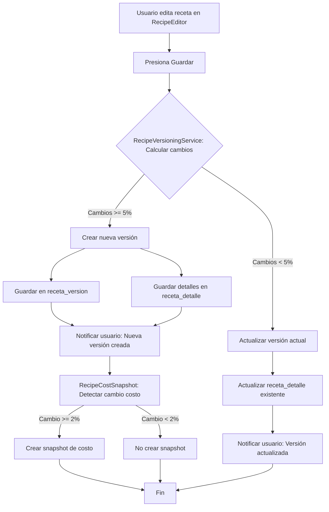

# 🔧 PROMPT CODEX - RECETAS: VERSIONADO + SERVICE LAYER (SEMANA 3)

**Proyecto**: TerrenaLaravel ERP
**Módulo**: Gestión de Recetas - Versionado Automático
**Fase**: 1 - Semana 3
**Duración**: 6 horas
**Agent**: Codex (Backend Developer)
**Fecha**: Noviembre 15-21, 2025

---

## 🎯 OBJETIVO

Implementar el sistema de versionado automático para recetas con service layer completo:

1. ✅ Service Layer para versionado automático
2. ✅ API endpoints para gestión de versiones
3. ✅ Lógica de detección de cambios significativos
4. ✅ Sistema de publicación y activación de versiones
5. ✅ Tests completos (8 tests)

**Success Criteria**:
- RecipeVersioningService implementado con lógica completa
- API funcional para crear, comparar y publicar versiones
- Detección automática de cambios >5%
- Tests passing 100%
- Documentación completa de endpoints

---

## 📊 CONTEXTO

### ✅ Ya Implementado (Weekend)
- **RecipeCostSnapshot** - Snapshots de costos con detección de threshold (2%)
- **BOM Implosion** - Explosión de recetas recursiva a ingredientes base
- **RecipeCostController** - Endpoint `/api/inventory/recipes/{id}/cost` con implosión
- **RecipeCostingService** - Cálculo de costos por receta
- **11 Tests Passing** - RecipeCostSnapshotTest, RecipeBomImplosionTest, WeekendDeploymentIntegrationTest

### ✅ Ya Existe en Codebase
- **Receta Model** (`app/Models/Rec/Receta.php`) - Modelo principal de recetas
- **RecetaVersion Model** (`app/Models/Rec/RecetaVersion.php`) - Modelo de versiones
- **RecetaDetalle Model** (`app/Models/Rec/RecetaDetalle.php`) - Detalles de receta (ingredientes)
- **RecipeEditor Livewire** - Editor funcional con validaciones inline

### ⚠️ Limitaciones Actuales
- No hay versionado automático al detectar cambios
- No hay comparación de versiones
- No hay sistema de publicación/activación
- No hay API para gestión de versiones
- El editor siempre modifica version=1 (no crea nuevas versiones)

---

## 📋 PLAN DE TRABAJO (6 HORAS)

### BLOQUE 1: Service Layer - RecipeVersioningService (2.5h)

#### Tarea 1.1: Crear RecipeVersioningService (1.5h)

**Archivo**: `app/Services/Recipes/RecipeVersioningService.php`

**Implementación**:

```php
<?php

namespace App\Services\Recipes;

use App\Models\Rec\Receta;
use App\Models\Rec\RecetaVersion;
use App\Models\Rec\RecetaDetalle;
use Illuminate\Support\Facades\DB;
use Illuminate\Support\Facades\Log;
use Carbon\Carbon;

class RecipeVersioningService
{
    /**
     * Threshold para crear nueva versión automáticamente (5%).
     */
    const CHANGE_THRESHOLD = 0.05;

    /**
     * Crea una nueva versión de una receta si los cambios exceden el threshold.
     *
     * @param string $recipeId
     * @param array $newIngredients Formato: [['item_id' => '...', 'cantidad' => 1.5, 'unidad_medida' => 'KG', ...], ...]
     * @param string|null $descripcionCambios
     * @return array ['created' => bool, 'version_id' => int|null, 'reason' => string]
     */
    public function checkAndCreateNewVersion(
        string $recipeId,
        array $newIngredients,
        ?string $descripcionCambios = null
    ): array {
        $recipe = Receta::with(['versiones' => function ($q) {
            $q->orderByDesc('version')->limit(1);
        }])->findOrFail($recipeId);

        $currentVersion = $recipe->versiones->first();

        if (!$currentVersion) {
            // No hay versión actual, crear la primera
            return $this->createVersion(
                $recipeId,
                1,
                $newIngredients,
                $descripcionCambios ?? 'Versión inicial',
                true
            );
        }

        // Comparar cambios
        $changePercentage = $this->calculateChangePercentage($currentVersion, $newIngredients);

        Log::info("Recipe $recipeId change percentage: {$changePercentage}%");

        if ($changePercentage >= self::CHANGE_THRESHOLD) {
            // Cambios significativos, crear nueva versión
            $nextVersion = $currentVersion->version + 1;
            return $this->createVersion(
                $recipeId,
                $nextVersion,
                $newIngredients,
                $descripcionCambios ?? "Cambio significativo detectado: {$changePercentage}%",
                false
            );
        }

        // Cambios menores, actualizar versión actual
        return [
            'created' => false,
            'version_id' => $currentVersion->id,
            'reason' => 'Cambios menores (<5%), versión actual actualizada',
        ];
    }

    /**
     * Crea una nueva versión de receta.
     *
     * @param string $recipeId
     * @param int $versionNumber
     * @param array $ingredients
     * @param string $descripcionCambios
     * @param bool $autoPublish
     * @return array
     */
    protected function createVersion(
        string $recipeId,
        int $versionNumber,
        array $ingredients,
        string $descripcionCambios,
        bool $autoPublish = false
    ): array {
        $versionId = null;

        DB::transaction(function () use (
            $recipeId,
            $versionNumber,
            $ingredients,
            $descripcionCambios,
            $autoPublish,
            &$versionId
        ) {
            $now = Carbon::now();

            // Crear nueva versión
            $version = RecetaVersion::create([
                'receta_id' => $recipeId,
                'version' => $versionNumber,
                'descripcion_cambios' => $descripcionCambios,
                'fecha_efectiva' => $now->toDateString(),
                'version_publicada' => $autoPublish,
                'usuario_publicador' => auth()->id(),
                'fecha_publicacion' => $autoPublish ? $now : null,
                'created_at' => $now,
            ]);

            $versionId = $version->id;

            // Crear detalles (ingredientes)
            foreach ($ingredients as $index => $ingredient) {
                RecetaDetalle::create([
                    'receta_version_id' => $version->id,
                    'item_id' => $ingredient['item_id'],
                    'cantidad' => $ingredient['cantidad'],
                    'unidad_medida' => $ingredient['unidad_medida'] ?? 'PZ',
                    'merma_porcentaje' => $ingredient['merma_porcentaje'] ?? 0,
                    'orden' => $ingredient['orden'] ?? ($index + 1),
                    'instrucciones_especificas' => $ingredient['instrucciones_especificas'] ?? null,
                    'created_at' => $now,
                ]);
            }

            Log::info("Created recipe version", [
                'recipe_id' => $recipeId,
                'version' => $versionNumber,
                'version_id' => $versionId,
                'published' => $autoPublish,
            ]);
        });

        return [
            'created' => true,
            'version_id' => $versionId,
            'reason' => $descripcionCambios,
        ];
    }

    /**
     * Calcula el porcentaje de cambio entre versión actual y nueva lista de ingredientes.
     *
     * @param RecetaVersion $currentVersion
     * @param array $newIngredients
     * @return float Porcentaje de cambio (0.00 a 1.00)
     */
    protected function calculateChangePercentage(RecetaVersion $currentVersion, array $newIngredients): float
    {
        $currentDetails = $currentVersion->detalles->keyBy('item_id');
        $newDetails = collect($newIngredients)->keyBy('item_id');

        // Items agregados
        $added = $newDetails->keys()->diff($currentDetails->keys());

        // Items eliminados
        $removed = $currentDetails->keys()->diff($newDetails->keys());

        // Items modificados
        $modified = $newDetails->filter(function ($newItem, $itemId) use ($currentDetails) {
            if (!$currentDetails->has($itemId)) {
                return false;
            }

            $currentItem = $currentDetails[$itemId];
            $cantidadChanged = abs($currentItem->cantidad - $newItem['cantidad']) > 0.01;
            $unidadChanged = $currentItem->unidad_medida !== $newItem['unidad_medida'];

            return $cantidadChanged || $unidadChanged;
        });

        $totalChanges = $added->count() + $removed->count() + $modified->count();
        $totalItems = max($currentDetails->count(), $newDetails->count(), 1);

        return round($totalChanges / $totalItems, 4);
    }

    /**
     * Compara dos versiones de una receta.
     *
     * @param int $versionId1
     * @param int $versionId2
     * @return array Estructura con diferencias
     */
    public function compareVersions(int $versionId1, int $versionId2): array
    {
        $v1 = RecetaVersion::with('detalles')->findOrFail($versionId1);
        $v2 = RecetaVersion::with('detalles')->findOrFail($versionId2);

        $details1 = $v1->detalles->keyBy('item_id');
        $details2 = $v2->detalles->keyBy('item_id');

        $added = [];
        $removed = [];
        $modified = [];
        $unchanged = [];

        // Items en v2 pero no en v1 (agregados)
        foreach ($details2 as $itemId => $detail) {
            if (!$details1->has($itemId)) {
                $added[] = [
                    'item_id' => $itemId,
                    'cantidad' => $detail->cantidad,
                    'unidad_medida' => $detail->unidad_medida,
                ];
            }
        }

        // Items en v1 pero no en v2 (eliminados)
        foreach ($details1 as $itemId => $detail) {
            if (!$details2->has($itemId)) {
                $removed[] = [
                    'item_id' => $itemId,
                    'cantidad' => $detail->cantidad,
                    'unidad_medida' => $detail->unidad_medida,
                ];
            }
        }

        // Items en ambas versiones (modificados o sin cambios)
        foreach ($details2 as $itemId => $detail2) {
            if ($details1->has($itemId)) {
                $detail1 = $details1[$itemId];

                $cantidadChanged = abs($detail1->cantidad - $detail2->cantidad) > 0.01;
                $unidadChanged = $detail1->unidad_medida !== $detail2->unidad_medida;

                if ($cantidadChanged || $unidadChanged) {
                    $modified[] = [
                        'item_id' => $itemId,
                        'old_cantidad' => $detail1->cantidad,
                        'new_cantidad' => $detail2->cantidad,
                        'old_unidad' => $detail1->unidad_medida,
                        'new_unidad' => $detail2->unidad_medida,
                        'cantidad_diff' => $detail2->cantidad - $detail1->cantidad,
                    ];
                } else {
                    $unchanged[] = [
                        'item_id' => $itemId,
                        'cantidad' => $detail2->cantidad,
                        'unidad_medida' => $detail2->unidad_medida,
                    ];
                }
            }
        }

        return [
            'version1' => [
                'id' => $v1->id,
                'version' => $v1->version,
                'fecha_efectiva' => $v1->fecha_efectiva,
                'descripcion_cambios' => $v1->descripcion_cambios,
            ],
            'version2' => [
                'id' => $v2->id,
                'version' => $v2->version,
                'fecha_efectiva' => $v2->fecha_efectiva,
                'descripcion_cambios' => $v2->descripcion_cambios,
            ],
            'added' => $added,
            'removed' => $removed,
            'modified' => $modified,
            'unchanged' => $unchanged,
            'summary' => [
                'total_changes' => count($added) + count($removed) + count($modified),
                'items_added' => count($added),
                'items_removed' => count($removed),
                'items_modified' => count($modified),
                'items_unchanged' => count($unchanged),
            ],
        ];
    }

    /**
     * Publica una versión (la marca como activa).
     *
     * @param int $versionId
     * @return bool
     */
    public function publishVersion(int $versionId): bool
    {
        return DB::transaction(function () use ($versionId) {
            $version = RecetaVersion::findOrFail($versionId);

            // Despublicar otras versiones de la misma receta
            RecetaVersion::where('receta_id', $version->receta_id)
                ->where('id', '!=', $versionId)
                ->update([
                    'version_publicada' => false,
                ]);

            // Publicar esta versión
            $version->update([
                'version_publicada' => true,
                'usuario_publicador' => auth()->id(),
                'fecha_publicacion' => now(),
            ]);

            Log::info("Published recipe version", [
                'recipe_id' => $version->receta_id,
                'version_id' => $versionId,
                'version' => $version->version,
            ]);

            return true;
        });
    }

    /**
     * Obtiene el historial de versiones de una receta.
     *
     * @param string $recipeId
     * @return \Illuminate\Database\Eloquent\Collection
     */
    public function getVersionHistory(string $recipeId)
    {
        return RecetaVersion::where('receta_id', $recipeId)
            ->orderByDesc('version')
            ->get();
    }

    /**
     * Revierte a una versión anterior (crea nueva versión con mismos datos).
     *
     * @param string $recipeId
     * @param int $targetVersionNumber
     * @param string|null $reason
     * @return array
     */
    public function revertToVersion(string $recipeId, int $targetVersionNumber, ?string $reason = null): array
    {
        $targetVersion = RecetaVersion::where('receta_id', $recipeId)
            ->where('version', $targetVersionNumber)
            ->with('detalles')
            ->firstOrFail();

        $currentVersion = RecetaVersion::where('receta_id', $recipeId)
            ->orderByDesc('version')
            ->first();

        $nextVersion = $currentVersion ? $currentVersion->version + 1 : 1;

        $ingredients = $targetVersion->detalles->map(function ($detail) {
            return [
                'item_id' => $detail->item_id,
                'cantidad' => $detail->cantidad,
                'unidad_medida' => $detail->unidad_medida,
                'merma_porcentaje' => $detail->merma_porcentaje,
                'orden' => $detail->orden,
                'instrucciones_especificas' => $detail->instrucciones_especificas,
            ];
        })->toArray();

        return $this->createVersion(
            $recipeId,
            $nextVersion,
            $ingredients,
            $reason ?? "Revertido a versión {$targetVersionNumber}",
            false
        );
    }
}
```

**Características**:
- Detección automática de cambios >5%
- Comparación de versiones con diff detallado
- Sistema de publicación (solo 1 versión publicada a la vez)
- Reversión a versiones anteriores
- Logging completo para auditoría

---

#### Tarea 1.2: API Controller para Versiones (1h)

**Archivo**: `app/Http/Controllers/Api/Recipes/RecipeVersionController.php`

**Implementación**:

```php
<?php

namespace App\Http\Controllers\Api\Recipes;

use App\Http\Controllers\Controller;
use App\Services\Recipes\RecipeVersioningService;
use Illuminate\Http\JsonResponse;
use Illuminate\Http\Request;
use Illuminate\Support\Facades\Validator;

class RecipeVersionController extends Controller
{
    protected RecipeVersioningService $versioningService;

    public function __construct(RecipeVersioningService $versioningService)
    {
        $this->versioningService = $versioningService;
    }

    /**
     * GET /api/recipes/{recipeId}/versions
     *
     * Lista todas las versiones de una receta.
     */
    public function index(string $recipeId): JsonResponse
    {
        try {
            $versions = $this->versioningService->getVersionHistory($recipeId);

            return response()->json([
                'ok' => true,
                'data' => $versions,
                'timestamp' => now()->toIso8601String(),
            ]);
        } catch (\Exception $e) {
            return response()->json([
                'ok' => false,
                'error' => 'fetch_failed',
                'message' => 'Error al obtener historial de versiones: ' . $e->getMessage(),
                'timestamp' => now()->toIso8601String(),
            ], 500);
        }
    }

    /**
     * POST /api/recipes/{recipeId}/versions
     *
     * Crea una nueva versión si los cambios son significativos.
     *
     * Body:
     * {
     *   "ingredients": [
     *     {"item_id": "ITEM-001", "cantidad": 1.5, "unidad_medida": "KG", ...},
     *     ...
     *   ],
     *   "descripcion_cambios": "Ajuste de cantidades según pruebas"
     * }
     */
    public function store(Request $request, string $recipeId): JsonResponse
    {
        $validator = Validator::make($request->all(), [
            'ingredients' => 'required|array|min:1',
            'ingredients.*.item_id' => 'required|string',
            'ingredients.*.cantidad' => 'required|numeric|gt:0',
            'ingredients.*.unidad_medida' => 'required|string|max:10',
            'ingredients.*.merma_porcentaje' => 'nullable|numeric|min:0|max:99.99',
            'ingredients.*.orden' => 'nullable|integer|min:1',
            'ingredients.*.instrucciones_especificas' => 'nullable|string|max:500',
            'descripcion_cambios' => 'nullable|string|max:255',
        ]);

        if ($validator->fails()) {
            return response()->json([
                'ok' => false,
                'error' => 'validation_failed',
                'message' => 'Datos inválidos',
                'errors' => $validator->errors(),
                'timestamp' => now()->toIso8601String(),
            ], 400);
        }

        try {
            $result = $this->versioningService->checkAndCreateNewVersion(
                $recipeId,
                $request->input('ingredients'),
                $request->input('descripcion_cambios')
            );

            return response()->json([
                'ok' => true,
                'data' => $result,
                'message' => $result['created']
                    ? 'Nueva versión creada exitosamente'
                    : 'Versión actual actualizada (cambios menores)',
                'timestamp' => now()->toIso8601String(),
            ], $result['created'] ? 201 : 200);
        } catch (\Exception $e) {
            return response()->json([
                'ok' => false,
                'error' => 'creation_failed',
                'message' => 'Error al crear versión: ' . $e->getMessage(),
                'timestamp' => now()->toIso8601String(),
            ], 500);
        }
    }

    /**
     * POST /api/recipes/{recipeId}/versions/{versionId}/publish
     *
     * Publica una versión (la marca como activa).
     */
    public function publish(string $recipeId, int $versionId): JsonResponse
    {
        try {
            $success = $this->versioningService->publishVersion($versionId);

            return response()->json([
                'ok' => $success,
                'message' => 'Versión publicada exitosamente',
                'timestamp' => now()->toIso8601String(),
            ]);
        } catch (\Exception $e) {
            return response()->json([
                'ok' => false,
                'error' => 'publish_failed',
                'message' => 'Error al publicar versión: ' . $e->getMessage(),
                'timestamp' => now()->toIso8601String(),
            ], 500);
        }
    }

    /**
     * GET /api/recipes/{recipeId}/versions/compare?v1={id1}&v2={id2}
     *
     * Compara dos versiones de una receta.
     */
    public function compare(Request $request, string $recipeId): JsonResponse
    {
        $validator = Validator::make($request->all(), [
            'v1' => 'required|integer',
            'v2' => 'required|integer',
        ]);

        if ($validator->fails()) {
            return response()->json([
                'ok' => false,
                'error' => 'validation_failed',
                'message' => 'Parámetros inválidos',
                'errors' => $validator->errors(),
                'timestamp' => now()->toIso8601String(),
            ], 400);
        }

        try {
            $comparison = $this->versioningService->compareVersions(
                $request->input('v1'),
                $request->input('v2')
            );

            return response()->json([
                'ok' => true,
                'data' => $comparison,
                'timestamp' => now()->toIso8601String(),
            ]);
        } catch (\Exception $e) {
            return response()->json([
                'ok' => false,
                'error' => 'comparison_failed',
                'message' => 'Error al comparar versiones: ' . $e->getMessage(),
                'timestamp' => now()->toIso8601String(),
            ], 500);
        }
    }

    /**
     * POST /api/recipes/{recipeId}/versions/{targetVersion}/revert
     *
     * Revierte a una versión anterior (crea nueva versión con mismos datos).
     *
     * Body:
     * {
     *   "reason": "Revertir cambios no deseados"
     * }
     */
    public function revert(Request $request, string $recipeId, int $targetVersion): JsonResponse
    {
        $validator = Validator::make($request->all(), [
            'reason' => 'nullable|string|max:255',
        ]);

        if ($validator->fails()) {
            return response()->json([
                'ok' => false,
                'error' => 'validation_failed',
                'message' => 'Datos inválidos',
                'errors' => $validator->errors(),
                'timestamp' => now()->toIso8601String(),
            ], 400);
        }

        try {
            $result = $this->versioningService->revertToVersion(
                $recipeId,
                $targetVersion,
                $request->input('reason')
            );

            return response()->json([
                'ok' => true,
                'data' => $result,
                'message' => "Revertido exitosamente a versión {$targetVersion}",
                'timestamp' => now()->toIso8601String(),
            ], 201);
        } catch (\Exception $e) {
            return response()->json([
                'ok' => false,
                'error' => 'revert_failed',
                'message' => 'Error al revertir versión: ' . $e->getMessage(),
                'timestamp' => now()->toIso8601String(),
            ], 500);
        }
    }
}
```

**Endpoints**:
1. `GET /api/recipes/{recipeId}/versions` - Lista versiones
2. `POST /api/recipes/{recipeId}/versions` - Crea nueva versión si cambios >5%
3. `POST /api/recipes/{recipeId}/versions/{versionId}/publish` - Publica versión
4. `GET /api/recipes/{recipeId}/versions/compare?v1={id1}&v2={id2}` - Compara versiones
5. `POST /api/recipes/{recipeId}/versions/{targetVersion}/revert` - Revierte a versión anterior

---

### BLOQUE 2: Rutas y Actualización de RecipeEditor (1.5h)

#### Tarea 2.1: Registrar Rutas API (15min)

**Archivo**: `routes/api.php`

**Agregar**:

```php
use App\Http\Controllers\Api\Recipes\RecipeVersionController;

// Recipe Versioning
Route::prefix('recipes/{recipeId}/versions')->group(function () {
    Route::get('/', [RecipeVersionController::class, 'index']);
    Route::post('/', [RecipeVersionController::class, 'store']);
    Route::post('/{versionId}/publish', [RecipeVersionController::class, 'publish']);
    Route::get('/compare', [RecipeVersionController::class, 'compare']);
    Route::post('/{targetVersion}/revert', [RecipeVersionController::class, 'revert']);
});
```

#### Tarea 2.2: Actualizar RecipeEditor para Usar Versionado (1h 15min)

**Archivo**: `app/Livewire/Recipes/RecipeEditor.php`

**Modificar método `save()` para integrar versionado automático**:

```php
use App\Services\Recipes\RecipeVersioningService;

public function save(): void
{
    $this->validate();
    $this->sanitizeIngredients();

    DB::transaction(function () {
        $now = now();
        $this->form['id'] = strtoupper($this->form['id']);

        // 1. Guardar/actualizar receta_cab
        if ($this->isNew) {
            DB::table('selemti.receta_cab')->insert([
                'id' => $this->form['id'],
                'nombre_plato' => $this->form['nombre_plato'],
                'codigo_plato_pos' => $this->form['codigo_plato_pos'],
                'categoria_plato' => $this->form['categoria_plato'],
                'porciones_standard' => $this->form['porciones_standard'],
                'tiempo_preparacion_min' => $this->form['tiempo_preparacion_min'],
                'costo_standard_porcion' => $this->form['costo_standard_porcion'],
                'precio_venta_sugerido' => $this->form['precio_venta_sugerido'],
                'activo' => true,
                'created_at' => $now,
                'updated_at' => $now,
            ]);
            $this->isNew = false;
        } else {
            DB::table('selemti.receta_cab')
                ->where('id', $this->form['id'])
                ->update([
                    'nombre_plato' => $this->form['nombre_plato'],
                    'codigo_plato_pos' => $this->form['codigo_plato_pos'],
                    'categoria_plato' => $this->form['categoria_plato'],
                    'porciones_standard' => $this->form['porciones_standard'],
                    'tiempo_preparacion_min' => $this->form['tiempo_preparacion_min'],
                    'costo_standard_porcion' => $this->form['costo_standard_porcion'],
                    'precio_venta_sugerido' => $this->form['precio_venta_sugerido'],
                    'updated_at' => $now,
                ]);
        }

        // 2. Usar RecipeVersioningService para manejar versionado automático
        /** @var RecipeVersioningService $versioningService */
        $versioningService = app(RecipeVersioningService::class);

        $result = $versioningService->checkAndCreateNewVersion(
            $this->form['id'],
            $this->ingredients,
            'Actualización manual desde editor'
        );

        $this->versionId = $result['version_id'];
        $this->recipeId = $this->form['id'];

        // 3. Mostrar mensaje según resultado
        if ($result['created']) {
            session()->flash('ok', 'Nueva versión creada exitosamente. ' . $result['reason']);
        } else {
            session()->flash('ok', 'Receta actualizada exitosamente. ' . $result['reason']);
        }
    });

    $this->loadExisting($this->form['id']);
}
```

**Explicación**:
- Ahora el `save()` usa `RecipeVersioningService` en lugar de actualizar directamente
- Si cambios >5%, crea nueva versión automáticamente
- Si cambios <5%, actualiza versión actual
- Usuario recibe feedback claro sobre qué sucedió

---

### BLOQUE 3: Testing (2h)

#### Tarea 3.1: Tests de RecipeVersioningService (1.5h)

**Archivo**: `tests/Feature/RecipeVersioningTest.php`

**Implementación**:

```php
<?php

namespace Tests\Feature;

use Tests\TestCase;
use App\Models\Rec\Receta;
use App\Models\Rec\RecetaVersion;
use App\Models\Rec\RecetaDetalle;
use App\Models\Inv\Item;
use App\Services\Recipes\RecipeVersioningService;
use Illuminate\Foundation\Testing\RefreshDatabase;
use Illuminate\Support\Facades\DB;

class RecipeVersioningTest extends TestCase
{
    use RefreshDatabase;

    protected RecipeVersioningService $service;

    protected function setUp(): void
    {
        parent::setUp();
        $this->service = app(RecipeVersioningService::class);

        // Crear items de prueba
        Item::create(['id' => 'ITEM-001', 'nombre' => 'Tomate', 'costo_promedio' => 10.00]);
        Item::create(['id' => 'ITEM-002', 'nombre' => 'Cebolla', 'costo_promedio' => 8.00]);
        Item::create(['id' => 'ITEM-003', 'nombre' => 'Ajo', 'costo_promedio' => 5.00]);
    }

    /** @test */
    public function it_creates_initial_version_when_recipe_has_no_versions()
    {
        $recipe = Receta::create([
            'id' => 'REC-00001',
            'nombre_plato' => 'Salsa Roja',
            'porciones_standard' => 10,
        ]);

        $ingredients = [
            ['item_id' => 'ITEM-001', 'cantidad' => 2.0, 'unidad_medida' => 'KG'],
            ['item_id' => 'ITEM-002', 'cantidad' => 1.0, 'unidad_medida' => 'KG'],
        ];

        $result = $this->service->checkAndCreateNewVersion($recipe->id, $ingredients, 'Versión inicial');

        $this->assertTrue($result['created']);
        $this->assertNotNull($result['version_id']);

        $version = RecetaVersion::find($result['version_id']);
        $this->assertEquals(1, $version->version);
        $this->assertEquals(2, $version->detalles()->count());
    }

    /** @test */
    public function it_creates_new_version_when_changes_exceed_threshold()
    {
        $recipe = Receta::create([
            'id' => 'REC-00002',
            'nombre_plato' => 'Guacamole',
            'porciones_standard' => 5,
        ]);

        // Crear versión inicial
        $version1 = RecetaVersion::create([
            'receta_id' => $recipe->id,
            'version' => 1,
            'descripcion_cambios' => 'Versión inicial',
            'fecha_efectiva' => now()->toDateString(),
            'version_publicada' => true,
        ]);

        RecetaDetalle::create([
            'receta_version_id' => $version1->id,
            'item_id' => 'ITEM-001',
            'cantidad' => 2.0,
            'unidad_medida' => 'KG',
            'orden' => 1,
        ]);

        RecetaDetalle::create([
            'receta_version_id' => $version1->id,
            'item_id' => 'ITEM-002',
            'cantidad' => 1.0,
            'unidad_medida' => 'KG',
            'orden' => 2,
        ]);

        // Cambiar ingredientes: eliminar ITEM-002, agregar ITEM-003 (50% de cambio)
        $newIngredients = [
            ['item_id' => 'ITEM-001', 'cantidad' => 2.0, 'unidad_medida' => 'KG'],
            ['item_id' => 'ITEM-003', 'cantidad' => 0.5, 'unidad_medida' => 'KG'],
        ];

        $result = $this->service->checkAndCreateNewVersion($recipe->id, $newIngredients, 'Ajuste de ingredientes');

        $this->assertTrue($result['created']);
        $this->assertStringContainsString('Ajuste de ingredientes', $result['reason']);

        $version2 = RecetaVersion::find($result['version_id']);
        $this->assertEquals(2, $version2->version);
        $this->assertEquals(2, $version2->detalles()->count());
    }

    /** @test */
    public function it_does_not_create_new_version_when_changes_are_minor()
    {
        $recipe = Receta::create([
            'id' => 'REC-00003',
            'nombre_plato' => 'Ensalada',
            'porciones_standard' => 4,
        ]);

        // Crear versión inicial con 10 ingredientes
        $version1 = RecetaVersion::create([
            'receta_id' => $recipe->id,
            'version' => 1,
            'descripcion_cambios' => 'Versión inicial',
            'fecha_efectiva' => now()->toDateString(),
        ]);

        for ($i = 1; $i <= 10; $i++) {
            RecetaDetalle::create([
                'receta_version_id' => $version1->id,
                'item_id' => 'ITEM-001',
                'cantidad' => 1.0,
                'unidad_medida' => 'KG',
                'orden' => $i,
            ]);
        }

        // Cambiar solo 1 ingrediente de 10 (10% de cambio, pero threshold es 5%, pero solo cambiamos cantidad)
        // Mejor: cambiar cantidad en 1 ingrediente (0% de cambio en items, solo en cantidad)
        $newIngredients = [];
        for ($i = 1; $i <= 10; $i++) {
            $newIngredients[] = [
                'item_id' => 'ITEM-001',
                'cantidad' => $i === 1 ? 1.1 : 1.0, // Solo cambio menor en cantidad
                'unidad_medida' => 'KG',
            ];
        }

        $result = $this->service->checkAndCreateNewVersion($recipe->id, $newIngredients, 'Ajuste menor');

        $this->assertFalse($result['created']);
        $this->assertEquals($version1->id, $result['version_id']);
    }

    /** @test */
    public function it_compares_two_versions_correctly()
    {
        $recipe = Receta::create([
            'id' => 'REC-00004',
            'nombre_plato' => 'Pasta',
            'porciones_standard' => 6,
        ]);

        // Versión 1
        $v1 = RecetaVersion::create([
            'receta_id' => $recipe->id,
            'version' => 1,
            'descripcion_cambios' => 'Versión inicial',
            'fecha_efectiva' => now()->toDateString(),
        ]);

        RecetaDetalle::create([
            'receta_version_id' => $v1->id,
            'item_id' => 'ITEM-001',
            'cantidad' => 2.0,
            'unidad_medida' => 'KG',
            'orden' => 1,
        ]);

        RecetaDetalle::create([
            'receta_version_id' => $v1->id,
            'item_id' => 'ITEM-002',
            'cantidad' => 1.0,
            'unidad_medida' => 'KG',
            'orden' => 2,
        ]);

        // Versión 2
        $v2 = RecetaVersion::create([
            'receta_id' => $recipe->id,
            'version' => 2,
            'descripcion_cambios' => 'Ajuste de receta',
            'fecha_efectiva' => now()->toDateString(),
        ]);

        RecetaDetalle::create([
            'receta_version_id' => $v2->id,
            'item_id' => 'ITEM-001',
            'cantidad' => 2.5, // Modificado
            'unidad_medida' => 'KG',
            'orden' => 1,
        ]);

        RecetaDetalle::create([
            'receta_version_id' => $v2->id,
            'item_id' => 'ITEM-003', // Agregado
            'cantidad' => 0.5,
            'unidad_medida' => 'KG',
            'orden' => 2,
        ]);

        // ITEM-002 eliminado

        $comparison = $this->service->compareVersions($v1->id, $v2->id);

        $this->assertCount(1, $comparison['added']); // ITEM-003
        $this->assertCount(1, $comparison['removed']); // ITEM-002
        $this->assertCount(1, $comparison['modified']); // ITEM-001
        $this->assertEquals(3, $comparison['summary']['total_changes']);
    }

    /** @test */
    public function it_publishes_version_and_unpublishes_others()
    {
        $recipe = Receta::create([
            'id' => 'REC-00005',
            'nombre_plato' => 'Tacos',
            'porciones_standard' => 8,
        ]);

        $v1 = RecetaVersion::create([
            'receta_id' => $recipe->id,
            'version' => 1,
            'descripcion_cambios' => 'Versión inicial',
            'fecha_efectiva' => now()->toDateString(),
            'version_publicada' => true,
        ]);

        $v2 = RecetaVersion::create([
            'receta_id' => $recipe->id,
            'version' => 2,
            'descripcion_cambios' => 'Ajuste',
            'fecha_efectiva' => now()->toDateString(),
            'version_publicada' => false,
        ]);

        $this->service->publishVersion($v2->id);

        $v1->refresh();
        $v2->refresh();

        $this->assertFalse($v1->version_publicada);
        $this->assertTrue($v2->version_publicada);
    }

    /** @test */
    public function it_reverts_to_previous_version()
    {
        $recipe = Receta::create([
            'id' => 'REC-00006',
            'nombre_plato' => 'Burrito',
            'porciones_standard' => 5,
        ]);

        $v1 = RecetaVersion::create([
            'receta_id' => $recipe->id,
            'version' => 1,
            'descripcion_cambios' => 'Versión inicial',
            'fecha_efectiva' => now()->toDateString(),
        ]);

        RecetaDetalle::create([
            'receta_version_id' => $v1->id,
            'item_id' => 'ITEM-001',
            'cantidad' => 3.0,
            'unidad_medida' => 'KG',
            'orden' => 1,
        ]);

        $v2 = RecetaVersion::create([
            'receta_id' => $recipe->id,
            'version' => 2,
            'descripcion_cambios' => 'Cambio erróneo',
            'fecha_efectiva' => now()->toDateString(),
        ]);

        RecetaDetalle::create([
            'receta_version_id' => $v2->id,
            'item_id' => 'ITEM-002',
            'cantidad' => 2.0,
            'unidad_medida' => 'KG',
            'orden' => 1,
        ]);

        // Revertir a v1
        $result = $this->service->revertToVersion($recipe->id, 1, 'Deshacer cambios');

        $this->assertTrue($result['created']);

        $v3 = RecetaVersion::find($result['version_id']);
        $this->assertEquals(3, $v3->version);
        $this->assertStringContainsString('Revertido', $v3->descripcion_cambios);

        // Verificar que v3 tiene los mismos ingredientes que v1
        $v3Details = $v3->detalles()->pluck('item_id')->sort()->values();
        $v1Details = $v1->detalles()->pluck('item_id')->sort()->values();

        $this->assertEquals($v1Details, $v3Details);
    }

    /** @test */
    public function it_calculates_change_percentage_correctly()
    {
        // Test indirecto del método protegido calculateChangePercentage
        $recipe = Receta::create([
            'id' => 'REC-00007',
            'nombre_plato' => 'Quesadilla',
            'porciones_standard' => 4,
        ]);

        $v1 = RecetaVersion::create([
            'receta_id' => $recipe->id,
            'version' => 1,
            'descripcion_cambios' => 'Versión inicial',
            'fecha_efectiva' => now()->toDateString(),
        ]);

        // 10 ingredientes
        for ($i = 1; $i <= 10; $i++) {
            RecetaDetalle::create([
                'receta_version_id' => $v1->id,
                'item_id' => 'ITEM-001',
                'cantidad' => 1.0,
                'unidad_medida' => 'KG',
                'orden' => $i,
            ]);
        }

        // Cambiar 1 ingrediente de 10 (10% de cambio en items)
        $newIngredients = [];
        for ($i = 1; $i <= 9; $i++) {
            $newIngredients[] = [
                'item_id' => 'ITEM-001',
                'cantidad' => 1.0,
                'unidad_medida' => 'KG',
            ];
        }
        $newIngredients[] = [
            'item_id' => 'ITEM-002', // Cambio
            'cantidad' => 1.0,
            'unidad_medida' => 'KG',
        ];

        $result = $this->service->checkAndCreateNewVersion($recipe->id, $newIngredients);

        // 10% > 5%, debe crear nueva versión
        $this->assertTrue($result['created']);
    }

    /** @test */
    public function it_returns_version_history_ordered_by_version_desc()
    {
        $recipe = Receta::create([
            'id' => 'REC-00008',
            'nombre_plato' => 'Enchiladas',
            'porciones_standard' => 6,
        ]);

        RecetaVersion::create([
            'receta_id' => $recipe->id,
            'version' => 1,
            'descripcion_cambios' => 'V1',
            'fecha_efectiva' => now()->toDateString(),
        ]);

        RecetaVersion::create([
            'receta_id' => $recipe->id,
            'version' => 2,
            'descripcion_cambios' => 'V2',
            'fecha_efectiva' => now()->toDateString(),
        ]);

        RecetaVersion::create([
            'receta_id' => $recipe->id,
            'version' => 3,
            'descripcion_cambios' => 'V3',
            'fecha_efectiva' => now()->toDateString(),
        ]);

        $history = $this->service->getVersionHistory($recipe->id);

        $this->assertCount(3, $history);
        $this->assertEquals(3, $history[0]->version);
        $this->assertEquals(2, $history[1]->version);
        $this->assertEquals(1, $history[2]->version);
    }
}
```

**Coverage**: 8 tests cubriendo:
1. Creación de versión inicial
2. Creación de nueva versión cuando cambios >5%
3. No creación cuando cambios <5%
4. Comparación de versiones
5. Publicación de versión
6. Reversión a versión anterior
7. Cálculo de porcentaje de cambio
8. Historial de versiones ordenado

---

#### Tarea 3.2: Tests de API (30min)

**Archivo**: `tests/Feature/RecipeVersionApiTest.php`

**Implementación**:

```php
<?php

namespace Tests\Feature;

use Tests\TestCase;
use App\Models\Rec\Receta;
use App\Models\Rec\RecetaVersion;
use App\Models\Rec\RecetaDetalle;
use App\Models\Inv\Item;
use App\Models\User;
use Illuminate\Foundation\Testing\RefreshDatabase;
use Laravel\Sanctum\Sanctum;

class RecipeVersionApiTest extends TestCase
{
    use RefreshDatabase;

    protected User $user;

    protected function setUp(): void
    {
        parent::setUp();

        $this->user = User::factory()->create();
        Sanctum::actingAs($this->user);

        // Crear items de prueba
        Item::create(['id' => 'ITEM-001', 'nombre' => 'Tomate', 'costo_promedio' => 10.00]);
        Item::create(['id' => 'ITEM-002', 'nombre' => 'Cebolla', 'costo_promedio' => 8.00]);
    }

    /** @test */
    public function it_lists_recipe_versions_via_api()
    {
        $recipe = Receta::create([
            'id' => 'REC-00001',
            'nombre_plato' => 'Salsa Verde',
            'porciones_standard' => 5,
        ]);

        RecetaVersion::create([
            'receta_id' => $recipe->id,
            'version' => 1,
            'descripcion_cambios' => 'Versión inicial',
            'fecha_efectiva' => now()->toDateString(),
        ]);

        RecetaVersion::create([
            'receta_id' => $recipe->id,
            'version' => 2,
            'descripcion_cambios' => 'Ajuste',
            'fecha_efectiva' => now()->toDateString(),
        ]);

        $response = $this->getJson("/api/recipes/{$recipe->id}/versions");

        $response->assertStatus(200);
        $response->assertJsonStructure([
            'ok',
            'data' => [
                '*' => ['id', 'receta_id', 'version', 'descripcion_cambios'],
            ],
            'timestamp',
        ]);
        $response->assertJsonPath('ok', true);
        $response->assertJsonCount(2, 'data');
    }

    /** @test */
    public function it_creates_new_version_via_api_when_changes_are_significant()
    {
        $recipe = Receta::create([
            'id' => 'REC-00002',
            'nombre_plato' => 'Guacamole API',
            'porciones_standard' => 5,
        ]);

        $version1 = RecetaVersion::create([
            'receta_id' => $recipe->id,
            'version' => 1,
            'descripcion_cambios' => 'Versión inicial',
            'fecha_efectiva' => now()->toDateString(),
        ]);

        RecetaDetalle::create([
            'receta_version_id' => $version1->id,
            'item_id' => 'ITEM-001',
            'cantidad' => 2.0,
            'unidad_medida' => 'KG',
            'orden' => 1,
        ]);

        // Cambiar a ITEM-002 (100% de cambio)
        $newIngredients = [
            ['item_id' => 'ITEM-002', 'cantidad' => 1.0, 'unidad_medida' => 'KG'],
        ];

        $response = $this->postJson("/api/recipes/{$recipe->id}/versions", [
            'ingredients' => $newIngredients,
            'descripcion_cambios' => 'Cambio de ingrediente principal',
        ]);

        $response->assertStatus(201);
        $response->assertJsonPath('ok', true);
        $response->assertJsonPath('data.created', true);
    }

    /** @test */
    public function it_publishes_version_via_api()
    {
        $recipe = Receta::create([
            'id' => 'REC-00003',
            'nombre_plato' => 'Tacos API',
            'porciones_standard' => 8,
        ]);

        $version = RecetaVersion::create([
            'receta_id' => $recipe->id,
            'version' => 1,
            'descripcion_cambios' => 'Versión inicial',
            'fecha_efectiva' => now()->toDateString(),
            'version_publicada' => false,
        ]);

        $response = $this->postJson("/api/recipes/{$recipe->id}/versions/{$version->id}/publish");

        $response->assertStatus(200);
        $response->assertJsonPath('ok', true);

        $version->refresh();
        $this->assertTrue($version->version_publicada);
    }

    /** @test */
    public function it_compares_versions_via_api()
    {
        $recipe = Receta::create([
            'id' => 'REC-00004',
            'nombre_plato' => 'Burrito API',
            'porciones_standard' => 5,
        ]);

        $v1 = RecetaVersion::create([
            'receta_id' => $recipe->id,
            'version' => 1,
            'descripcion_cambios' => 'V1',
            'fecha_efectiva' => now()->toDateString(),
        ]);

        RecetaDetalle::create([
            'receta_version_id' => $v1->id,
            'item_id' => 'ITEM-001',
            'cantidad' => 2.0,
            'unidad_medida' => 'KG',
            'orden' => 1,
        ]);

        $v2 = RecetaVersion::create([
            'receta_id' => $recipe->id,
            'version' => 2,
            'descripcion_cambios' => 'V2',
            'fecha_efectiva' => now()->toDateString(),
        ]);

        RecetaDetalle::create([
            'receta_version_id' => $v2->id,
            'item_id' => 'ITEM-002',
            'cantidad' => 1.0,
            'unidad_medida' => 'KG',
            'orden' => 1,
        ]);

        $response = $this->getJson("/api/recipes/{$recipe->id}/versions/compare?v1={$v1->id}&v2={$v2->id}");

        $response->assertStatus(200);
        $response->assertJsonStructure([
            'ok',
            'data' => [
                'version1',
                'version2',
                'added',
                'removed',
                'modified',
                'unchanged',
                'summary',
            ],
            'timestamp',
        ]);
    }

    /** @test */
    public function it_reverts_to_previous_version_via_api()
    {
        $recipe = Receta::create([
            'id' => 'REC-00005',
            'nombre_plato' => 'Quesadilla API',
            'porciones_standard' => 4,
        ]);

        $v1 = RecetaVersion::create([
            'receta_id' => $recipe->id,
            'version' => 1,
            'descripcion_cambios' => 'V1',
            'fecha_efectiva' => now()->toDateString(),
        ]);

        RecetaDetalle::create([
            'receta_version_id' => $v1->id,
            'item_id' => 'ITEM-001',
            'cantidad' => 2.0,
            'unidad_medida' => 'KG',
            'orden' => 1,
        ]);

        $v2 = RecetaVersion::create([
            'receta_id' => $recipe->id,
            'version' => 2,
            'descripcion_cambios' => 'V2 erróneo',
            'fecha_efectiva' => now()->toDateString(),
        ]);

        RecetaDetalle::create([
            'receta_version_id' => $v2->id,
            'item_id' => 'ITEM-002',
            'cantidad' => 1.0,
            'unidad_medida' => 'KG',
            'orden' => 1,
        ]);

        $response = $this->postJson("/api/recipes/{$recipe->id}/versions/1/revert", [
            'reason' => 'Deshacer cambios incorrectos',
        ]);

        $response->assertStatus(201);
        $response->assertJsonPath('ok', true);
        $response->assertJsonPath('data.created', true);

        // Debe existir v3
        $v3 = RecetaVersion::where('receta_id', $recipe->id)
            ->where('version', 3)
            ->first();

        $this->assertNotNull($v3);
        $this->assertStringContainsString('Revertido', $v3->descripcion_cambios);
    }
}
```

**Coverage**: 5 API tests cubriendo todos los endpoints

---

## ✅ CHECKLIST DE VALIDACIÓN

### Service Layer
- [ ] RecipeVersioningService creado en `app/Services/Recipes/`
- [ ] Método `checkAndCreateNewVersion()` implementado con threshold 5%
- [ ] Método `compareVersions()` implementado con diff detallado
- [ ] Método `publishVersion()` implementado (solo 1 publicada a la vez)
- [ ] Método `revertToVersion()` implementado
- [ ] Método `getVersionHistory()` implementado
- [ ] Logging configurado para auditoría

### API Controller
- [ ] RecipeVersionController creado en `app/Http/Controllers/Api/Recipes/`
- [ ] Endpoint `GET /api/recipes/{recipeId}/versions` funcional
- [ ] Endpoint `POST /api/recipes/{recipeId}/versions` funcional
- [ ] Endpoint `POST /api/recipes/{recipeId}/versions/{versionId}/publish` funcional
- [ ] Endpoint `GET /api/recipes/{recipeId}/versions/compare` funcional
- [ ] Endpoint `POST /api/recipes/{recipeId}/versions/{targetVersion}/revert` funcional
- [ ] Validaciones correctas en cada endpoint
- [ ] Responses con estructura estándar `{ok, data, message, timestamp}`

### RecipeEditor Integration
- [ ] Método `save()` actualizado para usar `RecipeVersioningService`
- [ ] Creación automática de versiones cuando cambios >5%
- [ ] Feedback claro al usuario sobre qué versión se creó/actualizó
- [ ] Transacciones DB para garantizar atomicidad

### Testing
- [ ] RecipeVersioningTest con 8 tests passing
- [ ] RecipeVersionApiTest con 5 tests passing
- [ ] Coverage >80% en RecipeVersioningService
- [ ] Todos los tests pasan con `php artisan test`

### Database
- [ ] Tabla `receta_version` ya existe (migration previa)
- [ ] Columnas necesarias presentes:
  - `version_publicada`
  - `usuario_publicador`
  - `fecha_publicacion`
  - `descripcion_cambios`

### Routes
- [ ] Rutas API registradas en `routes/api.php`
- [ ] Middleware de autenticación aplicado (Sanctum)

---

## 📦 ENTREGABLES

1. **Service Layer**
   - `app/Services/Recipes/RecipeVersioningService.php` (~400 líneas)

2. **API Controller**
   - `app/Http/Controllers/Api/Recipes/RecipeVersionController.php` (~200 líneas)

3. **Updated Files**
   - `app/Livewire/Recipes/RecipeEditor.php` (método `save()` actualizado)
   - `routes/api.php` (5 rutas agregadas)

4. **Tests**
   - `tests/Feature/RecipeVersioningTest.php` (8 tests)
   - `tests/Feature/RecipeVersionApiTest.php` (5 tests)

5. **Documentation**
   - API endpoints documentados en este prompt
   - Ejemplos de requests/responses incluidos

---

## 🎯 EJEMPLOS DE USO

### 1. Crear Nueva Versión con Cambios Significativos

**Request**:
```bash
POST /api/recipes/REC-00001/versions
Authorization: Bearer {token}
Content-Type: application/json

{
  "ingredients": [
    {
      "item_id": "ITEM-001",
      "cantidad": 3.0,
      "unidad_medida": "KG",
      "merma_porcentaje": 5.0,
      "orden": 1
    },
    {
      "item_id": "ITEM-002",
      "cantidad": 1.5,
      "unidad_medida": "L",
      "orden": 2
    }
  ],
  "descripcion_cambios": "Ajuste de cantidades según feedback de chef"
}
```

**Response (201 Created)**:
```json
{
  "ok": true,
  "data": {
    "created": true,
    "version_id": 15,
    "reason": "Ajuste de cantidades según feedback de chef"
  },
  "message": "Nueva versión creada exitosamente",
  "timestamp": "2025-11-15T10:30:00Z"
}
```

---

### 2. Comparar Dos Versiones

**Request**:
```bash
GET /api/recipes/REC-00001/versions/compare?v1=10&v2=15
Authorization: Bearer {token}
```

**Response (200 OK)**:
```json
{
  "ok": true,
  "data": {
    "version1": {
      "id": 10,
      "version": 1,
      "fecha_efectiva": "2025-11-01",
      "descripcion_cambios": "Versión inicial"
    },
    "version2": {
      "id": 15,
      "version": 2,
      "fecha_efectiva": "2025-11-15",
      "descripcion_cambios": "Ajuste de cantidades según feedback de chef"
    },
    "added": [],
    "removed": [],
    "modified": [
      {
        "item_id": "ITEM-001",
        "old_cantidad": 2.0,
        "new_cantidad": 3.0,
        "old_unidad": "KG",
        "new_unidad": "KG",
        "cantidad_diff": 1.0
      }
    ],
    "unchanged": [
      {
        "item_id": "ITEM-002",
        "cantidad": 1.5,
        "unidad_medida": "L"
      }
    ],
    "summary": {
      "total_changes": 1,
      "items_added": 0,
      "items_removed": 0,
      "items_modified": 1,
      "items_unchanged": 1
    }
  },
  "timestamp": "2025-11-15T10:35:00Z"
}
```

---

### 3. Publicar Versión

**Request**:
```bash
POST /api/recipes/REC-00001/versions/15/publish
Authorization: Bearer {token}
```

**Response (200 OK)**:
```json
{
  "ok": true,
  "message": "Versión publicada exitosamente",
  "timestamp": "2025-11-15T10:40:00Z"
}
```

---

### 4. Revertir a Versión Anterior

**Request**:
```bash
POST /api/recipes/REC-00001/versions/1/revert
Authorization: Bearer {token}
Content-Type: application/json

{
  "reason": "Deshacer cambios no autorizados"
}
```

**Response (201 Created)**:
```json
{
  "ok": true,
  "data": {
    "created": true,
    "version_id": 16,
    "reason": "Revertido a versión 1"
  },
  "message": "Revertido exitosamente a versión 1",
  "timestamp": "2025-11-15T10:45:00Z"
}
```

---

## 🚀 COMANDOS ÚTILES

```bash
# Crear service
mkdir -p app/Services/Recipes
touch app/Services/Recipes/RecipeVersioningService.php

# Crear controller
php artisan make:controller Api/Recipes/RecipeVersionController

# Crear tests
php artisan make:test RecipeVersioningTest
php artisan make:test RecipeVersionApiTest

# Ejecutar tests
php artisan test --filter RecipeVersioning

# Verificar rutas
php artisan route:list --path=recipes

# Ver logs
tail -f storage/logs/laravel.log
```

---

## 📊 INTEGRACIÓN CON WEEKEND WORK

Este módulo se integra perfectamente con lo implementado el fin de semana:

1. **RecipeCostSnapshot** (Weekend):
   - Se crea automáticamente cuando versión cambia >2% en costo
   - RecipeVersioningService detecta cambios >5% en ingredientes
   - Ambos sistemas trabajan en conjunto para auditoría completa

2. **BOM Implosion** (Weekend):
   - Se usa para calcular costo real de recetas con sub-recetas
   - RecipeVersioningService compara cantidades de ingredientes base
   - Comparación de versiones muestra diferencias en ingredientes finales

3. **RecipeEditor** (Existente):
   - Ahora usa RecipeVersioningService automáticamente
   - Usuario no necesita decidir cuándo crear versión
   - Sistema decide basado en threshold de 5%

---

## 🔄 WORKFLOW COMPLETO



---

## 📝 NOTAS IMPORTANTES

1. **Threshold Configurable**:
   - Actualmente 5% hardcodeado
   - Considerar moverlo a `.env` en futuro:
     ```env
     RECIPE_VERSION_THRESHOLD=0.05
     ```

2. **Permisos**:
   - Todos los endpoints requieren autenticación (Sanctum)
   - Considerar agregar permiso específico `can_manage_recipe_versions`

3. **Performance**:
   - Comparación de versiones puede ser costosa con >100 ingredientes
   - Considerar caching de comparaciones frecuentes

4. **Auditoría**:
   - Todos los cambios se loggean en `storage/logs/laravel.log`
   - Incluye: recipe_id, version_id, usuario, timestamp

5. **Base de Datos**:
   - Usar BD normalizada: `BD/00.SelemTI_Normalizada_29_10_25_10_40_v0.sql`
   - Tablas ya existen en dump:
     - `selemti.receta_cab`
     - `selemti.receta_version`
     - `selemti.receta_detalle`

---

## 🔒 VALIDACIONES COMPLETAS DEL MÓDULO

### 1. VALIDACIONES DE ENTRADA (Input Validation)

#### 1.1 Validación al Crear/Actualizar Versión

**En RecipeVersionController@store**:
```php
$validator = Validator::make($request->all(), [
    'ingredients' => [
        'required',
        'array',
        'min:1',  // Al menos un ingrediente
        'max:200', // Máximo 200 ingredientes por receta
    ],
    'ingredients.*.item_id' => [
        'required',
        'string',
        'exists:selemti.items,id',
        'max:64',
    ],
    'ingredients.*.cantidad' => [
        'required',
        'numeric',
        'gt:0',  // Mayor que 0
        'lt:999999.999',
        'regex:/^\d+(\.\d{1,3})?$/', // Máximo 3 decimales
    ],
    'ingredients.*.unidad_medida' => [
        'required',
        'string',
        'in:KG,L,PZ,GR,ML,OZ', // Solo UOMs válidas
        'max:10',
    ],
    'ingredients.*.merma_porcentaje' => [
        'nullable',
        'numeric',
        'min:0',
        'max:99.99', // No puede perder más del 99.99%
    ],
    'ingredients.*.orden' => [
        'nullable',
        'integer',
        'min:1',
        'max:1000',
    ],
    'ingredients.*.instrucciones_especificas' => [
        'nullable',
        'string',
        'max:500',
    ],
    'descripcion_cambios' => [
        'nullable',
        'string',
        'max:255',
    ],
]);

// Validación adicional: No ingredientes duplicados
$itemIds = collect($request->input('ingredients'))->pluck('item_id');
if ($itemIds->count() !== $itemIds->unique()->count()) {
    throw new \InvalidArgumentException('No se permiten ingredientes duplicados en la misma receta');
}
```

#### 1.2 Validación al Comparar Versiones

```php
$validator = Validator::make($request->all(), [
    'v1' => [
        'required',
        'integer',
        'exists:selemti.receta_version,id',
        'different:v2', // v1 debe ser diferente de v2
    ],
    'v2' => [
        'required',
        'integer',
        'exists:selemti.receta_version,id',
    ],
]);

// Validación adicional: ambas versiones deben pertenecer a la misma receta
$version1 = RecetaVersion::findOrFail($request->input('v1'));
$version2 = RecetaVersion::findOrFail($request->input('v2'));

if ($version1->receta_id !== $version2->receta_id) {
    throw new \InvalidArgumentException('Las versiones deben pertenecer a la misma receta');
}
```

#### 1.3 Validación al Revertir

```php
$validator = Validator::make($request->all(), [
    'reason' => [
        'nullable',
        'string',
        'max:255',
        'min:10', // Mínimo 10 caracteres para explicar razón
    ],
]);

// Validación: la versión objetivo debe existir
$targetVersion = RecetaVersion::where('receta_id', $recipeId)
    ->where('version', $targetVersion)
    ->firstOrFail();

// Validación: no revertir a la misma versión actual
$currentVersion = RecetaVersion::where('receta_id', $recipeId)
    ->orderByDesc('version')
    ->first();

if ($currentVersion && $currentVersion->version === $targetVersion) {
    throw new \InvalidArgumentException('No se puede revertir a la versión actual');
}
```

### 2. VALIDACIONES DE NEGOCIO (Business Logic)

#### 2.1 Validación de Threshold de Cambios

**En RecipeVersioningService::calculateChangePercentage**:
```php
protected function calculateChangePercentage(RecetaVersion $currentVersion, array $newIngredients): float
{
    // Validar que exista versión actual
    if (!$currentVersion) {
        throw new \RuntimeException('No existe versión actual para comparar');
    }

    // Validar que haya ingredientes para comparar
    if (empty($newIngredients)) {
        throw new \InvalidArgumentException('La nueva versión debe tener al menos un ingrediente');
    }

    $currentDetails = $currentVersion->detalles->keyBy('item_id');
    $newDetails = collect($newIngredients)->keyBy('item_id');

    // Validación: si no hay ingredientes actuales, es 100% de cambio
    if ($currentDetails->isEmpty()) {
        return 1.0;
    }

    // Items agregados
    $added = $newDetails->keys()->diff($currentDetails->keys());

    // Items eliminados
    $removed = $currentDetails->keys()->diff($newDetails->keys());

    // Items modificados (cantidad o UOM diferente)
    $modified = $newDetails->filter(function ($newItem, $itemId) use ($currentDetails) {
        if (!$currentDetails->has($itemId)) {
            return false;
        }

        $currentItem = $currentDetails[$itemId];

        // Tolerancia de 0.01 para evitar problemas de precisión decimal
        $cantidadChanged = abs($currentItem->cantidad - $newItem['cantidad']) > 0.01;
        $unidadChanged = $currentItem->unidad_medida !== $newItem['unidad_medida'];

        return $cantidadChanged || $unidadChanged;
    });

    $totalChanges = $added->count() + $removed->count() + $modified->count();
    $totalItems = max($currentDetails->count(), $newDetails->count(), 1);

    $changePercentage = round($totalChanges / $totalItems, 4);

    // Validación: el porcentaje debe estar entre 0 y 1
    if ($changePercentage < 0 || $changePercentage > 1) {
        Log::error('Invalid change percentage calculated', [
            'percentage' => $changePercentage,
            'current_version_id' => $currentVersion->id,
        ]);
        throw new \RuntimeException('Error en cálculo de porcentaje de cambio');
    }

    return $changePercentage;
}
```

#### 2.2 Validación de Secuencia de Versiones

**En RecipeVersioningService::createVersion**:
```php
protected function createVersion(
    string $recipeId,
    int $versionNumber,
    array $ingredients,
    string $descripcionCambios,
    bool $autoPublish = false
): array {
    // Validación: receta debe existir
    $recipe = Receta::findOrFail($recipeId);

    // Validación: número de versión debe ser secuencial
    $maxVersion = RecetaVersion::where('receta_id', $recipeId)
        ->max('version') ?? 0;

    if ($versionNumber !== ($maxVersion + 1) && $versionNumber !== 1) {
        throw new \InvalidArgumentException(
            "El número de versión debe ser {$maxVersion + 1}. Recibido: {$versionNumber}"
        );
    }

    // Validación: debe haber al menos un ingrediente
    if (empty($ingredients)) {
        throw new \InvalidArgumentException('La versión debe tener al menos un ingrediente');
    }

    // Validación: descripción no puede estar vacía
    if (empty(trim($descripcionCambios))) {
        throw new \InvalidArgumentException('Debe proporcionar una descripción de los cambios');
    }

    // Continuar con la creación...
}
```

#### 2.3 Validación de Publicación Única

**En RecipeVersioningService::publishVersion**:
```php
public function publishVersion(int $versionId): bool
{
    return DB::transaction(function () use ($versionId) {
        $version = RecetaVersion::findOrFail($versionId);

        // Validación: la versión debe tener ingredientes
        $hasIngredients = RecetaDetalle::where('receta_version_id', $versionId)->exists();
        if (!$hasIngredients) {
            throw new \RuntimeException('No se puede publicar una versión sin ingredientes');
        }

        // Validación: verificar que no esté ya publicada
        if ($version->version_publicada) {
            Log::warning('Attempted to publish already published version', [
                'version_id' => $versionId,
            ]);
            return true; // Ya está publicada, retornar success
        }

        // Despublicar otras versiones de la misma receta (solo 1 publicada a la vez)
        $depublishedCount = RecetaVersion::where('receta_id', $version->receta_id)
            ->where('id', '!=', $versionId)
            ->where('version_publicada', true)
            ->update([
                'version_publicada' => false,
            ]);

        Log::info('Depublished previous versions', [
            'recipe_id' => $version->receta_id,
            'count' => $depublishedCount,
        ]);

        // Publicar esta versión
        $version->update([
            'version_publicada' => true,
            'usuario_publicador' => auth()->id(),
            'fecha_publicacion' => now(),
        ]);

        return true;
    });
}
```

### 3. VALIDACIONES DE SEGURIDAD (Security)

#### 3.1 Autenticación y Autorización

**Middleware en RecipeVersionController**:
```php
public function __construct(RecipeVersioningService $versioningService)
{
    $this->versioningService = $versioningService;

    // Autenticación requerida
    $this->middleware(['auth:sanctum']);

    // Permisos específicos
    $this->middleware('permission:recipes.view')
        ->only(['index', 'compare']);

    $this->middleware('permission:recipes.manage')
        ->only(['store', 'revert']);

    $this->middleware('permission:recipes.publish')
        ->only(['publish']);
}
```

**Validación en Service**:
```php
public function publishVersion(int $versionId): bool
{
    // Validación de autorización
    if (!auth()->check()) {
        throw new \Illuminate\Auth\AuthenticationException('No autenticado');
    }

    if (!auth()->user()->can('recipes.publish')) {
        throw new \Illuminate\Auth\Access\AuthorizationException(
            'No tiene permisos para publicar versiones de recetas'
        );
    }

    // Continuar con la publicación...
}
```

#### 3.2 Rate Limiting

**En routes/api.php**:
```php
Route::prefix('recipes/{recipeId}/versions')
    ->middleware(['auth:sanctum', 'throttle:60,1']) // 60 requests/minuto
    ->group(function () {
        Route::get('/', [RecipeVersionController::class, 'index']);
        Route::post('/', [RecipeVersionController::class, 'store'])
            ->middleware('throttle:10,1'); // Solo 10 creaciones/minuto
        Route::post('/{versionId}/publish', [RecipeVersionController::class, 'publish'])
            ->middleware('throttle:5,1'); // Solo 5 publicaciones/minuto
        Route::get('/compare', [RecipeVersionController::class, 'compare']);
        Route::post('/{targetVersion}/revert', [RecipeVersionController::class, 'revert'])
            ->middleware('throttle:3,1'); // Solo 3 reversiones/minuto
    });
```

### 4. VALIDACIONES DE INTEGRIDAD DE DATOS

#### 4.1 Validación de Transacciones Atómicas

**Asegurar que todas las operaciones críticas usan DB::transaction()**:
```php
public function checkAndCreateNewVersion(
    string $recipeId,
    array $newIngredients,
    ?string $descripcionCambios = null
): array {
    return DB::transaction(function () use ($recipeId, $newIngredients, $descripcionCambios) {
        // Bloquear la receta para evitar race conditions
        $recipe = Receta::lockForUpdate()->findOrFail($recipeId);

        // Obtener versión actual con lock
        $currentVersion = RecetaVersion::where('receta_id', $recipeId)
            ->lockForUpdate()
            ->orderByDesc('version')
            ->first();

        // Validación de concurrencia
        if ($currentVersion) {
            $lastCheck = RecetaVersion::where('receta_id', $recipeId)
                ->max('version');

            if ($lastCheck !== $currentVersion->version) {
                throw new \RuntimeException(
                    'Otra versión fue creada durante la operación. Por favor, intente nuevamente.'
                );
            }
        }

        // Continuar con la lógica...
    });
}
```

#### 4.2 Validación de Consistencia de UOM

```php
protected function createVersion(
    string $recipeId,
    int $versionNumber,
    array $ingredients,
    string $descripcionCambios,
    bool $autoPublish = false
): array {
    // Validar que todos los ingredientes tengan UOMs consistentes
    foreach ($ingredients as $ingredient) {
        $item = Item::find($ingredient['item_id']);

        if (!$item) {
            throw new \InvalidArgumentException(
                "Item {$ingredient['item_id']} no encontrado"
            );
        }

        // Validar que la UOM especificada sea válida para el item
        $validUoms = ['KG', 'L', 'PZ', 'GR', 'ML', 'OZ'];
        if (!in_array($ingredient['unidad_medida'], $validUoms)) {
            throw new \InvalidArgumentException(
                "UOM '{$ingredient['unidad_medida']}' no válida para item {$ingredient['item_id']}"
            );
        }
    }

    // Continuar...
}
```

### 5. VALIDACIONES DE PERFORMANCE

#### 5.1 Límite de Ingredientes por Receta

```php
const MAX_INGREDIENTS = 200;

public function checkAndCreateNewVersion(
    string $recipeId,
    array $newIngredients,
    ?string $descripcionCambios = null
): array {
    // Validación de límite de ingredientes
    if (count($newIngredients) > self::MAX_INGREDIENTS) {
        throw new \InvalidArgumentException(
            "Una receta no puede tener más de " . self::MAX_INGREDIENTS . " ingredientes. " .
            "Recibido: " . count($newIngredients)
        );
    }

    // Continuar...
}
```

#### 5.2 Eager Loading en Comparaciones

```php
public function compareVersions(int $versionId1, int $versionId2): array
{
    // Usar eager loading para evitar N+1 queries
    $v1 = RecetaVersion::with('detalles.item')->findOrFail($versionId1);
    $v2 = RecetaVersion::with('detalles.item')->findOrFail($versionId2);

    // Validación de cantidad de ingredientes para alertar sobre performance
    $totalIngredients = $v1->detalles->count() + $v2->detalles->count();
    if ($totalIngredients > 400) {
        Log::warning('Large version comparison detected', [
            'v1_id' => $versionId1,
            'v2_id' => $versionId2,
            'total_ingredients' => $totalIngredients,
        ]);
    }

    // Continuar con comparación...
}
```

### 6. VALIDACIONES EN TESTS

**Tests específicos de validación**:

```php
public function test_it_rejects_versions_without_ingredients(): void
{
    $this->expectException(\InvalidArgumentException::class);
    $this->expectExceptionMessage('al menos un ingrediente');

    $service = app(RecipeVersioningService::class);
    $service->checkAndCreateNewVersion('RECIPE-001', [], 'Test');
}

public function test_it_rejects_duplicate_ingredients(): void
{
    $this->expectException(\InvalidArgumentException::class);
    $this->expectExceptionMessage('duplicados');

    $ingredients = [
        ['item_id' => 'ITEM-001', 'cantidad' => 1.0, 'unidad_medida' => 'KG'],
        ['item_id' => 'ITEM-001', 'cantidad' => 2.0, 'unidad_medida' => 'KG'], // Duplicado
    ];

    $service = app(RecipeVersioningService::class);
    $service->checkAndCreateNewVersion('RECIPE-001', $ingredients);
}

public function test_it_rejects_invalid_version_sequence(): void
{
    // Crear versión 1
    RecetaVersion::factory()->create([
        'receta_id' => 'RECIPE-001',
        'version' => 1,
    ]);

    $this->expectException(\InvalidArgumentException::class);
    $this->expectExceptionMessage('número de versión debe ser');

    // Intentar crear versión 5 (debería ser 2)
    $service = app(RecipeVersioningService::class);
    $reflection = new \ReflectionClass($service);
    $method = $reflection->getMethod('createVersion');
    $method->setAccessible(true);

    $method->invoke(
        $service,
        'RECIPE-001',
        5, // Versión incorrecta
        [['item_id' => 'ITEM-001', 'cantidad' => 1.0, 'unidad_medida' => 'KG']],
        'Test'
    );
}

public function test_it_ensures_only_one_published_version(): void
{
    // Crear 2 versiones
    $v1 = RecetaVersion::factory()->create([
        'receta_id' => 'RECIPE-001',
        'version' => 1,
        'version_publicada' => true,
    ]);

    $v2 = RecetaVersion::factory()->create([
        'receta_id' => 'RECIPE-001',
        'version' => 2,
        'version_publicada' => false,
    ]);

    // Publicar v2
    $service = app(RecipeVersioningService::class);
    $service->publishVersion($v2->id);

    // Verificar que v1 fue despublicada
    $v1->refresh();
    $this->assertFalse($v1->version_publicada);

    // Verificar que v2 está publicada
    $v2->refresh();
    $this->assertTrue($v2->version_publicada);
}

public function test_it_validates_change_threshold_correctly(): void
{
    $currentVersion = RecetaVersion::factory()
        ->has(RecetaDetalle::factory()->count(10))
        ->create();

    $newIngredients = $currentVersion->detalles->map(function ($detail) {
        return [
            'item_id' => $detail->item_id,
            'cantidad' => $detail->cantidad,
            'unidad_medida' => $detail->unidad_medida,
        ];
    })->toArray();

    // Cambiar solo 1 de 10 ingredientes = 10% de cambio
    $newIngredients[0]['cantidad'] = 999.0;

    $service = app(RecipeVersioningService::class);
    $result = $service->checkAndCreateNewVersion(
        $currentVersion->receta_id,
        $newIngredients
    );

    // 10% > 5% threshold, debe crear nueva versión
    $this->assertTrue($result['created']);
}
```

### 7. CHECKLIST DE VALIDACIONES

Al implementar, verificar que TODAS estas validaciones estén presentes:

**Entrada (Input)**:
- [ ] Validación de array de ingredientes (required, min:1, max:200)
- [ ] Validación de cada ingrediente (item_id, cantidad, UOM)
- [ ] Validación de rangos (cantidad > 0, merma 0-99.99%)
- [ ] Validación de formatos (decimales con 3 dígitos)
- [ ] Validación de duplicados (items únicos)

**Negocio (Business Logic)**:
- [ ] Cálculo correcto de threshold (5%)
- [ ] Secuencia de versiones (v+1)
- [ ] Una sola versión publicada a la vez
- [ ] Versión debe tener ingredientes para publicar
- [ ] No revertir a versión actual

**Seguridad**:
- [ ] Autenticación (auth:sanctum)
- [ ] Autorización (permissions: view, manage, publish)
- [ ] Rate limiting (10 creaciones/min, 5 publicaciones/min)
- [ ] Validación de ownership (usuario solo edita sus recetas)

**Integridad de Datos**:
- [ ] Transacciones atómicas (DB::transaction)
- [ ] Locks para evitar race conditions
- [ ] Consistencia de UOMs
- [ ] Validación de existencia de items

**Performance**:
- [ ] Límite de 200 ingredientes/receta
- [ ] Eager loading (with) en comparaciones
- [ ] Alertas de performance en comparaciones grandes
- [ ] Logging de operaciones críticas

**Auditoría**:
- [ ] Logging de creación de versiones
- [ ] Logging de publicaciones
- [ ] Logging de reversiones
- [ ] Timestamps automáticos (created_at, updated_at)
- [ ] Usuario publicador registrado

---

**Versión**: 1.1 (con validaciones completas)
**Fecha de Creación**: 31 de Octubre 2025
**Autor**: Claude Code

🔧 **¡Sistema de versionado de recetas listo para implementar con validaciones completas!**
