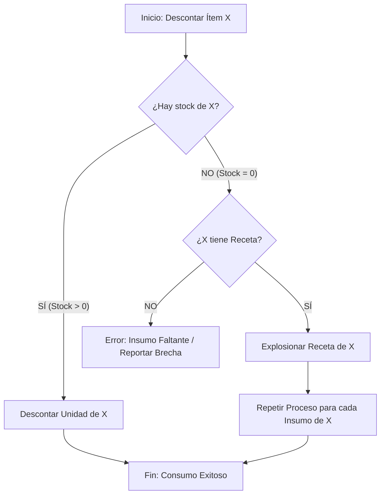

# 24 Motor de Consumo Recursivo (Stock-Aware)

Este documento define la lógica técnica del motor de consumo de inventario de Terrena 2026, implementado en la función `selemti.fn_expandir_consumo_ticket`.

## 1. Principio Fundamental
El sistema debe garantizar la exactitud del **Inventory Food Cost** independientemente del origen físico o marca del producto (comprado o elaborado internamente). Para ello, el motor utiliza un algoritmo recursivo que evalúa las existencias de **Insumos Genéricos** (desacoplados de marcas comerciales) en tiempo real.

## 2. Diagrama de Decisión (Logic Flow)
El motor aplica la siguiente lógica para cada componente de una receta:

## 3. Reglas de Negocio Implementadas

### 3.1 Consumo por Unidad (Semiterminados)
- **Definición**: Si el sistema detecta inventario de un producto elaborado (ej. Salsa Roja, Tortas ya preparadas), el sistema asume que el proceso de transformación ya ocurrió.
- **Acción**: Se liquida el producto terminado para no duplicar el descuento de los insumos base que ya fueron descontados en la **Orden de Producción (OP)**.

### 3.2 Explosión Automática (BOM Explosion)
- **Definición**: Si el inventario del semiterminado es cero, el sistema asume que el producto se está preparando "al momento" o desde sus materias primas originales.
- **Acción**: El motor recorre el **Bill of Materials (BOM)** y liquida los ingredientes base.

### 3.3 Recursividad Profunda
- El motor soporta hasta **5 niveles** de anidamiento.
- Ejemplo: *Chilaquiles* -> **Estado:** 🟡 PROTOTIPO AVANZADO (Pendiente Validación con Data Real)  
> **Versión:** 2.5 (Core Logic)  
> **Última revisión:** 14-Abr-2026  
La búsqueda de stock se realiza en cada nivel; el sistema se detendrá en el nivel más alto donde encuentre existencia física.

## 4. Auditoría y Trazabilidad
Cada expansión se registra en la tabla de auditoría `selemti.inv_consumo_pos_det` con los siguientes metadatos:
- **Origen**: `AUTO_BASE` (Plato principal) o `AUTO_MOD` (Modificador).
- **Nivel**: Nivel de profundidad en el que se encontró el insumo en el árbol de la receta.
- **Log**: Se genera una traza en `selemti.inv_consumo_pos_log` con el timestamp y versión del motor ejecutado.

## 5. Relación con el SSOT Financiero (Fase 1)
Mientras que este motor (Doc 24) determina la **baja física** de insumos, el **SSOT de Ventas** ([Doc 07](file:///C:/xampp3/htdocs/TerrenaLaravel/docs/2026/07_SSOT_VENTAS_Y_DESCUENTOS.md)) determina la **entrada financiera** real. 
- La conciliación final del negocio ocurre al cruzar este consumo teórico contra la liquidación canónica de `public.transactions`.

## 7. Deuda Técnica y Riesgos (DICTAMEN CRÍTICO)
> [!WARNING]
> **El Hack de Compatibilidad de IDs**:
> El motor actual utiliza `COALESCE(substring(b.item_id from '[0-9]+')::integer, 0)` para parchar la divergencia entre IDs de texto y enteros. Esto es un **riesgo de trazabilidad**. 
> **Acción requerida**: Normalizar `selemti.items.id` a un formato íntegro y predecible antes de declarar este motor como "Certificado".

## 8. Próximos Pasos para Certificación
1. **Población de Datos**: Sin UOMs y Conversiones reales, el motor es inútil (Población actual: 0%).
2. **Validación Real**: Ejecución sobre tickets históricos con modificadores reales de Floreant.
3. **Audit Trail**: Validar que `inv_consumo_pos_det` registre costos WAC reales, no ceros teóricos.
**Nota Técnica**: Esta lógica asegura que el Kardex refleje la realidad física de la cocina, permitiendo una operatividad flexible sin comprometer la integridad financiera certificada en la Fase 1.
