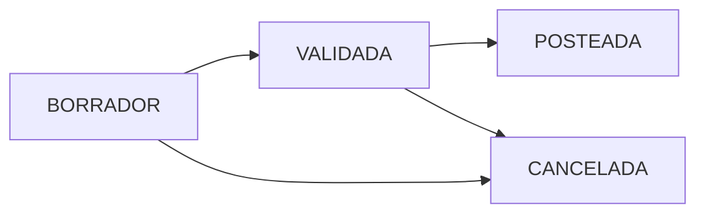

# PROMPTS PARA QWEN - Terrena POS
**Fecha**: 25-Nov-2025
**Proyecto**: TerrenaLaravel - Sistema POS Multi-Almacén
**Coordinador**: Claude Code (CLAUDE-WORKER-FRONTEND-V4.1)

## 🚨 RESTRICCIONES CRÍTICAS DE SEGURIDAD

**IMPORTANTE**: QWEN NO DEBE ejecutar:
- ❌ **NINGUNA** migración de Laravel (`php artisan migrate`)
- ❌ **NINGÚN** query SQL directo a la base de datos
- ❌ **NINGUNA** modificación de esquema de BD
- ❌ **NINGÚN** comando que altere tablas, columnas o constraints

**Razón**: Ejecuciones previas no coordinadas corrompieron la base de datos, causando pérdida de 159 tablas. La BD actual está validada y funcional.

## ✅ ROL DE QWEN: Documentación y Validación (READ-ONLY)

QWEN actuará como **arquitecto de documentación y validación**, con acceso de SOLO LECTURA a:
- Código fuente existente
- Esquema de BD (lectura mediante `\d` en psql, NO queries de modificación)
- Tests existentes
- Documentación del proyecto

---

## PROMPT 1: Documentar Esquema de BD Actual (Inventario)

```markdown
CONTEXTO:
Eres QWEN, especialista en bases de datos PostgreSQL 9.5 para el proyecto Terrena POS.

OBJETIVO:
Documentar el esquema COMPLETO de las tablas de inventario en el schema 'selemti', basándote ÚNICAMENTE en lectura del esquema existente.

RESTRICCIONES CRÍTICAS:
- ✅ SOLO comandos \d, \dt, \di (comandos de psql para inspección)
- ✅ SOLO queries SELECT para ver datos de ejemplo
- ❌ NO ejecutar ALTER, CREATE, DROP, UPDATE, DELETE, INSERT
- ❌ NO ejecutar migraciones de Laravel
- ❌ NO sugerir cambios de esquema (solo documentar lo que existe)

TABLAS A DOCUMENTAR (lectura con \d):
1. selemti.recepcion_cab
2. selemti.recepcion_det
3. selemti.traspaso_cab
4. selemti.traspaso_det
5. selemti.mov_inv
6. selemti.inventory_batch
7. selemti.cat_unidades
8. selemti.cat_almacenes
9. selemti.cat_sucursales
10. selemti.cat_proveedores
11. selemti.items

FORMATO DE SALIDA (para cada tabla):
## Tabla: selemti.[nombre_tabla]

### Descripción
[Propósito de la tabla en el sistema]

### Estructura
```sql
-- Output del comando \d selemti.[nombre_tabla]
```

### Columnas Clave
| Columna | Tipo | Constraints | Descripción |
|---------|------|-------------|-------------|
| ... | ... | ... | ... |

### Foreign Keys
- [columna] → [tabla_referenciada].[columna_referenciada]

### Índices
- [nombre_índice]: [columnas]

### Datos de Ejemplo (3 registros)
```sql
SELECT * FROM selemti.[tabla] LIMIT 3;
```

ENTREGABLE:
Archivo markdown: `docs/BD/INVENTARIO_SCHEMA_ACTUAL.md` con la documentación completa.

COMANDOS PERMITIDOS:
```bash
psql -h localhost -p 5433 -U postgres -d pos -c "\d selemti.recepcion_cab"
psql -h localhost -p 5433 -U postgres -d pos -c "SELECT * FROM selemti.recepcion_cab LIMIT 3"
```

NO EJECUTAR ningún comando fuera de estos patrones.
```

---

## PROMPT 2: Validar Consistencia Código vs BD

```markdown
CONTEXTO:
El proyecto Terrena POS ha experimentado desalineaciones entre código Laravel y estructura de BD real.

OBJETIVO:
Validar que los modelos Eloquent coincidan EXACTAMENTE con la estructura de BD documentada.

RESTRICCIONES:
- ✅ SOLO lectura de archivos PHP
- ✅ SOLO comparación con documentación de BD (PROMPT 1)
- ❌ NO modificar código
- ❌ NO ejecutar queries

ARCHIVOS A VALIDAR:
1. app/Models/Inventory/Reception.php vs selemti.recepcion_cab
2. app/Models/Inventory/ReceptionLine.php vs selemti.recepcion_det
3. app/Models/Inventory/TransferHeader.php vs selemti.traspaso_cab
4. app/Models/Inventory/TransferLine.php vs selemti.traspaso_det
5. app/Models/Inventory/Movement.php vs selemti.mov_inv
6. app/Models/Inventory/Batch.php vs selemti.inventory_batch
7. app/Models/Inv/Item.php vs selemti.items
8. app/Models/Catalogs/Unidad.php vs selemti.cat_unidades
9. app/Models/Catalogs/Almacen.php vs selemti.cat_almacenes
10. app/Models/Catalogs/Sucursal.php vs selemti.cat_sucursales

VALIDACIONES POR MODELO:
- [ ] protected $table coincide con nombre real
- [ ] protected $fillable incluye todas las columnas insertables
- [ ] protected $casts tiene tipos correctos
- [ ] Relaciones (belongsTo, hasMany) usan foreign keys correctas
- [ ] primaryKey es correcto

FORMATO DE SALIDA:
## Validación: [NombreModelo]

**Archivo**: `app/Models/.../[Modelo].php`
**Tabla BD**: `selemti.[tabla]`

### ✅ Alineaciones Correctas
- `$table = 'selemti.tabla'` ✓
- `$fillable` incluye: col1, col2, col3 ✓

### ❌ Desalineaciones Encontradas
| Aspecto | En Código | En BD Real | Acción Requerida |
|---------|-----------|------------|------------------|
| Nombre columna | `usuario_id` | `user_id` | Renombrar en modelo |

### 🔗 Validación de Relaciones
- `belongsTo(User::class, 'usuario_id')` → Verificar que selemti.tabla.usuario_id existe

ENTREGABLE:
`docs/CODE_VALIDATION/MODELS_VS_BD_VALIDATION.md`

NO HACER:
- Modificar código
- Ejecutar migraciones
- Proponer cambios de BD
```

---

## PROMPT 3: Documentar Flujos de Negocio

```markdown
CONTEXTO:
Los módulos de Recepciones y Transferencias están 100% funcionales. Necesitamos documentar sus flujos.

OBJETIVO:
Documentar los flujos completos de estado (state machines) basándote en el código de servicios.

ARCHIVOS A ANALIZAR (SOLO LECTURA):
1. app/Services/Inventory/ReceptionService.php
2. app/Services/Inventory/TransferService.php

ESTRUCTURA DEL ANÁLISIS:

## Módulo: Recepciones de Inventario

### State Machine


### Estados
| Estado | Descripción | Editable | Afecta Inventario |
|--------|-------------|----------|-------------------|
| BORRADOR | Recepción en captura | ✅ Sí | ❌ No |
| VALIDADA | Revisada y aprobada | ❌ No | ❌ No |
| POSTEADA | Aplicada a kardex | ❌ No | ✅ Sí |

### Métodos del Servicio
#### `createDraftReception(array $header, array $lines): int`
**Entrada**:
```php
$header = [
    'supplier_id' => int,
    'warehouse_id' => int,
    'user_id' => int
];
$lines = [[
    'item_id' => string,
    'qty_pack' => float,
    'costo_unit' => float,
    // ...
]];
```

**Proceso**:
1. Crea registro en `selemti.recepcion_cab` (estado: BORRADOR)
2. Inserta líneas en `selemti.recepcion_det`
3. Calcula totales (presentaciones y canónico)
4. NO crea batch ni afecta inventario

**Salida**: ID de recepción creada

**Permisos**: `recepciones.crear`

#### `validateReception(int $receptionId, int $userId): void`
[Similar estructura...]

#### `postReception(int $receptionId, int $userId): void`
[Similar estructura...]

### Registros de Auditoría
- `usuario_id`: Quien creó
- `validada_por`: Quien validó
- `validada_at`: Timestamp de validación
- `posteada_por`: Quien posteó
- `posteada_at`: Timestamp de posteo

### Efectos en Inventario (POST)
1. Crea lote en `selemti.inventory_batch`
2. Genera movimiento ENTRADA en `selemti.mov_inv`
3. Actualiza `batch_id` en `recepcion_det`

ENTREGABLE:
`docs/BUSINESS_FLOWS/RECEPCIONES_FLOW.md`
`docs/BUSINESS_FLOWS/TRANSFERENCIAS_FLOW.md`

RESTRICCIONES:
- Solo analizar código existente
- No proponer modificaciones
- Documentar el comportamiento ACTUAL
```

---

## PROMPT 4: Crear Plan de Tests de Integración

```markdown
CONTEXTO:
Los tests `test_reception_complete.php` y `test_transfer_complete.php` están funcionando al 100%.

OBJETIVO:
Documentar la estrategia de testing y crear plan para tests de módulos pendientes.

ARCHIVOS DE REFERENCIA:
- test_reception_complete.php (COMPLETO ✅)
- test_transfer_complete.php (COMPLETO ✅)

ANÁLISIS REQUERIDO:

## Tests Existentes - Patrón Identificado

### test_reception_complete.php
**Pasos del Test**:
1. Crear recepción (BORRADOR)
2. Validar → VALIDADA
3. Postear → POSTEADA
4. Verificar lote creado
5. Verificar movimiento kardex
6. Verificar audit trail

**Verificaciones**:
- Estado final correcto
- Lote existe en inventory_batch
- Movimiento existe en mov_inv
- Campos de auditoría poblados

### Patrón de Test Identificado
```php
// PASO 1: Acción
$result = $service->metodo(...);

// PASO 2: Verificación inmediata
echo $result['status'] === 'ESPERADO' ? '✅' : '❌';

// PASO 3: Verificación en BD
$record = DB::connection('pgsql')
    ->table('selemti.tabla')
    ->where('id', $id)
    ->first();

echo $record->campo === 'esperado' ? '✅' : '❌';
```

## Plan de Tests para Módulos Pendientes

### TEST 3: Inventory Counts (Conteos Físicos)
**Servicio**: `app/Services/Inventory/InventoryCountService.php`
**Tablas**: `selemti.inventory_counts`, `selemti.inventory_count_lines`

**Flujo a Testear**:
```
ABIERTO → CERRADO → POSTEADO
```

**Test Steps** (NO IMPLEMENTAR, solo planificar):
```php
// PASO 1: Crear conteo ABIERTO
$countId = $service->createCount($warehouseId, $userId);

// PASO 2: Agregar líneas de conteo
$service->addCountLine($countId, $itemId, $qtyFisica);

// PASO 3: Cerrar conteo
$service->closeCount($countId, $userId);

// PASO 4: Calcular varianzas
$variances = $service->calculateVariances($countId);

// PASO 5: Postear ajustes
$service->postAdjustments($countId, $userId);

// VERIFICACIONES:
// - Count en estado POSTEADO
// - Varianzas calculadas correctamente
// - Movimientos de ajuste en mov_inv
```

### TEST 4: Production Orders
[Similar estructura...]

### TEST 5: POS Consumption
[Similar estructura...]

ENTREGABLE:
`docs/TESTING/INTEGRATION_TEST_PLAN.md` con:
- Patrón identificado de tests existentes
- Plan detallado para cada módulo pendiente
- NO código de implementación (solo plan)

RESTRICCIÓN:
- No ejecutar tests nuevos
- Solo planificar basándote en código existente de servicios
```

---

## PROMPT 5: Revisar Seguridad y Performance

```markdown
CONTEXTO:
Revisar código de servicios existentes para identificar posibles mejoras de seguridad y performance.

OBJETIVO:
Análisis estático del código (NO ejecutar, solo leer).

ARCHIVOS A REVISAR:
1. app/Services/Inventory/ReceptionService.php
2. app/Services/Inventory/TransferService.php
3. app/Http/Controllers/API/UnidadesController.php
4. app/Http/Controllers/API/InventarioController.php

ASPECTOS A REVISAR:

### 1. Seguridad
- [ ] SQL Injection: ¿Se usan bindings correctamente?
- [ ] Validación de entrada: ¿Todos los parámetros validados?
- [ ] Autorización: ¿Se verifican permisos?
- [ ] Mass Assignment: ¿$fillable/$guarded configurados?

### 2. Performance
- [ ] N+1 Queries: ¿Se usan eager loading?
- [ ] Transacciones: ¿Operaciones multi-tabla en DB::transaction()?
- [ ] Índices: ¿Queries en columnas indexadas?

### 3. Manejo de Errores
- [ ] Try-catch apropiados
- [ ] Mensajes de error informativos
- [ ] Rollback en caso de fallo

FORMATO DE SALIDA:

## Servicio: ReceptionService

### ✅ Buenas Prácticas Identificadas
- Uso correcto de `DB::transaction()` en línea 179
- Validación de estado en línea 186

### ⚠️ Posibles Mejoras (NO implementar)
| Línea | Aspecto | Observación | Prioridad |
|-------|---------|-------------|-----------|
| 89 | Validación | Falta validar que warehouse_id exista | Media |
| 200 | Performance | Posible N+1 en loop de líneas | Baja |

### 🔒 Seguridad
- ✅ Sin vulnerabilidades críticas detectadas
- ⚠️ Considerar validar permisos en cada método público

ENTREGABLE:
`docs/CODE_REVIEW/SECURITY_PERFORMANCE_REVIEW.md`

RESTRICCIÓN:
- Solo análisis estático
- No ejecutar código
- No modificar archivos
- Reportar observaciones, no implementar fixes
```

---

## COORDINACIÓN CON CLAUDE Y CODEX

### Entregables de QWEN que CLAUDE usará:
1. `INVENTARIO_SCHEMA_ACTUAL.md` → Para crear UIs alineadas con BD
2. `MODELS_VS_BD_VALIDATION.md` → Para corregir modelos si hay desalineaciones
3. `RECEPCIONES_FLOW.md` → Para documentar componentes Livewire
4. `INTEGRATION_TEST_PLAN.md` → Para crear tests de módulos pendientes

### Entregables de QWEN que CODEX usará:
1. `BUSINESS_FLOWS/*.md` → Para implementar servicios pendientes
2. `INTEGRATION_TEST_PLAN.md` → Para crear tests unitarios
3. `SECURITY_PERFORMANCE_REVIEW.md` → Para aplicar mejoras sugeridas

---

## CHECKLIST DE SEGURIDAD PARA QWEN

Antes de ejecutar CUALQUIER comando, verificar:
- [ ] ¿Es un comando de LECTURA? (`\d`, `SELECT`, lectura de archivo)
- [ ] ¿NO modifica datos? (sin `ALTER`, `CREATE`, `UPDATE`, `DELETE`, `INSERT`)
- [ ] ¿NO ejecuta migraciones? (sin `php artisan migrate`)
- [ ] ¿El output es solo documentación/análisis?

Si la respuesta a CUALQUIERA es NO → **DETENER** y reportar a coordinador (Claude).

---

**Última actualización**: 25-Nov-2025
**Preparado por**: Claude Code (CLAUDE-WORKER-FRONTEND-V4.1)
**Estado BD**: Validada y funcional (182 tablas, 35 vistas)
