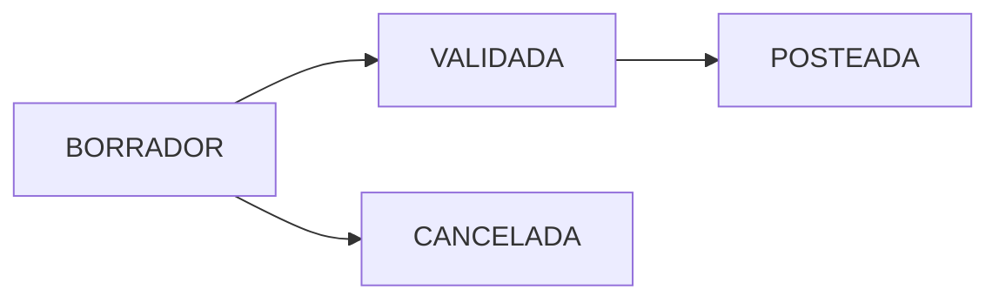

# Módulo: Recepciones de Inventario

## State Machine


### Estados

| Estado | Descripción | Editable | Afecta Inventario |
|--------|-------------|----------|-------------------|
| BORRADOR | Recepción en estado inicial, editable | ✅ Sí | ❌ No |
| VALIDADA | Recepción validada, no editable | ❌ No | ❌ No |
| POSTEADA | Recepción posteada, irreversible | ❌ No | ✅ Sí |
| CANCELADA | Recepción cancelada | ❌ No | ❌ No |

## Métodos del Servicio

### createDraftReception(array $header, array $lines): int

Entrada:
```php
$header = [
  'supplier_id' => int,
  'branch_id' => int|null,
  'warehouse_id' => int|null,
  'user_id' => int
];

$lines = [[
  'item_id' => string,
  'qty_pack' => numeric,
  'uom_purchase' => string,
  'pack_size' => numeric,
  'uom_base' => string,
  'costo_unit' => numeric,
  'lot' => string|null,
  'exp_date' => string|null,
  'temp' => numeric|null,
  'doc_url' => string|null
]];
```

Proceso:
1. Genera un número secuencial para la recepción
2. Crea el encabezado en `selemti.recepcion_cab` con estado BORRADOR
3. Crea los detalles en `selemti.recepcion_det`, sin crear lotes aún
4. Calcula totales y actualiza el encabezado

Salida: ID de la recepción creada

Permisos: No requiere permisos específicos

Efectos en BD:
- Tabla `selemti.recepcion_cab`: Inserta nuevo registro
- Tabla `selemti.recepcion_det`: Inserta registros de detalle

### validateReception(int $receptionId, int $userId): void

Entrada:
```php
$receptionId = ID de la recepción a validar
$userId = ID del usuario que realiza la validación
```

Proceso:
1. Verifica que la recepción exista
2. Verifica que esté en estado BORRADOR
3. Actualiza el estado a VALIDADA
4. Registra el usuario y timestamp de validación

Salida: void (no devuelve valor)

Permisos: requiere permiso 'recepciones.validar' (implícito)

Efectos en BD:
- Tabla `selemti.recepcion_cab`: Actualiza estado, validada_por, validada_at

### postReception(int $receptionId, int $userId): void

Entrada:
```php
$receptionId = ID de la recepción a postear
$userId = ID del usuario que realiza el posteo
```

Proceso:
1. Verifica que la recepción exista y esté en estado VALIDADA
2. Por cada línea de detalle, crea lotes en `selemti.inventory_batch`
3. Actualiza batch_id en `selemti.recepcion_det`
4. Crea movimientos en `selemti.mov_inv` de tipo ENTRADA
5. Actualiza la recepción a estado POSTEADA

Salida: void (no devuelve valor)

Permisos: No requiere permisos específicos

Efectos en BD:
- Tabla `selemti.inventory_batch`: Inserta nuevos lotes
- Tabla `selemti.recepcion_det`: Actualiza batch_id
- Tabla `selemti.mov_inv`: Inserta movimientos de inventario
- Tabla `selemti.recepcion_cab`: Actualiza estado, posteada_por, posteada_at

## Registros de Auditoría

- `usuario_id`: Quien creó la recepción (en cabecera)
- `validada_por`: Quien validó la recepción
- `validada_at`: Timestamp de validación
- `posteada_por`: Quien posteó la recepción
- `posteada_at`: Timestamp de posteo

## Efectos en Inventario

1. Tablas afectadas:
   - `selemti.inventory_batch`: Se crean nuevos lotes al postear
   - `selemti.mov_inv`: Se crean movimientos de entrada al postear
   - `selemti.recepcion_cab` y `selemti.recepcion_det`: Mantienen el registro

2. Movimientos creados: Tipo 'ENTRADA' en mov_inv referenciando la recepción

3. Cuándo se afecta el inventario: Solo cuando se invoca postReception (estado POSTEADA)

## Notas Importantes

- En estado BORRADOR no se afecta el inventario ni se crean lotes
- El estado VALIDADA no afecta el inventario pero bloquea ediciones
- El estado POSTEADA es irreversible y actualiza el inventario
- Las recepciones utilizan la numeración secuencial con formato 'RC-YYYYMMDD-####'
- Los lotes se crean con ubicación basada en el almacén de recepción