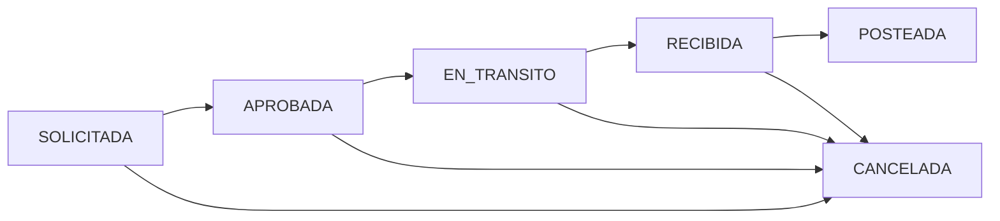

# Módulo: Transferencias de Inventario

## State Machine


### Estados

| Estado | Descripción | Editable | Afecta Inventario |
|--------|-------------|----------|-------------------|
| SOLICITADA | Transferencia creada, pendiente de aprobación | ✅ Sí | ❌ No |
| APROBADA | Transferencia aprobada, pendiente de despacho | ❌ No | ❌ No |
| EN_TRANSITO | Transferencia en tránsito | ❌ No | ❌ No |
| RECIBIDA | Transferencia recibida en destino | ❌ No | ❌ No |
| POSTEADA | Transferencia posteada, irreversible | ❌ No | ✅ Sí |
| CANCELADA | Transferencia cancelada | ❌ No | ❌ No |

## Métodos del Servicio

### createTransfer(int $fromAlmacenId, int $toAlmacenId, array $lines, int $userId): array

Entrada:
```php
$fromAlmacenId = ID del almacén de origen
$toAlmacenId = ID del almacén de destino
$lines = [array de líneas con formato ['item_id' => string, 'qty_requested' => numeric, 'cantidad' => numeric]]
$userId = ID del usuario que crea la transferencia
```

Proceso:
1. Valida que los IDs de almacén sean positivos y diferentes
2. Valida que existan líneas en la transferencia
3. Crea el encabezado en `selemti.traspaso_cab` con estado SOLICITADA
4. Crea los detalles en `selemti.traspaso_det`

Salida: Array con ['transfer_id' => ID de la transferencia, 'status' => estado actual]

Permisos: No requiere permisos específicos

Efectos en BD:
- Tabla `selemti.traspaso_cab`: Inserta nuevo registro
- Tabla `selemti.traspaso_det`: Inserta registros de detalle

### approveTransfer(int $transferId, int $userId): array

Entrada:
```php
$transferId = ID de la transferencia a aprobar
$userId = ID del usuario que realiza la aprobación
```

Proceso:
1. Verifica que la transferencia exista y esté en estado SOLICITADA
2. Calcula el stock disponible en el almacén de origen para los items
3. Valida que haya suficiente stock para todos los items solicitados
4. Actualiza el estado a APROBADA
5. Registra quién aprobó y cuándo

Salida: Array con ['transfer_id' => ID de la transferencia, 'status' => estado actual]

Permisos: No requiere permisos específicos

Efectos en BD:
- Tabla `selemti.traspaso_cab`: Actualiza estado, validada_por, validada_at

### markInTransit(int $transferId, int $userId, ?string $numeroGuia = null): array

Entrada:
```php
$transferId = ID de la transferencia a marcar como en tránsito
$userId = ID del usuario que registra el cambio
$numeroGuia = Número de guía opcional (null por defecto)
```

Proceso:
1. Verifica que la transferencia exista y esté en estado APROBADA
2. Actualiza las cantidades despachadas en cada línea
3. Cambia el estado a EN_TRANSITO
4. Registra quién despachó y el número de guía (si aplica)

Salida: Array con ['transfer_id' => ID de la transferencia, 'status' => estado actual, 'numero_guia' => número de guía]

Permisos: No requiere permisos específicos

Efectos en BD:
- Tabla `selemti.traspaso_det`: Actualiza cantidad_despachada
- Tabla `selemti.traspaso_cab`: Actualiza estado, despachada_por, guia

### receiveTransfer(int $transferId, array $receivedLines, int $userId): array

Entrada:
```php
$transferId = ID de la transferencia a recibir
$receivedLines = [array con formato ['line_id' => ID de línea, 'cantidad_recibida' => numeric]]
$userId = ID del usuario que realiza la recepción
```

Proceso:
1. Verifica que la transferencia exista y esté en estado EN_TRANSITO
2. Actualiza las cantidades recibidas en cada línea correspondiente
3. Calcula las varianzas entre lo despachado y lo recibido
4. Cambia el estado a RECIBIDA
5. Registra quién recibió

Salida: Array con ['transfer_id' => ID de la transferencia, 'status' => estado actual, 'varianzas' => array de varianzas, 'lines_confirmed' => número de líneas confirmadas]

Permisos: No requiere permisos específicos

Efectos en BD:
- Tabla `selemti.traspaso_det`: Actualiza cantidad_recibida
- Tabla `selemti.traspaso_cab`: Actualiza estado, recibida_por

### postTransferToInventory(int $transferId, int $userId): array

Entrada:
```php
$transferId = ID de la transferencia a postear
$userId = ID del usuario que realiza el posteo
```

Proceso:
1. Verifica que la transferencia exista y esté en estado APROBADA
2. Por cada línea, crea un movimiento de salida en el almacén de origen
3. Por cada línea, crea un movimiento de entrada en el almacén de destino
4. Cambia el estado a POSTEADA
5. Registra quién posteó y cuándo

Salida: Array con ['transfer_id' => ID de la transferencia, 'movements_created' => número total de movimientos, 'status' => estado actual, 'movimientos' => array de IDs de movimientos]

Permisos: No requiere permisos específicos

Efectos en BD:
- Tabla `selemti.mov_inv`: Inserta movimientos de salida (-) y entrada (+)
- Tabla `selemti.traspaso_cab`: Actualiza estado, posteada_por, posteada_at

## Registros de Auditoría

- `usuario_id`: Quien creó la transferencia (en cabecera)
- `validada_por`: Quien aprobó la transferencia
- `validada_at`: Timestamp de aprobación
- `despachada_por`: Quien despachó la transferencia
- `guia`: Número de guía de envío
- `recibida_por`: Quien recibió la transferencia
- `posteada_por`: Quien posteó la transferencia
- `posteada_at`: Timestamp de posteo

## Efectos en Inventario

1. Tablas afectadas:
   - `selemti.mov_inv`: Se crean movimientos de salida y entrada al postear
   - `selemti.traspaso_cab` y `selemti.traspaso_det`: Mantienen el registro de la transferencia

2. Movimientos creados: Tipo 'TRASPASO' en mov_inv (negativos en origen, positivos en destino)

3. Cuándo se afecta el inventario: Solo cuando se invoca postTransferToInventory (estado POSTEADA), lo cual crea movimientos de inventario en ambos almacenes

## Notas Importantes

- La aprobación implica validación de stock disponible en el almacén de origen
- La recepción puede incluir varianzas (diferencias entre lo enviado y lo recibido)
- El estado POSTEADA es irreversible y actualiza el inventario en ambos almacenes
- El sistema prevé la posibilidad de cancelación en múltiples estados, aunque no se implementa en los métodos mostrados
- Actualmente, se permite postear directamente desde APROBADA sin pasar por EN_TRANSITO o RECIBIDA