Data Dictionary — public y selemti

Fecha: 2025-10-17 08:31

search_path sesión: selemti, public

# Esquema: public

## public.action_history — filas aprox: 36562

- Tipo: BASE TABLE

### Campos
- id: integer(32,0); nullable=no; default=nextval('action_history_id_seq'::regclass)
- action_time: timestamp without time zone; nullable=yes; default=null
- action_name: character varying(255); nullable=yes; default=null
- description: character varying(255); nullable=yes; default=null
- user_id: integer(32,0); nullable=yes; default=null

### PK
- id

### FKs
- user_id ? public.users(auto_id) [FALTA ÍNDICE]

### Índices
- action_history_pkey (UNIQUE PK) — () — CREATE UNIQUE INDEX action_history_pkey ON action_history USING btree (id)

### Únicas
- N/A

### Checks
- N/A

### Secuencias
- id ? public.action_history_id_seq

### Flags
- sin_timestamps

## public.attendence_history — filas aprox: 8

- Tipo: BASE TABLE

### Campos
- id: integer(32,0); nullable=no; default=nextval('attendence_history_id_seq'::regclass)
- clock_in_time: timestamp without time zone; nullable=yes; default=null
- clock_out_time: timestamp without time zone; nullable=yes; default=null
- clock_in_hour: smallint(16,0); nullable=yes; default=null
- clock_out_hour: smallint(16,0); nullable=yes; default=null
- clocked_out: boolean; nullable=yes; default=null
- user_id: integer(32,0); nullable=yes; default=null
- shift_id: integer(32,0); nullable=yes; default=null
- terminal_id: integer(32,0); nullable=yes; default=null

### PK
- id

### FKs
- terminal_id ? public.terminal(id) [FALTA ÍNDICE]
- user_id ? public.users(auto_id) [FALTA ÍNDICE]
- shift_id ? public.shift(id) [FALTA ÍNDICE]

### Índices
- attendence_history_pkey (UNIQUE PK) — () — CREATE UNIQUE INDEX attendence_history_pkey ON attendence_history USING btree (id)

### Únicas
- N/A

### Checks
- N/A

### Secuencias
- id ? public.attendence_history_id_seq

### Flags
- sin_timestamps

## public.cash_drawer — filas aprox: 0

- Tipo: BASE TABLE

### Campos
- id: integer(32,0); nullable=no; default=nextval('cash_drawer_id_seq'::regclass)
- terminal_id: integer(32,0); nullable=yes; default=null

### PK
- id

### FKs
- terminal_id ? public.terminal(id) [FALTA ÍNDICE]

### Índices
- cash_drawer_pkey (UNIQUE PK) — () — CREATE UNIQUE INDEX cash_drawer_pkey ON cash_drawer USING btree (id)

### Únicas
- N/A

### Checks
- N/A

### Secuencias
- id ? public.cash_drawer_id_seq

### Flags
- sin_timestamps

## public.cash_drawer_reset_history — filas aprox: 70

- Tipo: BASE TABLE

### Campos
- id: integer(32,0); nullable=no; default=nextval('cash_drawer_reset_history_id_seq'::regclass)
- reset_time: timestamp without time zone; nullable=yes; default=null
- user_id: integer(32,0); nullable=yes; default=null

### PK
- id

### FKs
- user_id ? public.users(auto_id) [FALTA ÍNDICE]

### Índices
- cash_drawer_reset_history_pkey (UNIQUE PK) — () — CREATE UNIQUE INDEX cash_drawer_reset_history_pkey ON cash_drawer_reset_history USING btree (id)

### Únicas
- N/A

### Checks
- N/A

### Secuencias
- id ? public.cash_drawer_reset_history_id_seq

### Flags
- sin_timestamps

## public.cooking_instruction — filas aprox: 17

- Tipo: BASE TABLE

### Campos
- id: integer(32,0); nullable=no; default=nextval('cooking_instruction_id_seq'::regclass)
- description: character varying(60); nullable=yes; default=null

### PK
- id

### FKs
- N/A

### Índices
- cooking_instruction_pkey (UNIQUE PK) — () — CREATE UNIQUE INDEX cooking_instruction_pkey ON cooking_instruction USING btree (id)

### Únicas
- N/A

### Checks
- N/A

### Secuencias
- id ? public.cooking_instruction_id_seq

### Flags
- sin_timestamps

## public.coupon_and_discount — filas aprox: 6

- Tipo: BASE TABLE

### Campos
- id: integer(32,0); nullable=no; default=nextval('coupon_and_discount_id_seq'::regclass)
- name: character varying(120); nullable=yes; default=null
- type: integer(32,0); nullable=yes; default=null
- barcode: character varying(120); nullable=yes; default=null
- qualification_type: integer(32,0); nullable=yes; default=null
- apply_to_all: boolean; nullable=yes; default=null
- minimum_buy: integer(32,0); nullable=yes; default=null
- maximum_off: integer(32,0); nullable=yes; default=null
- value: double precision(53,0); nullable=yes; default=null
- expiry_date: timestamp without time zone; nullable=yes; default=null
- enabled: boolean; nullable=yes; default=null
- auto_apply: boolean; nullable=yes; default=null
- modifiable: boolean; nullable=yes; default=null
- never_expire: boolean; nullable=yes; default=null
- uuid: character varying(36); nullable=yes; default=null

### PK
- id

### FKs
- N/A

### Índices
- coupon_and_discount_pkey (UNIQUE PK) — () — CREATE UNIQUE INDEX coupon_and_discount_pkey ON coupon_and_discount USING btree (id)
- coupon_and_discount_uuid_key (UNIQUE ) — () — CREATE UNIQUE INDEX coupon_and_discount_uuid_key ON coupon_and_discount USING btree (uuid)

### Únicas
- coupon_and_discount_uuid_key — [uuid]

### Checks
- N/A

### Secuencias
- id ? public.coupon_and_discount_id_seq

### Flags
- monetario_no_uniforme
- sin_timestamps

## public.currency — filas aprox: 5

- Tipo: BASE TABLE

### Campos
- id: integer(32,0); nullable=no; default=nextval('currency_id_seq'::regclass)
- code: character varying(20); nullable=yes; default=null
- name: character varying(30); nullable=yes; default=null
- symbol: character varying(10); nullable=yes; default=null
- exchange_rate: double precision(53,0); nullable=yes; default=null
- decimal_places: integer(32,0); nullable=yes; default=null
- tolerance: double precision(53,0); nullable=yes; default=null
- buy_price: double precision(53,0); nullable=yes; default=null
- sales_price: double precision(53,0); nullable=yes; default=null
- main: boolean; nullable=yes; default=null

### PK
- id

### FKs
- N/A

### Índices
- currency_pkey (UNIQUE PK) — () — CREATE UNIQUE INDEX currency_pkey ON currency USING btree (id)

### Únicas
- N/A

### Checks
- N/A

### Secuencias
- id ? public.currency_id_seq

### Flags
- monetario_no_uniforme
- sin_timestamps

## public.currency_balance — filas aprox: 0

- Tipo: BASE TABLE

### Campos
- id: integer(32,0); nullable=no; default=nextval('currency_balance_id_seq'::regclass)
- balance: double precision(53,0); nullable=yes; default=null
- currency_id: integer(32,0); nullable=yes; default=null
- cash_drawer_id: integer(32,0); nullable=yes; default=null
- dpr_id: integer(32,0); nullable=yes; default=null

### PK
- id

### FKs
- currency_id ? public.currency(id) [FALTA ÍNDICE]
- cash_drawer_id ? public.cash_drawer(id) [FALTA ÍNDICE]
- dpr_id ? public.drawer_pull_report(id) [FALTA ÍNDICE]

### Índices
- currency_balance_pkey (UNIQUE PK) — () — CREATE UNIQUE INDEX currency_balance_pkey ON currency_balance USING btree (id)

### Únicas
- N/A

### Checks
- N/A

### Secuencias
- id ? public.currency_balance_id_seq

### Flags
- monetario_no_uniforme
- sin_timestamps

## public.custom_payment — filas aprox: 1

- Tipo: BASE TABLE

### Campos
- id: integer(32,0); nullable=no; default=nextval('custom_payment_id_seq'::regclass)
- name: character varying(60); nullable=yes; default=null
- required_ref_number: boolean; nullable=yes; default=null
- ref_number_field_name: character varying(60); nullable=yes; default=null

### PK
- id

### FKs
- N/A

### Índices
- custom_payment_pkey (UNIQUE PK) — () — CREATE UNIQUE INDEX custom_payment_pkey ON custom_payment USING btree (id)

### Únicas
- N/A

### Checks
- N/A

### Secuencias
- id ? public.custom_payment_id_seq

### Flags
- sin_timestamps

## public.customer — filas aprox: 0

- Tipo: BASE TABLE

### Campos
- auto_id: integer(32,0); nullable=no; default=nextval('customer_auto_id_seq'::regclass)
- loyalty_no: character varying(30); nullable=yes; default=null
- loyalty_point: integer(32,0); nullable=yes; default=null
- social_security_number: character varying(60); nullable=yes; default=null
- picture: bytea; nullable=yes; default=null
- homephone_no: character varying(30); nullable=yes; default=null
- mobile_no: character varying(30); nullable=yes; default=null
- workphone_no: character varying(30); nullable=yes; default=null
- email: character varying(40); nullable=yes; default=null
- salutation: character varying(60); nullable=yes; default=null
- first_name: character varying(60); nullable=yes; default=null
- last_name: character varying(60); nullable=yes; default=null
- name: character varying(120); nullable=yes; default=null
- dob: character varying(16); nullable=yes; default=null
- ssn: character varying(30); nullable=yes; default=null
- address: character varying(220); nullable=yes; default=null
- city: character varying(30); nullable=yes; default=null
- state: character varying(30); nullable=yes; default=null
- zip_code: character varying(10); nullable=yes; default=null
- country: character varying(30); nullable=yes; default=null
- vip: boolean; nullable=yes; default=null
- credit_limit: double precision(53,0); nullable=yes; default=null
- credit_spent: double precision(53,0); nullable=yes; default=null
- credit_card_no: character varying(30); nullable=yes; default=null
- note: character varying(255); nullable=yes; default=null

### PK
- auto_id

### FKs
- N/A

### Índices
- customer_pkey (UNIQUE PK) — () — CREATE UNIQUE INDEX customer_pkey ON customer USING btree (auto_id)

### Únicas
- N/A

### Checks
- N/A

### Secuencias
- auto_id ? public.customer_auto_id_seq

### Flags
- monetario_no_uniforme
- sin_timestamps

## public.customer_properties — filas aprox: 0

- Tipo: BASE TABLE

### Campos
- id: integer(32,0); nullable=no; default=null
- property_value: character varying(255); nullable=yes; default=null
- property_name: character varying(255); nullable=no; default=null

### PK
- id, property_name

### FKs
- id ? public.customer(auto_id) [FALTA ÍNDICE]

### Índices
- customer_properties_pkey (UNIQUE PK) — () — CREATE UNIQUE INDEX customer_properties_pkey ON customer_properties USING btree (id, property_name)

### Únicas
- N/A

### Checks
- N/A

### Secuencias
- N/A

### Flags
- sin_timestamps

## public.daily_folio_counter — filas aprox: 21

- Tipo: BASE TABLE

### Campos
- folio_date: date; nullable=no; default=null
- branch_key: text; nullable=no; default=null
- last_value: integer(32,0); nullable=no; default=0

### PK
- folio_date, branch_key

### FKs
- N/A

### Índices
- daily_folio_counter_pkey (UNIQUE PK) — () — CREATE UNIQUE INDEX daily_folio_counter_pkey ON daily_folio_counter USING btree (folio_date, branch_key)

### Únicas
- N/A

### Checks
- N/A

### Secuencias
- N/A

### Flags
- sin_timestamps

## public.data_update_info — filas aprox: 1

- Tipo: BASE TABLE

### Campos
- id: integer(32,0); nullable=no; default=nextval('data_update_info_id_seq'::regclass)
- last_update_time: timestamp without time zone; nullable=yes; default=null

### PK
- id

### FKs
- N/A

### Índices
- data_update_info_pkey (UNIQUE PK) — () — CREATE UNIQUE INDEX data_update_info_pkey ON data_update_info USING btree (id)

### Únicas
- N/A

### Checks
- N/A

### Secuencias
- id ? public.data_update_info_id_seq

### Flags
- sin_timestamps

## public.delivery_address — filas aprox: 0

- Tipo: BASE TABLE

### Campos
- id: integer(32,0); nullable=no; default=nextval('delivery_address_id_seq'::regclass)
- address: character varying(320); nullable=yes; default=null
- phone_extension: character varying(10); nullable=yes; default=null
- room_no: character varying(30); nullable=yes; default=null
- distance: double precision(53,0); nullable=yes; default=null
- customer_id: integer(32,0); nullable=yes; default=null

### PK
- id

### FKs
- customer_id ? public.customer(auto_id) [FALTA ÍNDICE]

### Índices
- delivery_address_pkey (UNIQUE PK) — () — CREATE UNIQUE INDEX delivery_address_pkey ON delivery_address USING btree (id)

### Únicas
- N/A

### Checks
- N/A

### Secuencias
- id ? public.delivery_address_id_seq

### Flags
- monetario_no_uniforme
- sin_timestamps

## public.delivery_charge — filas aprox: 0

- Tipo: BASE TABLE

### Campos
- id: integer(32,0); nullable=no; default=nextval('delivery_charge_id_seq'::regclass)
- name: character varying(220); nullable=yes; default=null
- zip_code: character varying(20); nullable=yes; default=null
- start_range: double precision(53,0); nullable=yes; default=null
- end_range: double precision(53,0); nullable=yes; default=null
- charge_amount: double precision(53,0); nullable=yes; default=null

### PK
- id

### FKs
- N/A

### Índices
- delivery_charge_pkey (UNIQUE PK) — () — CREATE UNIQUE INDEX delivery_charge_pkey ON delivery_charge USING btree (id)

### Únicas
- N/A

### Checks
- N/A

### Secuencias
- id ? public.delivery_charge_id_seq

### Flags
- monetario_no_uniforme
- sin_timestamps

## public.delivery_configuration — filas aprox: 1

- Tipo: BASE TABLE

### Campos
- id: integer(32,0); nullable=no; default=nextval('delivery_configuration_id_seq'::regclass)
- unit_name: character varying(20); nullable=yes; default=null
- unit_symbol: character varying(8); nullable=yes; default=null
- charge_by_zip_code: boolean; nullable=yes; default=null

### PK
- id

### FKs
- N/A

### Índices
- delivery_configuration_pkey (UNIQUE PK) — () — CREATE UNIQUE INDEX delivery_configuration_pkey ON delivery_configuration USING btree (id)

### Únicas
- N/A

### Checks
- N/A

### Secuencias
- id ? public.delivery_configuration_id_seq

### Flags
- sin_timestamps

## public.delivery_instruction — filas aprox: 0

- Tipo: BASE TABLE

### Campos
- id: integer(32,0); nullable=no; default=nextval('delivery_instruction_id_seq'::regclass)
- notes: character varying(220); nullable=yes; default=null
- customer_no: integer(32,0); nullable=yes; default=null

### PK
- id

### FKs
- customer_no ? public.customer(auto_id) [FALTA ÍNDICE]

### Índices
- delivery_instruction_pkey (UNIQUE PK) — () — CREATE UNIQUE INDEX delivery_instruction_pkey ON delivery_instruction USING btree (id)

### Únicas
- N/A

### Checks
- N/A

### Secuencias
- id ? public.delivery_instruction_id_seq

### Flags
- sin_timestamps

## public.drawer_assigned_history — filas aprox: 141

- Tipo: BASE TABLE

### Campos
- id: integer(32,0); nullable=no; default=nextval('drawer_assigned_history_id_seq'::regclass)
- time: timestamp without time zone; nullable=yes; default=null
- operation: character varying(60); nullable=yes; default=null
- a_user: integer(32,0); nullable=yes; default=null

### PK
- id

### FKs
- a_user ? public.users(auto_id) [FALTA ÍNDICE]

### Índices
- drawer_assigned_history_pkey (UNIQUE PK) — () — CREATE UNIQUE INDEX drawer_assigned_history_pkey ON drawer_assigned_history USING btree (id)
- idx_dah_user_op_time ( ) — () — CREATE INDEX idx_dah_user_op_time ON drawer_assigned_history USING btree (a_user, operation, "time" DESC)
- idx_drawer_assigned_history_user_time ( ) — () — CREATE INDEX idx_drawer_assigned_history_user_time ON drawer_assigned_history USING btree (a_user, "time")

### Únicas
- N/A

### Checks
- N/A

### Secuencias
- id ? public.drawer_assigned_history_id_seq

### Flags
- sin_timestamps

## public.drawer_pull_report — filas aprox: 70

- Tipo: BASE TABLE

### Campos
- id: integer(32,0); nullable=no; default=nextval('drawer_pull_report_id_seq'::regclass)
- report_time: timestamp without time zone; nullable=yes; default=null
- reg: character varying(15); nullable=yes; default=null
- ticket_count: integer(32,0); nullable=yes; default=null
- begin_cash: double precision(53,0); nullable=yes; default=null
- net_sales: double precision(53,0); nullable=yes; default=null
- sales_tax: double precision(53,0); nullable=yes; default=null
- cash_tax: double precision(53,0); nullable=yes; default=null
- total_revenue: double precision(53,0); nullable=yes; default=null
- gross_receipts: double precision(53,0); nullable=yes; default=null
- giftcertreturncount: integer(32,0); nullable=yes; default=null
- giftcertreturnamount: double precision(53,0); nullable=yes; default=null
- giftcertchangeamount: double precision(53,0); nullable=yes; default=null
- cash_receipt_no: integer(32,0); nullable=yes; default=null
- cash_receipt_amount: double precision(53,0); nullable=yes; default=null
- credit_card_receipt_no: integer(32,0); nullable=yes; default=null
- credit_card_receipt_amount: double precision(53,0); nullable=yes; default=null
- debit_card_receipt_no: integer(32,0); nullable=yes; default=null
- debit_card_receipt_amount: double precision(53,0); nullable=yes; default=null
- refund_receipt_count: integer(32,0); nullable=yes; default=null
- refund_amount: double precision(53,0); nullable=yes; default=null
- receipt_differential: double precision(53,0); nullable=yes; default=null
- cash_back: double precision(53,0); nullable=yes; default=null
- cash_tips: double precision(53,0); nullable=yes; default=null
- charged_tips: double precision(53,0); nullable=yes; default=null
- tips_paid: double precision(53,0); nullable=yes; default=null
- tips_differential: double precision(53,0); nullable=yes; default=null
- pay_out_no: integer(32,0); nullable=yes; default=null
- pay_out_amount: double precision(53,0); nullable=yes; default=null
- drawer_bleed_no: integer(32,0); nullable=yes; default=null
- drawer_bleed_amount: double precision(53,0); nullable=yes; default=null
- drawer_accountable: double precision(53,0); nullable=yes; default=null
- cash_to_deposit: double precision(53,0); nullable=yes; default=null
- variance: double precision(53,0); nullable=yes; default=null
- delivery_charge: double precision(53,0); nullable=yes; default=null
- totalvoidwst: double precision(53,0); nullable=yes; default=null
- totalvoid: double precision(53,0); nullable=yes; default=null
- totaldiscountcount: integer(32,0); nullable=yes; default=null
- totaldiscountamount: double precision(53,0); nullable=yes; default=null
- totaldiscountsales: double precision(53,0); nullable=yes; default=null
- totaldiscountguest: integer(32,0); nullable=yes; default=null
- totaldiscountpartysize: integer(32,0); nullable=yes; default=null
- totaldiscountchecksize: integer(32,0); nullable=yes; default=null
- totaldiscountpercentage: double precision(53,0); nullable=yes; default=null
- totaldiscountratio: double precision(53,0); nullable=yes; default=null
- user_id: integer(32,0); nullable=yes; default=null
- terminal_id: integer(32,0); nullable=yes; default=null

### PK
- id

### FKs
- terminal_id ? public.terminal(id) [FALTA ÍNDICE]
- user_id ? public.users(auto_id) [FALTA ÍNDICE]

### Índices
- drawer_pull_report_pkey (UNIQUE PK) — () — CREATE UNIQUE INDEX drawer_pull_report_pkey ON drawer_pull_report USING btree (id)
- drawer_report_time ( ) — () — CREATE INDEX drawer_report_time ON drawer_pull_report USING btree (report_time)

### Únicas
- N/A

### Checks
- N/A

### Secuencias
- id ? public.drawer_pull_report_id_seq

### Flags
- monetario_no_uniforme
- sin_timestamps

## public.drawer_pull_report_voidtickets — filas aprox: 0

- Tipo: BASE TABLE

### Campos
- dpreport_id: integer(32,0); nullable=no; default=null
- code: integer(32,0); nullable=yes; default=null
- reason: character varying(255); nullable=yes; default=null
- hast: character varying(255); nullable=yes; default=null
- quantity: integer(32,0); nullable=yes; default=null
- amount: double precision(53,0); nullable=yes; default=null

### PK
- N/A

### FKs
- dpreport_id ? public.drawer_pull_report(id) [FALTA ÍNDICE]

### Índices
- N/A

### Únicas
- N/A

### Checks
- N/A

### Secuencias
- N/A

### Flags
- monetario_no_uniforme
- sin_timestamps

## public.employee_in_out_history — filas aprox: 0

- Tipo: BASE TABLE

### Campos
- id: integer(32,0); nullable=no; default=nextval('employee_in_out_history_id_seq'::regclass)
- out_time: timestamp without time zone; nullable=yes; default=null
- in_time: timestamp without time zone; nullable=yes; default=null
- out_hour: smallint(16,0); nullable=yes; default=null
- in_hour: smallint(16,0); nullable=yes; default=null
- clock_out: boolean; nullable=yes; default=null
- user_id: integer(32,0); nullable=yes; default=null
- shift_id: integer(32,0); nullable=yes; default=null
- terminal_id: integer(32,0); nullable=yes; default=null

### PK
- id

### FKs
- terminal_id ? public.terminal(id) [FALTA ÍNDICE]
- user_id ? public.users(auto_id) [FALTA ÍNDICE]
- shift_id ? public.shift(id) [FALTA ÍNDICE]

### Índices
- employee_in_out_history_pkey (UNIQUE PK) — () — CREATE UNIQUE INDEX employee_in_out_history_pkey ON employee_in_out_history USING btree (id)

### Únicas
- N/A

### Checks
- N/A

### Secuencias
- id ? public.employee_in_out_history_id_seq

### Flags
- sin_timestamps

## public.global_config — filas aprox: 0

- Tipo: BASE TABLE

### Campos
- id: integer(32,0); nullable=no; default=nextval('global_config_id_seq'::regclass)
- pos_key: character varying(60); nullable=yes; default=null
- pos_value: character varying(220); nullable=yes; default=null

### PK
- id

### FKs
- N/A

### Índices
- global_config_pkey (UNIQUE PK) — () — CREATE UNIQUE INDEX global_config_pkey ON global_config USING btree (id)
- global_config_pos_key_key (UNIQUE ) — () — CREATE UNIQUE INDEX global_config_pos_key_key ON global_config USING btree (pos_key)

### Únicas
- global_config_pos_key_key — [pos_key]

### Checks
- N/A

### Secuencias
- id ? public.global_config_id_seq

### Flags
- sin_timestamps

## public.gratuity — filas aprox: 0

- Tipo: BASE TABLE

### Campos
- id: integer(32,0); nullable=no; default=nextval('gratuity_id_seq'::regclass)
- amount: double precision(53,0); nullable=yes; default=null
- paid: boolean; nullable=yes; default=null
- refunded: boolean; nullable=yes; default=null
- ticket_id: integer(32,0); nullable=yes; default=null
- owner_id: integer(32,0); nullable=yes; default=null
- terminal_id: integer(32,0); nullable=yes; default=null

### PK
- id

### FKs
- ticket_id ? public.ticket(id) [FALTA ÍNDICE]
- terminal_id ? public.terminal(id) [FALTA ÍNDICE]
- owner_id ? public.users(auto_id) [FALTA ÍNDICE]

### Índices
- gratuity_pkey (UNIQUE PK) — () — CREATE UNIQUE INDEX gratuity_pkey ON gratuity USING btree (id)

### Únicas
- N/A

### Checks
- N/A

### Secuencias
- id ? public.gratuity_id_seq

### Flags
- monetario_no_uniforme
- sin_timestamps

## public.group_taxes — filas aprox: 0

- Tipo: BASE TABLE

### Campos
- group_id: character varying(128); nullable=no; default=null
- elt: integer(32,0); nullable=no; default=null

### PK
- N/A

### FKs
- elt ? public.tax(id) [FALTA ÍNDICE]
- group_id ? public.tax_group(id) [FALTA ÍNDICE]

### Índices
- N/A

### Únicas
- N/A

### Checks
- N/A

### Secuencias
- N/A

### Flags
- sin_timestamps

## public.guest_check_print — filas aprox: 95

- Tipo: BASE TABLE

### Campos
- id: integer(32,0); nullable=no; default=nextval('guest_check_print_id_seq'::regclass)
- ticket_id: integer(32,0); nullable=yes; default=null
- table_no: character varying(255); nullable=yes; default=null
- ticket_total: double precision(53,0); nullable=yes; default=null
- print_time: timestamp without time zone; nullable=yes; default=null
- user_id: integer(32,0); nullable=yes; default=null

### PK
- id

### FKs
- user_id ? public.users(auto_id) [FALTA ÍNDICE]

### Índices
- guest_check_print_pkey (UNIQUE PK) — () — CREATE UNIQUE INDEX guest_check_print_pkey ON guest_check_print USING btree (id)

### Únicas
- N/A

### Checks
- N/A

### Secuencias
- id ? public.guest_check_print_id_seq

### Flags
- monetario_no_uniforme
- sin_timestamps

## public.inventory_group — filas aprox: 0

- Tipo: BASE TABLE

### Campos
- id: integer(32,0); nullable=no; default=nextval('inventory_group_id_seq'::regclass)
- name: character varying(60); nullable=no; default=null
- visible: boolean; nullable=yes; default=null

### PK
- id

### FKs
- N/A

### Índices
- inventory_group_pkey (UNIQUE PK) — () — CREATE UNIQUE INDEX inventory_group_pkey ON inventory_group USING btree (id)

### Únicas
- N/A

### Checks
- N/A

### Secuencias
- id ? public.inventory_group_id_seq

### Flags
- sin_timestamps

## public.inventory_item — filas aprox: 0

- Tipo: BASE TABLE

### Campos
- id: integer(32,0); nullable=no; default=nextval('inventory_item_id_seq'::regclass)
- create_time: timestamp without time zone; nullable=yes; default=null
- last_update_date: timestamp without time zone; nullable=yes; default=null
- name: character varying(60); nullable=yes; default=null
- package_barcode: character varying(30); nullable=yes; default=null
- unit_barcode: character varying(30); nullable=yes; default=null
- unit_per_package: double precision(53,0); nullable=yes; default=null
- sort_order: integer(32,0); nullable=yes; default=null
- package_reorder_level: integer(32,0); nullable=yes; default=null
- package_replenish_level: integer(32,0); nullable=yes; default=null
- description: character varying(255); nullable=yes; default=null
- average_package_price: double precision(53,0); nullable=yes; default=null
- total_unit_packages: double precision(53,0); nullable=yes; default=null
- total_recepie_units: double precision(53,0); nullable=yes; default=null
- unit_purchase_price: double precision(53,0); nullable=yes; default=null
- unit_selling_price: double precision(53,0); nullable=yes; default=null
- visible: boolean; nullable=yes; default=null
- punit_id: integer(32,0); nullable=yes; default=null
- recipe_unit_id: integer(32,0); nullable=yes; default=null
- item_group_id: integer(32,0); nullable=yes; default=null
- item_location_id: integer(32,0); nullable=yes; default=null
- item_vendor_id: integer(32,0); nullable=yes; default=null
- total_packages: integer(32,0); nullable=yes; default=null

### PK
- id

### FKs
- item_group_id ? public.inventory_group(id) [FALTA ÍNDICE]
- punit_id ? public.packaging_unit(id) [FALTA ÍNDICE]
- recipe_unit_id ? public.packaging_unit(id) [FALTA ÍNDICE]
- item_location_id ? public.inventory_location(id) [FALTA ÍNDICE]
- item_vendor_id ? public.inventory_vendor(id) [FALTA ÍNDICE]

### Índices
- inventory_item_pkey (UNIQUE PK) — () — CREATE UNIQUE INDEX inventory_item_pkey ON inventory_item USING btree (id)

### Únicas
- N/A

### Checks
- N/A

### Secuencias
- id ? public.inventory_item_id_seq

### Flags
- monetario_no_uniforme
- sin_timestamps

## public.inventory_location — filas aprox: 0

- Tipo: BASE TABLE

### Campos
- id: integer(32,0); nullable=no; default=nextval('inventory_location_id_seq'::regclass)
- name: character varying(60); nullable=no; default=null
- sort_order: integer(32,0); nullable=yes; default=null
- visible: boolean; nullable=yes; default=null
- warehouse_id: integer(32,0); nullable=yes; default=null

### PK
- id

### FKs
- warehouse_id ? public.inventory_warehouse(id) [FALTA ÍNDICE]

### Índices
- inventory_location_pkey (UNIQUE PK) — () — CREATE UNIQUE INDEX inventory_location_pkey ON inventory_location USING btree (id)

### Únicas
- N/A

### Checks
- N/A

### Secuencias
- id ? public.inventory_location_id_seq

### Flags
- sin_timestamps

## public.inventory_meta_code — filas aprox: 0

- Tipo: BASE TABLE

### Campos
- id: integer(32,0); nullable=no; default=nextval('inventory_meta_code_id_seq'::regclass)
- type: character varying(255); nullable=yes; default=null
- code_text: character varying(255); nullable=yes; default=null
- code_no: integer(32,0); nullable=yes; default=null
- description: character varying(255); nullable=yes; default=null

### PK
- id

### FKs
- N/A

### Índices
- inventory_meta_code_pkey (UNIQUE PK) — () — CREATE UNIQUE INDEX inventory_meta_code_pkey ON inventory_meta_code USING btree (id)

### Únicas
- N/A

### Checks
- N/A

### Secuencias
- id ? public.inventory_meta_code_id_seq

### Flags
- sin_timestamps

## public.inventory_transaction — filas aprox: 0

- Tipo: BASE TABLE

### Campos
- id: integer(32,0); nullable=no; default=nextval('inventory_transaction_id_seq'::regclass)
- transaction_date: timestamp without time zone; nullable=yes; default=null
- unit_quantity: double precision(53,0); nullable=yes; default=null
- unit_price: double precision(53,0); nullable=yes; default=null
- remark: character varying(255); nullable=yes; default=null
- tran_type: integer(32,0); nullable=yes; default=null
- reference_id: integer(32,0); nullable=yes; default=null
- item_id: integer(32,0); nullable=yes; default=null
- vendor_id: integer(32,0); nullable=yes; default=null
- from_warehouse_id: integer(32,0); nullable=yes; default=null
- to_warehouse_id: integer(32,0); nullable=yes; default=null
- quantity: integer(32,0); nullable=yes; default=null

### PK
- id

### FKs
- reference_id ? public.purchase_order(id) [FALTA ÍNDICE]
- item_id ? public.inventory_item(id) [FALTA ÍNDICE]
- vendor_id ? public.inventory_vendor(id) [FALTA ÍNDICE]
- to_warehouse_id ? public.inventory_warehouse(id) [FALTA ÍNDICE]
- from_warehouse_id ? public.inventory_warehouse(id) [FALTA ÍNDICE]

### Índices
- inventory_transaction_pkey (UNIQUE PK) — () — CREATE UNIQUE INDEX inventory_transaction_pkey ON inventory_transaction USING btree (id)

### Únicas
- N/A

### Checks
- N/A

### Secuencias
- id ? public.inventory_transaction_id_seq

### Flags
- monetario_no_uniforme
- sin_timestamps

## public.inventory_unit — filas aprox: 0

- Tipo: BASE TABLE

### Campos
- id: integer(32,0); nullable=no; default=nextval('inventory_unit_id_seq'::regclass)
- short_name: character varying(255); nullable=yes; default=null
- long_name: character varying(255); nullable=yes; default=null
- alt_name: character varying(255); nullable=yes; default=null
- conv_factor1: character varying(255); nullable=yes; default=null
- conv_factor2: character varying(255); nullable=yes; default=null
- conv_factor3: character varying(255); nullable=yes; default=null

### PK
- id

### FKs
- N/A

### Índices
- inventory_unit_pkey (UNIQUE PK) — () — CREATE UNIQUE INDEX inventory_unit_pkey ON inventory_unit USING btree (id)

### Únicas
- N/A

### Checks
- N/A

### Secuencias
- id ? public.inventory_unit_id_seq

### Flags
- sin_timestamps

## public.inventory_vendor — filas aprox: 0

- Tipo: BASE TABLE

### Campos
- id: integer(32,0); nullable=no; default=nextval('inventory_vendor_id_seq'::regclass)
- name: character varying(60); nullable=no; default=null
- visible: boolean; nullable=yes; default=null
- address: character varying(120); nullable=no; default=null
- city: character varying(60); nullable=no; default=null
- state: character varying(60); nullable=no; default=null
- zip: character varying(60); nullable=no; default=null
- country: character varying(60); nullable=no; default=null
- email: character varying(60); nullable=no; default=null
- phone: character varying(60); nullable=no; default=null
- fax: character varying(60); nullable=yes; default=null

### PK
- id

### FKs
- N/A

### Índices
- inventory_vendor_pkey (UNIQUE PK) — () — CREATE UNIQUE INDEX inventory_vendor_pkey ON inventory_vendor USING btree (id)

### Únicas
- N/A

### Checks
- N/A

### Secuencias
- id ? public.inventory_vendor_id_seq

### Flags
- sin_timestamps

## public.inventory_warehouse — filas aprox: 0

- Tipo: BASE TABLE

### Campos
- id: integer(32,0); nullable=no; default=nextval('inventory_warehouse_id_seq'::regclass)
- name: character varying(60); nullable=no; default=null
- visible: boolean; nullable=yes; default=null

### PK
- id

### FKs
- N/A

### Índices
- inventory_warehouse_pkey (UNIQUE PK) — () — CREATE UNIQUE INDEX inventory_warehouse_pkey ON inventory_warehouse USING btree (id)

### Únicas
- N/A

### Checks
- N/A

### Secuencias
- id ? public.inventory_warehouse_id_seq

### Flags
- sin_timestamps

## public.item_order_type — filas aprox: 90

- Tipo: BASE TABLE

### Campos
- menu_item_id: integer(32,0); nullable=no; default=null
- order_type_id: integer(32,0); nullable=no; default=null

### PK
- N/A

### FKs
- order_type_id ? public.order_type(id) [FALTA ÍNDICE]
- menu_item_id ? public.menu_item(id) [FALTA ÍNDICE]

### Índices
- N/A

### Únicas
- N/A

### Checks
- N/A

### Secuencias
- N/A

### Flags
- sin_timestamps

## public.kds_ready_log — filas aprox: 5

- Tipo: BASE TABLE

### Campos
- ticket_id: integer(32,0); nullable=no; default=null
- notified_at: timestamp without time zone; nullable=no; default=now()

### PK
- ticket_id

### FKs
- N/A

### Índices
- kds_ready_log_pkey (UNIQUE PK) — () — CREATE UNIQUE INDEX kds_ready_log_pkey ON kds_ready_log USING btree (ticket_id)

### Únicas
- N/A

### Checks
- N/A

### Secuencias
- N/A

### Flags
- sin_timestamps

## public.kit_ticket_table_num — filas aprox: 0

- Tipo: BASE TABLE

### Campos
- kit_ticket_id: integer(32,0); nullable=no; default=null
- table_id: integer(32,0); nullable=yes; default=null

### PK
- N/A

### FKs
- kit_ticket_id ? public.kitchen_ticket(id) [FALTA ÍNDICE]

### Índices
- N/A

### Únicas
- N/A

### Checks
- N/A

### Secuencias
- N/A

### Flags
- sin_timestamps

## public.kitchen_ticket — filas aprox: 0

- Tipo: BASE TABLE

### Campos
- id: integer(32,0); nullable=no; default=nextval('kitchen_ticket_id_seq'::regclass)
- ticket_id: integer(32,0); nullable=yes; default=null
- create_date: timestamp without time zone; nullable=yes; default=null
- close_date: timestamp without time zone; nullable=yes; default=null
- voided: boolean; nullable=yes; default=null
- sequence_number: integer(32,0); nullable=yes; default=null
- status: character varying(30); nullable=yes; default=null
- server_name: character varying(30); nullable=yes; default=null
- ticket_type: character varying(20); nullable=yes; default=null
- pg_id: integer(32,0); nullable=yes; default=null

### PK
- id

### FKs
- pg_id ? public.printer_group(id) [FALTA ÍNDICE]

### Índices
- ix_kitchen_ticket_ticket_id ( ) — () — CREATE INDEX ix_kitchen_ticket_ticket_id ON kitchen_ticket USING btree (ticket_id)
- kitchen_ticket_pkey (UNIQUE PK) — () — CREATE UNIQUE INDEX kitchen_ticket_pkey ON kitchen_ticket USING btree (id)

### Únicas
- N/A

### Checks
- N/A

### Secuencias
- id ? public.kitchen_ticket_id_seq

### Flags
- sin_timestamps

## public.kitchen_ticket_item — filas aprox: 1691

- Tipo: BASE TABLE

### Campos
- id: integer(32,0); nullable=no; default=nextval('kitchen_ticket_item_id_seq'::regclass)
- cookable: boolean; nullable=yes; default=null
- ticket_item_id: integer(32,0); nullable=no; default=null
- ticket_item_modifier_id: integer(32,0); nullable=yes; default=null
- menu_item_code: character varying(255); nullable=yes; default=null
- menu_item_name: character varying(120); nullable=yes; default=null
- menu_item_group_id: integer(32,0); nullable=yes; default=null
- menu_item_group_name: character varying(120); nullable=yes; default=null
- quantity: integer(32,0); nullable=yes; default=null
- fractional_quantity: double precision(53,0); nullable=yes; default=null
- fractional_unit: boolean; nullable=yes; default=null
- unit_name: character varying(20); nullable=yes; default=null
- sort_order: integer(32,0); nullable=yes; default=null
- voided: boolean; nullable=yes; default=null
- status: character varying(30); nullable=yes; default=null
- kithen_ticket_id: integer(32,0); nullable=yes; default=null
- item_order: integer(32,0); nullable=yes; default=null

### PK
- id

### FKs
- kithen_ticket_id ? public.kitchen_ticket(id) [FALTA ÍNDICE]

### Índices
- ix_kitchen_ticket_item_item_id ( ) — () — CREATE INDEX ix_kitchen_ticket_item_item_id ON kitchen_ticket_item USING btree (ticket_item_id)
- kitchen_ticket_item_pkey (UNIQUE PK) — () — CREATE UNIQUE INDEX kitchen_ticket_item_pkey ON kitchen_ticket_item USING btree (id)

### Únicas
- N/A

### Checks
- N/A

### Secuencias
- id ? public.kitchen_ticket_item_id_seq

### Flags
- monetario_no_uniforme
- sin_timestamps

## public.menu_category — filas aprox: 7

- Tipo: BASE TABLE

### Campos
- id: integer(32,0); nullable=no; default=nextval('menu_category_id_seq'::regclass)
- name: character varying(120); nullable=no; default=null
- translated_name: character varying(120); nullable=yes; default=null
- visible: boolean; nullable=yes; default=null
- beverage: boolean; nullable=yes; default=null
- sort_order: integer(32,0); nullable=yes; default=null
- btn_color: integer(32,0); nullable=yes; default=null
- text_color: integer(32,0); nullable=yes; default=null

### PK
- id

### FKs
- N/A

### Índices
- food_category_visible ( ) — () — CREATE INDEX food_category_visible ON menu_category USING btree (visible)
- menu_category_pkey (UNIQUE PK) — () — CREATE UNIQUE INDEX menu_category_pkey ON menu_category USING btree (id)

### Únicas
- N/A

### Checks
- N/A

### Secuencias
- id ? public.menu_category_id_seq

### Flags
- sin_timestamps

## public.menu_group — filas aprox: 23

- Tipo: BASE TABLE

### Campos
- id: integer(32,0); nullable=no; default=nextval('menu_group_id_seq'::regclass)
- name: character varying(120); nullable=no; default=null
- translated_name: character varying(120); nullable=yes; default=null
- visible: boolean; nullable=yes; default=null
- sort_order: integer(32,0); nullable=yes; default=null
- btn_color: integer(32,0); nullable=yes; default=null
- text_color: integer(32,0); nullable=yes; default=null
- category_id: integer(32,0); nullable=yes; default=null

### PK
- id

### FKs
- category_id ? public.menu_category(id) [FALTA ÍNDICE]

### Índices
- menu_group_pkey (UNIQUE PK) — () — CREATE UNIQUE INDEX menu_group_pkey ON menu_group USING btree (id)
- menugroupvisible ( ) — () — CREATE INDEX menugroupvisible ON menu_group USING btree (visible)

### Únicas
- N/A

### Checks
- N/A

### Secuencias
- id ? public.menu_group_id_seq

### Flags
- sin_timestamps

## public.menu_item — filas aprox: 93

- Tipo: BASE TABLE

### Campos
- id: integer(32,0); nullable=no; default=nextval('menu_item_id_seq'::regclass)
- name: character varying(120); nullable=no; default=null
- description: character varying(255); nullable=yes; default=null
- unit_name: character varying(20); nullable=yes; default=null
- translated_name: character varying(120); nullable=yes; default=null
- barcode: character varying(120); nullable=yes; default=null
- buy_price: double precision(53,0); nullable=no; default=null
- stock_amount: double precision(53,0); nullable=yes; default=null
- price: double precision(53,0); nullable=no; default=null
- discount_rate: double precision(53,0); nullable=yes; default=null
- visible: boolean; nullable=yes; default=null
- disable_when_stock_amount_is_zero: boolean; nullable=yes; default=null
- sort_order: integer(32,0); nullable=yes; default=null
- btn_color: integer(32,0); nullable=yes; default=null
- text_color: integer(32,0); nullable=yes; default=null
- image: bytea; nullable=yes; default=null
- show_image_only: boolean; nullable=yes; default=null
- fractional_unit: boolean; nullable=yes; default=null
- pizza_type: boolean; nullable=yes; default=null
- default_sell_portion: integer(32,0); nullable=yes; default=null
- group_id: integer(32,0); nullable=yes; default=null
- tax_group_id: character varying(128); nullable=yes; default=null
- recepie: integer(32,0); nullable=yes; default=null
- pg_id: integer(32,0); nullable=yes; default=null
- tax_id: integer(32,0); nullable=yes; default=null

### PK
- id

### FKs
- group_id ? public.menu_group(id) [FALTA ÍNDICE]
- pg_id ? public.printer_group(id) [FALTA ÍNDICE]
- tax_group_id ? public.tax_group(id) [FALTA ÍNDICE]
- tax_id ? public.tax(id) [FALTA ÍNDICE]
- recepie ? public.recepie(id) [FALTA ÍNDICE]

### Índices
- menu_item_pkey (UNIQUE PK) — () — CREATE UNIQUE INDEX menu_item_pkey ON menu_item USING btree (id)

### Únicas
- N/A

### Checks
- N/A

### Secuencias
- id ? public.menu_item_id_seq

### Flags
- monetario_no_uniforme
- sin_timestamps

## public.menu_item_properties — filas aprox: 0

- Tipo: BASE TABLE

### Campos
- menu_item_id: integer(32,0); nullable=no; default=null
- property_value: character varying(100); nullable=yes; default=null
- property_name: character varying(255); nullable=no; default=null

### PK
- menu_item_id, property_name

### FKs
- menu_item_id ? public.menu_item(id) [FALTA ÍNDICE]

### Índices
- menu_item_properties_pkey (UNIQUE PK) — () — CREATE UNIQUE INDEX menu_item_properties_pkey ON menu_item_properties USING btree (menu_item_id, property_name)

### Únicas
- N/A

### Checks
- N/A

### Secuencias
- N/A

### Flags
- sin_timestamps

## public.menu_item_size — filas aprox: 3

- Tipo: BASE TABLE

### Campos
- id: integer(32,0); nullable=no; default=nextval('menu_item_size_id_seq'::regclass)
- name: character varying(60); nullable=yes; default=null
- translated_name: character varying(60); nullable=yes; default=null
- description: character varying(120); nullable=yes; default=null
- sort_order: integer(32,0); nullable=yes; default=null
- size_in_inch: double precision(53,0); nullable=yes; default=null
- default_size: boolean; nullable=yes; default=null

### PK
- id

### FKs
- N/A

### Índices
- menu_item_size_pkey (UNIQUE PK) — () — CREATE UNIQUE INDEX menu_item_size_pkey ON menu_item_size USING btree (id)

### Únicas
- N/A

### Checks
- N/A

### Secuencias
- id ? public.menu_item_size_id_seq

### Flags
- monetario_no_uniforme
- sin_timestamps

## public.menu_item_terminal_ref — filas aprox: 0

- Tipo: BASE TABLE

### Campos
- menu_item_id: integer(32,0); nullable=no; default=null
- terminal_id: integer(32,0); nullable=no; default=null

### PK
- N/A

### FKs
- terminal_id ? public.terminal(id) [FALTA ÍNDICE]
- menu_item_id ? public.menu_item(id) [FALTA ÍNDICE]

### Índices
- N/A

### Únicas
- N/A

### Checks
- N/A

### Secuencias
- N/A

### Flags
- sin_timestamps

## public.menu_modifier — filas aprox: 165

- Tipo: BASE TABLE

### Campos
- id: integer(32,0); nullable=no; default=nextval('menu_modifier_id_seq'::regclass)
- name: character varying(120); nullable=yes; default=null
- translated_name: character varying(120); nullable=yes; default=null
- price: double precision(53,0); nullable=yes; default=null
- extra_price: double precision(53,0); nullable=yes; default=null
- sort_order: integer(32,0); nullable=yes; default=null
- btn_color: integer(32,0); nullable=yes; default=null
- text_color: integer(32,0); nullable=yes; default=null
- enable: boolean; nullable=yes; default=null
- fixed_price: boolean; nullable=yes; default=null
- print_to_kitchen: boolean; nullable=yes; default=null
- section_wise_pricing: boolean; nullable=yes; default=null
- pizza_modifier: boolean; nullable=yes; default=null
- group_id: integer(32,0); nullable=yes; default=null
- tax_id: integer(32,0); nullable=yes; default=null

### PK
- id

### FKs
- group_id ? public.menu_modifier_group(id) [FALTA ÍNDICE]
- group_id ? public.menu_modifier_group(id) [FALTA ÍNDICE]
- tax_id ? public.tax(id) [FALTA ÍNDICE]

### Índices
- menu_modifier_pkey (UNIQUE PK) — () — CREATE UNIQUE INDEX menu_modifier_pkey ON menu_modifier USING btree (id)
- modifierenabled ( ) — () — CREATE INDEX modifierenabled ON menu_modifier USING btree (enable)

### Únicas
- N/A

### Checks
- N/A

### Secuencias
- id ? public.menu_modifier_id_seq

### Flags
- monetario_no_uniforme
- sin_timestamps

## public.menu_modifier_group — filas aprox: 49

- Tipo: BASE TABLE

### Campos
- id: integer(32,0); nullable=no; default=nextval('menu_modifier_group_id_seq'::regclass)
- name: character varying(60); nullable=yes; default=null
- translated_name: character varying(60); nullable=yes; default=null
- enabled: boolean; nullable=yes; default=null
- exclusived: boolean; nullable=yes; default=null
- required: boolean; nullable=yes; default=null

### PK
- id

### FKs
- N/A

### Índices
- menu_modifier_group_pkey (UNIQUE PK) — () — CREATE UNIQUE INDEX menu_modifier_group_pkey ON menu_modifier_group USING btree (id)
- mg_enable ( ) — () — CREATE INDEX mg_enable ON menu_modifier_group USING btree (enabled)

### Únicas
- N/A

### Checks
- N/A

### Secuencias
- id ? public.menu_modifier_group_id_seq

### Flags
- sin_timestamps

## public.menu_modifier_properties — filas aprox: 0

- Tipo: BASE TABLE

### Campos
- menu_modifier_id: integer(32,0); nullable=no; default=null
- property_value: character varying(100); nullable=yes; default=null
- property_name: character varying(255); nullable=no; default=null

### PK
- menu_modifier_id, property_name

### FKs
- menu_modifier_id ? public.menu_modifier(id) [FALTA ÍNDICE]

### Índices
- menu_modifier_properties_pkey (UNIQUE PK) — () — CREATE UNIQUE INDEX menu_modifier_properties_pkey ON menu_modifier_properties USING btree (menu_modifier_id, property_name)

### Únicas
- N/A

### Checks
- N/A

### Secuencias
- N/A

### Flags
- sin_timestamps

## public.menucategory_discount — filas aprox: 0

- Tipo: BASE TABLE

### Campos
- discount_id: integer(32,0); nullable=no; default=null
- menucategory_id: integer(32,0); nullable=no; default=null

### PK
- N/A

### FKs
- menucategory_id ? public.menu_category(id) [FALTA ÍNDICE]
- discount_id ? public.coupon_and_discount(id) [FALTA ÍNDICE]

### Índices
- N/A

### Únicas
- N/A

### Checks
- N/A

### Secuencias
- N/A

### Flags
- sin_timestamps

## public.menugroup_discount — filas aprox: 0

- Tipo: BASE TABLE

### Campos
- discount_id: integer(32,0); nullable=no; default=null
- menugroup_id: integer(32,0); nullable=no; default=null

### PK
- N/A

### FKs
- menugroup_id ? public.menu_group(id) [FALTA ÍNDICE]
- discount_id ? public.coupon_and_discount(id) [FALTA ÍNDICE]

### Índices
- N/A

### Únicas
- N/A

### Checks
- N/A

### Secuencias
- N/A

### Flags
- sin_timestamps

## public.menuitem_discount — filas aprox: 78

- Tipo: BASE TABLE

### Campos
- discount_id: integer(32,0); nullable=no; default=null
- menuitem_id: integer(32,0); nullable=no; default=null

### PK
- N/A

### FKs
- menuitem_id ? public.menu_item(id) [FALTA ÍNDICE]
- discount_id ? public.coupon_and_discount(id) [FALTA ÍNDICE]

### Índices
- N/A

### Únicas
- N/A

### Checks
- N/A

### Secuencias
- N/A

### Flags
- sin_timestamps

## public.menuitem_modifiergroup — filas aprox: 62

- Tipo: BASE TABLE

### Campos
- id: integer(32,0); nullable=no; default=nextval('menuitem_modifiergroup_id_seq'::regclass)
- min_quantity: integer(32,0); nullable=yes; default=null
- max_quantity: integer(32,0); nullable=yes; default=null
- sort_order: integer(32,0); nullable=yes; default=null
- modifier_group: integer(32,0); nullable=yes; default=null
- menuitem_modifiergroup_id: integer(32,0); nullable=yes; default=null

### PK
- id

### FKs
- modifier_group ? public.menu_modifier_group(id) [FALTA ÍNDICE]
- menuitem_modifiergroup_id ? public.menu_item(id) [FALTA ÍNDICE]
- modifier_group ? public.menu_modifier_group(id) [FALTA ÍNDICE]

### Índices
- menuitem_modifiergroup_pkey (UNIQUE PK) — () — CREATE UNIQUE INDEX menuitem_modifiergroup_pkey ON menuitem_modifiergroup USING btree (id)

### Únicas
- N/A

### Checks
- N/A

### Secuencias
- id ? public.menuitem_modifiergroup_id_seq

### Flags
- sin_timestamps

## public.menuitem_pizzapirce — filas aprox: 0

- Tipo: BASE TABLE

### Campos
- menu_item_id: integer(32,0); nullable=no; default=null
- pizza_price_id: integer(32,0); nullable=no; default=null

### PK
- N/A

### FKs
- menu_item_id ? public.menu_item(id) [FALTA ÍNDICE]
- pizza_price_id ? public.pizza_price(id) [FALTA ÍNDICE]

### Índices
- N/A

### Únicas
- N/A

### Checks
- N/A

### Secuencias
- N/A

### Flags
- sin_timestamps

## public.menuitem_shift — filas aprox: 0

- Tipo: BASE TABLE

### Campos
- id: integer(32,0); nullable=no; default=nextval('menuitem_shift_id_seq'::regclass)
- shift_price: double precision(53,0); nullable=yes; default=null
- shift_id: integer(32,0); nullable=yes; default=null
- menuitem_id: integer(32,0); nullable=yes; default=null

### PK
- id

### FKs
- menuitem_id ? public.menu_item(id) [FALTA ÍNDICE]
- shift_id ? public.shift(id) [FALTA ÍNDICE]

### Índices
- menuitem_shift_pkey (UNIQUE PK) — () — CREATE UNIQUE INDEX menuitem_shift_pkey ON menuitem_shift USING btree (id)

### Únicas
- N/A

### Checks
- N/A

### Secuencias
- id ? public.menuitem_shift_id_seq

### Flags
- monetario_no_uniforme
- sin_timestamps

## public.menumodifier_pizzamodifierprice — filas aprox: 0

- Tipo: BASE TABLE

### Campos
- menumodifier_id: integer(32,0); nullable=no; default=null
- pizzamodifierprice_id: integer(32,0); nullable=no; default=null

### PK
- N/A

### FKs
- pizzamodifierprice_id ? public.pizza_modifier_price(id) [FALTA ÍNDICE]
- menumodifier_id ? public.menu_modifier(id) [FALTA ÍNDICE]

### Índices
- N/A

### Únicas
- N/A

### Checks
- N/A

### Secuencias
- N/A

### Flags
- sin_timestamps

## public.migrations — filas aprox: 0

- Tipo: BASE TABLE

### Campos
- id: integer(32,0); nullable=no; default=nextval('public.migrations_id_seq'::regclass)
- migration: character varying(255); nullable=no; default=null
- batch: integer(32,0); nullable=no; default=null

### PK
- id

### FKs
- N/A

### Índices
- migrations_pkey (UNIQUE PK) — () — CREATE UNIQUE INDEX migrations_pkey ON public.migrations USING btree (id)

### Únicas
- N/A

### Checks
- N/A

### Secuencias
- id ? public.migrations_id_seq

### Flags
- sin_timestamps

## public.modifier_multiplier_price — filas aprox: 63

- Tipo: BASE TABLE

### Campos
- id: integer(32,0); nullable=no; default=nextval('modifier_multiplier_price_id_seq'::regclass)
- price: double precision(53,0); nullable=yes; default=null
- multiplier_id: character varying(20); nullable=yes; default=null
- menumodifier_id: integer(32,0); nullable=yes; default=null
- pizza_modifier_price_id: integer(32,0); nullable=yes; default=null

### PK
- id

### FKs
- multiplier_id ? public.multiplier(name) [FALTA ÍNDICE]
- pizza_modifier_price_id ? public.pizza_modifier_price(id) [FALTA ÍNDICE]
- menumodifier_id ? public.menu_modifier(id) [FALTA ÍNDICE]

### Índices
- modifier_multiplier_price_pkey (UNIQUE PK) — () — CREATE UNIQUE INDEX modifier_multiplier_price_pkey ON modifier_multiplier_price USING btree (id)

### Únicas
- N/A

### Checks
- N/A

### Secuencias
- id ? public.modifier_multiplier_price_id_seq

### Flags
- monetario_no_uniforme
- sin_timestamps

## public.multiplier — filas aprox: 1

- Tipo: BASE TABLE

### Campos
- name: character varying(20); nullable=no; default=null
- ticket_prefix: character varying(20); nullable=yes; default=null
- rate: double precision(53,0); nullable=yes; default=null
- sort_order: integer(32,0); nullable=yes; default=null
- default_multiplier: boolean; nullable=yes; default=null
- main: boolean; nullable=yes; default=null
- btn_color: integer(32,0); nullable=yes; default=null
- text_color: integer(32,0); nullable=yes; default=null

### PK
- name

### FKs
- N/A

### Índices
- multiplier_pkey (UNIQUE PK) — () — CREATE UNIQUE INDEX multiplier_pkey ON multiplier USING btree (name)

### Únicas
- N/A

### Checks
- N/A

### Secuencias
- N/A

### Flags
- monetario_no_uniforme
- sin_timestamps

## public.order_type — filas aprox: 4

- Tipo: BASE TABLE

### Campos
- id: integer(32,0); nullable=no; default=nextval('order_type_id_seq'::regclass)
- name: character varying(120); nullable=no; default=null
- enabled: boolean; nullable=yes; default=null
- show_table_selection: boolean; nullable=yes; default=null
- show_guest_selection: boolean; nullable=yes; default=null
- should_print_to_kitchen: boolean; nullable=yes; default=null
- prepaid: boolean; nullable=yes; default=null
- close_on_paid: boolean; nullable=yes; default=null
- required_customer_data: boolean; nullable=yes; default=null
- delivery: boolean; nullable=yes; default=null
- show_item_barcode: boolean; nullable=yes; default=null
- show_in_login_screen: boolean; nullable=yes; default=null
- consolidate_tiems_in_receipt: boolean; nullable=yes; default=null
- allow_seat_based_order: boolean; nullable=yes; default=null
- hide_item_with_empty_inventory: boolean; nullable=yes; default=null
- has_forhere_and_togo: boolean; nullable=yes; default=null
- pre_auth_credit_card: boolean; nullable=yes; default=null
- bar_tab: boolean; nullable=yes; default=null
- retail_order: boolean; nullable=yes; default=null
- show_price_on_button: boolean; nullable=yes; default=null
- show_stock_count_on_button: boolean; nullable=yes; default=null
- show_unit_price_in_ticket_grid: boolean; nullable=yes; default=null
- properties: text; nullable=yes; default=null

### PK
- id

### FKs
- N/A

### Índices
- order_type_name_key (UNIQUE ) — () — CREATE UNIQUE INDEX order_type_name_key ON order_type USING btree (name)
- order_type_pkey (UNIQUE PK) — () — CREATE UNIQUE INDEX order_type_pkey ON order_type USING btree (id)

### Únicas
- order_type_name_key — [name]

### Checks
- N/A

### Secuencias
- id ? public.order_type_id_seq

### Flags
- sin_timestamps

## public.packaging_unit — filas aprox: 0

- Tipo: BASE TABLE

### Campos
- id: integer(32,0); nullable=no; default=nextval('packaging_unit_id_seq'::regclass)
- name: character varying(30); nullable=yes; default=null
- short_name: character varying(10); nullable=yes; default=null
- factor: double precision(53,0); nullable=yes; default=null
- baseunit: boolean; nullable=yes; default=null
- dimension: character varying(30); nullable=yes; default=null

### PK
- id

### FKs
- N/A

### Índices
- packaging_unit_name_key (UNIQUE ) — () — CREATE UNIQUE INDEX packaging_unit_name_key ON packaging_unit USING btree (name)
- packaging_unit_pkey (UNIQUE PK) — () — CREATE UNIQUE INDEX packaging_unit_pkey ON packaging_unit USING btree (id)

### Únicas
- packaging_unit_name_key — [name]

### Checks
- N/A

### Secuencias
- id ? public.packaging_unit_id_seq

### Flags
- monetario_no_uniforme
- sin_timestamps

## public.payout_reasons — filas aprox: 0

- Tipo: BASE TABLE

### Campos
- id: integer(32,0); nullable=no; default=nextval('payout_reasons_id_seq'::regclass)
- reason: character varying(255); nullable=yes; default=null

### PK
- id

### FKs
- N/A

### Índices
- payout_reasons_pkey (UNIQUE PK) — () — CREATE UNIQUE INDEX payout_reasons_pkey ON payout_reasons USING btree (id)

### Únicas
- N/A

### Checks
- N/A

### Secuencias
- id ? public.payout_reasons_id_seq

### Flags
- sin_timestamps

## public.payout_recepients — filas aprox: 0

- Tipo: BASE TABLE

### Campos
- id: integer(32,0); nullable=no; default=nextval('payout_recepients_id_seq'::regclass)
- name: character varying(255); nullable=yes; default=null

### PK
- id

### FKs
- N/A

### Índices
- payout_recepients_pkey (UNIQUE PK) — () — CREATE UNIQUE INDEX payout_recepients_pkey ON payout_recepients USING btree (id)

### Únicas
- N/A

### Checks
- N/A

### Secuencias
- id ? public.payout_recepients_id_seq

### Flags
- sin_timestamps

## public.pizza_crust — filas aprox: 2

- Tipo: BASE TABLE

### Campos
- id: integer(32,0); nullable=no; default=nextval('pizza_crust_id_seq'::regclass)
- name: character varying(60); nullable=yes; default=null
- translated_name: character varying(60); nullable=yes; default=null
- description: character varying(120); nullable=yes; default=null
- sort_order: integer(32,0); nullable=yes; default=null
- default_crust: boolean; nullable=yes; default=null

### PK
- id

### FKs
- N/A

### Índices
- pizza_crust_pkey (UNIQUE PK) — () — CREATE UNIQUE INDEX pizza_crust_pkey ON pizza_crust USING btree (id)

### Únicas
- N/A

### Checks
- N/A

### Secuencias
- id ? public.pizza_crust_id_seq

### Flags
- sin_timestamps

## public.pizza_modifier_price — filas aprox: 0

- Tipo: BASE TABLE

### Campos
- id: integer(32,0); nullable=no; default=nextval('pizza_modifier_price_id_seq'::regclass)
- item_size: integer(32,0); nullable=yes; default=null

### PK
- id

### FKs
- item_size ? public.menu_item_size(id) [FALTA ÍNDICE]

### Índices
- pizza_modifier_price_pkey (UNIQUE PK) — () — CREATE UNIQUE INDEX pizza_modifier_price_pkey ON pizza_modifier_price USING btree (id)

### Únicas
- N/A

### Checks
- N/A

### Secuencias
- id ? public.pizza_modifier_price_id_seq

### Flags
- sin_timestamps

## public.pizza_price — filas aprox: 0

- Tipo: BASE TABLE

### Campos
- id: integer(32,0); nullable=no; default=nextval('pizza_price_id_seq'::regclass)
- price: double precision(53,0); nullable=yes; default=null
- menu_item_size: integer(32,0); nullable=yes; default=null
- crust: integer(32,0); nullable=yes; default=null
- order_type: integer(32,0); nullable=yes; default=null

### PK
- id

### FKs
- crust ? public.pizza_crust(id) [FALTA ÍNDICE]
- order_type ? public.order_type(id) [FALTA ÍNDICE]
- menu_item_size ? public.menu_item_size(id) [FALTA ÍNDICE]

### Índices
- pizza_price_pkey (UNIQUE PK) — () — CREATE UNIQUE INDEX pizza_price_pkey ON pizza_price USING btree (id)

### Únicas
- N/A

### Checks
- N/A

### Secuencias
- id ? public.pizza_price_id_seq

### Flags
- monetario_no_uniforme
- sin_timestamps

## public.printer_configuration — filas aprox: 0

- Tipo: BASE TABLE

### Campos
- id: integer(32,0); nullable=no; default=null
- receipt_printer: character varying(255); nullable=yes; default=null
- kitchen_printer: character varying(255); nullable=yes; default=null
- prwts: boolean; nullable=yes; default=null
- prwtp: boolean; nullable=yes; default=null
- pkwts: boolean; nullable=yes; default=null
- pkwtp: boolean; nullable=yes; default=null
- unpft: boolean; nullable=yes; default=null
- unpfk: boolean; nullable=yes; default=null

### PK
- id

### FKs
- N/A

### Índices
- printer_configuration_pkey (UNIQUE PK) — () — CREATE UNIQUE INDEX printer_configuration_pkey ON printer_configuration USING btree (id)

### Únicas
- N/A

### Checks
- N/A

### Secuencias
- N/A

### Flags
- sin_timestamps

## public.printer_group — filas aprox: 2

- Tipo: BASE TABLE

### Campos
- id: integer(32,0); nullable=no; default=nextval('printer_group_id_seq'::regclass)
- name: character varying(60); nullable=no; default=null
- is_default: boolean; nullable=yes; default=null

### PK
- id

### FKs
- N/A

### Índices
- printer_group_name_key (UNIQUE ) — () — CREATE UNIQUE INDEX printer_group_name_key ON printer_group USING btree (name)
- printer_group_pkey (UNIQUE PK) — () — CREATE UNIQUE INDEX printer_group_pkey ON printer_group USING btree (id)

### Únicas
- printer_group_name_key — [name]

### Checks
- N/A

### Secuencias
- id ? public.printer_group_id_seq

### Flags
- sin_timestamps

## public.printer_group_printers — filas aprox: 0

- Tipo: BASE TABLE

### Campos
- printer_id: integer(32,0); nullable=no; default=null
- printer_name: character varying(255); nullable=yes; default=null

### PK
- N/A

### FKs
- printer_id ? public.printer_group(id) [FALTA ÍNDICE]

### Índices
- N/A

### Únicas
- N/A

### Checks
- N/A

### Secuencias
- N/A

### Flags
- sin_timestamps

## public.purchase_order — filas aprox: 0

- Tipo: BASE TABLE

### Campos
- id: integer(32,0); nullable=no; default=nextval('purchase_order_id_seq'::regclass)
- order_id: character varying(30); nullable=yes; default=null
- name: character varying(30); nullable=yes; default=null

### PK
- id

### FKs
- N/A

### Índices
- purchase_order_pkey (UNIQUE PK) — () — CREATE UNIQUE INDEX purchase_order_pkey ON purchase_order USING btree (id)

### Únicas
- N/A

### Checks
- N/A

### Secuencias
- id ? public.purchase_order_id_seq

### Flags
- sin_timestamps

## public.recepie — filas aprox: 0

- Tipo: BASE TABLE

### Campos
- id: integer(32,0); nullable=no; default=nextval('recepie_id_seq'::regclass)
- menu_item: integer(32,0); nullable=yes; default=null

### PK
- id

### FKs
- menu_item ? public.menu_item(id) [FALTA ÍNDICE]

### Índices
- recepie_pkey (UNIQUE PK) — () — CREATE UNIQUE INDEX recepie_pkey ON recepie USING btree (id)

### Únicas
- N/A

### Checks
- N/A

### Secuencias
- id ? public.recepie_id_seq

### Flags
- sin_timestamps

## public.recepie_item — filas aprox: 0

- Tipo: BASE TABLE

### Campos
- id: integer(32,0); nullable=no; default=nextval('recepie_item_id_seq'::regclass)
- percentage: double precision(53,0); nullable=yes; default=null
- inventory_deductable: boolean; nullable=yes; default=null
- inventory_item: integer(32,0); nullable=yes; default=null
- recepie_id: integer(32,0); nullable=yes; default=null

### PK
- id

### FKs
- inventory_item ? public.inventory_item(id) [FALTA ÍNDICE]
- recepie_id ? public.recepie(id) [FALTA ÍNDICE]

### Índices
- recepie_item_pkey (UNIQUE PK) — () — CREATE UNIQUE INDEX recepie_item_pkey ON recepie_item USING btree (id)

### Únicas
- N/A

### Checks
- N/A

### Secuencias
- id ? public.recepie_item_id_seq

### Flags
- monetario_no_uniforme
- sin_timestamps

## public.restaurant — filas aprox: 1

- Tipo: BASE TABLE

### Campos
- id: integer(32,0); nullable=no; default=null
- unique_id: integer(32,0); nullable=yes; default=null
- name: character varying(120); nullable=yes; default=null
- address_line1: character varying(60); nullable=yes; default=null
- address_line2: character varying(60); nullable=yes; default=null
- address_line3: character varying(60); nullable=yes; default=null
- zip_code: character varying(10); nullable=yes; default=null
- telephone: character varying(16); nullable=yes; default=null
- capacity: integer(32,0); nullable=yes; default=null
- tables: integer(32,0); nullable=yes; default=null
- cname: character varying(20); nullable=yes; default=null
- csymbol: character varying(10); nullable=yes; default=null
- sc_percentage: double precision(53,0); nullable=yes; default=null
- gratuity_percentage: double precision(53,0); nullable=yes; default=null
- ticket_footer: character varying(60); nullable=yes; default=null
- price_includes_tax: boolean; nullable=yes; default=null
- allow_modifier_max_exceed: boolean; nullable=yes; default=null

### PK
- id

### FKs
- N/A

### Índices
- restaurant_pkey (UNIQUE PK) — () — CREATE UNIQUE INDEX restaurant_pkey ON restaurant USING btree (id)

### Únicas
- N/A

### Checks
- N/A

### Secuencias
- N/A

### Flags
- monetario_no_uniforme
- sin_timestamps

## public.restaurant_properties — filas aprox: 3

- Tipo: BASE TABLE

### Campos
- id: integer(32,0); nullable=no; default=null
- property_value: character varying(1000); nullable=yes; default=null
- property_name: character varying(255); nullable=no; default=null

### PK
- id, property_name

### FKs
- id ? public.restaurant(id) [FALTA ÍNDICE]

### Índices
- restaurant_properties_pkey (UNIQUE PK) — () — CREATE UNIQUE INDEX restaurant_properties_pkey ON restaurant_properties USING btree (id, property_name)

### Únicas
- N/A

### Checks
- N/A

### Secuencias
- N/A

### Flags
- sin_timestamps

## public.shift — filas aprox: 1

- Tipo: BASE TABLE

### Campos
- id: integer(32,0); nullable=no; default=nextval('shift_id_seq'::regclass)
- name: character varying(60); nullable=no; default=null
- start_time: timestamp without time zone; nullable=yes; default=null
- end_time: timestamp without time zone; nullable=yes; default=null
- shift_len: bigint(64,0); nullable=yes; default=null

### PK
- id

### FKs
- N/A

### Índices
- shift_name_key (UNIQUE ) — () — CREATE UNIQUE INDEX shift_name_key ON shift USING btree (name)
- shift_pkey (UNIQUE PK) — () — CREATE UNIQUE INDEX shift_pkey ON shift USING btree (id)

### Únicas
- shift_name_key — [name]

### Checks
- N/A

### Secuencias
- id ? public.shift_id_seq

### Flags
- sin_timestamps

## public.shop_floor — filas aprox: 0

- Tipo: BASE TABLE

### Campos
- id: integer(32,0); nullable=no; default=nextval('shop_floor_id_seq'::regclass)
- name: character varying(60); nullable=yes; default=null
- occupied: boolean; nullable=yes; default=null
- image: oid; nullable=yes; default=null

### PK
- id

### FKs
- N/A

### Índices
- shop_floor_pkey (UNIQUE PK) — () — CREATE UNIQUE INDEX shop_floor_pkey ON shop_floor USING btree (id)

### Únicas
- N/A

### Checks
- N/A

### Secuencias
- id ? public.shop_floor_id_seq

### Flags
- sin_timestamps

## public.shop_floor_template — filas aprox: 0

- Tipo: BASE TABLE

### Campos
- id: integer(32,0); nullable=no; default=nextval('shop_floor_template_id_seq'::regclass)
- name: character varying(60); nullable=yes; default=null
- default_floor: boolean; nullable=yes; default=null
- main: boolean; nullable=yes; default=null
- floor_id: integer(32,0); nullable=yes; default=null

### PK
- id

### FKs
- floor_id ? public.shop_floor(id) [FALTA ÍNDICE]

### Índices
- shop_floor_template_pkey (UNIQUE PK) — () — CREATE UNIQUE INDEX shop_floor_template_pkey ON shop_floor_template USING btree (id)

### Únicas
- N/A

### Checks
- N/A

### Secuencias
- id ? public.shop_floor_template_id_seq

### Flags
- sin_timestamps

## public.shop_floor_template_properties — filas aprox: 0

- Tipo: BASE TABLE

### Campos
- id: integer(32,0); nullable=no; default=null
- property_value: character varying(60); nullable=yes; default=null
- property_name: character varying(255); nullable=no; default=null

### PK
- id, property_name

### FKs
- id ? public.shop_floor_template(id) [FALTA ÍNDICE]

### Índices
- shop_floor_template_properties_pkey (UNIQUE PK) — () — CREATE UNIQUE INDEX shop_floor_template_properties_pkey ON shop_floor_template_properties USING btree (id, property_name)

### Únicas
- N/A

### Checks
- N/A

### Secuencias
- N/A

### Flags
- sin_timestamps

## public.shop_table — filas aprox: 0

- Tipo: BASE TABLE

### Campos
- id: integer(32,0); nullable=no; default=null
- name: character varying(20); nullable=yes; default=null
- description: character varying(60); nullable=yes; default=null
- capacity: integer(32,0); nullable=yes; default=null
- x: integer(32,0); nullable=yes; default=null
- y: integer(32,0); nullable=yes; default=null
- floor_id: integer(32,0); nullable=yes; default=null
- free: boolean; nullable=yes; default=null
- serving: boolean; nullable=yes; default=null
- booked: boolean; nullable=yes; default=null
- dirty: boolean; nullable=yes; default=null
- disable: boolean; nullable=yes; default=null

### PK
- id

### FKs
- floor_id ? public.shop_floor(id) [FALTA ÍNDICE]

### Índices
- shop_table_pkey (UNIQUE PK) — () — CREATE UNIQUE INDEX shop_table_pkey ON shop_table USING btree (id)

### Únicas
- N/A

### Checks
- N/A

### Secuencias
- N/A

### Flags
- sin_timestamps

## public.shop_table_status — filas aprox: 0

- Tipo: BASE TABLE

### Campos
- id: integer(32,0); nullable=no; default=null
- table_status: integer(32,0); nullable=yes; default=null

### PK
- id

### FKs
- N/A

### Índices
- shop_table_status_pkey (UNIQUE PK) — () — CREATE UNIQUE INDEX shop_table_status_pkey ON shop_table_status USING btree (id)

### Únicas
- N/A

### Checks
- N/A

### Secuencias
- N/A

### Flags
- sin_timestamps

## public.shop_table_type — filas aprox: 0

- Tipo: BASE TABLE

### Campos
- id: integer(32,0); nullable=no; default=nextval('shop_table_type_id_seq'::regclass)
- description: character varying(120); nullable=yes; default=null
- name: character varying(40); nullable=yes; default=null

### PK
- id

### FKs
- N/A

### Índices
- shop_table_type_pkey (UNIQUE PK) — () — CREATE UNIQUE INDEX shop_table_type_pkey ON shop_table_type USING btree (id)

### Únicas
- N/A

### Checks
- N/A

### Secuencias
- id ? public.shop_table_type_id_seq

### Flags
- sin_timestamps

## public.table_booking_info — filas aprox: 0

- Tipo: BASE TABLE

### Campos
- id: integer(32,0); nullable=no; default=nextval('table_booking_info_id_seq'::regclass)
- from_date: timestamp without time zone; nullable=yes; default=null
- to_date: timestamp without time zone; nullable=yes; default=null
- guest_count: integer(32,0); nullable=yes; default=null
- status: character varying(30); nullable=yes; default=null
- payment_status: character varying(30); nullable=yes; default=null
- booking_confirm: character varying(30); nullable=yes; default=null
- booking_charge: double precision(53,0); nullable=yes; default=null
- remaining_balance: double precision(53,0); nullable=yes; default=null
- paid_amount: double precision(53,0); nullable=yes; default=null
- booking_id: character varying(30); nullable=yes; default=null
- booking_type: character varying(30); nullable=yes; default=null
- user_id: integer(32,0); nullable=yes; default=null
- customer_id: integer(32,0); nullable=yes; default=null

### PK
- id

### FKs
- user_id ? public.users(auto_id) [FALTA ÍNDICE]
- customer_id ? public.customer(auto_id) [FALTA ÍNDICE]

### Índices
- fromdate ( ) — () — CREATE INDEX fromdate ON table_booking_info USING btree (from_date)
- table_booking_info_pkey (UNIQUE PK) — () — CREATE UNIQUE INDEX table_booking_info_pkey ON table_booking_info USING btree (id)
- todate ( ) — () — CREATE INDEX todate ON table_booking_info USING btree (to_date)

### Únicas
- N/A

### Checks
- N/A

### Secuencias
- id ? public.table_booking_info_id_seq

### Flags
- monetario_no_uniforme
- sin_timestamps

## public.table_booking_mapping — filas aprox: 0

- Tipo: BASE TABLE

### Campos
- booking_id: integer(32,0); nullable=no; default=null
- table_id: integer(32,0); nullable=no; default=null

### PK
- N/A

### FKs
- booking_id ? public.table_booking_info(id) [FALTA ÍNDICE]
- table_id ? public.shop_table(id) [FALTA ÍNDICE]

### Índices
- N/A

### Únicas
- N/A

### Checks
- N/A

### Secuencias
- N/A

### Flags
- sin_timestamps

## public.table_ticket_num — filas aprox: 0

- Tipo: BASE TABLE

### Campos
- shop_table_status_id: integer(32,0); nullable=no; default=null
- ticket_id: integer(32,0); nullable=yes; default=null
- user_id: integer(32,0); nullable=yes; default=null
- user_name: character varying(30); nullable=yes; default=null

### PK
- N/A

### FKs
- shop_table_status_id ? public.shop_table_status(id) [FALTA ÍNDICE]

### Índices
- N/A

### Únicas
- N/A

### Checks
- N/A

### Secuencias
- N/A

### Flags
- sin_timestamps

## public.table_type_relation — filas aprox: 0

- Tipo: BASE TABLE

### Campos
- table_id: integer(32,0); nullable=no; default=null
- type_id: integer(32,0); nullable=no; default=null

### PK
- N/A

### FKs
- table_id ? public.shop_table(id) [FALTA ÍNDICE]
- type_id ? public.shop_table_type(id) [FALTA ÍNDICE]

### Índices
- N/A

### Únicas
- N/A

### Checks
- N/A

### Secuencias
- N/A

### Flags
- sin_timestamps

## public.tax — filas aprox: 2

- Tipo: BASE TABLE

### Campos
- id: integer(32,0); nullable=no; default=nextval('tax_id_seq'::regclass)
- name: character varying(20); nullable=no; default=null
- rate: double precision(53,0); nullable=yes; default=null

### PK
- id

### FKs
- N/A

### Índices
- tax_pkey (UNIQUE PK) — () — CREATE UNIQUE INDEX tax_pkey ON tax USING btree (id)

### Únicas
- N/A

### Checks
- N/A

### Secuencias
- id ? public.tax_id_seq

### Flags
- monetario_no_uniforme
- sin_timestamps

## public.tax_group — filas aprox: 0

- Tipo: BASE TABLE

### Campos
- id: character varying(128); nullable=no; default=null
- name: character varying(20); nullable=no; default=null

### PK
- id

### FKs
- N/A

### Índices
- tax_group_pkey (UNIQUE PK) — () — CREATE UNIQUE INDEX tax_group_pkey ON tax_group USING btree (id)

### Únicas
- N/A

### Checks
- N/A

### Secuencias
- N/A

### Flags
- sin_timestamps

## public.terminal — filas aprox: 8

- Tipo: BASE TABLE

### Campos
- id: integer(32,0); nullable=no; default=null
- name: character varying(60); nullable=yes; default=null
- terminal_key: character varying(120); nullable=yes; default=null
- opening_balance: double precision(53,0); nullable=yes; default=null
- current_balance: double precision(53,0); nullable=yes; default=null
- has_cash_drawer: boolean; nullable=yes; default=null
- in_use: boolean; nullable=yes; default=null
- active: boolean; nullable=yes; default=null
- location: character varying(320); nullable=yes; default=null
- floor_id: integer(32,0); nullable=yes; default=null
- assigned_user: integer(32,0); nullable=yes; default=null

### PK
- id

### FKs
- assigned_user ? public.users(auto_id) [FALTA ÍNDICE]

### Índices
- terminal_pkey (UNIQUE PK) — () — CREATE UNIQUE INDEX terminal_pkey ON terminal USING btree (id)

### Únicas
- N/A

### Checks
- N/A

### Secuencias
- N/A

### Flags
- monetario_no_uniforme
- sin_timestamps

## public.terminal_printers — filas aprox: 9

- Tipo: BASE TABLE

### Campos
- id: integer(32,0); nullable=no; default=nextval('terminal_printers_id_seq'::regclass)
- terminal_id: integer(32,0); nullable=yes; default=null
- printer_name: character varying(60); nullable=yes; default=null
- virtual_printer_id: integer(32,0); nullable=yes; default=null

### PK
- id

### FKs
- terminal_id ? public.terminal(id) [FALTA ÍNDICE]
- virtual_printer_id ? public.virtual_printer(id) [FALTA ÍNDICE]

### Índices
- terminal_printers_pkey (UNIQUE PK) — () — CREATE UNIQUE INDEX terminal_printers_pkey ON terminal_printers USING btree (id)

### Únicas
- N/A

### Checks
- N/A

### Secuencias
- id ? public.terminal_printers_id_seq

### Flags
- sin_timestamps

## public.terminal_properties — filas aprox: 4

- Tipo: BASE TABLE

### Campos
- id: integer(32,0); nullable=no; default=null
- property_value: character varying(255); nullable=yes; default=null
- property_name: character varying(255); nullable=no; default=null

### PK
- id, property_name

### FKs
- id ? public.terminal(id) [FALTA ÍNDICE]

### Índices
- terminal_properties_pkey (UNIQUE PK) — () — CREATE UNIQUE INDEX terminal_properties_pkey ON terminal_properties USING btree (id, property_name)

### Únicas
- N/A

### Checks
- N/A

### Secuencias
- N/A

### Flags
- sin_timestamps

## public.ticket — filas aprox: 11633

- Tipo: BASE TABLE

### Campos
- id: integer(32,0); nullable=no; default=nextval('ticket_id_seq'::regclass)
- global_id: character varying(16); nullable=yes; default=null
- create_date: timestamp without time zone; nullable=yes; default=null
- closing_date: timestamp without time zone; nullable=yes; default=null
- active_date: timestamp without time zone; nullable=yes; default=null
- deliveery_date: timestamp without time zone; nullable=yes; default=null
- creation_hour: integer(32,0); nullable=yes; default=null
- paid: boolean; nullable=yes; default=null
- voided: boolean; nullable=yes; default=null
- void_reason: character varying(255); nullable=yes; default=null
- wasted: boolean; nullable=yes; default=null
- refunded: boolean; nullable=yes; default=null
- settled: boolean; nullable=yes; default=null
- drawer_resetted: boolean; nullable=yes; default=null
- sub_total: double precision(53,0); nullable=yes; default=null
- total_discount: double precision(53,0); nullable=yes; default=null
- total_tax: double precision(53,0); nullable=yes; default=null
- total_price: double precision(53,0); nullable=yes; default=null
- paid_amount: double precision(53,0); nullable=yes; default=null
- due_amount: double precision(53,0); nullable=yes; default=null
- advance_amount: double precision(53,0); nullable=yes; default=null
- adjustment_amount: double precision(53,0); nullable=yes; default=null
- number_of_guests: integer(32,0); nullable=yes; default=null
- status: character varying(30); nullable=yes; default=null
- bar_tab: boolean; nullable=yes; default=null
- is_tax_exempt: boolean; nullable=yes; default=null
- is_re_opened: boolean; nullable=yes; default=null
- service_charge: double precision(53,0); nullable=yes; default=null
- delivery_charge: double precision(53,0); nullable=yes; default=null
- customer_id: integer(32,0); nullable=yes; default=null
- delivery_address: character varying(120); nullable=yes; default=null
- customer_pickeup: boolean; nullable=yes; default=null
- delivery_extra_info: character varying(255); nullable=yes; default=null
- ticket_type: character varying(20); nullable=yes; default=null
- shift_id: integer(32,0); nullable=yes; default=null
- owner_id: integer(32,0); nullable=yes; default=null
- driver_id: integer(32,0); nullable=yes; default=null
- gratuity_id: integer(32,0); nullable=yes; default=null
- void_by_user: integer(32,0); nullable=yes; default=null
- terminal_id: integer(32,0); nullable=yes; default=null
- folio_date: date; nullable=yes; default=null
- branch_key: text; nullable=yes; default=null
- daily_folio: integer(32,0); nullable=yes; default=null

### PK
- id

### FKs
- void_by_user ? public.users(auto_id) [FALTA ÍNDICE]
- terminal_id ? public.terminal(id) [FALTA ÍNDICE]
- shift_id ? public.shift(id) [FALTA ÍNDICE]
- owner_id ? public.users(auto_id) [FALTA ÍNDICE]
- gratuity_id ? public.gratuity(id) [FALTA ÍNDICE]
- driver_id ? public.users(auto_id) [FALTA ÍNDICE]

### Índices
- creationhour ( ) — () — CREATE INDEX creationhour ON ticket USING btree (creation_hour)
- deliverydate ( ) — () — CREATE INDEX deliverydate ON ticket USING btree (deliveery_date)
- drawerresetted ( ) — () — CREATE INDEX drawerresetted ON ticket USING btree (drawer_resetted)
- idx_ticket_close_term_owner ( ) — () — CREATE INDEX idx_ticket_close_term_owner ON ticket USING btree (closing_date, terminal_id, owner_id)
- ix_ticket_branch_key ( ) — () — CREATE INDEX ix_ticket_branch_key ON ticket USING btree (branch_key)
- ix_ticket_folio_date ( ) — () — CREATE INDEX ix_ticket_folio_date ON ticket USING btree (folio_date)
- ticket_global_id_key (UNIQUE ) — () — CREATE UNIQUE INDEX ticket_global_id_key ON ticket USING btree (global_id)
- ticket_pkey (UNIQUE PK) — () — CREATE UNIQUE INDEX ticket_pkey ON ticket USING btree (id)
- ticketactivedate ( ) — () — CREATE INDEX ticketactivedate ON ticket USING btree (active_date)
- ticketclosingdate ( ) — () — CREATE INDEX ticketclosingdate ON ticket USING btree (closing_date)
- ticketcreatedate ( ) — () — CREATE INDEX ticketcreatedate ON ticket USING btree (create_date)
- ticketpaid ( ) — () — CREATE INDEX ticketpaid ON ticket USING btree (paid)
- ticketsettled ( ) — () — CREATE INDEX ticketsettled ON ticket USING btree (settled)
- ticketvoided ( ) — () — CREATE INDEX ticketvoided ON ticket USING btree (voided)
- ux_ticket_dailyfolio (UNIQUE ) — () — CREATE UNIQUE INDEX ux_ticket_dailyfolio ON ticket USING btree (folio_date, branch_key, daily_folio) WHERE (daily_folio IS NOT NULL)

### Únicas
- ticket_global_id_key — [global_id]

### Checks
- ck_ticket_daily_folio_positive: CHECK (daily_folio IS NULL OR daily_folio > 0)

### Secuencias
- id ? public.ticket_id_seq

### Flags
- monetario_no_uniforme
- sin_timestamps

## public.ticket_discount — filas aprox: 54

- Tipo: BASE TABLE

### Campos
- id: integer(32,0); nullable=no; default=nextval('ticket_discount_id_seq'::regclass)
- discount_id: integer(32,0); nullable=yes; default=null
- name: character varying(30); nullable=yes; default=null
- type: integer(32,0); nullable=yes; default=null
- auto_apply: boolean; nullable=yes; default=null
- minimum_amount: integer(32,0); nullable=yes; default=null
- value: double precision(53,0); nullable=yes; default=null
- ticket_id: integer(32,0); nullable=yes; default=null

### PK
- id

### FKs
- ticket_id ? public.ticket(id) [FALTA ÍNDICE]

### Índices
- ticket_discount_pkey (UNIQUE PK) — () — CREATE UNIQUE INDEX ticket_discount_pkey ON ticket_discount USING btree (id)

### Únicas
- N/A

### Checks
- N/A

### Secuencias
- id ? public.ticket_discount_id_seq

### Flags
- monetario_no_uniforme
- sin_timestamps

## public.ticket_item — filas aprox: 20406

- Tipo: BASE TABLE

### Campos
- id: integer(32,0); nullable=no; default=nextval('ticket_item_id_seq'::regclass)
- item_id: integer(32,0); nullable=yes; default=null
- item_count: integer(32,0); nullable=yes; default=null
- item_quantity: double precision(53,0); nullable=yes; default=null
- item_name: character varying(120); nullable=yes; default=null
- item_unit_name: character varying(20); nullable=yes; default=null
- group_name: character varying(120); nullable=yes; default=null
- category_name: character varying(120); nullable=yes; default=null
- item_price: double precision(53,0); nullable=yes; default=null
- item_tax_rate: double precision(53,0); nullable=yes; default=null
- sub_total: double precision(53,0); nullable=yes; default=null
- sub_total_without_modifiers: double precision(53,0); nullable=yes; default=null
- discount: double precision(53,0); nullable=yes; default=null
- tax_amount: double precision(53,0); nullable=yes; default=null
- tax_amount_without_modifiers: double precision(53,0); nullable=yes; default=null
- total_price: double precision(53,0); nullable=yes; default=null
- total_price_without_modifiers: double precision(53,0); nullable=yes; default=null
- beverage: boolean; nullable=yes; default=null
- inventory_handled: boolean; nullable=yes; default=null
- print_to_kitchen: boolean; nullable=yes; default=null
- treat_as_seat: boolean; nullable=yes; default=null
- seat_number: integer(32,0); nullable=yes; default=null
- fractional_unit: boolean; nullable=yes; default=null
- has_modiiers: boolean; nullable=yes; default=null
- printed_to_kitchen: boolean; nullable=yes; default=null
- status: character varying(255); nullable=yes; default=null
- stock_amount_adjusted: boolean; nullable=yes; default=null
- pizza_type: boolean; nullable=yes; default=null
- size_modifier_id: integer(32,0); nullable=yes; default=null
- ticket_id: integer(32,0); nullable=yes; default=null
- pg_id: integer(32,0); nullable=yes; default=null
- pizza_section_mode: integer(32,0); nullable=yes; default=null

### PK
- id

### FKs
- ticket_id ? public.ticket(id) [FALTA ÍNDICE]
- size_modifier_id ? public.ticket_item_modifier(id) [FALTA ÍNDICE]
- pg_id ? public.printer_group(id) [FALTA ÍNDICE]

### Índices
- ix_ticket_item_ticket_pg ( ) — () — CREATE INDEX ix_ticket_item_ticket_pg ON ticket_item USING btree (ticket_id, pg_id)
- ticket_item_pkey (UNIQUE PK) — () — CREATE UNIQUE INDEX ticket_item_pkey ON ticket_item USING btree (id)

### Únicas
- N/A

### Checks
- N/A

### Secuencias
- id ? public.ticket_item_id_seq

### Flags
- monetario_no_uniforme
- sin_timestamps

## public.ticket_item_addon_relation — filas aprox: 0

- Tipo: BASE TABLE

### Campos
- ticket_item_id: integer(32,0); nullable=no; default=null
- modifier_id: integer(32,0); nullable=no; default=null
- list_order: integer(32,0); nullable=no; default=null

### PK
- ticket_item_id, list_order

### FKs
- modifier_id ? public.ticket_item_modifier(id) [FALTA ÍNDICE]
- ticket_item_id ? public.ticket_item(id) [FALTA ÍNDICE]

### Índices
- ticket_item_addon_relation_pkey (UNIQUE PK) — () — CREATE UNIQUE INDEX ticket_item_addon_relation_pkey ON ticket_item_addon_relation USING btree (ticket_item_id, list_order)

### Únicas
- N/A

### Checks
- N/A

### Secuencias
- N/A

### Flags
- sin_timestamps

## public.ticket_item_cooking_instruction — filas aprox: 10989

- Tipo: BASE TABLE

### Campos
- ticket_item_id: integer(32,0); nullable=no; default=null
- description: character varying(60); nullable=yes; default=null
- printedtokitchen: boolean; nullable=yes; default=null
- item_order: integer(32,0); nullable=no; default=null

### PK
- ticket_item_id, item_order

### FKs
- ticket_item_id ? public.ticket_item(id) [FALTA ÍNDICE]

### Índices
- ticket_item_cooking_instruction_pkey (UNIQUE PK) — () — CREATE UNIQUE INDEX ticket_item_cooking_instruction_pkey ON ticket_item_cooking_instruction USING btree (ticket_item_id, item_order)

### Únicas
- N/A

### Checks
- N/A

### Secuencias
- N/A

### Flags
- sin_timestamps

## public.ticket_item_discount — filas aprox: 146

- Tipo: BASE TABLE

### Campos
- id: integer(32,0); nullable=no; default=nextval('ticket_item_discount_id_seq'::regclass)
- discount_id: integer(32,0); nullable=yes; default=null
- name: character varying(30); nullable=yes; default=null
- type: integer(32,0); nullable=yes; default=null
- auto_apply: boolean; nullable=yes; default=null
- minimum_quantity: integer(32,0); nullable=yes; default=null
- value: double precision(53,0); nullable=yes; default=null
- amount: double precision(53,0); nullable=yes; default=null
- ticket_itemid: integer(32,0); nullable=yes; default=null

### PK
- id

### FKs
- ticket_itemid ? public.ticket_item(id) [FALTA ÍNDICE]

### Índices
- ticket_item_discount_pkey (UNIQUE PK) — () — CREATE UNIQUE INDEX ticket_item_discount_pkey ON ticket_item_discount USING btree (id)

### Únicas
- N/A

### Checks
- N/A

### Secuencias
- id ? public.ticket_item_discount_id_seq

### Flags
- monetario_no_uniforme
- sin_timestamps

## public.ticket_item_modifier — filas aprox: 11816

- Tipo: BASE TABLE

### Campos
- id: integer(32,0); nullable=no; default=nextval('ticket_item_modifier_id_seq'::regclass)
- item_id: integer(32,0); nullable=yes; default=null
- group_id: integer(32,0); nullable=yes; default=null
- item_count: integer(32,0); nullable=yes; default=null
- modifier_name: character varying(120); nullable=yes; default=null
- modifier_price: double precision(53,0); nullable=yes; default=null
- modifier_tax_rate: double precision(53,0); nullable=yes; default=null
- modifier_type: integer(32,0); nullable=yes; default=null
- subtotal_price: double precision(53,0); nullable=yes; default=null
- total_price: double precision(53,0); nullable=yes; default=null
- tax_amount: double precision(53,0); nullable=yes; default=null
- info_only: boolean; nullable=yes; default=null
- section_name: character varying(20); nullable=yes; default=null
- multiplier_name: character varying(20); nullable=yes; default=null
- print_to_kitchen: boolean; nullable=yes; default=null
- section_wise_pricing: boolean; nullable=yes; default=null
- status: character varying(10); nullable=yes; default=null
- printed_to_kitchen: boolean; nullable=yes; default=null
- ticket_item_id: integer(32,0); nullable=yes; default=null

### PK
- id

### FKs
- ticket_item_id ? public.ticket_item(id) [FALTA ÍNDICE]

### Índices
- ticket_item_modifier_pkey (UNIQUE PK) — () — CREATE UNIQUE INDEX ticket_item_modifier_pkey ON ticket_item_modifier USING btree (id)

### Únicas
- N/A

### Checks
- N/A

### Secuencias
- id ? public.ticket_item_modifier_id_seq

### Flags
- monetario_no_uniforme
- sin_timestamps

## public.ticket_item_modifier_relation — filas aprox: 11816

- Tipo: BASE TABLE

### Campos
- ticket_item_id: integer(32,0); nullable=no; default=null
- modifier_id: integer(32,0); nullable=no; default=null
- list_order: integer(32,0); nullable=no; default=null

### PK
- ticket_item_id, list_order

### FKs
- modifier_id ? public.ticket_item_modifier(id) [FALTA ÍNDICE]
- ticket_item_id ? public.ticket_item(id) [FALTA ÍNDICE]

### Índices
- ticket_item_modifier_relation_pkey (UNIQUE PK) — () — CREATE UNIQUE INDEX ticket_item_modifier_relation_pkey ON ticket_item_modifier_relation USING btree (ticket_item_id, list_order)

### Únicas
- N/A

### Checks
- N/A

### Secuencias
- N/A

### Flags
- sin_timestamps

## public.ticket_properties — filas aprox: 0

- Tipo: BASE TABLE

### Campos
- id: integer(32,0); nullable=no; default=null
- property_value: character varying(1000); nullable=yes; default=null
- property_name: character varying(255); nullable=no; default=null

### PK
- id, property_name

### FKs
- id ? public.ticket(id) [FALTA ÍNDICE]

### Índices
- ticket_properties_pkey (UNIQUE PK) — () — CREATE UNIQUE INDEX ticket_properties_pkey ON ticket_properties USING btree (id, property_name)

### Únicas
- N/A

### Checks
- N/A

### Secuencias
- N/A

### Flags
- sin_timestamps

## public.ticket_table_num — filas aprox: 0

- Tipo: BASE TABLE

### Campos
- ticket_id: integer(32,0); nullable=no; default=null
- table_id: integer(32,0); nullable=yes; default=null

### PK
- N/A

### FKs
- ticket_id ? public.ticket(id) [FALTA ÍNDICE]

### Índices
- N/A

### Únicas
- N/A

### Checks
- N/A

### Secuencias
- N/A

### Flags
- sin_timestamps

## public.transaction_properties — filas aprox: 0

- Tipo: BASE TABLE

### Campos
- id: integer(32,0); nullable=no; default=null
- property_value: character varying(255); nullable=yes; default=null
- property_name: character varying(255); nullable=no; default=null

### PK
- id, property_name

### FKs
- id ? public.transactions(id) [FALTA ÍNDICE]

### Índices
- transaction_properties_pkey (UNIQUE PK) — () — CREATE UNIQUE INDEX transaction_properties_pkey ON transaction_properties USING btree (id, property_name)

### Únicas
- N/A

### Checks
- N/A

### Secuencias
- N/A

### Flags
- sin_timestamps

## public.transactions — filas aprox: 11632

- Tipo: BASE TABLE

### Campos
- id: integer(32,0); nullable=no; default=nextval('transactions_id_seq'::regclass)
- payment_type: character varying(30); nullable=no; default=null
- global_id: character varying(16); nullable=yes; default=null
- transaction_time: timestamp without time zone; nullable=yes; default=null
- amount: double precision(53,0); nullable=yes; default=null
- tips_amount: double precision(53,0); nullable=yes; default=null
- tips_exceed_amount: double precision(53,0); nullable=yes; default=null
- tender_amount: double precision(53,0); nullable=yes; default=null
- transaction_type: character varying(30); nullable=no; default=null
- custom_payment_name: character varying(60); nullable=yes; default=null
- custom_payment_ref: character varying(120); nullable=yes; default=null
- custom_payment_field_name: character varying(60); nullable=yes; default=null
- payment_sub_type: character varying(40); nullable=no; default=null
- captured: boolean; nullable=yes; default=null
- voided: boolean; nullable=yes; default=null
- authorizable: boolean; nullable=yes; default=null
- card_holder_name: character varying(60); nullable=yes; default=null
- card_number: character varying(40); nullable=yes; default=null
- card_auth_code: character varying(30); nullable=yes; default=null
- card_type: character varying(20); nullable=yes; default=null
- card_transaction_id: character varying(255); nullable=yes; default=null
- card_merchant_gateway: character varying(60); nullable=yes; default=null
- card_reader: character varying(30); nullable=yes; default=null
- card_aid: character varying(120); nullable=yes; default=null
- card_arqc: character varying(120); nullable=yes; default=null
- card_ext_data: character varying(255); nullable=yes; default=null
- gift_cert_number: character varying(64); nullable=yes; default=null
- gift_cert_face_value: double precision(53,0); nullable=yes; default=null
- gift_cert_paid_amount: double precision(53,0); nullable=yes; default=null
- gift_cert_cash_back_amount: double precision(53,0); nullable=yes; default=null
- drawer_resetted: boolean; nullable=yes; default=null
- note: character varying(255); nullable=yes; default=null
- terminal_id: integer(32,0); nullable=yes; default=null
- ticket_id: integer(32,0); nullable=yes; default=null
- user_id: integer(32,0); nullable=yes; default=null
- payout_reason_id: integer(32,0); nullable=yes; default=null
- payout_recepient_id: integer(32,0); nullable=yes; default=null

### PK
- id

### FKs
- ticket_id ? public.ticket(id) [FALTA ÍNDICE]
- terminal_id ? public.terminal(id) [FALTA ÍNDICE]
- user_id ? public.users(auto_id) [FALTA ÍNDICE]
- payout_recepient_id ? public.payout_recepients(id) [FALTA ÍNDICE]
- payout_reason_id ? public.payout_reasons(id) [FALTA ÍNDICE]

### Índices
- idx_tx_term_user_time ( ) — () — CREATE INDEX idx_tx_term_user_time ON transactions USING btree (terminal_id, user_id, transaction_time)
- tran_drawer_resetted ( ) — () — CREATE INDEX tran_drawer_resetted ON transactions USING btree (drawer_resetted)
- transactions_global_id_key (UNIQUE ) — () — CREATE UNIQUE INDEX transactions_global_id_key ON transactions USING btree (global_id)
- transactions_pkey (UNIQUE PK) — () — CREATE UNIQUE INDEX transactions_pkey ON transactions USING btree (id)

### Únicas
- transactions_global_id_key — [global_id]

### Checks
- N/A

### Secuencias
- id ? public.transactions_id_seq

### Flags
- monetario_no_uniforme
- sin_timestamps

## public.user_permission — filas aprox: 27

- Tipo: BASE TABLE

### Campos
- name: character varying(40); nullable=no; default=null

### PK
- name

### FKs
- N/A

### Índices
- user_permission_pkey (UNIQUE PK) — () — CREATE UNIQUE INDEX user_permission_pkey ON user_permission USING btree (name)

### Únicas
- N/A

### Checks
- N/A

### Secuencias
- N/A

### Flags
- sin_timestamps

## public.user_type — filas aprox: 4

- Tipo: BASE TABLE

### Campos
- id: integer(32,0); nullable=no; default=nextval('user_type_id_seq'::regclass)
- p_name: character varying(60); nullable=yes; default=null

### PK
- id

### FKs
- N/A

### Índices
- user_type_pkey (UNIQUE PK) — () — CREATE UNIQUE INDEX user_type_pkey ON user_type USING btree (id)

### Únicas
- N/A

### Checks
- N/A

### Secuencias
- id ? public.user_type_id_seq

### Flags
- sin_timestamps

## public.user_user_permission — filas aprox: 69

- Tipo: BASE TABLE

### Campos
- permissionid: integer(32,0); nullable=no; default=null
- elt: character varying(40); nullable=no; default=null

### PK
- permissionid, elt

### FKs
- permissionid ? public.user_type(id) [FALTA ÍNDICE]
- elt ? public.user_permission(name) [FALTA ÍNDICE]

### Índices
- user_user_permission_pkey (UNIQUE PK) — () — CREATE UNIQUE INDEX user_user_permission_pkey ON user_user_permission USING btree (permissionid, elt)

### Únicas
- N/A

### Checks
- N/A

### Secuencias
- N/A

### Flags
- sin_timestamps

## public.users — filas aprox: 9

- Tipo: BASE TABLE

### Campos
- auto_id: integer(32,0); nullable=no; default=nextval('users_auto_id_seq'::regclass)
- user_id: integer(32,0); nullable=yes; default=null
- user_pass: character varying(16); nullable=no; default=null
- first_name: character varying(30); nullable=yes; default=null
- last_name: character varying(30); nullable=yes; default=null
- ssn: character varying(30); nullable=yes; default=null
- cost_per_hour: double precision(53,0); nullable=yes; default=null
- clocked_in: boolean; nullable=yes; default=null
- last_clock_in_time: timestamp without time zone; nullable=yes; default=null
- last_clock_out_time: timestamp without time zone; nullable=yes; default=null
- phone_no: character varying(20); nullable=yes; default=null
- is_driver: boolean; nullable=yes; default=null
- available_for_delivery: boolean; nullable=yes; default=null
- active: boolean; nullable=yes; default=null
- shift_id: integer(32,0); nullable=yes; default=null
- currentterminal: integer(32,0); nullable=yes; default=null
- n_user_type: integer(32,0); nullable=yes; default=null

### PK
- auto_id

### FKs
- shift_id ? public.shift(id) [FALTA ÍNDICE]
- n_user_type ? public.user_type(id) [FALTA ÍNDICE]
- currentterminal ? public.terminal(id) [FALTA ÍNDICE]

### Índices
- users_pkey (UNIQUE PK) — () — CREATE UNIQUE INDEX users_pkey ON public.users USING btree (auto_id)
- users_user_id_key (UNIQUE ) — () — CREATE UNIQUE INDEX users_user_id_key ON public.users USING btree (user_id)
- users_user_pass_key (UNIQUE ) — () — CREATE UNIQUE INDEX users_user_pass_key ON public.users USING btree (user_pass)

### Únicas
- users_user_id_key — [user_id]
- users_user_pass_key — [user_pass]

### Checks
- N/A

### Secuencias
- auto_id ? public.users_auto_id_seq

### Flags
- monetario_no_uniforme
- sin_timestamps

## public.virtual_printer — filas aprox: 4

- Tipo: BASE TABLE

### Campos
- id: integer(32,0); nullable=no; default=nextval('virtual_printer_id_seq'::regclass)
- name: character varying(60); nullable=no; default=null
- type: integer(32,0); nullable=yes; default=null
- priority: integer(32,0); nullable=yes; default=null
- enabled: boolean; nullable=yes; default=null

### PK
- id

### FKs
- N/A

### Índices
- virtual_printer_name_key (UNIQUE ) — () — CREATE UNIQUE INDEX virtual_printer_name_key ON virtual_printer USING btree (name)
- virtual_printer_pkey (UNIQUE PK) — () — CREATE UNIQUE INDEX virtual_printer_pkey ON virtual_printer USING btree (id)

### Únicas
- virtual_printer_name_key — [name]

### Checks
- N/A

### Secuencias
- id ? public.virtual_printer_id_seq

### Flags
- sin_timestamps

## public.virtualprinter_order_type — filas aprox: 0

- Tipo: BASE TABLE

### Campos
- printer_id: integer(32,0); nullable=no; default=null
- order_type: character varying(255); nullable=yes; default=null

### PK
- N/A

### FKs
- printer_id ? public.virtual_printer(id) [FALTA ÍNDICE]

### Índices
- N/A

### Únicas
- N/A

### Checks
- N/A

### Secuencias
- N/A

### Flags
- sin_timestamps

## public.void_reasons — filas aprox: 10

- Tipo: BASE TABLE

### Campos
- id: integer(32,0); nullable=no; default=nextval('void_reasons_id_seq'::regclass)
- reason_text: character varying(255); nullable=yes; default=null

### PK
- id

### FKs
- N/A

### Índices
- void_reasons_pkey (UNIQUE PK) — () — CREATE UNIQUE INDEX void_reasons_pkey ON void_reasons USING btree (id)

### Únicas
- N/A

### Checks
- N/A

### Secuencias
- id ? public.void_reasons_id_seq

### Flags
- sin_timestamps

## public.zip_code_vs_delivery_charge — filas aprox: 0

- Tipo: BASE TABLE

### Campos
- auto_id: integer(32,0); nullable=no; default=nextval('zip_code_vs_delivery_charge_auto_id_seq'::regclass)
- zip_code: character varying(10); nullable=no; default=null
- delivery_charge: double precision(53,0); nullable=no; default=null

### PK
- auto_id

### FKs
- N/A

### Índices
- zip_code_vs_delivery_charge_pkey (UNIQUE PK) — () — CREATE UNIQUE INDEX zip_code_vs_delivery_charge_pkey ON zip_code_vs_delivery_charge USING btree (auto_id)

### Únicas
- N/A

### Checks
- N/A

### Secuencias
- auto_id ? public.zip_code_vs_delivery_charge_auto_id_seq

### Flags
- monetario_no_uniforme
- sin_timestamps

## public.kds_orders_enhanced — filas aprox: 0

- Tipo: BASE TABLE

### Campos
- kitchen_ticket_id: integer(32,0); nullable=yes; default=null
- ticket_id: integer(32,0); nullable=yes; default=null
- kds_created_at: timestamp without time zone; nullable=yes; default=null
- sequence_number: integer(32,0); nullable=yes; default=null
- daily_folio: integer(32,0); nullable=yes; default=null
- folio_date: date; nullable=yes; default=null
- branch_key: text; nullable=yes; default=null
- folio_display: text; nullable=yes; default=null
- number_of_guests: integer(32,0); nullable=yes; default=null
- ticket_type: character varying(20); nullable=yes; default=null
- terminal_name: character varying(60); nullable=yes; default=null
- prioridad_voceo: text; nullable=yes; default=null

### PK
- N/A

### FKs
- N/A

### Índices
- N/A

### Únicas
- N/A

### Checks
- N/A

### Secuencias
- N/A

### Flags
- sin_timestamps

## public.ticket_folio_complete — filas aprox: 0

- Tipo: BASE TABLE

### Campos
- id: integer(32,0); nullable=yes; default=null
- daily_folio: integer(32,0); nullable=yes; default=null
- folio_date: date; nullable=yes; default=null
- branch_key: text; nullable=yes; default=null
- total_price: double precision(53,0); nullable=yes; default=null
- paid_amount: double precision(53,0); nullable=yes; default=null
- create_date: timestamp without time zone; nullable=yes; default=null
- folio_date_txt: text; nullable=yes; default=null
- folio_display: text; nullable=yes; default=null
- sucursal_completa: character varying; nullable=yes; default=null
- terminal_name: character varying(60); nullable=yes; default=null
- periodo_mes: text; nullable=yes; default=null
- hora_venta: double precision(53,0); nullable=yes; default=null
- dia_semana: double precision(53,0); nullable=yes; default=null
- status_simple: text; nullable=yes; default=null

### PK
- N/A

### FKs
- N/A

### Índices
- N/A

### Únicas
- N/A

### Checks
- N/A

### Secuencias
- N/A

### Flags
- monetario_no_uniforme
- sin_timestamps

## public.vw_reconciliation_status — filas aprox: 0

- Tipo: BASE TABLE

### Campos
- report_date: date; nullable=yes; default=null
- terminal_id: integer(32,0); nullable=yes; default=null
- tickets_count: bigint(64,0); nullable=yes; default=null
- transactions_count: bigint(64,0); nullable=yes; default=null
- correct_total: numeric(12,2); nullable=yes; default=null
- current_system_total: numeric(12,2); nullable=yes; default=null
- discrepancy: numeric(12,2); nullable=yes; default=null
- discrepancy_percent: numeric; nullable=yes; default=null

### PK
- N/A

### FKs
- N/A

### Índices
- N/A

### Únicas
- N/A

### Checks
- N/A

### Secuencias
- N/A

### Flags
- sin_timestamps

# Esquema: selemti

## selemti.almacen — filas aprox: 0

- Tipo: BASE TABLE

### Campos
- id: text; nullable=no; default=null
- sucursal_id: text; nullable=no; default=null
- nombre: text; nullable=no; default=null
- activo: boolean; nullable=no; default=true

### PK
- id

### FKs
- sucursal_id ? selemti.sucursal(id) [FALTA ÍNDICE]

### Índices
- almacen_pkey (UNIQUE PK) — () — CREATE UNIQUE INDEX almacen_pkey ON almacen USING btree (id)

### Únicas
- N/A

### Checks
- N/A

### Secuencias
- N/A

### Flags
- sin_timestamps

## selemti.auditoria — filas aprox: 8

- Tipo: BASE TABLE

### Campos
- id: bigint(64,0); nullable=no; default=nextval('auditoria_id_seq'::regclass)
- quien: integer(32,0); nullable=yes; default=null
- que: text; nullable=no; default=null
- payload: jsonb; nullable=yes; default=null
- creado_en: timestamp with time zone; nullable=no; default=now()

### PK
- id

### FKs
- N/A

### Índices
- auditoria_pkey (UNIQUE PK) — () — CREATE UNIQUE INDEX auditoria_pkey ON auditoria USING btree (id)

### Únicas
- N/A

### Checks
- N/A

### Secuencias
- id ? selemti.auditoria_id_seq

### Flags
- sin_timestamps

## selemti.cache — filas aprox: 0

- Tipo: BASE TABLE

### Campos
- key: character varying(255); nullable=no; default=null
- value: text; nullable=no; default=null
- expiration: integer(32,0); nullable=no; default=null

### PK
- key

### FKs
- N/A

### Índices
- cache_pkey (UNIQUE PK) — () — CREATE UNIQUE INDEX cache_pkey ON cache USING btree (key)

### Únicas
- N/A

### Checks
- N/A

### Secuencias
- N/A

### Flags
- sin_timestamps

## selemti.cache_locks — filas aprox: 0

- Tipo: BASE TABLE

### Campos
- key: character varying(255); nullable=no; default=null
- owner: character varying(255); nullable=no; default=null
- expiration: integer(32,0); nullable=no; default=null

### PK
- key

### FKs
- N/A

### Índices
- cache_locks_pkey (UNIQUE PK) — () — CREATE UNIQUE INDEX cache_locks_pkey ON cache_locks USING btree (key)

### Únicas
- N/A

### Checks
- N/A

### Secuencias
- N/A

### Flags
- sin_timestamps

## selemti.cat_unidades — filas aprox: 0

- Tipo: BASE TABLE

### Campos
- id: bigint(64,0); nullable=no; default=nextval('cat_unidades_id_seq'::regclass)
- created_at: timestamp without time zone; nullable=yes; default=null
- updated_at: timestamp without time zone; nullable=yes; default=null

### PK
- id

### FKs
- N/A

### Índices
- cat_unidades_pkey (UNIQUE PK) — () — CREATE UNIQUE INDEX cat_unidades_pkey ON cat_unidades USING btree (id)

### Únicas
- N/A

### Checks
- N/A

### Secuencias
- id ? selemti.cat_unidades_id_seq

## selemti.conversiones_unidad — filas aprox: 0

- Tipo: BASE TABLE

### Campos
- id: integer(32,0); nullable=no; default=nextval('conversiones_unidad_id_seq'::regclass)
- unidad_origen_id: integer(32,0); nullable=no; default=null
- unidad_destino_id: integer(32,0); nullable=no; default=null
- factor_conversion: numeric(12,6); nullable=no; default=null
- formula_directa: text; nullable=yes; default=null
- precision_estimada: numeric(5,4); nullable=yes; default=1.0
- activo: boolean; nullable=yes; default=true
- created_at: timestamp without time zone; nullable=yes; default=now()

### PK
- id

### FKs
- unidad_destino_id ? selemti.unidades_medida(id) [FALTA ÍNDICE]
- unidad_origen_id ? selemti.unidades_medida(id) [FALTA ÍNDICE]

### Índices
- conversiones_unidad_pkey (UNIQUE PK) — () — CREATE UNIQUE INDEX conversiones_unidad_pkey ON conversiones_unidad USING btree (id)
- conversiones_unidad_unidad_origen_id_unidad_destino_id_key (UNIQUE ) — () — CREATE UNIQUE INDEX conversiones_unidad_unidad_origen_id_unidad_destino_id_key ON conversiones_unidad USING btree (unidad_origen_id, unidad_destino_id)

### Únicas
- conversiones_unidad_unidad_origen_id_unidad_destino_id_key — [unidad_origen_id, unidad_destino_id]

### Checks
- conversiones_unidad_check: CHECK (unidad_origen_id <> unidad_destino_id)
- conversiones_unidad_factor_conversion_check: CHECK (factor_conversion > 0::numeric)

### Secuencias
- id ? selemti.conversiones_unidad_id_seq

## selemti.cost_layer — filas aprox: 0

- Tipo: BASE TABLE

### Campos
- id: bigint(64,0); nullable=no; default=nextval('cost_layer_id_seq'::regclass)
- item_id: character varying(20); nullable=no; default=null
- batch_id: bigint(64,0); nullable=yes; default=null
- ts_in: timestamp without time zone; nullable=no; default=null
- qty_in: numeric(14,6); nullable=no; default=null
- qty_left: numeric(14,6); nullable=no; default=null
- unit_cost: numeric(14,6); nullable=no; default=null
- sucursal_id: character varying(30); nullable=yes; default=null
- source_ref: text; nullable=yes; default=null
- source_id: bigint(64,0); nullable=yes; default=null

### PK
- id

### FKs
- batch_id ? selemti.inventory_batch(id) [FALTA ÍNDICE]
- item_id ? selemti.items(id) [FALTA ÍNDICE]

### Índices
- cost_layer_pkey (UNIQUE PK) — () — CREATE UNIQUE INDEX cost_layer_pkey ON cost_layer USING btree (id)
- ix_layer_item_suc ( ) — () — CREATE INDEX ix_layer_item_suc ON cost_layer USING btree (item_id, sucursal_id)

### Únicas
- N/A

### Checks
- N/A

### Secuencias
- id ? selemti.cost_layer_id_seq

### Flags
- sin_timestamps

## selemti.failed_jobs — filas aprox: 0

- Tipo: BASE TABLE

### Campos
- id: bigint(64,0); nullable=no; default=nextval('failed_jobs_id_seq'::regclass)
- uuid: character varying(255); nullable=no; default=null
- connection: text; nullable=no; default=null
- queue: text; nullable=no; default=null
- payload: text; nullable=no; default=null
- exception: text; nullable=no; default=null
- failed_at: timestamp without time zone; nullable=no; default=now()

### PK
- id

### FKs
- N/A

### Índices
- failed_jobs_pkey (UNIQUE PK) — () — CREATE UNIQUE INDEX failed_jobs_pkey ON failed_jobs USING btree (id)
- failed_jobs_uuid_unique (UNIQUE ) — () — CREATE UNIQUE INDEX failed_jobs_uuid_unique ON failed_jobs USING btree (uuid)

### Únicas
- failed_jobs_uuid_unique — [uuid]

### Checks
- N/A

### Secuencias
- id ? selemti.failed_jobs_id_seq

### Flags
- sin_timestamps

## selemti.formas_pago — filas aprox: 13

- Tipo: BASE TABLE

### Campos
- id: bigint(64,0); nullable=no; default=nextval('formas_pago_id_seq'::regclass)
- codigo: text; nullable=no; default=null
- payment_type: text; nullable=yes; default=null
- transaction_type: text; nullable=yes; default=null
- payment_sub_type: text; nullable=yes; default=null
- custom_name: text; nullable=yes; default=null
- custom_ref: text; nullable=yes; default=null
- activo: boolean; nullable=no; default=true
- prioridad: integer(32,0); nullable=no; default=100
- creado_en: timestamp with time zone; nullable=no; default=now()

### PK
- id

### FKs
- N/A

### Índices
- formas_pago_pkey (UNIQUE PK) — () — CREATE UNIQUE INDEX formas_pago_pkey ON formas_pago USING btree (id)
- uq_fp_huella_expr (UNIQUE ) — () — CREATE UNIQUE INDEX uq_fp_huella_expr ON formas_pago USING btree (payment_type, (COALESCE(transaction_type, ''::text)), (COALESCE(payment_sub_type, ''::text)), (COALESCE(custom_name, ''::text)), (COALESCE(custom_ref, ''::text)))

### Únicas
- N/A

### Checks
- N/A

### Secuencias
- id ? selemti.formas_pago_id_seq

### Flags
- sin_timestamps

## selemti.historial_costos_item — filas aprox: 0

- Tipo: BASE TABLE

### Campos
- id: integer(32,0); nullable=no; default=nextval('historial_costos_item_id_seq'::regclass)
- item_id: character varying(20); nullable=no; default=null
- fecha_efectiva: date; nullable=no; default=null
- fecha_registro: timestamp without time zone; nullable=yes; default=now()
- costo_anterior: numeric(10,2); nullable=yes; default=null
- costo_nuevo: numeric(10,2); nullable=yes; default=null
- tipo_cambio: character varying(20); nullable=yes; default=null
- referencia_id: integer(32,0); nullable=yes; default=null
- referencia_tipo: character varying(20); nullable=yes; default=null
- usuario_id: integer(32,0); nullable=yes; default=null
- valid_from: date; nullable=no; default=null
- valid_to: date; nullable=yes; default=null
- sys_from: timestamp without time zone; nullable=no; default=now()
- sys_to: timestamp without time zone; nullable=yes; default=null
- costo_wac: numeric(12,4); nullable=yes; default=null
- costo_peps: numeric(12,4); nullable=yes; default=null
- costo_ueps: numeric(12,4); nullable=yes; default=null
- costo_estandar: numeric(12,4); nullable=yes; default=null
- algoritmo_principal: character varying(10); nullable=yes; default='WAC'::character varying
- version_datos: integer(32,0); nullable=yes; default=1
- recalculado: boolean; nullable=yes; default=false
- fuente_datos: character varying(20); nullable=yes; default=null
- metadata_calculo: json; nullable=yes; default=null
- created_at: timestamp without time zone; nullable=yes; default=now()

### PK
- id

### FKs
- item_id ? selemti.items(id) [FALTA ÍNDICE]

### Índices
- historial_costos_item_item_id_fecha_efectiva_version_datos_key (UNIQUE ) — () — CREATE UNIQUE INDEX historial_costos_item_item_id_fecha_efectiva_version_datos_key ON historial_costos_item USING btree (item_id, fecha_efectiva, version_datos)
- historial_costos_item_pkey (UNIQUE PK) — () — CREATE UNIQUE INDEX historial_costos_item_pkey ON historial_costos_item USING btree (id)
- idx_historial_costos_item_fecha ( ) — () — CREATE INDEX idx_historial_costos_item_fecha ON historial_costos_item USING btree (item_id, fecha_efectiva DESC)

### Únicas
- historial_costos_item_item_id_fecha_efectiva_version_datos_key — [item_id, fecha_efectiva, version_datos]

### Checks
- historial_costos_item_algoritmo_principal_check: CHECK (algoritmo_principal::text = ANY (ARRAY['WAC'::character varying, 'PEPS'::character varying, 'UEPS'::character varying, 'ESTANDAR'::character varying]::text[]))
- historial_costos_item_fuente_datos_check: CHECK (fuente_datos::text = ANY (ARRAY['COMPRA'::character varying, 'AJUSTE'::character varying, 'REPROCESO'::character varying, 'IMPORTACION'::character varying]::text[]))
- historial_costos_item_tipo_cambio_check: CHECK (tipo_cambio::text = ANY (ARRAY['COMPRA'::character varying, 'AJUSTE'::character varying, 'REPROCESO'::character varying]::text[]))

### Secuencias
- id ? selemti.historial_costos_item_id_seq

## selemti.historial_costos_receta — filas aprox: 0

- Tipo: BASE TABLE

### Campos
- id: integer(32,0); nullable=no; default=nextval('historial_costos_receta_id_seq'::regclass)
- receta_version_id: integer(32,0); nullable=no; default=null
- fecha_calculo: date; nullable=no; default=null
- costo_total: numeric(10,2); nullable=yes; default=null
- costo_porcion: numeric(10,2); nullable=yes; default=null
- algoritmo_utilizado: character varying(20); nullable=yes; default=null
- version_datos: integer(32,0); nullable=yes; default=1
- metadata_calculo: json; nullable=yes; default=null
- created_at: timestamp without time zone; nullable=yes; default=now()
- valid_from: date; nullable=no; default=null
- valid_to: date; nullable=yes; default=null
- sys_from: timestamp without time zone; nullable=no; default=now()
- sys_to: timestamp without time zone; nullable=yes; default=null

### PK
- id

### FKs
- receta_version_id ? selemti.receta_version(id) [FALTA ÍNDICE]

### Índices
- historial_costos_receta_pkey (UNIQUE PK) — () — CREATE UNIQUE INDEX historial_costos_receta_pkey ON historial_costos_receta USING btree (id)

### Únicas
- N/A

### Checks
- N/A

### Secuencias
- id ? selemti.historial_costos_receta_id_seq

## selemti.inventory_batch — filas aprox: 0

- Tipo: BASE TABLE

### Campos
- id: integer(32,0); nullable=no; default=nextval('inventory_batch_id_seq'::regclass)
- item_id: character varying(20); nullable=no; default=null
- lote_proveedor: character varying(50); nullable=no; default=null
- fecha_recepcion: date; nullable=no; default=null
- fecha_caducidad: date; nullable=no; default=null
- temperatura_recepcion: numeric(5,2); nullable=yes; default=null
- documento_url: character varying(255); nullable=yes; default=null
- cantidad_original: numeric(10,3); nullable=no; default=null
- cantidad_actual: numeric(10,3); nullable=no; default=null
- estado: character varying(20); nullable=yes; default='ACTIVO'::character varying
- ubicacion_id: character varying(10); nullable=no; default=null
- created_at: timestamp without time zone; nullable=yes; default=now()
- updated_at: timestamp without time zone; nullable=yes; default=now()

### PK
- id

### FKs
- item_id ? selemti.items(id) [FALTA ÍNDICE]

### Índices
- idx_inventory_batch_caducidad ( ) — () — CREATE INDEX idx_inventory_batch_caducidad ON inventory_batch USING btree (fecha_caducidad)
- idx_inventory_batch_item ( ) — () — CREATE INDEX idx_inventory_batch_item ON inventory_batch USING btree (item_id)
- inventory_batch_pkey (UNIQUE PK) — () — CREATE UNIQUE INDEX inventory_batch_pkey ON inventory_batch USING btree (id)

### Únicas
- N/A

### Checks
- inventory_batch_cantidad_actual_check: CHECK (cantidad_actual >= 0::numeric)
- inventory_batch_cantidad_original_check: CHECK (cantidad_original > 0::numeric)
- inventory_batch_check: CHECK (cantidad_actual <= cantidad_original)
- inventory_batch_estado_check: CHECK (estado::text = ANY (ARRAY['ACTIVO'::character varying, 'BLOQUEADO'::character varying, 'RECALL'::character varying]::text[]))
- inventory_batch_lote_proveedor_check: CHECK (length(lote_proveedor::text) >= 1 AND length(lote_proveedor::text) <= 50)
- inventory_batch_temperatura_recepcion_check: CHECK (temperatura_recepcion >= '-30'::integer::numeric AND temperatura_recepcion <= 60::numeric)
- inventory_batch_ubicacion_id_check: CHECK (ubicacion_id::text ~~ 'UBIC-%'::text)

### Secuencias
- id ? selemti.inventory_batch_id_seq

## selemti.item_vendor — filas aprox: 0

- Tipo: BASE TABLE

### Campos
- item_id: text; nullable=no; default=null
- vendor_id: text; nullable=no; default=null
- presentacion: text; nullable=no; default=null
- unidad_presentacion_id: integer(32,0); nullable=no; default=null
- factor_a_canonica: numeric(14,6); nullable=no; default=null
- costo_ultimo: numeric(14,6); nullable=no; default=0
- moneda: text; nullable=no; default='MXN'::text
- lead_time_dias: integer(32,0); nullable=yes; default=null
- codigo_proveedor: text; nullable=yes; default=null
- activo: boolean; nullable=no; default=true
- created_at: timestamp without time zone; nullable=no; default=now()

### PK
- item_id, vendor_id, presentacion

### FKs
- item_id ? selemti.items(id) [FALTA ÍNDICE]
- unidad_presentacion_id ? selemti.unidades_medida(id) [FALTA ÍNDICE]

### Índices
- item_vendor_pkey (UNIQUE PK) — () — CREATE UNIQUE INDEX item_vendor_pkey ON item_vendor USING btree (item_id, vendor_id, presentacion)

### Únicas
- N/A

### Checks
- item_vendor_factor_a_canonica_check: CHECK (factor_a_canonica > 0::numeric)

### Secuencias
- N/A

## selemti.items — filas aprox: 0

- Tipo: BASE TABLE

### Campos
- id: character varying(20); nullable=no; default=null
- nombre: character varying(100); nullable=no; default=null
- descripcion: text; nullable=yes; default=null
- categoria_id: character varying(10); nullable=no; default=null
- unidad_medida: character varying(10); nullable=no; default='PZ'::character varying
- perishable: boolean; nullable=yes; default=false
- temperatura_min: integer(32,0); nullable=yes; default=null
- temperatura_max: integer(32,0); nullable=yes; default=null
- costo_promedio: numeric(10,2); nullable=yes; default=0.00
- activo: boolean; nullable=yes; default=true
- created_at: timestamp without time zone; nullable=yes; default=now()
- updated_at: timestamp without time zone; nullable=yes; default=now()
- unidad_medida_id: integer(32,0); nullable=yes; default=null
- factor_conversion: numeric(12,6); nullable=yes; default=1.0
- unidad_compra_id: integer(32,0); nullable=yes; default=null
- factor_compra: numeric(12,6); nullable=yes; default=1.0
- tipo: USER-DEFINED; nullable=yes; default=null
- unidad_salida_id: integer(32,0); nullable=yes; default=null

### PK
- id

### FKs
- unidad_compra_id ? selemti.unidades_medida(id) [FALTA ÍNDICE]
- unidad_medida_id ? selemti.unidades_medida(id) [FALTA ÍNDICE]
- unidad_salida_id ? selemti.unidades_medida(id) [FALTA ÍNDICE]

### Índices
- items_pkey (UNIQUE PK) — () — CREATE UNIQUE INDEX items_pkey ON items USING btree (id)

### Únicas
- N/A

### Checks
- items_categoria_id_check: CHECK (categoria_id::text ~~ 'CAT-%'::text)
- items_check: CHECK (temperatura_max IS NULL OR temperatura_min IS NULL OR temperatura_max >= temperatura_min)
- items_costo_promedio_check: CHECK (costo_promedio >= 0::numeric)
- items_id_check: CHECK (id::text ~ '^[A-Z0-9\-]{1,20}$'::text)
- items_nombre_check: CHECK (length(nombre::text) >= 2)
- items_unidad_medida_check: CHECK (unidad_medida::text = ANY (ARRAY['KG'::character varying, 'LT'::character varying, 'PZ'::character varying, 'BULTO'::character varying, 'CAJA'::character varying]::text[]))

### Secuencias
- N/A

## selemti.job_batches — filas aprox: 0

- Tipo: BASE TABLE

### Campos
- id: character varying(255); nullable=no; default=null
- name: character varying(255); nullable=no; default=null
- total_jobs: integer(32,0); nullable=no; default=null
- pending_jobs: integer(32,0); nullable=no; default=null
- failed_jobs: integer(32,0); nullable=no; default=null
- failed_job_ids: text; nullable=no; default=null
- options: text; nullable=yes; default=null
- cancelled_at: integer(32,0); nullable=yes; default=null
- created_at: integer(32,0); nullable=no; default=null
- finished_at: integer(32,0); nullable=yes; default=null

### PK
- id

### FKs
- N/A

### Índices
- job_batches_pkey (UNIQUE PK) — () — CREATE UNIQUE INDEX job_batches_pkey ON job_batches USING btree (id)

### Únicas
- N/A

### Checks
- N/A

### Secuencias
- N/A

## selemti.job_recalc_queue — filas aprox: 0

- Tipo: BASE TABLE

### Campos
- id: bigint(64,0); nullable=no; default=nextval('job_recalc_queue_id_seq'::regclass)
- scope_type: text; nullable=no; default=null
- scope_from: date; nullable=yes; default=null
- scope_to: date; nullable=yes; default=null
- item_id: character varying(20); nullable=yes; default=null
- receta_id: character varying(20); nullable=yes; default=null
- sucursal_id: character varying(30); nullable=yes; default=null
- reason: text; nullable=yes; default=null
- created_ts: timestamp without time zone; nullable=no; default=now()
- status: text; nullable=no; default='PENDING'::text
- result: json; nullable=yes; default=null

### PK
- id

### FKs
- N/A

### Índices
- job_recalc_queue_pkey (UNIQUE PK) — () — CREATE UNIQUE INDEX job_recalc_queue_pkey ON job_recalc_queue USING btree (id)

### Únicas
- N/A

### Checks
- job_recalc_queue_scope_type_check: CHECK (scope_type = ANY (ARRAY['PERIODO'::text, 'ITEM'::text, 'RECETA'::text, 'SUCURSAL'::text]))
- job_recalc_queue_status_check: CHECK (status = ANY (ARRAY['PENDING'::text, 'RUNNING'::text, 'DONE'::text, 'FAILED'::text]))

### Secuencias
- id ? selemti.job_recalc_queue_id_seq

### Flags
- sin_timestamps

## selemti.jobs — filas aprox: 0

- Tipo: BASE TABLE

### Campos
- id: bigint(64,0); nullable=no; default=nextval('jobs_id_seq'::regclass)
- queue: character varying(255); nullable=no; default=null
- payload: text; nullable=no; default=null
- attempts: smallint(16,0); nullable=no; default=null
- reserved_at: integer(32,0); nullable=yes; default=null
- available_at: integer(32,0); nullable=no; default=null
- created_at: integer(32,0); nullable=no; default=null

### PK
- id

### FKs
- N/A

### Índices
- jobs_pkey (UNIQUE PK) — () — CREATE UNIQUE INDEX jobs_pkey ON jobs USING btree (id)
- jobs_queue_index ( ) — () — CREATE INDEX jobs_queue_index ON jobs USING btree (queue)

### Únicas
- N/A

### Checks
- N/A

### Secuencias
- id ? selemti.jobs_id_seq

## selemti.migrations — filas aprox: 0

- Tipo: BASE TABLE

### Campos
- id: integer(32,0); nullable=no; default=nextval('migrations_id_seq'::regclass)
- migration: character varying(255); nullable=no; default=null
- batch: integer(32,0); nullable=no; default=null

### PK
- id

### FKs
- N/A

### Índices
- migrations_pkey (UNIQUE PK) — () — CREATE UNIQUE INDEX migrations_pkey ON migrations USING btree (id)

### Únicas
- N/A

### Checks
- N/A

### Secuencias
- id ? selemti.migrations_id_seq

### Flags
- sin_timestamps

## selemti.model_has_permissions — filas aprox: 0

- Tipo: BASE TABLE

### Campos
- permission_id: bigint(64,0); nullable=no; default=null
- model_type: character varying(255); nullable=no; default=null
- model_id: bigint(64,0); nullable=no; default=null

### PK
- permission_id, model_id, model_type

### FKs
- permission_id ? selemti.permissions(id) [FALTA ÍNDICE]

### Índices
- model_has_permissions_model_id_model_type_index ( ) — () — CREATE INDEX model_has_permissions_model_id_model_type_index ON model_has_permissions USING btree (model_id, model_type)
- model_has_permissions_pkey (UNIQUE PK) — () — CREATE UNIQUE INDEX model_has_permissions_pkey ON model_has_permissions USING btree (permission_id, model_id, model_type)

### Únicas
- N/A

### Checks
- N/A

### Secuencias
- N/A

### Flags
- sin_timestamps

## selemti.model_has_roles — filas aprox: 0

- Tipo: BASE TABLE

### Campos
- role_id: bigint(64,0); nullable=no; default=null
- model_type: character varying(255); nullable=no; default=null
- model_id: bigint(64,0); nullable=no; default=null

### PK
- role_id, model_id, model_type

### FKs
- role_id ? selemti.roles(id) [FALTA ÍNDICE]

### Índices
- model_has_roles_model_id_model_type_index ( ) — () — CREATE INDEX model_has_roles_model_id_model_type_index ON model_has_roles USING btree (model_id, model_type)
- model_has_roles_pkey (UNIQUE PK) — () — CREATE UNIQUE INDEX model_has_roles_pkey ON model_has_roles USING btree (role_id, model_id, model_type)

### Únicas
- N/A

### Checks
- N/A

### Secuencias
- N/A

### Flags
- sin_timestamps

## selemti.modificadores_pos — filas aprox: 0

- Tipo: BASE TABLE

### Campos
- id: integer(32,0); nullable=no; default=nextval('modificadores_pos_id_seq'::regclass)
- codigo_pos: character varying(20); nullable=no; default=null
- nombre: character varying(100); nullable=no; default=null
- tipo: character varying(20); nullable=yes; default=null
- precio_extra: numeric(10,2); nullable=yes; default=0
- receta_modificador_id: character varying(20); nullable=yes; default=null
- activo: boolean; nullable=yes; default=true

### PK
- id

### FKs
- receta_modificador_id ? selemti.receta_cab(id) [FALTA ÍNDICE]

### Índices
- modificadores_pos_codigo_pos_key (UNIQUE ) — () — CREATE UNIQUE INDEX modificadores_pos_codigo_pos_key ON modificadores_pos USING btree (codigo_pos)
- modificadores_pos_pkey (UNIQUE PK) — () — CREATE UNIQUE INDEX modificadores_pos_pkey ON modificadores_pos USING btree (id)

### Únicas
- modificadores_pos_codigo_pos_key — [codigo_pos]

### Checks
- modificadores_pos_tipo_check: CHECK (tipo::text = ANY (ARRAY['AGREGADO'::character varying, 'SUSTITUCION'::character varying, 'ELIMINACION'::character varying]::text[]))

### Secuencias
- id ? selemti.modificadores_pos_id_seq

### Flags
- sin_timestamps

## selemti.mov_inv — filas aprox: 0

- Tipo: BASE TABLE

### Campos
- id: bigint(64,0); nullable=no; default=nextval('mov_inv_id_seq'::regclass)
- ts: timestamp without time zone; nullable=no; default=now()
- item_id: character varying(20); nullable=no; default=null
- lote_id: integer(32,0); nullable=yes; default=null
- cantidad: numeric(14,6); nullable=no; default=null
- qty_original: numeric(14,6); nullable=yes; default=null
- uom_original_id: integer(32,0); nullable=yes; default=null
- costo_unit: numeric(14,6); nullable=yes; default=0
- tipo: character varying(20); nullable=no; default=null
- ref_tipo: character varying(50); nullable=yes; default=null
- ref_id: bigint(64,0); nullable=yes; default=null
- sucursal_id: character varying(30); nullable=yes; default=null
- usuario_id: integer(32,0); nullable=yes; default=null
- created_at: timestamp without time zone; nullable=yes; default=now()

### PK
- id

### FKs
- item_id ? selemti.items(id) [FALTA ÍNDICE]
- lote_id ? selemti.inventory_batch(id) [FALTA ÍNDICE]

### Índices
- idx_mov_inv_item_ts ( ) — () — CREATE INDEX idx_mov_inv_item_ts ON mov_inv USING btree (item_id, ts)
- idx_mov_inv_tipo_fecha ( ) — () — CREATE INDEX idx_mov_inv_tipo_fecha ON mov_inv USING btree (tipo, ts)
- mov_inv_pkey (UNIQUE PK) — () — CREATE UNIQUE INDEX mov_inv_pkey ON mov_inv USING btree (id)

### Únicas
- N/A

### Checks
- mov_inv_tipo_check: CHECK (tipo::text = ANY (ARRAY['ENTRADA'::character varying, 'SALIDA'::character varying, 'AJUSTE'::character varying, 'MERMA'::character varying, 'TRASPASO'::character varying]::text[]))

### Secuencias
- id ? selemti.mov_inv_id_seq

## selemti.op_produccion_cab — filas aprox: 0

- Tipo: BASE TABLE

### Campos
- id: integer(32,0); nullable=no; default=nextval('op_produccion_cab_id_seq'::regclass)
- receta_version_id: integer(32,0); nullable=no; default=null
- cantidad_planeada: numeric(10,3); nullable=no; default=null
- cantidad_real: numeric(10,3); nullable=yes; default=null
- fecha_produccion: date; nullable=no; default=null
- estado: character varying(20); nullable=yes; default='PENDIENTE'::character varying
- lote_resultado: character varying(50); nullable=yes; default=null
- usuario_responsable: integer(32,0); nullable=yes; default=null
- created_at: timestamp without time zone; nullable=yes; default=now()
- updated_at: timestamp without time zone; nullable=yes; default=now()

### PK
- id

### FKs
- receta_version_id ? selemti.receta_version(id) [FALTA ÍNDICE]

### Índices
- op_produccion_cab_pkey (UNIQUE PK) — () — CREATE UNIQUE INDEX op_produccion_cab_pkey ON op_produccion_cab USING btree (id)

### Únicas
- N/A

### Checks
- op_produccion_cab_cantidad_planeada_check: CHECK (cantidad_planeada > 0::numeric)
- op_produccion_cab_estado_check: CHECK (estado::text = ANY (ARRAY['PENDIENTE'::character varying, 'EN_PROCESO'::character varying, 'COMPLETADA'::character varying, 'CANCELADA'::character varying]::text[]))

### Secuencias
- id ? selemti.op_produccion_cab_id_seq

## selemti.param_sucursal — filas aprox: 0

- Tipo: BASE TABLE

### Campos
- id: integer(32,0); nullable=no; default=nextval('param_sucursal_id_seq'::regclass)
- sucursal_id: text; nullable=no; default=null
- consumo: USER-DEFINED; nullable=no; default='FEFO'::consumo_policy
- tolerancia_precorte_pct: numeric(8,4); nullable=yes; default=0.02
- tolerancia_corte_abs: numeric(12,4); nullable=yes; default=50.0
- created_at: timestamp without time zone; nullable=no; default=now()
- updated_at: timestamp without time zone; nullable=no; default=now()

### PK
- id

### FKs
- N/A

### Índices
- param_sucursal_pkey (UNIQUE PK) — () — CREATE UNIQUE INDEX param_sucursal_pkey ON param_sucursal USING btree (id)
- param_sucursal_sucursal_id_key (UNIQUE ) — () — CREATE UNIQUE INDEX param_sucursal_sucursal_id_key ON param_sucursal USING btree (sucursal_id)

### Únicas
- param_sucursal_sucursal_id_key — [sucursal_id]

### Checks
- N/A

### Secuencias
- id ? selemti.param_sucursal_id_seq

## selemti.password_reset_tokens — filas aprox: 0

- Tipo: BASE TABLE

### Campos
- email: character varying(255); nullable=no; default=null
- token: character varying(255); nullable=no; default=null
- created_at: timestamp without time zone; nullable=yes; default=null

### PK
- email

### FKs
- N/A

### Índices
- password_reset_tokens_pkey (UNIQUE PK) — () — CREATE UNIQUE INDEX password_reset_tokens_pkey ON password_reset_tokens USING btree (email)

### Únicas
- N/A

### Checks
- N/A

### Secuencias
- N/A

## selemti.perdida_log — filas aprox: 0

- Tipo: BASE TABLE

### Campos
- id: bigint(64,0); nullable=no; default=nextval('perdida_log_id_seq'::regclass)
- ts: timestamp without time zone; nullable=no; default=now()
- item_id: text; nullable=no; default=null
- lote_id: bigint(64,0); nullable=yes; default=null
- sucursal_id: text; nullable=yes; default=null
- clase: USER-DEFINED; nullable=no; default=null
- motivo: text; nullable=yes; default=null
- qty_canonica: numeric(14,6); nullable=no; default=null
- qty_original: numeric(14,6); nullable=yes; default=null
- uom_original_id: integer(32,0); nullable=yes; default=null
- evidencia_url: text; nullable=yes; default=null
- usuario_id: integer(32,0); nullable=yes; default=null
- ref_tipo: text; nullable=yes; default=null
- ref_id: bigint(64,0); nullable=yes; default=null
- created_at: timestamp without time zone; nullable=no; default=now()

### PK
- id

### FKs
- item_id ? selemti.items(id) [FALTA ÍNDICE]
- lote_id ? selemti.inventory_batch(id) [FALTA ÍNDICE]
- uom_original_id ? selemti.unidades_medida(id) [FALTA ÍNDICE]

### Índices
- idx_perdida_item_ts ( ) — () — CREATE INDEX idx_perdida_item_ts ON perdida_log USING btree (item_id, ts DESC)
- perdida_log_pkey (UNIQUE PK) — () — CREATE UNIQUE INDEX perdida_log_pkey ON perdida_log USING btree (id)

### Únicas
- N/A

### Checks
- perdida_log_qty_canonica_check: CHECK (qty_canonica > 0::numeric)

### Secuencias
- id ? selemti.perdida_log_id_seq

## selemti.permissions — filas aprox: 0

- Tipo: BASE TABLE

### Campos
- id: bigint(64,0); nullable=no; default=nextval('permissions_id_seq'::regclass)
- name: character varying(255); nullable=no; default=null
- guard_name: character varying(255); nullable=no; default=null
- created_at: timestamp without time zone; nullable=yes; default=null
- updated_at: timestamp without time zone; nullable=yes; default=null

### PK
- id

### FKs
- N/A

### Índices
- permissions_name_guard_name_unique (UNIQUE ) — () — CREATE UNIQUE INDEX permissions_name_guard_name_unique ON permissions USING btree (name, guard_name)
- permissions_pkey (UNIQUE PK) — () — CREATE UNIQUE INDEX permissions_pkey ON permissions USING btree (id)

### Únicas
- permissions_name_guard_name_unique — [name, guard_name]

### Checks
- N/A

### Secuencias
- id ? selemti.permissions_id_seq

## selemti.pos_map — filas aprox: 0

- Tipo: BASE TABLE

### Campos
- pos_system: text; nullable=no; default=null
- plu: text; nullable=no; default=null
- tipo: text; nullable=no; default=null
- receta_id: text; nullable=yes; default=null
- receta_version_id: integer(32,0); nullable=yes; default=null
- valid_from: date; nullable=no; default=null
- valid_to: date; nullable=yes; default=null
- sys_from: timestamp without time zone; nullable=no; default=now()
- sys_to: timestamp without time zone; nullable=yes; default=null
- meta: json; nullable=yes; default=null

### PK
- pos_system, plu, valid_from, sys_from

### FKs
- N/A

### Índices
- pos_map_pkey (UNIQUE PK) — () — CREATE UNIQUE INDEX pos_map_pkey ON pos_map USING btree (pos_system, plu, valid_from, sys_from)

### Únicas
- N/A

### Checks
- pos_map_tipo_check: CHECK (tipo = ANY (ARRAY['PLATO'::text, 'MODIFICADOR'::text, 'COMBO'::text]))

### Secuencias
- N/A

### Flags
- sin_timestamps

## selemti.postcorte — filas aprox: 4

- Tipo: BASE TABLE

### Campos
- id: bigint(64,0); nullable=no; default=nextval('postcorte_id_seq'::regclass)
- sesion_id: bigint(64,0); nullable=no; default=null
- sistema_efectivo_esperado: numeric(12,2); nullable=no; default=0
- declarado_efectivo: numeric(12,2); nullable=no; default=0
- diferencia_efectivo: numeric(12,2); nullable=no; default=0
- veredicto_efectivo: text; nullable=no; default='CUADRA'::text
- sistema_tarjetas: numeric(12,2); nullable=no; default=0
- declarado_tarjetas: numeric(12,2); nullable=no; default=0
- diferencia_tarjetas: numeric(12,2); nullable=no; default=0
- veredicto_tarjetas: text; nullable=no; default='CUADRA'::text
- creado_en: timestamp with time zone; nullable=no; default=now()
- creado_por: integer(32,0); nullable=yes; default=null
- notas: text; nullable=yes; default=null
- sistema_transferencias: numeric(12,2); nullable=no; default=0
- declarado_transferencias: numeric(12,2); nullable=no; default=0
- diferencia_transferencias: numeric(12,2); nullable=no; default=0
- veredicto_transferencias: text; nullable=no; default='CUADRA'::text
- validado: boolean; nullable=no; default=false
- validado_por: integer(32,0); nullable=yes; default=null
- validado_en: timestamp with time zone; nullable=yes; default=null

### PK
- id

### FKs
- sesion_id ? selemti.sesion_cajon(id) [FALTA ÍNDICE]

### Índices
- postcorte_pkey (UNIQUE PK) — () — CREATE UNIQUE INDEX postcorte_pkey ON postcorte USING btree (id)
- uq_postcorte_sesion_id (UNIQUE ) — () — CREATE UNIQUE INDEX uq_postcorte_sesion_id ON postcorte USING btree (sesion_id)

### Únicas
- uq_postcorte_sesion_id — [sesion_id]

### Checks
- postcorte_veredicto_efectivo_check: CHECK (veredicto_efectivo = ANY (ARRAY['CUADRA'::text, 'A_FAVOR'::text, 'EN_CONTRA'::text]))
- postcorte_veredicto_tarjetas_check: CHECK (veredicto_tarjetas = ANY (ARRAY['CUADRA'::text, 'A_FAVOR'::text, 'EN_CONTRA'::text]))
- postcorte_veredicto_transfer_check: CHECK (veredicto_transferencias = ANY (ARRAY['CUADRA'::text, 'A_FAVOR'::text, 'EN_CONTRA'::text]))

### Secuencias
- id ? selemti.postcorte_id_seq

### Flags
- sin_timestamps

## selemti.precorte — filas aprox: 4

- Tipo: BASE TABLE

### Campos
- id: bigint(64,0); nullable=no; default=nextval('precorte_id_seq'::regclass)
- sesion_id: bigint(64,0); nullable=no; default=null
- declarado_efectivo: numeric(12,2); nullable=no; default=0
- declarado_otros: numeric(12,2); nullable=no; default=0
- estatus: text; nullable=no; default='PENDIENTE'::text
- creado_en: timestamp with time zone; nullable=no; default=now()
- creado_por: integer(32,0); nullable=yes; default=null
- ip_cliente: inet; nullable=yes; default=null
- notas: text; nullable=yes; default=null

### PK
- id

### FKs
- sesion_id ? selemti.sesion_cajon(id) [FALTA ÍNDICE]

### Índices
- idx_precorte_sesion_id ( ) — () — CREATE INDEX idx_precorte_sesion_id ON precorte USING btree (sesion_id)
- precorte_pkey (UNIQUE PK) — () — CREATE UNIQUE INDEX precorte_pkey ON precorte USING btree (id)
- precorte_sesion_id_idx ( ) — () — CREATE INDEX precorte_sesion_id_idx ON precorte USING btree (sesion_id)

### Únicas
- N/A

### Checks
- precorte_estatus_check: CHECK (estatus = ANY (ARRAY['PENDIENTE'::text, 'ENVIADO'::text, 'APROBADO'::text, 'RECHAZADO'::text]))

### Secuencias
- id ? selemti.precorte_id_seq

### Flags
- sin_timestamps

## selemti.precorte_efectivo — filas aprox: 26

- Tipo: BASE TABLE

### Campos
- id: bigint(64,0); nullable=no; default=nextval('precorte_efectivo_id_seq'::regclass)
- precorte_id: bigint(64,0); nullable=no; default=null
- denominacion: numeric(12,2); nullable=no; default=null
- cantidad: integer(32,0); nullable=no; default=null
- subtotal: numeric(12,2); nullable=no; default=0

### PK
- id

### FKs
- precorte_id ? selemti.precorte(id) [FALTA ÍNDICE]

### Índices
- precorte_efectivo_pkey (UNIQUE PK) — () — CREATE UNIQUE INDEX precorte_efectivo_pkey ON precorte_efectivo USING btree (id)

### Únicas
- N/A

### Checks
- N/A

### Secuencias
- id ? selemti.precorte_efectivo_id_seq

### Flags
- sin_timestamps

## selemti.precorte_otros — filas aprox: 8

- Tipo: BASE TABLE

### Campos
- id: bigint(64,0); nullable=no; default=nextval('precorte_otros_id_seq'::regclass)
- precorte_id: bigint(64,0); nullable=no; default=null
- tipo: text; nullable=no; default=null
- monto: numeric(12,2); nullable=no; default=0
- referencia: text; nullable=yes; default=null
- evidencia_url: text; nullable=yes; default=null
- notas: text; nullable=yes; default=null
- creado_en: timestamp with time zone; nullable=no; default=now()

### PK
- id

### FKs
- precorte_id ? selemti.precorte(id) [FALTA ÍNDICE]

### Índices
- ix_precorte_otros_precorte ( ) — () — CREATE INDEX ix_precorte_otros_precorte ON precorte_otros USING btree (precorte_id)
- precorte_otros_pkey (UNIQUE PK) — () — CREATE UNIQUE INDEX precorte_otros_pkey ON precorte_otros USING btree (id)

### Únicas
- N/A

### Checks
- N/A

### Secuencias
- id ? selemti.precorte_otros_id_seq

### Flags
- sin_timestamps

## selemti.proveedor — filas aprox: 0

- Tipo: BASE TABLE

### Campos
- id: text; nullable=no; default=null
- nombre: text; nullable=no; default=null
- rfc: text; nullable=yes; default=null
- activo: boolean; nullable=no; default=true

### PK
- id

### FKs
- N/A

### Índices
- proveedor_pkey (UNIQUE PK) — () — CREATE UNIQUE INDEX proveedor_pkey ON proveedor USING btree (id)

### Únicas
- N/A

### Checks
- N/A

### Secuencias
- N/A

### Flags
- sin_timestamps

## selemti.recalc_log — filas aprox: 0

- Tipo: BASE TABLE

### Campos
- id: bigint(64,0); nullable=no; default=nextval('recalc_log_id_seq'::regclass)
- job_id: bigint(64,0); nullable=yes; default=null
- step: text; nullable=yes; default=null
- started_ts: timestamp without time zone; nullable=yes; default=null
- ended_ts: timestamp without time zone; nullable=yes; default=null
- ok: boolean; nullable=yes; default=null
- details: json; nullable=yes; default=null

### PK
- id

### FKs
- job_id ? selemti.job_recalc_queue(id) [FALTA ÍNDICE]

### Índices
- recalc_log_pkey (UNIQUE PK) — () — CREATE UNIQUE INDEX recalc_log_pkey ON recalc_log USING btree (id)

### Únicas
- N/A

### Checks
- N/A

### Secuencias
- id ? selemti.recalc_log_id_seq

### Flags
- sin_timestamps

## selemti.receta_cab — filas aprox: 0

- Tipo: BASE TABLE

### Campos
- id: character varying(20); nullable=no; default=null
- nombre_plato: character varying(100); nullable=no; default=null
- codigo_plato_pos: character varying(20); nullable=yes; default=null
- categoria_plato: character varying(50); nullable=yes; default=null
- porciones_standard: integer(32,0); nullable=yes; default=1
- instrucciones_preparacion: text; nullable=yes; default=null
- tiempo_preparacion_min: integer(32,0); nullable=yes; default=null
- costo_standard_porcion: numeric(10,2); nullable=yes; default=0
- precio_venta_sugerido: numeric(10,2); nullable=yes; default=0
- activo: boolean; nullable=yes; default=true
- created_at: timestamp without time zone; nullable=yes; default=now()
- updated_at: timestamp without time zone; nullable=yes; default=now()

### PK
- id

### FKs
- N/A

### Índices
- receta_cab_codigo_plato_pos_key (UNIQUE ) — () — CREATE UNIQUE INDEX receta_cab_codigo_plato_pos_key ON receta_cab USING btree (codigo_plato_pos)
- receta_cab_pkey (UNIQUE PK) — () — CREATE UNIQUE INDEX receta_cab_pkey ON receta_cab USING btree (id)

### Únicas
- receta_cab_codigo_plato_pos_key — [codigo_plato_pos]

### Checks
- receta_cab_id_check: CHECK (id::text ~ '^REC-[A-Z0-9\-]+$'::text)
- receta_cab_porciones_standard_check: CHECK (porciones_standard > 0)

### Secuencias
- N/A

## selemti.receta_det — filas aprox: 0

- Tipo: BASE TABLE

### Campos
- id: integer(32,0); nullable=no; default=nextval('receta_det_id_seq'::regclass)
- receta_version_id: integer(32,0); nullable=no; default=null
- item_id: character varying(20); nullable=no; default=null
- cantidad: numeric(10,4); nullable=no; default=null
- unidad_medida: character varying(10); nullable=no; default=null
- merma_porcentaje: numeric(5,2); nullable=yes; default=0
- instrucciones_especificas: text; nullable=yes; default=null
- orden: integer(32,0); nullable=yes; default=1
- created_at: timestamp without time zone; nullable=yes; default=now()

### PK
- id

### FKs
- item_id ? selemti.items(id) [FALTA ÍNDICE]
- receta_version_id ? selemti.receta_version(id) [FALTA ÍNDICE]

### Índices
- receta_det_pkey (UNIQUE PK) — () — CREATE UNIQUE INDEX receta_det_pkey ON receta_det USING btree (id)

### Únicas
- N/A

### Checks
- receta_det_cantidad_check: CHECK (cantidad > 0::numeric)
- receta_det_merma_porcentaje_check: CHECK (merma_porcentaje >= 0::numeric AND merma_porcentaje <= 100::numeric)

### Secuencias
- id ? selemti.receta_det_id_seq

## selemti.receta_shadow — filas aprox: 0

- Tipo: BASE TABLE

### Campos
- id: integer(32,0); nullable=no; default=nextval('receta_shadow_id_seq'::regclass)
- codigo_plato_pos: character varying(20); nullable=no; default=null
- nombre_plato: character varying(100); nullable=no; default=null
- estado: character varying(15); nullable=yes; default='INFERIDA'::character varying
- confianza: numeric(5,4); nullable=yes; default=0.0
- total_ventas_analizadas: integer(32,0); nullable=yes; default=0
- fecha_primer_venta: date; nullable=yes; default=null
- fecha_ultima_venta: date; nullable=yes; default=null
- frecuencia_dias: numeric(10,2); nullable=yes; default=null
- ingredientes_inferidos: json; nullable=yes; default=null
- usuario_validador: integer(32,0); nullable=yes; default=null
- fecha_validacion: timestamp without time zone; nullable=yes; default=null
- created_at: timestamp without time zone; nullable=yes; default=now()
- updated_at: timestamp without time zone; nullable=yes; default=now()

### PK
- id

### FKs
- N/A

### Índices
- receta_shadow_pkey (UNIQUE PK) — () — CREATE UNIQUE INDEX receta_shadow_pkey ON receta_shadow USING btree (id)

### Únicas
- N/A

### Checks
- receta_shadow_confianza_check: CHECK (confianza >= 0::numeric AND confianza <= 1::numeric)
- receta_shadow_estado_check: CHECK (estado::text = ANY (ARRAY['INFERIDA'::character varying, 'VALIDADA'::character varying, 'DESCARTADA'::character varying]::text[]))

### Secuencias
- id ? selemti.receta_shadow_id_seq

## selemti.receta_version — filas aprox: 0

- Tipo: BASE TABLE

### Campos
- id: integer(32,0); nullable=no; default=nextval('receta_version_id_seq'::regclass)
- receta_id: character varying(20); nullable=no; default=null
- version: integer(32,0); nullable=no; default=1
- descripcion_cambios: text; nullable=yes; default=null
- fecha_efectiva: date; nullable=no; default=null
- version_publicada: boolean; nullable=yes; default=false
- usuario_publicador: integer(32,0); nullable=yes; default=null
- fecha_publicacion: timestamp without time zone; nullable=yes; default=null
- created_at: timestamp without time zone; nullable=yes; default=now()

### PK
- id

### FKs
- receta_id ? selemti.receta_cab(id) [FALTA ÍNDICE]

### Índices
- idx_receta_version_publicada ( ) — () — CREATE INDEX idx_receta_version_publicada ON receta_version USING btree (version_publicada)
- receta_version_pkey (UNIQUE PK) — () — CREATE UNIQUE INDEX receta_version_pkey ON receta_version USING btree (id)
- receta_version_receta_id_version_key (UNIQUE ) — () — CREATE UNIQUE INDEX receta_version_receta_id_version_key ON receta_version USING btree (receta_id, version)

### Únicas
- receta_version_receta_id_version_key — [receta_id, version]

### Checks
- N/A

### Secuencias
- id ? selemti.receta_version_id_seq

## selemti.role_has_permissions — filas aprox: 0

- Tipo: BASE TABLE

### Campos
- permission_id: bigint(64,0); nullable=no; default=null
- role_id: bigint(64,0); nullable=no; default=null

### PK
- permission_id, role_id

### FKs
- permission_id ? selemti.permissions(id) [FALTA ÍNDICE]
- role_id ? selemti.roles(id) [FALTA ÍNDICE]

### Índices
- role_has_permissions_pkey (UNIQUE PK) — () — CREATE UNIQUE INDEX role_has_permissions_pkey ON role_has_permissions USING btree (permission_id, role_id)

### Únicas
- N/A

### Checks
- N/A

### Secuencias
- N/A

### Flags
- sin_timestamps

## selemti.roles — filas aprox: 0

- Tipo: BASE TABLE

### Campos
- id: bigint(64,0); nullable=no; default=nextval('roles_id_seq'::regclass)
- name: character varying(255); nullable=no; default=null
- guard_name: character varying(255); nullable=no; default=null
- created_at: timestamp without time zone; nullable=yes; default=null
- updated_at: timestamp without time zone; nullable=yes; default=null

### PK
- id

### FKs
- N/A

### Índices
- roles_name_guard_name_unique (UNIQUE ) — () — CREATE UNIQUE INDEX roles_name_guard_name_unique ON roles USING btree (name, guard_name)
- roles_pkey (UNIQUE PK) — () — CREATE UNIQUE INDEX roles_pkey ON roles USING btree (id)

### Únicas
- roles_name_guard_name_unique — [name, guard_name]

### Checks
- N/A

### Secuencias
- id ? selemti.roles_id_seq

## selemti.sesion_cajon — filas aprox: 8

- Tipo: BASE TABLE

### Campos
- id: bigint(64,0); nullable=no; default=nextval('sesion_cajon_id_seq'::regclass)
- sucursal: text; nullable=yes; default=null
- terminal_id: integer(32,0); nullable=no; default=null
- terminal_nombre: text; nullable=yes; default=null
- cajero_usuario_id: integer(32,0); nullable=no; default=null
- apertura_ts: timestamp with time zone; nullable=no; default=now()
- cierre_ts: timestamp with time zone; nullable=yes; default=null
- estatus: text; nullable=no; default='ACTIVA'::text
- opening_float: numeric(12,2); nullable=no; default=0
- closing_float: numeric(12,2); nullable=yes; default=null
- dah_evento_id: integer(32,0); nullable=yes; default=null
- skipped_precorte: boolean; nullable=no; default=false

### PK
- id

### FKs
- N/A

### Índices
- ix_sesion_cajon_cajero ( ) — () — CREATE INDEX ix_sesion_cajon_cajero ON sesion_cajon USING btree (cajero_usuario_id, apertura_ts)
- ix_sesion_cajon_terminal ( ) — () — CREATE INDEX ix_sesion_cajon_terminal ON sesion_cajon USING btree (terminal_id, apertura_ts)
- sesion_cajon_pkey (UNIQUE PK) — () — CREATE UNIQUE INDEX sesion_cajon_pkey ON sesion_cajon USING btree (id)
- sesion_cajon_terminal_id_cajero_usuario_id_apertura_ts_key (UNIQUE ) — () — CREATE UNIQUE INDEX sesion_cajon_terminal_id_cajero_usuario_id_apertura_ts_key ON sesion_cajon USING btree (terminal_id, cajero_usuario_id, apertura_ts)

### Únicas
- sesion_cajon_terminal_id_cajero_usuario_id_apertura_ts_key — [terminal_id, cajero_usuario_id, apertura_ts]

### Checks
- sesion_cajon_estatus_check: CHECK (estatus = ANY (ARRAY['ACTIVA'::text, 'LISTO_PARA_CORTE'::text, 'CERRADA'::text]))

### Secuencias
- id ? selemti.sesion_cajon_id_seq

### Flags
- sin_timestamps

## selemti.sessions — filas aprox: 3

- Tipo: BASE TABLE

### Campos
- id: character varying(255); nullable=no; default=null
- user_id: bigint(64,0); nullable=yes; default=null
- ip_address: character varying(45); nullable=yes; default=null
- user_agent: text; nullable=yes; default=null
- payload: text; nullable=no; default=null
- last_activity: integer(32,0); nullable=no; default=null

### PK
- id

### FKs
- N/A

### Índices
- sessions_last_activity_index ( ) — () — CREATE INDEX sessions_last_activity_index ON sessions USING btree (last_activity)
- sessions_pkey (UNIQUE PK) — () — CREATE UNIQUE INDEX sessions_pkey ON sessions USING btree (id)
- sessions_user_id_index ( ) — () — CREATE INDEX sessions_user_id_index ON sessions USING btree (user_id)

### Únicas
- N/A

### Checks
- N/A

### Secuencias
- N/A

### Flags
- sin_timestamps

## selemti.stock_policy — filas aprox: 0

- Tipo: BASE TABLE

### Campos
- id: bigint(64,0); nullable=no; default=nextval('stock_policy_id_seq'::regclass)
- item_id: text; nullable=no; default=null
- sucursal_id: text; nullable=no; default=null
- almacen_id: text; nullable=yes; default=null
- min_qty: numeric(14,6); nullable=no; default=0
- max_qty: numeric(14,6); nullable=no; default=0
- reorder_lote: numeric(14,6); nullable=yes; default=null
- activo: boolean; nullable=no; default=true
- created_at: timestamp without time zone; nullable=no; default=now()

### PK
- id

### FKs
- item_id ? selemti.items(id) [FALTA ÍNDICE]

### Índices
- idx_stock_policy_item_suc ( ) — () — CREATE INDEX idx_stock_policy_item_suc ON stock_policy USING btree (item_id, sucursal_id)
- idx_stock_policy_unique (UNIQUE ) — () — CREATE UNIQUE INDEX idx_stock_policy_unique ON stock_policy USING btree (item_id, sucursal_id, (COALESCE(almacen_id, '_'::text)))
- stock_policy_pkey (UNIQUE PK) — () — CREATE UNIQUE INDEX stock_policy_pkey ON stock_policy USING btree (id)

### Únicas
- N/A

### Checks
- N/A

### Secuencias
- id ? selemti.stock_policy_id_seq

## selemti.sucursal — filas aprox: 0

- Tipo: BASE TABLE

### Campos
- id: text; nullable=no; default=null
- nombre: text; nullable=no; default=null
- activo: boolean; nullable=no; default=true

### PK
- id

### FKs
- N/A

### Índices
- sucursal_pkey (UNIQUE PK) — () — CREATE UNIQUE INDEX sucursal_pkey ON sucursal USING btree (id)

### Únicas
- N/A

### Checks
- N/A

### Secuencias
- N/A

### Flags
- sin_timestamps

## selemti.sucursal_almacen_terminal — filas aprox: 0

- Tipo: BASE TABLE

### Campos
- id: integer(32,0); nullable=no; default=nextval('sucursal_almacen_terminal_id_seq'::regclass)
- sucursal_id: text; nullable=no; default=null
- almacen_id: text; nullable=no; default=null
- terminal_id: integer(32,0); nullable=yes; default=null
- location: text; nullable=yes; default=null
- descripcion: text; nullable=yes; default=null
- activo: boolean; nullable=no; default=true
- created_at: timestamp without time zone; nullable=no; default=now()

### PK
- id

### FKs
- N/A

### Índices
- idx_suc_alm_term_unique (UNIQUE ) — () — CREATE UNIQUE INDEX idx_suc_alm_term_unique ON sucursal_almacen_terminal USING btree (sucursal_id, almacen_id, (COALESCE(terminal_id, 0)))
- sucursal_almacen_terminal_pkey (UNIQUE PK) — () — CREATE UNIQUE INDEX sucursal_almacen_terminal_pkey ON sucursal_almacen_terminal USING btree (id)

### Únicas
- N/A

### Checks
- N/A

### Secuencias
- id ? selemti.sucursal_almacen_terminal_id_seq

## selemti.ticket_det_consumo — filas aprox: 0

- Tipo: BASE TABLE

### Campos
- id: bigint(64,0); nullable=no; default=nextval('ticket_det_consumo_id_seq'::regclass)
- ticket_id: bigint(64,0); nullable=no; default=null
- ticket_det_id: bigint(64,0); nullable=no; default=null
- item_id: text; nullable=no; default=null
- lote_id: bigint(64,0); nullable=yes; default=null
- qty_canonica: numeric(14,6); nullable=no; default=null
- qty_original: numeric(14,6); nullable=yes; default=null
- uom_original_id: integer(32,0); nullable=yes; default=null
- sucursal_id: text; nullable=yes; default=null
- ref_tipo: text; nullable=yes; default=null
- ref_id: bigint(64,0); nullable=yes; default=null
- created_at: timestamp without time zone; nullable=no; default=now()

### PK
- id

### FKs
- item_id ? selemti.items(id) [FALTA ÍNDICE]
- lote_id ? selemti.inventory_batch(id) [FALTA ÍNDICE]
- uom_original_id ? selemti.unidades_medida(id) [FALTA ÍNDICE]

### Índices
- idx_tick_cons_unique (UNIQUE ) — () — CREATE UNIQUE INDEX idx_tick_cons_unique ON ticket_det_consumo USING btree (ticket_det_id, item_id, lote_id, qty_canonica, (COALESCE(uom_original_id, 0)))
- idx_tickcons_lote ( ) — () — CREATE INDEX idx_tickcons_lote ON ticket_det_consumo USING btree (item_id, lote_id)
- idx_tickcons_ticket ( ) — () — CREATE INDEX idx_tickcons_ticket ON ticket_det_consumo USING btree (ticket_id, ticket_det_id)
- ticket_det_consumo_pkey (UNIQUE PK) — () — CREATE UNIQUE INDEX ticket_det_consumo_pkey ON ticket_det_consumo USING btree (id)

### Únicas
- N/A

### Checks
- ticket_det_consumo_qty_canonica_check: CHECK (qty_canonica > 0::numeric)

### Secuencias
- id ? selemti.ticket_det_consumo_id_seq

## selemti.ticket_venta_cab — filas aprox: 0

- Tipo: BASE TABLE

### Campos
- id: bigint(64,0); nullable=no; default=nextval('ticket_venta_cab_id_seq'::regclass)
- numero_ticket: character varying(50); nullable=no; default=null
- fecha_venta: timestamp without time zone; nullable=no; default=now()
- sucursal_id: character varying(10); nullable=no; default=null
- terminal_id: integer(32,0); nullable=yes; default=null
- total_venta: numeric(12,2); nullable=yes; default=0
- estado: character varying(20); nullable=yes; default='ABIERTO'::character varying
- created_at: timestamp without time zone; nullable=yes; default=now()

### PK
- id

### FKs
- N/A

### Índices
- idx_ticket_venta_fecha ( ) — () — CREATE INDEX idx_ticket_venta_fecha ON ticket_venta_cab USING btree (fecha_venta)
- ticket_venta_cab_numero_ticket_key (UNIQUE ) — () — CREATE UNIQUE INDEX ticket_venta_cab_numero_ticket_key ON ticket_venta_cab USING btree (numero_ticket)
- ticket_venta_cab_pkey (UNIQUE PK) — () — CREATE UNIQUE INDEX ticket_venta_cab_pkey ON ticket_venta_cab USING btree (id)

### Únicas
- ticket_venta_cab_numero_ticket_key — [numero_ticket]

### Checks
- ticket_venta_cab_estado_check: CHECK (estado::text = ANY (ARRAY['ABIERTO'::character varying, 'CERRADO'::character varying, 'ANULADO'::character varying]::text[]))

### Secuencias
- id ? selemti.ticket_venta_cab_id_seq

## selemti.ticket_venta_det — filas aprox: 0

- Tipo: BASE TABLE

### Campos
- id: bigint(64,0); nullable=no; default=nextval('ticket_venta_det_id_seq'::regclass)
- ticket_id: bigint(64,0); nullable=no; default=null
- item_id: character varying(20); nullable=no; default=null
- cantidad: numeric(10,3); nullable=no; default=null
- precio_unitario: numeric(10,2); nullable=no; default=null
- subtotal: numeric(12,2); nullable=no; default=null
- receta_version_id: integer(32,0); nullable=yes; default=null
- created_at: timestamp without time zone; nullable=yes; default=now()
- receta_shadow_id: integer(32,0); nullable=yes; default=null
- reprocesado: boolean; nullable=yes; default=false
- version_reproceso: integer(32,0); nullable=yes; default=1
- modificadores_aplicados: json; nullable=yes; default=null

### PK
- id

### FKs
- ticket_id ? selemti.ticket_venta_cab(id) [FALTA ÍNDICE]
- receta_shadow_id ? selemti.receta_shadow(id) [FALTA ÍNDICE]
- receta_version_id ? selemti.receta_version(id) [FALTA ÍNDICE]

### Índices
- ticket_venta_det_pkey (UNIQUE PK) — () — CREATE UNIQUE INDEX ticket_venta_det_pkey ON ticket_venta_det USING btree (id)

### Únicas
- N/A

### Checks
- ticket_venta_det_cantidad_check: CHECK (cantidad > 0::numeric)

### Secuencias
- id ? selemti.ticket_venta_det_id_seq

## selemti.unidades_medida — filas aprox: 0

- Tipo: BASE TABLE

### Campos
- id: integer(32,0); nullable=no; default=nextval('unidades_medida_id_seq'::regclass)
- codigo: character varying(10); nullable=no; default=null
- nombre: character varying(50); nullable=no; default=null
- tipo: character varying(10); nullable=no; default=null
- categoria: character varying(20); nullable=yes; default=null
- es_base: boolean; nullable=yes; default=false
- factor_conversion_base: numeric(12,6); nullable=yes; default=1.0
- decimales: integer(32,0); nullable=yes; default=2
- created_at: timestamp without time zone; nullable=yes; default=now()

### PK
- id

### FKs
- N/A

### Índices
- unidades_medida_codigo_key (UNIQUE ) — () — CREATE UNIQUE INDEX unidades_medida_codigo_key ON unidades_medida USING btree (codigo)
- unidades_medida_pkey (UNIQUE PK) — () — CREATE UNIQUE INDEX unidades_medida_pkey ON unidades_medida USING btree (id)

### Únicas
- unidades_medida_codigo_key — [codigo]

### Checks
- unidades_medida_categoria_check: CHECK (categoria::text = ANY (ARRAY['METRICO'::character varying, 'IMPERIAL'::character varying, 'CULINARIO'::character varying]::text[]))
- unidades_medida_codigo_check: CHECK (codigo::text ~ '^[A-Z]{2,5}$'::text)
- unidades_medida_decimales_check: CHECK (decimales >= 0 AND decimales <= 6)
- unidades_medida_tipo_check: CHECK (tipo::text = ANY (ARRAY['PESO'::character varying, 'VOLUMEN'::character varying, 'UNIDAD'::character varying, 'TIEMPO'::character varying]::text[]))

### Secuencias
- id ? selemti.unidades_medida_id_seq

## selemti.user_roles — filas aprox: 0

- Tipo: BASE TABLE

### Campos
- user_id: integer(32,0); nullable=no; default=null
- role_id: character varying(20); nullable=no; default=null
- assigned_at: timestamp without time zone; nullable=yes; default=now()
- assigned_by: integer(32,0); nullable=yes; default=null

### PK
- user_id, role_id

### FKs
- N/A

### Índices
- user_roles_pkey (UNIQUE PK) — () — CREATE UNIQUE INDEX user_roles_pkey ON user_roles USING btree (user_id, role_id)

### Únicas
- N/A

### Checks
- user_roles_role_id_check: CHECK (role_id::text = ANY (ARRAY['GERENTE'::character varying, 'CHEF'::character varying, 'ALMACEN'::character varying, 'CAJERO'::character varying, 'AUDITOR'::character varying, 'SISTEMA'::character varying]::text[]))

### Secuencias
- N/A

### Flags
- sin_timestamps

## selemti.users — filas aprox: 0

- Tipo: BASE TABLE

### Campos
- id: integer(32,0); nullable=no; default=nextval('users_id_seq'::regclass)
- username: character varying(50); nullable=no; default=null
- password_hash: character varying(255); nullable=no; default=null
- email: character varying(255); nullable=yes; default=null
- nombre_completo: character varying(100); nullable=no; default=null
- sucursal_id: character varying(10); nullable=yes; default='SUR'::character varying
- activo: boolean; nullable=yes; default=true
- fecha_ultimo_login: timestamp without time zone; nullable=yes; default=null
- intentos_login: integer(32,0); nullable=yes; default=0
- bloqueado_hasta: timestamp without time zone; nullable=yes; default=null
- created_at: timestamp without time zone; nullable=yes; default=now()
- updated_at: timestamp without time zone; nullable=yes; default=now()

### PK
- id

### FKs
- N/A

### Índices
- users_pkey (UNIQUE PK) — () — CREATE UNIQUE INDEX users_pkey ON users USING btree (id)
- users_username_key (UNIQUE ) — () — CREATE UNIQUE INDEX users_username_key ON users USING btree (username)

### Únicas
- users_username_key — [username]

### Checks
- users_email_check: CHECK (email::text ~* '^[A-Za-z0-9._%+-]+@[A-Za-z0-9.-]+\.[A-Za-z]{2,}$'::text)
- users_intentos_login_check: CHECK (intentos_login >= 0)
- users_password_hash_check: CHECK (length(password_hash::text) = 60)
- users_sucursal_id_check: CHECK (sucursal_id::text = ANY (ARRAY['SUR'::character varying, 'NORTE'::character varying, 'CENTRO'::character varying]::text[]))
- users_username_check: CHECK (length(username::text) >= 3)

### Secuencias
- id ? selemti.users_id_seq

## selemti.v_ingenieria_menu_completa — filas aprox: 0

- Tipo: BASE TABLE

### Campos
- receta_id: character varying(20); nullable=yes; default=null
- nombre_plato: character varying(100); nullable=yes; default=null
- codigo_plato_pos: character varying(20); nullable=yes; default=null
- precio_venta_sugerido: numeric(10,2); nullable=yes; default=null
- costo_actual: numeric(10,2); nullable=yes; default=null
- margen_actual: numeric; nullable=yes; default=null
- porcentaje_margen: numeric; nullable=yes; default=null
- alerta_costo_alto: boolean; nullable=yes; default=null
- alerta_sin_ventas: boolean; nullable=yes; default=null

### PK
- N/A

### FKs
- N/A

### Índices
- N/A

### Únicas
- N/A

### Checks
- N/A

### Secuencias
- N/A

### Flags
- sin_timestamps

## selemti.v_items_con_uom — filas aprox: 0

- Tipo: BASE TABLE

### Campos
- id: character varying(20); nullable=yes; default=null
- nombre: character varying(100); nullable=yes; default=null
- descripcion: text; nullable=yes; default=null
- categoria_id: character varying(10); nullable=yes; default=null
- unidad_medida: character varying(10); nullable=yes; default=null
- perishable: boolean; nullable=yes; default=null
- temperatura_min: integer(32,0); nullable=yes; default=null
- temperatura_max: integer(32,0); nullable=yes; default=null
- costo_promedio: numeric(10,2); nullable=yes; default=null
- activo: boolean; nullable=yes; default=null
- created_at: timestamp without time zone; nullable=yes; default=null
- updated_at: timestamp without time zone; nullable=yes; default=null
- unidad_medida_id: integer(32,0); nullable=yes; default=null
- factor_conversion: numeric(12,6); nullable=yes; default=null
- unidad_compra_id: integer(32,0); nullable=yes; default=null
- factor_compra: numeric(12,6); nullable=yes; default=null
- tipo: USER-DEFINED; nullable=yes; default=null
- unidad_salida_id: integer(32,0); nullable=yes; default=null
- uom_codigo: character varying(10); nullable=yes; default=null
- uom_nombre: character varying(50); nullable=yes; default=null
- uom_tipo: character varying(10); nullable=yes; default=null

### PK
- N/A

### FKs
- N/A

### Índices
- N/A

### Únicas
- N/A

### Checks
- N/A

### Secuencias
- N/A

## selemti.v_merma_por_item — filas aprox: 0

- Tipo: BASE TABLE

### Campos
- item_id: character varying(20); nullable=yes; default=null
- semana: date; nullable=yes; default=null
- qty_mermada: numeric; nullable=yes; default=null
- qty_recibida: numeric; nullable=yes; default=null
- merma_pct: numeric; nullable=yes; default=null

### PK
- N/A

### FKs
- N/A

### Índices
- N/A

### Únicas
- N/A

### Checks
- N/A

### Secuencias
- N/A

### Flags
- sin_timestamps

## selemti.v_stock_actual — filas aprox: 0

- Tipo: BASE TABLE

### Campos
- item_id: character varying(20); nullable=yes; default=null
- nombre: character varying(100); nullable=yes; default=null
- stock_actual: numeric; nullable=yes; default=null

### PK
- N/A

### FKs
- N/A

### Índices
- N/A

### Únicas
- N/A

### Checks
- N/A

### Secuencias
- N/A

### Flags
- sin_timestamps

## selemti.v_stock_brechas — filas aprox: 0

- Tipo: BASE TABLE

### Campos
- sucursal_id: text; nullable=yes; default=null
- almacen_id: text; nullable=yes; default=null
- item_id: text; nullable=yes; default=null
- min_qty: numeric(14,6); nullable=yes; default=null
- max_qty: numeric(14,6); nullable=yes; default=null
- stock_actual: numeric; nullable=yes; default=null
- qty_a_comprar: numeric; nullable=yes; default=null

### PK
- N/A

### FKs
- N/A

### Índices
- N/A

### Únicas
- N/A

### Checks
- N/A

### Secuencias
- N/A

### Flags
- sin_timestamps

## selemti.vw_anulaciones_por_terminal_dia — filas aprox: 0

- Tipo: BASE TABLE

### Campos
- terminal_id: integer(32,0); nullable=yes; default=null
- fecha: date; nullable=yes; default=null
- anulaciones_total: numeric(12,2); nullable=yes; default=null

### PK
- N/A

### FKs
- N/A

### Índices
- N/A

### Únicas
- N/A

### Checks
- N/A

### Secuencias
- N/A

### Flags
- sin_timestamps

## selemti.vw_conciliacion_efectivo — filas aprox: 0

- Tipo: BASE TABLE

### Campos
- sesion_id: bigint(64,0); nullable=yes; default=null
- opening_float: numeric(12,2); nullable=yes; default=null
- cash_in: numeric(12,2); nullable=yes; default=null
- cash_out: numeric(12,2); nullable=yes; default=null
- cash_refund: numeric(12,2); nullable=yes; default=null
- sistema_efectivo_esperado: numeric(12,2); nullable=yes; default=null
- declarado_efectivo: numeric(12,2); nullable=yes; default=null
- diferencia_efectivo: numeric(12,2); nullable=yes; default=null

### PK
- N/A

### FKs
- N/A

### Índices
- N/A

### Únicas
- N/A

### Checks
- N/A

### Secuencias
- N/A

### Flags
- sin_timestamps

## selemti.vw_conciliacion_sesion — filas aprox: 0

- Tipo: BASE TABLE

### Campos
- sesion_id: bigint(64,0); nullable=yes; default=null
- sistema_efectivo_esperado: numeric(12,2); nullable=yes; default=null
- declarado_efectivo: numeric(12,2); nullable=yes; default=null
- diferencia_efectivo: numeric(12,2); nullable=yes; default=null
- veredicto_efectivo: text; nullable=yes; default=null
- sys_credito: numeric(12,2); nullable=yes; default=null
- sys_debito: numeric(12,2); nullable=yes; default=null
- sys_transfer: numeric(12,2); nullable=yes; default=null
- sys_custom: numeric(12,2); nullable=yes; default=null
- sys_gift: numeric(12,2); nullable=yes; default=null
- decl_credito: numeric(12,2); nullable=yes; default=null
- decl_debito: numeric(12,2); nullable=yes; default=null
- decl_transfer: numeric(12,2); nullable=yes; default=null
- decl_custom: numeric(12,2); nullable=yes; default=null
- decl_gift: numeric(12,2); nullable=yes; default=null
- sistema_no_efectivo: numeric(12,2); nullable=yes; default=null
- total_descuentos: numeric; nullable=yes; default=null
- begin_cash: double precision(53,0); nullable=yes; default=null
- cash_receipt_amount: double precision(53,0); nullable=yes; default=null
- credit_card_receipt_amount: double precision(53,0); nullable=yes; default=null
- debit_card_receipt_amount: double precision(53,0); nullable=yes; default=null
- pay_out_amount: double precision(53,0); nullable=yes; default=null
- drawer_bleed_amount: double precision(53,0); nullable=yes; default=null
- refund_amount: double precision(53,0); nullable=yes; default=null
- totaldiscountamount: double precision(53,0); nullable=yes; default=null
- totalvoid: double precision(53,0); nullable=yes; default=null
- drawer_accountable: double precision(53,0); nullable=yes; default=null
- cash_to_deposit: double precision(53,0); nullable=yes; default=null
- variance: double precision(53,0); nullable=yes; default=null
- report_time: timestamp without time zone; nullable=yes; default=null
- sys_cash: numeric(12,2); nullable=yes; default=null
- sys_total_tarjetas: numeric(12,2); nullable=yes; default=null
- decl_total_tarjetas: numeric(12,2); nullable=yes; default=null
- diferencia_tarjetas: numeric(12,2); nullable=yes; default=null

### PK
- N/A

### FKs
- N/A

### Índices
- N/A

### Únicas
- N/A

### Checks
- N/A

### Secuencias
- N/A

### Flags
- monetario_no_uniforme
- sin_timestamps

## selemti.vw_conciliacion_tarjetas — filas aprox: 0

- Tipo: BASE TABLE

### Campos
- sesion_id: bigint(64,0); nullable=yes; default=null
- sys_credito: numeric(12,2); nullable=yes; default=null
- sys_debito: numeric(12,2); nullable=yes; default=null
- sys_transfer: numeric(12,2); nullable=yes; default=null
- sys_custom: numeric(12,2); nullable=yes; default=null
- sys_gift: numeric(12,2); nullable=yes; default=null
- sys_total_tarjetas: numeric(12,2); nullable=yes; default=null
- decl_credito: numeric(12,2); nullable=yes; default=null
- decl_debito: numeric(12,2); nullable=yes; default=null
- decl_transfer: numeric(12,2); nullable=yes; default=null
- decl_custom: numeric(12,2); nullable=yes; default=null
- decl_gift: numeric(12,2); nullable=yes; default=null
- decl_total_tarjetas: numeric(12,2); nullable=yes; default=null
- diferencia_tarjetas: numeric(12,2); nullable=yes; default=null

### PK
- N/A

### FKs
- N/A

### Índices
- N/A

### Únicas
- N/A

### Checks
- N/A

### Secuencias
- N/A

### Flags
- sin_timestamps

## selemti.vw_descuentos_por_terminal_dia — filas aprox: 0

- Tipo: BASE TABLE

### Campos
- terminal_id: integer(32,0); nullable=yes; default=null
- fecha: date; nullable=yes; default=null
- descuentos_ticket: numeric(12,2); nullable=yes; default=null
- descuentos_items: numeric(12,2); nullable=yes; default=null
- descuentos_100: numeric(12,2); nullable=yes; default=null
- descuentos_parciales: numeric(12,2); nullable=yes; default=null
- total_descuentos: numeric(12,2); nullable=yes; default=null

### PK
- N/A

### FKs
- N/A

### Índices
- N/A

### Únicas
- N/A

### Checks
- N/A

### Secuencias
- N/A

### Flags
- sin_timestamps

## selemti.vw_fast_tickets — filas aprox: 0

- Tipo: BASE TABLE

### Campos
- id: integer(32,0); nullable=yes; default=null
- terminal_id: integer(32,0); nullable=yes; default=null
- owner_id: integer(32,0); nullable=yes; default=null
- create_date: timestamp without time zone; nullable=yes; default=null
- closing_date: timestamp without time zone; nullable=yes; default=null
- status: character varying(30); nullable=yes; default=null
- total_discount: double precision(53,0); nullable=yes; default=null
- total_price: double precision(53,0); nullable=yes; default=null

### PK
- N/A

### FKs
- N/A

### Índices
- N/A

### Únicas
- N/A

### Checks
- N/A

### Secuencias
- N/A

### Flags
- monetario_no_uniforme
- sin_timestamps

## selemti.vw_fast_tx — filas aprox: 0

- Tipo: BASE TABLE

### Campos
- terminal_id: integer(32,0); nullable=yes; default=null
- user_id: integer(32,0); nullable=yes; default=null
- transaction_time: timestamp without time zone; nullable=yes; default=null
- payment_type: character varying(30); nullable=yes; default=null
- transaction_type: character varying(30); nullable=yes; default=null
- payment_sub_type: character varying(40); nullable=yes; default=null
- custom_payment_name: character varying(60); nullable=yes; default=null
- custom_payment_ref: character varying(120); nullable=yes; default=null
- amount: double precision(53,0); nullable=yes; default=null
- voided: boolean; nullable=yes; default=null

### PK
- N/A

### FKs
- N/A

### Índices
- N/A

### Únicas
- N/A

### Checks
- N/A

### Secuencias
- N/A

### Flags
- monetario_no_uniforme
- sin_timestamps

## selemti.vw_pagos_por_terminal_dia — filas aprox: 0

- Tipo: BASE TABLE

### Campos
- terminal_id: integer(32,0); nullable=yes; default=null
- fecha: date; nullable=yes; default=null
- efectivo: numeric(12,2); nullable=yes; default=null
- credito: numeric(12,2); nullable=yes; default=null
- debito: numeric(12,2); nullable=yes; default=null
- transfer: numeric(12,2); nullable=yes; default=null
- gift: numeric(12,2); nullable=yes; default=null
- custom: numeric(12,2); nullable=yes; default=null
- total_tarjetas: numeric(12,2); nullable=yes; default=null

### PK
- N/A

### FKs
- N/A

### Índices
- N/A

### Únicas
- N/A

### Checks
- N/A

### Secuencias
- N/A

### Flags
- sin_timestamps

## selemti.vw_resumen_conciliacion_terminal_dia — filas aprox: 0

- Tipo: BASE TABLE

### Campos
- terminal_id: integer(32,0); nullable=yes; default=null
- fecha: date; nullable=yes; default=null
- ventas_netas: numeric(12,2); nullable=yes; default=null
- efectivo: numeric(12,2); nullable=yes; default=null
- credito: numeric(12,2); nullable=yes; default=null
- debito: numeric(12,2); nullable=yes; default=null
- transfer: numeric(12,2); nullable=yes; default=null
- custom: numeric(12,2); nullable=yes; default=null
- gift: numeric(12,2); nullable=yes; default=null
- total_tarjetas: numeric(12,2); nullable=yes; default=null
- descuentos_ticket: numeric(12,2); nullable=yes; default=null
- descuentos_items: numeric(12,2); nullable=yes; default=null
- descuentos_100: numeric(12,2); nullable=yes; default=null
- descuentos_parciales: numeric(12,2); nullable=yes; default=null
- total_descuentos: numeric(12,2); nullable=yes; default=null
- anulaciones_total: numeric(12,2); nullable=yes; default=null

### PK
- N/A

### FKs
- N/A

### Índices
- N/A

### Únicas
- N/A

### Checks
- N/A

### Secuencias
- N/A

### Flags
- sin_timestamps

## selemti.vw_sesion_descuentos — filas aprox: 0

- Tipo: BASE TABLE

### Campos
- sesion_id: bigint(64,0); nullable=yes; default=null
- descuentos: numeric; nullable=yes; default=null

### PK
- N/A

### FKs
- N/A

### Índices
- N/A

### Únicas
- N/A

### Checks
- N/A

### Secuencias
- N/A

### Flags
- sin_timestamps

## selemti.vw_sesion_dpr — filas aprox: 0

- Tipo: BASE TABLE

### Campos
- sesion_id: bigint(64,0); nullable=yes; default=null
- id: integer(32,0); nullable=yes; default=null
- report_time: timestamp without time zone; nullable=yes; default=null
- reg: character varying(15); nullable=yes; default=null
- ticket_count: integer(32,0); nullable=yes; default=null
- begin_cash: double precision(53,0); nullable=yes; default=null
- net_sales: double precision(53,0); nullable=yes; default=null
- sales_tax: double precision(53,0); nullable=yes; default=null
- cash_tax: double precision(53,0); nullable=yes; default=null
- total_revenue: double precision(53,0); nullable=yes; default=null
- gross_receipts: double precision(53,0); nullable=yes; default=null
- giftcertreturncount: integer(32,0); nullable=yes; default=null
- giftcertreturnamount: double precision(53,0); nullable=yes; default=null
- giftcertchangeamount: double precision(53,0); nullable=yes; default=null
- cash_receipt_no: integer(32,0); nullable=yes; default=null
- cash_receipt_amount: double precision(53,0); nullable=yes; default=null
- credit_card_receipt_no: integer(32,0); nullable=yes; default=null
- credit_card_receipt_amount: double precision(53,0); nullable=yes; default=null
- debit_card_receipt_no: integer(32,0); nullable=yes; default=null
- debit_card_receipt_amount: double precision(53,0); nullable=yes; default=null
- refund_receipt_count: integer(32,0); nullable=yes; default=null
- refund_amount: double precision(53,0); nullable=yes; default=null
- receipt_differential: double precision(53,0); nullable=yes; default=null
- cash_back: double precision(53,0); nullable=yes; default=null
- cash_tips: double precision(53,0); nullable=yes; default=null
- charged_tips: double precision(53,0); nullable=yes; default=null
- tips_paid: double precision(53,0); nullable=yes; default=null
- tips_differential: double precision(53,0); nullable=yes; default=null
- pay_out_no: integer(32,0); nullable=yes; default=null
- pay_out_amount: double precision(53,0); nullable=yes; default=null
- drawer_bleed_no: integer(32,0); nullable=yes; default=null
- drawer_bleed_amount: double precision(53,0); nullable=yes; default=null
- drawer_accountable: double precision(53,0); nullable=yes; default=null
- cash_to_deposit: double precision(53,0); nullable=yes; default=null
- variance: double precision(53,0); nullable=yes; default=null
- delivery_charge: double precision(53,0); nullable=yes; default=null
- totalvoidwst: double precision(53,0); nullable=yes; default=null
- totalvoid: double precision(53,0); nullable=yes; default=null
- totaldiscountcount: integer(32,0); nullable=yes; default=null
- totaldiscountamount: double precision(53,0); nullable=yes; default=null
- totaldiscountsales: double precision(53,0); nullable=yes; default=null
- totaldiscountguest: integer(32,0); nullable=yes; default=null
- totaldiscountpartysize: integer(32,0); nullable=yes; default=null
- totaldiscountchecksize: integer(32,0); nullable=yes; default=null
- totaldiscountpercentage: double precision(53,0); nullable=yes; default=null
- totaldiscountratio: double precision(53,0); nullable=yes; default=null
- user_id: integer(32,0); nullable=yes; default=null
- terminal_id: integer(32,0); nullable=yes; default=null

### PK
- N/A

### FKs
- N/A

### Índices
- N/A

### Únicas
- N/A

### Checks
- N/A

### Secuencias
- N/A

### Flags
- monetario_no_uniforme
- sin_timestamps

## selemti.vw_sesion_reembolsos_efectivo — filas aprox: 0

- Tipo: BASE TABLE

### Campos
- sesion_id: bigint(64,0); nullable=yes; default=null
- reembolsos_efectivo: numeric(12,2); nullable=yes; default=null

### PK
- N/A

### FKs
- N/A

### Índices
- N/A

### Únicas
- N/A

### Checks
- N/A

### Secuencias
- N/A

### Flags
- sin_timestamps

## selemti.vw_sesion_retiros — filas aprox: 0

- Tipo: BASE TABLE

### Campos
- sesion_id: bigint(64,0); nullable=yes; default=null
- retiros: numeric(12,2); nullable=yes; default=null

### PK
- N/A

### FKs
- N/A

### Índices
- N/A

### Únicas
- N/A

### Checks
- N/A

### Secuencias
- N/A

### Flags
- sin_timestamps

## selemti.vw_sesion_ventas — filas aprox: 0

- Tipo: BASE TABLE

### Campos
- sesion_id: bigint(64,0); nullable=yes; default=null
- codigo_fp: text; nullable=yes; default=null
- monto: numeric(12,2); nullable=yes; default=null

### PK
- N/A

### FKs
- N/A

### Índices
- N/A

### Únicas
- N/A

### Checks
- N/A

### Secuencias
- N/A

### Flags
- sin_timestamps

# ERD public

```mermaid
erDiagram
  ACTION_HISTORY }o--|| USERS : "user_id -> auto_id"
  ATTENDENCE_HISTORY }o--|| TERMINAL : "terminal_id -> id"
  ATTENDENCE_HISTORY }o--|| USERS : "user_id -> auto_id"
  ATTENDENCE_HISTORY }o--|| SHIFT : "shift_id -> id"
  CASH_DRAWER }o--|| TERMINAL : "terminal_id -> id"
  CASH_DRAWER_RESET_HISTORY }o--|| USERS : "user_id -> auto_id"
  CURRENCY_BALANCE }o--|| CURRENCY : "currency_id -> id"
  CURRENCY_BALANCE }o--|| CASH_DRAWER : "cash_drawer_id -> id"
  CURRENCY_BALANCE }o--|| DRAWER_PULL_REPORT : "dpr_id -> id"
  CUSTOMER_PROPERTIES }o--|| CUSTOMER : "id -> auto_id"
  DELIVERY_ADDRESS }o--|| CUSTOMER : "customer_id -> auto_id"
  DELIVERY_INSTRUCTION }o--|| CUSTOMER : "customer_no -> auto_id"
  DRAWER_ASSIGNED_HISTORY }o--|| USERS : "a_user -> auto_id"
  DRAWER_PULL_REPORT }o--|| TERMINAL : "terminal_id -> id"
  DRAWER_PULL_REPORT }o--|| USERS : "user_id -> auto_id"
  DRAWER_PULL_REPORT_VOIDTICKETS }o--|| DRAWER_PULL_REPORT : "dpreport_id -> id"
  EMPLOYEE_IN_OUT_HISTORY }o--|| TERMINAL : "terminal_id -> id"
  EMPLOYEE_IN_OUT_HISTORY }o--|| USERS : "user_id -> auto_id"
  EMPLOYEE_IN_OUT_HISTORY }o--|| SHIFT : "shift_id -> id"
  GRATUITY }o--|| TICKET : "ticket_id -> id"
  GRATUITY }o--|| TERMINAL : "terminal_id -> id"
  GRATUITY }o--|| USERS : "owner_id -> auto_id"
  GROUP_TAXES }o--|| TAX : "elt -> id"
  GROUP_TAXES }o--|| TAX_GROUP : "group_id -> id"
  GUEST_CHECK_PRINT }o--|| USERS : "user_id -> auto_id"
  INVENTORY_ITEM }o--|| INVENTORY_GROUP : "item_group_id -> id"
  INVENTORY_ITEM }o--|| PACKAGING_UNIT : "punit_id -> id"
  INVENTORY_ITEM }o--|| PACKAGING_UNIT : "recipe_unit_id -> id"
  INVENTORY_ITEM }o--|| INVENTORY_LOCATION : "item_location_id -> id"
  INVENTORY_ITEM }o--|| INVENTORY_VENDOR : "item_vendor_id -> id"
  INVENTORY_LOCATION }o--|| INVENTORY_WAREHOUSE : "warehouse_id -> id"
  INVENTORY_TRANSACTION }o--|| PURCHASE_ORDER : "reference_id -> id"
  INVENTORY_TRANSACTION }o--|| INVENTORY_ITEM : "item_id -> id"
  INVENTORY_TRANSACTION }o--|| INVENTORY_VENDOR : "vendor_id -> id"
  INVENTORY_TRANSACTION }o--|| INVENTORY_WAREHOUSE : "to_warehouse_id -> id"
  INVENTORY_TRANSACTION }o--|| INVENTORY_WAREHOUSE : "from_warehouse_id -> id"
  ITEM_ORDER_TYPE }o--|| ORDER_TYPE : "order_type_id -> id"
  ITEM_ORDER_TYPE }o--|| MENU_ITEM : "menu_item_id -> id"
  KIT_TICKET_TABLE_NUM }o--|| KITCHEN_TICKET : "kit_ticket_id -> id"
  KITCHEN_TICKET }o--|| PRINTER_GROUP : "pg_id -> id"
  KITCHEN_TICKET_ITEM }o--|| KITCHEN_TICKET : "kithen_ticket_id -> id"
  MENU_GROUP }o--|| MENU_CATEGORY : "category_id -> id"
  MENU_ITEM }o--|| MENU_GROUP : "group_id -> id"
  MENU_ITEM }o--|| PRINTER_GROUP : "pg_id -> id"
  MENU_ITEM }o--|| TAX_GROUP : "tax_group_id -> id"
  MENU_ITEM }o--|| TAX : "tax_id -> id"
  MENU_ITEM }o--|| RECEPIE : "recepie -> id"
  MENU_ITEM_PROPERTIES }o--|| MENU_ITEM : "menu_item_id -> id"
  MENU_ITEM_TERMINAL_REF }o--|| TERMINAL : "terminal_id -> id"
  MENU_ITEM_TERMINAL_REF }o--|| MENU_ITEM : "menu_item_id -> id"
  MENU_MODIFIER }o--|| MENU_MODIFIER_GROUP : "group_id -> id"
  MENU_MODIFIER }o--|| MENU_MODIFIER_GROUP : "group_id -> id"
  MENU_MODIFIER }o--|| TAX : "tax_id -> id"
  MENU_MODIFIER_PROPERTIES }o--|| MENU_MODIFIER : "menu_modifier_id -> id"
  MENUCATEGORY_DISCOUNT }o--|| MENU_CATEGORY : "menucategory_id -> id"
  MENUCATEGORY_DISCOUNT }o--|| COUPON_AND_DISCOUNT : "discount_id -> id"
  MENUGROUP_DISCOUNT }o--|| MENU_GROUP : "menugroup_id -> id"
  MENUGROUP_DISCOUNT }o--|| COUPON_AND_DISCOUNT : "discount_id -> id"
  MENUITEM_DISCOUNT }o--|| MENU_ITEM : "menuitem_id -> id"
  MENUITEM_DISCOUNT }o--|| COUPON_AND_DISCOUNT : "discount_id -> id"
  MENUITEM_MODIFIERGROUP }o--|| MENU_MODIFIER_GROUP : "modifier_group -> id"
  MENUITEM_MODIFIERGROUP }o--|| MENU_ITEM : "menuitem_modifiergroup_id -> id"
  MENUITEM_MODIFIERGROUP }o--|| MENU_MODIFIER_GROUP : "modifier_group -> id"
  MENUITEM_PIZZAPIRCE }o--|| MENU_ITEM : "menu_item_id -> id"
  MENUITEM_PIZZAPIRCE }o--|| PIZZA_PRICE : "pizza_price_id -> id"
  MENUITEM_SHIFT }o--|| MENU_ITEM : "menuitem_id -> id"
  MENUITEM_SHIFT }o--|| SHIFT : "shift_id -> id"
  MENUMODIFIER_PIZZAMODIFIERPRICE }o--|| PIZZA_MODIFIER_PRICE : "pizzamodifierprice_id -> id"
  MENUMODIFIER_PIZZAMODIFIERPRICE }o--|| MENU_MODIFIER : "menumodifier_id -> id"
  MODIFIER_MULTIPLIER_PRICE }o--|| MULTIPLIER : "multiplier_id -> name"
  MODIFIER_MULTIPLIER_PRICE }o--|| PIZZA_MODIFIER_PRICE : "pizza_modifier_price_id -> id"
  MODIFIER_MULTIPLIER_PRICE }o--|| MENU_MODIFIER : "menumodifier_id -> id"
  PIZZA_MODIFIER_PRICE }o--|| MENU_ITEM_SIZE : "item_size -> id"
  PIZZA_PRICE }o--|| PIZZA_CRUST : "crust -> id"
  PIZZA_PRICE }o--|| ORDER_TYPE : "order_type -> id"
  PIZZA_PRICE }o--|| MENU_ITEM_SIZE : "menu_item_size -> id"
  PRINTER_GROUP_PRINTERS }o--|| PRINTER_GROUP : "printer_id -> id"
  RECEPIE }o--|| MENU_ITEM : "menu_item -> id"
  RECEPIE_ITEM }o--|| INVENTORY_ITEM : "inventory_item -> id"
  RECEPIE_ITEM }o--|| RECEPIE : "recepie_id -> id"
  RESTAURANT_PROPERTIES }o--|| RESTAURANT : "id -> id"
  SHOP_FLOOR_TEMPLATE }o--|| SHOP_FLOOR : "floor_id -> id"
  SHOP_FLOOR_TEMPLATE_PROPERTIES }o--|| SHOP_FLOOR_TEMPLATE : "id -> id"
  SHOP_TABLE }o--|| SHOP_FLOOR : "floor_id -> id"
  TABLE_BOOKING_INFO }o--|| USERS : "user_id -> auto_id"
  TABLE_BOOKING_INFO }o--|| CUSTOMER : "customer_id -> auto_id"
  TABLE_BOOKING_MAPPING }o--|| TABLE_BOOKING_INFO : "booking_id -> id"
  TABLE_BOOKING_MAPPING }o--|| SHOP_TABLE : "table_id -> id"
  TABLE_TICKET_NUM }o--|| SHOP_TABLE_STATUS : "shop_table_status_id -> id"
  TABLE_TYPE_RELATION }o--|| SHOP_TABLE : "table_id -> id"
  TABLE_TYPE_RELATION }o--|| SHOP_TABLE_TYPE : "type_id -> id"
  TERMINAL }o--|| USERS : "assigned_user -> auto_id"
  TERMINAL_PRINTERS }o--|| TERMINAL : "terminal_id -> id"
  TERMINAL_PRINTERS }o--|| VIRTUAL_PRINTER : "virtual_printer_id -> id"
  TERMINAL_PROPERTIES }o--|| TERMINAL : "id -> id"
  TICKET }o--|| USERS : "void_by_user -> auto_id"
  TICKET }o--|| TERMINAL : "terminal_id -> id"
  TICKET }o--|| SHIFT : "shift_id -> id"
  TICKET }o--|| USERS : "owner_id -> auto_id"
  TICKET }o--|| GRATUITY : "gratuity_id -> id"
  TICKET }o--|| USERS : "driver_id -> auto_id"
  TICKET_DISCOUNT }o--|| TICKET : "ticket_id -> id"
  TICKET_ITEM }o--|| TICKET : "ticket_id -> id"
  TICKET_ITEM }o--|| TICKET_ITEM_MODIFIER : "size_modifier_id -> id"
  TICKET_ITEM }o--|| PRINTER_GROUP : "pg_id -> id"
  TICKET_ITEM_ADDON_RELATION }o--|| TICKET_ITEM_MODIFIER : "modifier_id -> id"
  TICKET_ITEM_ADDON_RELATION }o--|| TICKET_ITEM : "ticket_item_id -> id"
  TICKET_ITEM_COOKING_INSTRUCTION }o--|| TICKET_ITEM : "ticket_item_id -> id"
  TICKET_ITEM_DISCOUNT }o--|| TICKET_ITEM : "ticket_itemid -> id"
  TICKET_ITEM_MODIFIER }o--|| TICKET_ITEM : "ticket_item_id -> id"
  TICKET_ITEM_MODIFIER_RELATION }o--|| TICKET_ITEM_MODIFIER : "modifier_id -> id"
  TICKET_ITEM_MODIFIER_RELATION }o--|| TICKET_ITEM : "ticket_item_id -> id"
  TICKET_PROPERTIES }o--|| TICKET : "id -> id"
  TICKET_TABLE_NUM }o--|| TICKET : "ticket_id -> id"
  TRANSACTION_PROPERTIES }o--|| TRANSACTIONS : "id -> id"
  TRANSACTIONS }o--|| TICKET : "ticket_id -> id"
  TRANSACTIONS }o--|| TERMINAL : "terminal_id -> id"
  TRANSACTIONS }o--|| USERS : "user_id -> auto_id"
  TRANSACTIONS }o--|| PAYOUT_RECEPIENTS : "payout_recepient_id -> id"
  TRANSACTIONS }o--|| PAYOUT_REASONS : "payout_reason_id -> id"
  USER_USER_PERMISSION }o--|| USER_TYPE : "permissionid -> id"
  USER_USER_PERMISSION }o--|| USER_PERMISSION : "elt -> name"
  USERS }o--|| SHIFT : "shift_id -> id"
  USERS }o--|| USER_TYPE : "n_user_type -> id"
  USERS }o--|| TERMINAL : "currentterminal -> id"
  VIRTUALPRINTER_ORDER_TYPE }o--|| VIRTUAL_PRINTER : "printer_id -> id"
```



# ERD selemti

```mermaid
erDiagram
  ALMACEN }o--|| SUCURSAL : "sucursal_id -> id"
  CONVERSIONES_UNIDAD }o--|| UNIDADES_MEDIDA : "unidad_destino_id -> id"
  CONVERSIONES_UNIDAD }o--|| UNIDADES_MEDIDA : "unidad_origen_id -> id"
  COST_LAYER }o--|| INVENTORY_BATCH : "batch_id -> id"
  COST_LAYER }o--|| ITEMS : "item_id -> id"
  HISTORIAL_COSTOS_ITEM }o--|| ITEMS : "item_id -> id"
  HISTORIAL_COSTOS_RECETA }o--|| RECETA_VERSION : "receta_version_id -> id"
  INVENTORY_BATCH }o--|| ITEMS : "item_id -> id"
  ITEM_VENDOR }o--|| ITEMS : "item_id -> id"
  ITEM_VENDOR }o--|| UNIDADES_MEDIDA : "unidad_presentacion_id -> id"
  ITEMS }o--|| UNIDADES_MEDIDA : "unidad_compra_id -> id"
  ITEMS }o--|| UNIDADES_MEDIDA : "unidad_medida_id -> id"
  ITEMS }o--|| UNIDADES_MEDIDA : "unidad_salida_id -> id"
  MODEL_HAS_PERMISSIONS }o--|| PERMISSIONS : "permission_id -> id"
  MODEL_HAS_ROLES }o--|| ROLES : "role_id -> id"
  MODIFICADORES_POS }o--|| RECETA_CAB : "receta_modificador_id -> id"
  MOV_INV }o--|| ITEMS : "item_id -> id"
  MOV_INV }o--|| INVENTORY_BATCH : "lote_id -> id"
  OP_PRODUCCION_CAB }o--|| RECETA_VERSION : "receta_version_id -> id"
  PERDIDA_LOG }o--|| ITEMS : "item_id -> id"
  PERDIDA_LOG }o--|| INVENTORY_BATCH : "lote_id -> id"
  PERDIDA_LOG }o--|| UNIDADES_MEDIDA : "uom_original_id -> id"
  POSTCORTE }o--|| SESION_CAJON : "sesion_id -> id"
  PRECORTE }o--|| SESION_CAJON : "sesion_id -> id"
  PRECORTE_EFECTIVO }o--|| PRECORTE : "precorte_id -> id"
  PRECORTE_OTROS }o--|| PRECORTE : "precorte_id -> id"
  RECALC_LOG }o--|| JOB_RECALC_QUEUE : "job_id -> id"
  RECETA_DET }o--|| ITEMS : "item_id -> id"
  RECETA_DET }o--|| RECETA_VERSION : "receta_version_id -> id"
  RECETA_VERSION }o--|| RECETA_CAB : "receta_id -> id"
  ROLE_HAS_PERMISSIONS }o--|| PERMISSIONS : "permission_id -> id"
  ROLE_HAS_PERMISSIONS }o--|| ROLES : "role_id -> id"
  STOCK_POLICY }o--|| ITEMS : "item_id -> id"
  TICKET_DET_CONSUMO }o--|| ITEMS : "item_id -> id"
  TICKET_DET_CONSUMO }o--|| INVENTORY_BATCH : "lote_id -> id"
  TICKET_DET_CONSUMO }o--|| UNIDADES_MEDIDA : "uom_original_id -> id"
  TICKET_VENTA_DET }o--|| TICKET_VENTA_CAB : "ticket_id -> id"
  TICKET_VENTA_DET }o--|| RECETA_SHADOW : "receta_shadow_id -> id"
  TICKET_VENTA_DET }o--|| RECETA_VERSION : "receta_version_id -> id"
```



# ERD Global (caja/ventas/pagos/movimientos)

```mermaid
flowchart LR
  "public.gratuity" -->|ticket_id -> id| "public.ticket"
  "public.ticket" -->|void_by_user -> auto_id| "public.users"
  "public.ticket" -->|terminal_id -> id| "public.terminal"
  "public.ticket" -->|shift_id -> id| "public.shift"
  "public.ticket" -->|owner_id -> auto_id| "public.users"
  "public.ticket" -->|gratuity_id -> id| "public.gratuity"
  "public.ticket" -->|driver_id -> auto_id| "public.users"
  "public.ticket_discount" -->|ticket_id -> id| "public.ticket"
  "public.ticket_item" -->|ticket_id -> id| "public.ticket"
  "public.ticket_properties" -->|id -> id| "public.ticket"
  "public.ticket_table_num" -->|ticket_id -> id| "public.ticket"
  "public.transactions" -->|ticket_id -> id| "public.ticket"
  "selemti.postcorte" -->|sesion_id -> id| "selemti.sesion_cajon"
  "selemti.precorte" -->|sesion_id -> id| "selemti.sesion_cajon"
  "selemti.precorte_efectivo" -->|precorte_id -> id| "selemti.precorte"
  "selemti.precorte_otros" -->|precorte_id -> id| "selemti.precorte"
```
