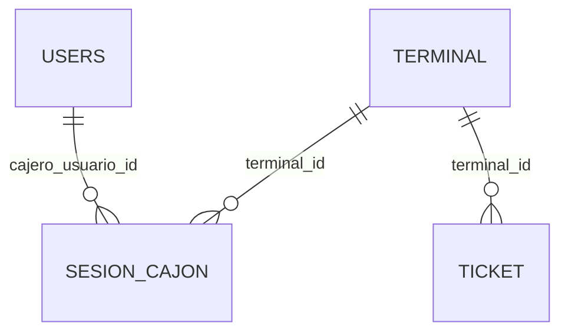
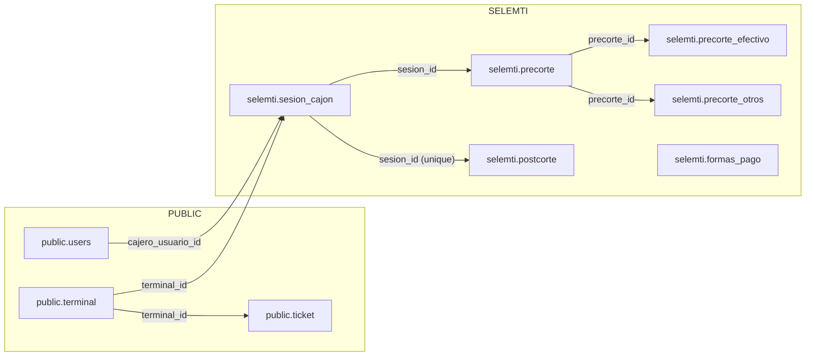

DB — Inventario por esquemas (public, selemti) [Solo lectura]

Fecha: 2025-10-17 01:32

Alcance
- Catálogo estructural: tablas, columnas (tipo, nulos, default), PK, FKs, índices (plan de extracción safe, pendiente de aprobación).
- Conteo aproximado: preferir reltuples de pg_class; usar COUNT(*) solo bajo aprobación.
- ERD Mermaid por esquema y diagrama global.
- Inconsistencias detectables e índices sugeridos.
- Notas de integración FloreantPOS: lectura en public y control en selemti.

Plan de extracción (solo lectura; proponer y esperar aprobación)
- Listado de tablas/relaciones:
  - SELECT table_schema, table_name FROM information_schema.tables WHERE table_schema IN ('public','selemti') AND table_type='BASE TABLE' ORDER BY 1,2;
- Columnas por tabla (tipo, nulos, default):
  - SELECT column_name, data_type, is_nullable, column_default FROM information_schema.columns WHERE table_schema=$schema AND table_name=$tabla ORDER BY ordinal_position;
- PK/FK/UNIQUE/Índices:
  - PK/FK: usar pg_constraint + pg_attribute; Índices: pg_index + pg_class.
  - Consulta propuesta (resumen por tabla): ver bloque “Consultas utilitarias”.
- Tamaño aproximado (reltuples):
  - SELECT n.nspname, c.relname, c.reltuples::bigint AS approx_rows FROM pg_class c JOIN pg_namespace n ON n.oid=c.relnamespace WHERE n.nspname IN ('public','selemti') AND c.relkind='r' ORDER BY 1,2;
- COUNT(*) para tablas clave: solo si apruebas y si el tamaño lo permite.

ERD — selemti (aproximado desde el código)
```mermaid
erDiagram
  SESION_CAJON ||--o{ PRECORTE : "sesion_id"
  SESION_CAJON ||--o{ POSTCORTE : "sesion_id (unique)"
  PRECORTE ||--o{ PRECORTE_EFECTIVO : "precorte_id"
  PRECORTE ||--o{ PRECORTE_OTROS : "precorte_id"
  FORMAS_PAGO }
```

ERD — public (aproximado desde el código)


ERD — global (relaciones clave)


Inconsistencias potenciales (a validar con extracción)
- Tipos monetarios: preferir DECIMAL/NUMERIC sobre float; validar columnas declaradas en precorte/postcorte.
- FKs sin índice: verificar índices explícitos en FK:
  - selemti.precorte(sesion_id)
  - selemti.precorte_efectivo(precorte_id)
  - selemti.precorte_otros(precorte_id)
  - selemti.postcorte(sesion_id)
  - selemti.sesion_cajon(terminal_id, cajero_usuario_id)
  - public.ticket(terminal_id), filtra por closing_date IS NULL
- Timestamps: confirmar created_at/updated_at en tablas auditoras (precorte/postcorte) y marcas de validación.
- Enums: revisar estatus en selemti.sesion_cajon y selemti.precorte; preferir CHECK/ENUM según estándar del proyecto.
- Normalización: formas_pago referenciada en conciliación/cortes; revisar relaciones.

Sugerencias de índices
- selemti.sesion_cajon: (terminal_id, apertura_ts DESC), (cajero_usuario_id, estatus)
- selemti.precorte: (sesion_id), (estatus)
- selemti.precorte_efectivo: (precorte_id)
- selemti.precorte_otros: (precorte_id, tipo)
- selemti.postcorte: UNIQUE(sesion_id), (validado, sesion_id)
- public.ticket: (terminal_id, closing_date), filtro WHERE closing_date IS NULL
- selemti.formas_pago: (activo, prioridad)

Consultas utilitarias (propuestas, requieren aprobación)
- PK/FK detallado:
  - SELECT con pg_constraint/pg_attribute para listar columnas de PK/FK por tabla.
- Índices por tabla y columnas:
  - SELECT i.relname AS index_name, a.attname AS column_name, ix.indisunique, ix.indisprimary FROM pg_class t JOIN pg_index ix ON t.oid=ix.indrelid JOIN pg_class i ON i.oid=ix.indexrelid JOIN pg_namespace n ON n.oid=t.relnamespace JOIN unnest(ix.indkey) WITH ORDINALITY AS k(attnum, ord) ON TRUE JOIN pg_attribute a ON a.attrelid=t.oid AND a.attnum=k.attnum WHERE n.nspname IN ('public','selemti') ORDER BY n.nspname, t.relname, i.relname, k.ord;
- Tamaño aproximado:
  - SELECT n.nspname, c.relname, c.reltuples::bigint AS approx_rows FROM pg_class c JOIN pg_namespace n ON n.oid=c.relnamespace WHERE n.nspname IN ('public','selemti') AND c.relkind='r' ORDER BY 1,2;

Notas de integración FloreantPOS
- Lectura en `public` (tickets, terminales, usuarios POS) y escritura/control en `selemti` (sesiones, precorte, postcorte, conciliación, formas_pago).
- No escribir directamente en tablas de POS.

