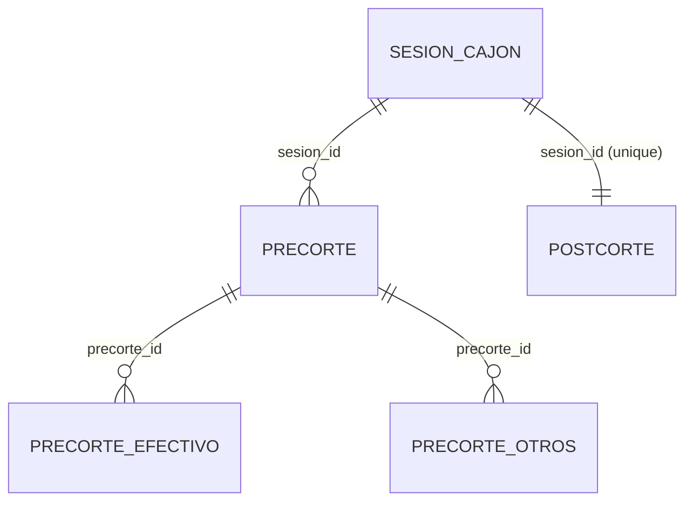
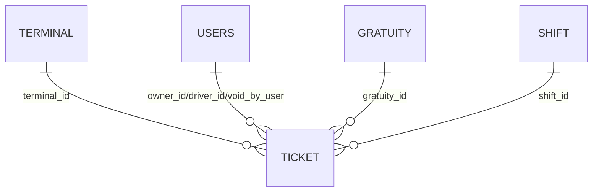
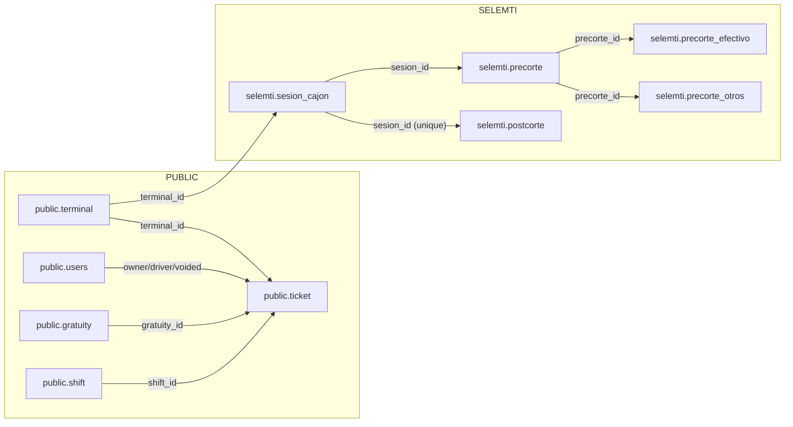

ERD — public y selemti (derivado de metadatos)

Fecha: 2025-10-17 01:59

## selemti

```mermaid
erDiagram
  SESION_CAJON ||--o{ PRECORTE : "sesion_id"
  PRECORTE ||--o{ PRECORTE_EFECTIVO : "precorte_id"
  PRECORTE ||--o{ PRECORTE_OTROS : "precorte_id"
  SESION_CAJON ||--|| POSTCORTE : "sesion_id (unique)"
```

## public (subset relevante)

```mermaid
erDiagram
  TERMINAL ||--o{ TICKET : "terminal_id"
  USERS ||--o{ TICKET : "owner_id/driver_id/void_by_user"
  GRATUITY ||--o{ TICKET : "gratuity_id"
  SHIFT ||--o{ TICKET : "shift_id"
```

## Global

```mermaid
flowchart LR
  subgraph PUBLIC
    PT[public.terminal]
    PU[public.users]
    TK[public.ticket]
    GR[public.gratuity]
    SH[public.shift]
  end
  subgraph SELEMTI
    SC[selemti.sesion_cajon]
    PR[selemti.precorte]
    PRe[selemti.precorte_efectivo]
    PRo[selemti.precorte_otros]
    PO[selemti.postcorte]
  end
  PT -- terminal_id --> TK
  PU -- owner/driver/voided --> TK
  GR -- gratuity_id --> TK
  SH -- shift_id --> TK
  PT -- terminal_id --> SC
  SC -- sesion_id --> PR
  PR -- precorte_id --> PRe
  PR -- precorte_id --> PRo
  SC -- sesion_id (unique) --> PO
```

