ERD Completo — public y selemti (Mermaid)

Fecha: 2025-10-17 08:11

## Esquema: selemti

Tablas (selemti): almacen, auditoria, cache, cache_locks, cat_unidades, conversiones_unidad, cost_layer, failed_jobs, formas_pago, historial_costos_item, historial_costos_receta, inventory_batch, item_vendor, items, job_batches, job_recalc_queue, jobs, migrations, model_has_permissions, model_has_roles, modificadores_pos, mov_inv, op_produccion_cab, param_sucursal, password_reset_tokens, perdida_log, permissions, pos_map, postcorte, precorte, precorte_efectivo, precorte_otros, proveedor, recalc_log, receta_cab, receta_det, receta_shadow, receta_version, role_has_permissions, roles, sesion_cajon, sessions, stock_policy, sucursal, sucursal_almacen_terminal, ticket_det_consumo, ticket_venta_cab, ticket_venta_det, unidades_medida, user_roles, users

```mermaid
erDiagram
  ALMACEN }o--|| SUCURSAL : "sucursal_id -> id"
  CONVERSIONES_UNIDAD }o--|| UNIDADES_MEDIDA : "unidad_destino_id -> id"
  CONVERSIONES_UNIDAD }o--|| UNIDADES_MEDIDA : "unidad_origen_id -> id"
  COST_LAYER }o--|| ITEMS : "item_id -> id"
  COST_LAYER }o--|| INVENTORY_BATCH : "batch_id -> id"
  HISTORIAL_COSTOS_ITEM }o--|| ITEMS : "item_id -> id"
  HISTORIAL_COSTOS_RECETA }o--|| RECETA_VERSION : "receta_version_id -> id"
  INVENTORY_BATCH }o--|| ITEMS : "item_id -> id"
  ITEM_VENDOR }o--|| ITEMS : "item_id -> id"
  ITEM_VENDOR }o--|| UNIDADES_MEDIDA : "unidad_presentacion_id -> id"
  ITEMS }o--|| UNIDADES_MEDIDA : "unidad_medida_id -> id"
  ITEMS }o--|| UNIDADES_MEDIDA : "unidad_compra_id -> id"
  ITEMS }o--|| UNIDADES_MEDIDA : "unidad_salida_id -> id"
  MODEL_HAS_PERMISSIONS }o--|| PERMISSIONS : "permission_id -> id"
  MODEL_HAS_ROLES }o--|| ROLES : "role_id -> id"
  MODIFICADORES_POS }o--|| RECETA_CAB : "receta_modificador_id -> id"
  MOV_INV }o--|| ITEMS : "item_id -> id"
  MOV_INV }o--|| INVENTORY_BATCH : "lote_id -> id"
  OP_PRODUCCION_CAB }o--|| RECETA_VERSION : "receta_version_id -> id"
  PERDIDA_LOG }o--|| INVENTORY_BATCH : "lote_id -> id"
  PERDIDA_LOG }o--|| UNIDADES_MEDIDA : "uom_original_id -> id"
  PERDIDA_LOG }o--|| ITEMS : "item_id -> id"
  POSTCORTE }o--|| SESION_CAJON : "sesion_id -> id"
  PRECORTE }o--|| SESION_CAJON : "sesion_id -> id"
  PRECORTE_EFECTIVO }o--|| PRECORTE : "precorte_id -> id"
  PRECORTE_OTROS }o--|| PRECORTE : "precorte_id -> id"
  RECALC_LOG }o--|| JOB_RECALC_QUEUE : "job_id -> id"
  RECETA_DET }o--|| ITEMS : "item_id -> id"
  RECETA_DET }o--|| RECETA_VERSION : "receta_version_id -> id"
  RECETA_VERSION }o--|| RECETA_CAB : "receta_id -> id"
  ROLE_HAS_PERMISSIONS }o--|| ROLES : "role_id -> id"
  ROLE_HAS_PERMISSIONS }o--|| PERMISSIONS : "permission_id -> id"
  STOCK_POLICY }o--|| ITEMS : "item_id -> id"
  TICKET_DET_CONSUMO }o--|| UNIDADES_MEDIDA : "uom_original_id -> id"
  TICKET_DET_CONSUMO }o--|| ITEMS : "item_id -> id"
  TICKET_DET_CONSUMO }o--|| INVENTORY_BATCH : "lote_id -> id"
  TICKET_VENTA_DET }o--|| RECETA_VERSION : "receta_version_id -> id"
  TICKET_VENTA_DET }o--|| TICKET_VENTA_CAB : "ticket_id -> id"
  TICKET_VENTA_DET }o--|| RECETA_SHADOW : "receta_shadow_id -> id"
```

## Esquema: public

Tablas (public): action_history, attendence_history, cash_drawer, cash_drawer_reset_history, cooking_instruction, coupon_and_discount, currency, currency_balance, custom_payment, customer, customer_properties, daily_folio_counter, data_update_info, delivery_address, delivery_charge, delivery_configuration, delivery_instruction, drawer_assigned_history, drawer_pull_report, drawer_pull_report_voidtickets, employee_in_out_history, global_config, gratuity, group_taxes, guest_check_print, inventory_group, inventory_item, inventory_location, inventory_meta_code, inventory_transaction, inventory_unit, inventory_vendor, inventory_warehouse, item_order_type, kds_ready_log, kit_ticket_table_num, kitchen_ticket, kitchen_ticket_item, menu_category, menu_group, menu_item, menu_item_properties, menu_item_size, menu_item_terminal_ref, menu_modifier, menu_modifier_group, menu_modifier_properties, menucategory_discount, menugroup_discount, menuitem_discount, menuitem_modifiergroup, menuitem_pizzapirce, menuitem_shift, menumodifier_pizzamodifierprice, migrations, modifier_multiplier_price, multiplier, order_type, packaging_unit, payout_reasons, payout_recepients, pizza_crust, pizza_modifier_price, pizza_price, printer_configuration, printer_group, printer_group_printers, purchase_order, recepie, recepie_item, restaurant, restaurant_properties, shift, shop_floor, shop_floor_template, shop_floor_template_properties, shop_table, shop_table_status, shop_table_type, table_booking_info, table_booking_mapping, table_ticket_num, table_type_relation, tax, tax_group, terminal, terminal_printers, terminal_properties, ticket, ticket_discount, ticket_item, ticket_item_addon_relation, ticket_item_cooking_instruction, ticket_item_discount, ticket_item_modifier, ticket_item_modifier_relation, ticket_properties, ticket_table_num, transaction_properties, transactions, user_permission, user_type, user_user_permission, users, virtual_printer, virtualprinter_order_type, void_reasons, zip_code_vs_delivery_charge

```mermaid
erDiagram
  ACTION_HISTORY }o--|| USERS : "user_id -> auto_id"
  ATTENDENCE_HISTORY }o--|| SHIFT : "shift_id -> id"
  ATTENDENCE_HISTORY }o--|| TERMINAL : "terminal_id -> id"
  ATTENDENCE_HISTORY }o--|| USERS : "user_id -> auto_id"
  CASH_DRAWER }o--|| TERMINAL : "terminal_id -> id"
  CASH_DRAWER_RESET_HISTORY }o--|| USERS : "user_id -> auto_id"
  CURRENCY_BALANCE }o--|| DRAWER_PULL_REPORT : "dpr_id -> id"
  CURRENCY_BALANCE }o--|| CASH_DRAWER : "cash_drawer_id -> id"
  CURRENCY_BALANCE }o--|| CURRENCY : "currency_id -> id"
  CUSTOMER_PROPERTIES }o--|| CUSTOMER : "id -> auto_id"
  DELIVERY_ADDRESS }o--|| CUSTOMER : "customer_id -> auto_id"
  DELIVERY_INSTRUCTION }o--|| CUSTOMER : "customer_no -> auto_id"
  DRAWER_ASSIGNED_HISTORY }o--|| USERS : "a_user -> auto_id"
  DRAWER_PULL_REPORT }o--|| TERMINAL : "terminal_id -> id"
  DRAWER_PULL_REPORT }o--|| USERS : "user_id -> auto_id"
  DRAWER_PULL_REPORT_VOIDTICKETS }o--|| DRAWER_PULL_REPORT : "dpreport_id -> id"
  EMPLOYEE_IN_OUT_HISTORY }o--|| TERMINAL : "terminal_id -> id"
  EMPLOYEE_IN_OUT_HISTORY }o--|| USERS : "user_id -> auto_id"
  EMPLOYEE_IN_OUT_HISTORY }o--|| SHIFT : "shift_id -> id"
  GRATUITY }o--|| TERMINAL : "terminal_id -> id"
  GRATUITY }o--|| USERS : "owner_id -> auto_id"
  GRATUITY }o--|| TICKET : "ticket_id -> id"
  GROUP_TAXES }o--|| TAX_GROUP : "group_id -> id"
  GROUP_TAXES }o--|| TAX : "elt -> id"
  GUEST_CHECK_PRINT }o--|| USERS : "user_id -> auto_id"
  INVENTORY_ITEM }o--|| INVENTORY_VENDOR : "item_vendor_id -> id"
  INVENTORY_ITEM }o--|| PACKAGING_UNIT : "punit_id -> id"
  INVENTORY_ITEM }o--|| PACKAGING_UNIT : "recipe_unit_id -> id"
  INVENTORY_ITEM }o--|| INVENTORY_LOCATION : "item_location_id -> id"
  INVENTORY_ITEM }o--|| INVENTORY_GROUP : "item_group_id -> id"
  INVENTORY_LOCATION }o--|| INVENTORY_WAREHOUSE : "warehouse_id -> id"
  INVENTORY_TRANSACTION }o--|| INVENTORY_WAREHOUSE : "from_warehouse_id -> id"
  INVENTORY_TRANSACTION }o--|| INVENTORY_ITEM : "item_id -> id"
  INVENTORY_TRANSACTION }o--|| INVENTORY_WAREHOUSE : "to_warehouse_id -> id"
  INVENTORY_TRANSACTION }o--|| PURCHASE_ORDER : "reference_id -> id"
  INVENTORY_TRANSACTION }o--|| INVENTORY_VENDOR : "vendor_id -> id"
  ITEM_ORDER_TYPE }o--|| MENU_ITEM : "menu_item_id -> id"
  ITEM_ORDER_TYPE }o--|| ORDER_TYPE : "order_type_id -> id"
  KIT_TICKET_TABLE_NUM }o--|| KITCHEN_TICKET : "kit_ticket_id -> id"
  KITCHEN_TICKET }o--|| PRINTER_GROUP : "pg_id -> id"
  KITCHEN_TICKET_ITEM }o--|| KITCHEN_TICKET : "kithen_ticket_id -> id"
  MENU_GROUP }o--|| MENU_CATEGORY : "category_id -> id"
  MENU_ITEM }o--|| PRINTER_GROUP : "pg_id -> id"
  MENU_ITEM }o--|| MENU_GROUP : "group_id -> id"
  MENU_ITEM }o--|| TAX_GROUP : "tax_group_id -> id"
  MENU_ITEM }o--|| RECEPIE : "recepie -> id"
  MENU_ITEM }o--|| TAX : "tax_id -> id"
  MENU_ITEM_PROPERTIES }o--|| MENU_ITEM : "menu_item_id -> id"
  MENU_ITEM_TERMINAL_REF }o--|| TERMINAL : "terminal_id -> id"
  MENU_ITEM_TERMINAL_REF }o--|| MENU_ITEM : "menu_item_id -> id"
  MENU_MODIFIER }o--|| MENU_MODIFIER_GROUP : "group_id -> id"
  MENU_MODIFIER }o--|| TAX : "tax_id -> id"
  MENU_MODIFIER }o--|| MENU_MODIFIER_GROUP : "group_id -> id"
  MENU_MODIFIER_PROPERTIES }o--|| MENU_MODIFIER : "menu_modifier_id -> id"
  MENUCATEGORY_DISCOUNT }o--|| COUPON_AND_DISCOUNT : "discount_id -> id"
  MENUCATEGORY_DISCOUNT }o--|| MENU_CATEGORY : "menucategory_id -> id"
  MENUGROUP_DISCOUNT }o--|| MENU_GROUP : "menugroup_id -> id"
  MENUGROUP_DISCOUNT }o--|| COUPON_AND_DISCOUNT : "discount_id -> id"
  MENUITEM_DISCOUNT }o--|| COUPON_AND_DISCOUNT : "discount_id -> id"
  MENUITEM_DISCOUNT }o--|| MENU_ITEM : "menuitem_id -> id"
  MENUITEM_MODIFIERGROUP }o--|| MENU_MODIFIER_GROUP : "modifier_group -> id"
  MENUITEM_MODIFIERGROUP }o--|| MENU_MODIFIER_GROUP : "modifier_group -> id"
  MENUITEM_MODIFIERGROUP }o--|| MENU_ITEM : "menuitem_modifiergroup_id -> id"
  MENUITEM_PIZZAPIRCE }o--|| MENU_ITEM : "menu_item_id -> id"
  MENUITEM_PIZZAPIRCE }o--|| PIZZA_PRICE : "pizza_price_id -> id"
  MENUITEM_SHIFT }o--|| MENU_ITEM : "menuitem_id -> id"
  MENUITEM_SHIFT }o--|| SHIFT : "shift_id -> id"
  MENUMODIFIER_PIZZAMODIFIERPRICE }o--|| PIZZA_MODIFIER_PRICE : "pizzamodifierprice_id -> id"
  MENUMODIFIER_PIZZAMODIFIERPRICE }o--|| MENU_MODIFIER : "menumodifier_id -> id"
  MODIFIER_MULTIPLIER_PRICE }o--|| MENU_MODIFIER : "menumodifier_id -> id"
  MODIFIER_MULTIPLIER_PRICE }o--|| PIZZA_MODIFIER_PRICE : "pizza_modifier_price_id -> id"
  MODIFIER_MULTIPLIER_PRICE }o--|| MULTIPLIER : "multiplier_id -> name"
  PIZZA_MODIFIER_PRICE }o--|| MENU_ITEM_SIZE : "item_size -> id"
  PIZZA_PRICE }o--|| MENU_ITEM_SIZE : "menu_item_size -> id"
  PIZZA_PRICE }o--|| PIZZA_CRUST : "crust -> id"
  PIZZA_PRICE }o--|| ORDER_TYPE : "order_type -> id"
  PRINTER_GROUP_PRINTERS }o--|| PRINTER_GROUP : "printer_id -> id"
  RECEPIE }o--|| MENU_ITEM : "menu_item -> id"
  RECEPIE_ITEM }o--|| INVENTORY_ITEM : "inventory_item -> id"
  RECEPIE_ITEM }o--|| RECEPIE : "recepie_id -> id"
  RESTAURANT_PROPERTIES }o--|| RESTAURANT : "id -> id"
  SHOP_FLOOR_TEMPLATE }o--|| SHOP_FLOOR : "floor_id -> id"
  SHOP_FLOOR_TEMPLATE_PROPERTIES }o--|| SHOP_FLOOR_TEMPLATE : "id -> id"
  SHOP_TABLE }o--|| SHOP_FLOOR : "floor_id -> id"
  TABLE_BOOKING_INFO }o--|| CUSTOMER : "customer_id -> auto_id"
  TABLE_BOOKING_INFO }o--|| USERS : "user_id -> auto_id"
  TABLE_BOOKING_MAPPING }o--|| TABLE_BOOKING_INFO : "booking_id -> id"
  TABLE_BOOKING_MAPPING }o--|| SHOP_TABLE : "table_id -> id"
  TABLE_TICKET_NUM }o--|| SHOP_TABLE_STATUS : "shop_table_status_id -> id"
  TABLE_TYPE_RELATION }o--|| SHOP_TABLE_TYPE : "type_id -> id"
  TABLE_TYPE_RELATION }o--|| SHOP_TABLE : "table_id -> id"
  TERMINAL }o--|| USERS : "assigned_user -> auto_id"
  TERMINAL_PRINTERS }o--|| VIRTUAL_PRINTER : "virtual_printer_id -> id"
  TERMINAL_PRINTERS }o--|| TERMINAL : "terminal_id -> id"
  TERMINAL_PROPERTIES }o--|| TERMINAL : "id -> id"
  TICKET }o--|| USERS : "driver_id -> auto_id"
  TICKET }o--|| TERMINAL : "terminal_id -> id"
  TICKET }o--|| USERS : "owner_id -> auto_id"
  TICKET }o--|| USERS : "void_by_user -> auto_id"
  TICKET }o--|| GRATUITY : "gratuity_id -> id"
  TICKET }o--|| SHIFT : "shift_id -> id"
  TICKET_DISCOUNT }o--|| TICKET : "ticket_id -> id"
  TICKET_ITEM }o--|| TICKET_ITEM_MODIFIER : "size_modifier_id -> id"
  TICKET_ITEM }o--|| TICKET : "ticket_id -> id"
  TICKET_ITEM }o--|| PRINTER_GROUP : "pg_id -> id"
  TICKET_ITEM_ADDON_RELATION }o--|| TICKET_ITEM_MODIFIER : "modifier_id -> id"
  TICKET_ITEM_ADDON_RELATION }o--|| TICKET_ITEM : "ticket_item_id -> id"
  TICKET_ITEM_COOKING_INSTRUCTION }o--|| TICKET_ITEM : "ticket_item_id -> id"
  TICKET_ITEM_DISCOUNT }o--|| TICKET_ITEM : "ticket_itemid -> id"
  TICKET_ITEM_MODIFIER }o--|| TICKET_ITEM : "ticket_item_id -> id"
  TICKET_ITEM_MODIFIER_RELATION }o--|| TICKET_ITEM : "ticket_item_id -> id"
  TICKET_ITEM_MODIFIER_RELATION }o--|| TICKET_ITEM_MODIFIER : "modifier_id -> id"
  TICKET_PROPERTIES }o--|| TICKET : "id -> id"
  TICKET_TABLE_NUM }o--|| TICKET : "ticket_id -> id"
  TRANSACTION_PROPERTIES }o--|| TRANSACTIONS : "id -> id"
  TRANSACTIONS }o--|| USERS : "user_id -> auto_id"
  TRANSACTIONS }o--|| PAYOUT_RECEPIENTS : "payout_recepient_id -> id"
  TRANSACTIONS }o--|| TERMINAL : "terminal_id -> id"
  TRANSACTIONS }o--|| TICKET : "ticket_id -> id"
  TRANSACTIONS }o--|| PAYOUT_REASONS : "payout_reason_id -> id"
  USER_USER_PERMISSION }o--|| USER_TYPE : "permissionid -> id"
  USER_USER_PERMISSION }o--|| USER_PERMISSION : "elt -> name"
  USERS }o--|| SHIFT : "shift_id -> id"
  USERS }o--|| TERMINAL : "currentterminal -> id"
  USERS }o--|| USER_TYPE : "n_user_type -> id"
  VIRTUALPRINTER_ORDER_TYPE }o--|| VIRTUAL_PRINTER : "printer_id -> id"
```

