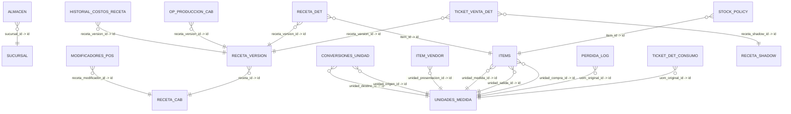

ERD — Inventario y Recetas (Filtrado)

Fecha: 2025-10-17 08:17

```mermaid
erDiagram
  ALMACEN }o--|| SUCURSAL : "sucursal_id -> id"
  CONVERSIONES_UNIDAD }o--|| UNIDADES_MEDIDA : "unidad_destino_id -> id"
  CONVERSIONES_UNIDAD }o--|| UNIDADES_MEDIDA : "unidad_origen_id -> id"
  HISTORIAL_COSTOS_RECETA }o--|| RECETA_VERSION : "receta_version_id -> id"
  ITEM_VENDOR }o--|| UNIDADES_MEDIDA : "unidad_presentacion_id -> id"
  ITEMS }o--|| UNIDADES_MEDIDA : "unidad_medida_id -> id"
  ITEMS }o--|| UNIDADES_MEDIDA : "unidad_salida_id -> id"
  ITEMS }o--|| UNIDADES_MEDIDA : "unidad_compra_id -> id"
  MODIFICADORES_POS }o--|| RECETA_CAB : "receta_modificador_id -> id"
  OP_PRODUCCION_CAB }o--|| RECETA_VERSION : "receta_version_id -> id"
  PERDIDA_LOG }o--|| UNIDADES_MEDIDA : "uom_original_id -> id"
  RECETA_DET }o--|| ITEMS : "item_id -> id"
  RECETA_DET }o--|| RECETA_VERSION : "receta_version_id -> id"
  RECETA_VERSION }o--|| RECETA_CAB : "receta_id -> id"
  STOCK_POLICY }o--|| ITEMS : "item_id -> id"
  TICKET_DET_CONSUMO }o--|| UNIDADES_MEDIDA : "uom_original_id -> id"
  TICKET_VENTA_DET }o--|| RECETA_SHADOW : "receta_shadow_id -> id"
  TICKET_VENTA_DET }o--|| RECETA_VERSION : "receta_version_id -> id"
```
