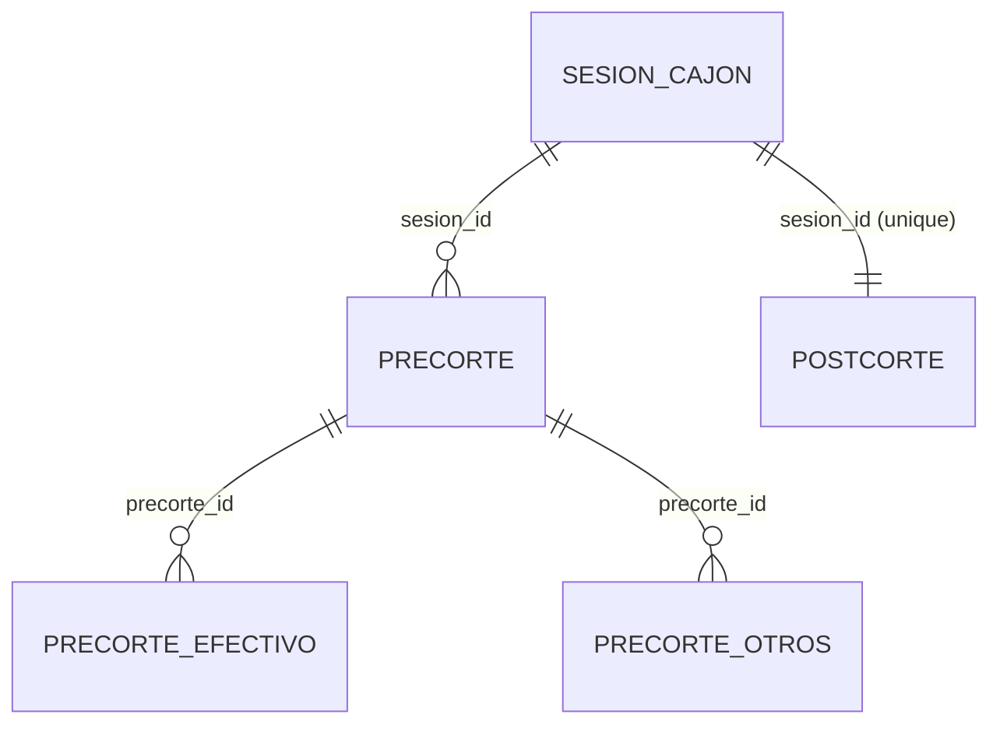
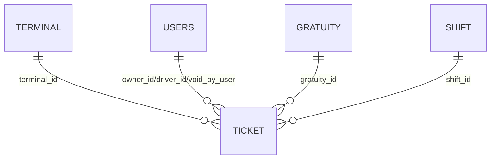
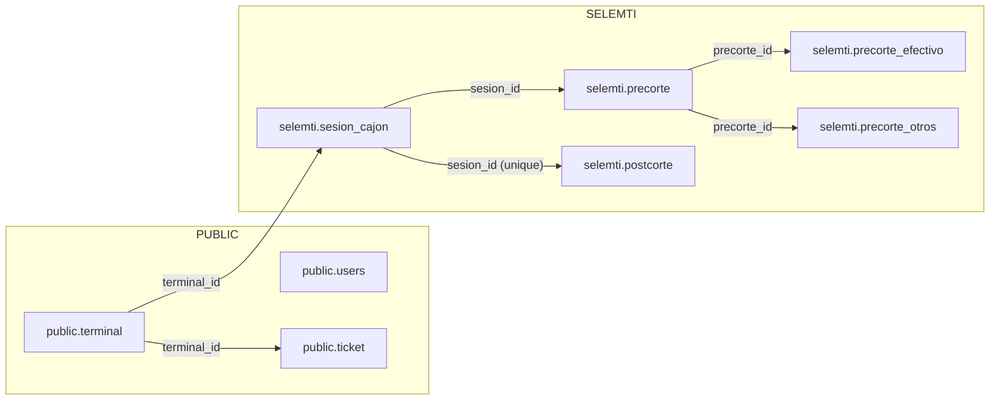

ERD por Subdominio — Caja, POS, Inventario/Recetas

Fecha: 2025-10-17 08:19

Caja (selemti)


POS (public)


Inventario/Recetas (selemti + public donde aplique)
```mermaid
erDiagram
  RECETA_CAB ||--o{ RECETA_VERSION : "receta_id"
  RECETA_VERSION ||--o{ RECETA_DET : "receta_version_id"
  RECETA_SHADOW ||--o{ RECETA_VERSION : "receta_id (shadow)"
  UNIDADES_MEDIDA ||--o{ RECETA_DET : "unidad"
  STOCK_POLICY ||--o{ ??? : "aplicación (según diseño)"
```

Global (relaciones relevantes entre dominios)

