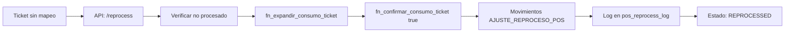

# Implementación Completa: Sistema de Consumo POS ↔ Inventario

**Fecha:** 2025-10-27
**Versión:** 1.0
**Módulo:** POS Consumption Service

---

## 📋 RESUMEN EJECUTIVO

Se ha implementado una capa de aplicación completa para el manejo de consumo POS ↔ inventario con soporte de:
- ✅ Reproceso histórico de tickets
- ✅ Reversa de tickets con auditoría
- ✅ Diagnóstico de tickets problemáticos
- ✅ Dashboard de tickets sin mapeo de recetas
- ✅ Costeo de recetas en tiempo real

---

## 📁 ESTRUCTURA DE ARCHIVOS CREADOS

### 1. DTOs (Data Transfer Objects)
```
app/Services/Pos/DTO/
├── PosConsumptionResult.php
└── PosConsumptionDiagnostics.php
```

### 2. Repositorios
```
app/Services/Pos/Repositories/
├── TicketRepository.php
├── ConsumoPosRepository.php
├── InventarioRepository.php
├── RecetaRepository.php
└── CostosRepository.php
```

### 3. Servicio Principal
```
app/Services/Pos/
└── PosConsumptionService.php
```

### 4. Controladores
```
app/Http/Controllers/Pos/
├── PosConsumptionController.php
└── RecipeCostController.php
```

### 5. Migraciones
```
database/migrations/
├── 2025_10_27_100239_create_pos_reverse_log_table.php
└── 2025_10_27_100252_create_pos_reprocess_log_table.php
```

### 6. SQL
```
BD/
└── fn_confirmar_consumo_ticket_extendido.sql
```

### 7. Tests
```
tests/Feature/
└── PosConsumptionServiceTest.php
```

### 8. Rutas
- Actualizado: `routes/api.php`

---

## 🔧 INSTALACIÓN Y DESPLIEGUE

### Paso 1: Ejecutar Migraciones

```bash
php artisan migrate
```

Esto creará las tablas:
- `selemti.pos_reverse_log`
- `selemti.pos_reprocess_log`

### Paso 2: Ejecutar SQL Extendido

Conectarse a PostgreSQL y ejecutar:

```bash
psql -h localhost -p 5433 -U postgres -d pos -f BD/fn_confirmar_consumo_ticket_extendido.sql
```

O manualmente copiar y ejecutar el contenido del archivo en pgAdmin/DBeaver.

### Paso 3: Verificar Permisos

Asegurarse de que existan los permisos en la tabla `permissions`:

```sql
INSERT INTO permissions (name, guard_name, created_at, updated_at)
VALUES
    ('can_reprocess_sales', 'web', NOW(), NOW()),
    ('can_view_recipe_dashboard', 'web', NOW(), NOW())
ON CONFLICT (name, guard_name) DO NOTHING;
```

Asignar permisos a roles:

```sql
-- Ejemplo: asignar a rol admin
INSERT INTO role_has_permissions (permission_id, role_id)
SELECT p.id, r.id
FROM permissions p
CROSS JOIN roles r
WHERE p.name IN ('can_reprocess_sales', 'can_view_recipe_dashboard')
    AND r.name = 'admin'
ON CONFLICT DO NOTHING;
```

### Paso 4: Ejecutar Tests

```bash
php artisan test tests/Feature/PosConsumptionServiceTest.php
```

---

## 🌐 ENDPOINTS API

### Base URL
```
http://localhost/TerrenaLaravel/api
```

### 1. Diagnosticar Ticket

**GET** `/pos/tickets/{ticketId}/diagnostics`

**Permisos:** `can_view_recipe_dashboard`

**Response:**
```json
{
  "ok": true,
  "data": {
    "ticket_header_ok": true,
    "items_total": 5,
    "items_con_receta": 4,
    "items_sin_receta": 1,
    "tiene_consumo_confirmado": false,
    "estado_consumo": "SIN_DATOS",
    "puede_reprocesar": true,
    "puede_reversar": false,
    "faltan_empaques_to_go": false,
    "faltan_consumibles_operativos": false,
    "items_sin_receta_detalle": [
      {
        "item_id": 123,
        "item_name": "Producto X",
        "quantity": 1
      }
    ],
    "warnings": [
      "Hay 1 items sin receta mapeada"
    ],
    "has_issues": true
  },
  "timestamp": "2025-10-27T10:30:45Z"
}
```

---

### 2. Reprocesar Ticket

**POST** `/pos/tickets/{ticketId}/reprocess`

**Permisos:** `can_reprocess_sales`

**Request Body:** (opcional)
```json
{}
```

**Response:**
```json
{
  "ok": true,
  "data": {
    "ticket_id": 12345,
    "status": "REPROCESSED",
    "consumos": [
      {
        "item_id": 101,
        "description": "Hamburguesa Clásica",
        "qty": 1.0,
        "uom": "UNI",
        "costo_unitario": 45.50,
        "costo_total": 45.50
      },
      {
        "item_id": 102,
        "description": "Papas Fritas",
        "qty": 1.0,
        "uom": "KG",
        "costo_unitario": 12.00,
        "costo_total": 12.00
      }
    ],
    "missing": null,
    "message": "Ticket reprocesado exitosamente",
    "meta": {
      "num_movimientos": 2,
      "user_id": 1,
      "fecha_reproceso": "2025-10-27T10:35:12Z"
    },
    "success": true
  },
  "timestamp": "2025-10-27T10:35:12Z"
}
```

---

### 3. Reversar Ticket

**POST** `/pos/tickets/{ticketId}/reverse`

**Permisos:** `can_reprocess_sales`

**Request Body:**
```json
{
  "motivo": "Error en ticket, cliente canceló"
}
```

**Response:**
```json
{
  "ok": true,
  "data": {
    "ticket_id": 12345,
    "status": "REVERSED",
    "consumos": null,
    "missing": null,
    "message": "Ticket reversado exitosamente",
    "meta": {
      "num_movimientos_reversados": 2,
      "user_id": 1,
      "fecha_reversa": "2025-10-27T10:40:30Z",
      "motivo": "Error en ticket, cliente canceló"
    },
    "success": true
  },
  "timestamp": "2025-10-27T10:40:30Z"
}
```

---

### 4. Dashboard: Tickets con Problemas

**GET** `/pos/dashboard/missing-recipes`

**Permisos:** `can_view_recipe_dashboard`

**Query Params:**
- `hours` (opcional, default: 24) - Últimas N horas
- `limit` (opcional, default: 50) - Máximo de resultados

**Response:**
```json
{
  "ok": true,
  "data": {
    "tickets": [
      {
        "ticket_id": 67890,
        "folio_display": "123 (2025-10-27)",
        "branch_key": "SUC001",
        "create_date": "2025-10-27 09:15:30",
        "total_amount": 250.50,
        "estado_consumo": "SIN_DATOS",
        "items_total": 5,
        "items_sin_receta": 2,
        "puede_reprocesar": true,
        "tiene_consumo_confirmado": false,
        "warnings": [
          "Hay 2 items sin receta mapeada"
        ]
      }
    ],
    "total": 1,
    "hours": 24,
    "limit": 50
  },
  "timestamp": "2025-10-27T10:45:00Z"
}
```

---

### 5. Obtener Costo de Receta

**GET** `/recipes/{recipeId}/cost`

**Permisos:** `can_view_recipe_dashboard`

**Response:**
```json
{
  "ok": true,
  "data": {
    "recipe_id": 555,
    "recipe_name": "Hamburguesa Clásica",
    "costo_estandar": 45.50,
    "costo_calculado": 45.50,
    "num_items": 8,
    "items": [
      {
        "item_id": 201,
        "item_descripcion": "Pan de hamburguesa",
        "item_clave": "PAN001",
        "qty": 1.0,
        "uom": "UNI",
        "costo_unitario": 5.00,
        "costo_total": 5.00,
        "es_producible": false
      },
      {
        "item_id": 202,
        "item_descripcion": "Carne molida 80/20",
        "item_clave": "CAR001",
        "qty": 0.15,
        "uom": "KG",
        "costo_unitario": 120.00,
        "costo_total": 18.00,
        "es_producible": false
      }
    ],
    "timestamp": "2025-10-27T10:50:00Z"
  },
  "timestamp": "2025-10-27T10:50:00Z"
}
```

---

### 6. Recalcular Costo de Receta

**POST** `/recipes/{recipeId}/recalculate`

**Permisos:** `can_view_recipe_dashboard`

**Response:**
```json
{
  "ok": true,
  "data": {
    "recipe_id": 555,
    "recipe_name": "Hamburguesa Clásica",
    "costo_estandar": 47.25,
    "recalculado_at": "2025-10-27T10:55:00Z"
  },
  "message": "Costo recalculado exitosamente",
  "timestamp": "2025-10-27T10:55:00Z"
}
```

---

## 🔍 FLUJO DE TRABAJO

### Caso 1: Venta Normal (Automática)


### Caso 2: Reproceso Histórico



### Caso 3: Reversa


---

## 📊 TABLAS NUEVAS

### selemti.pos_reverse_log

```sql
CREATE TABLE selemti.pos_reverse_log (
    id BIGSERIAL PRIMARY KEY,
    ticket_id BIGINT NOT NULL,
    user_id BIGINT NOT NULL,
    reversed_at TIMESTAMP NOT NULL DEFAULT NOW(),
    motivo TEXT,
    meta JSONB,
    created_at TIMESTAMP DEFAULT NOW(),
    updated_at TIMESTAMP DEFAULT NOW()
);
```

**Índices:**
- `idx_pos_reverse_log_ticket_id`
- `idx_pos_reverse_log_user_id`
- `idx_pos_reverse_log_reversed_at`

---

### selemti.pos_reprocess_log

```sql
CREATE TABLE selemti.pos_reprocess_log (
    id BIGSERIAL PRIMARY KEY,
    ticket_id BIGINT NOT NULL,
    user_id BIGINT NOT NULL,
    reprocessed_at TIMESTAMP NOT NULL DEFAULT NOW(),
    motivo TEXT,
    meta JSONB,
    created_at TIMESTAMP DEFAULT NOW(),
    updated_at TIMESTAMP DEFAULT NOW()
);
```

**Índices:**
- `idx_pos_reprocess_log_ticket_id`
- `idx_pos_reprocess_log_user_id`
- `idx_pos_reprocess_log_reprocessed_at`

---

## 🧪 TESTING

### Ejecutar Tests

```bash
# Todos los tests del módulo
php artisan test tests/Feature/PosConsumptionServiceTest.php

# Test específico
php artisan test --filter test_no_double_consumption_for_already_processed_ticket

# Con coverage (si está configurado)
php artisan test --coverage tests/Feature/PosConsumptionServiceTest.php
```

### Tests Incluidos

1. ✅ `test_no_double_consumption_for_already_processed_ticket`
2. ✅ `test_reprocess_creates_consumption_and_marks_as_reprocessed`
3. ✅ `test_reverse_creates_reverse_log_and_calls_db_function`
4. ✅ `test_diagnostics_detects_missing_mappings_and_packaging_flags`
5. ✅ `test_recalculate_recipe_cost_calls_stored_procedure`

---

## 🔐 PERMISOS

### Permisos Requeridos

| Permiso | Descripción | Endpoints |
|---------|-------------|-----------|
| `can_view_recipe_dashboard` | Ver dashboard de recetas | `/pos/tickets/{id}/diagnostics`<br>`/pos/dashboard/missing-recipes`<br>`/recipes/{id}/cost`<br>`/recipes/{id}/recalculate` |
| `can_reprocess_sales` | Reprocesar y reversar ventas | `/pos/tickets/{id}/reprocess`<br>`/pos/tickets/{id}/reverse` |

### Asignar Permisos a Usuario

```php
use App\Models\User;
use Spatie\Permission\Models\Permission;

$user = User::find(1);
$user->givePermissionTo('can_view_recipe_dashboard');
$user->givePermissionTo('can_reprocess_sales');
```

---

## 🚀 PRÓXIMOS PASOS

### Para Frontend (UI)

1. **Dashboard de Tickets Problemáticos**
   - Crear vista `/pos/dashboard`
   - Consumir endpoint `/pos/dashboard/missing-recipes`
   - Mostrar semáforo (verde/amarillo/rojo) según estado
   - Botón "Reprocesar" para cada ticket

2. **Modal de Diagnóstico**
   - Al hacer clic en ticket, abrir modal
   - Consumir `/pos/tickets/{id}/diagnostics`
   - Mostrar detalles de items sin receta
   - Opciones: Reprocesar / Ignorar

3. **Panel de Costos de Recetas**
   - Vista `/recipes/costs`
   - Lista de recetas con costo actual
   - Botón "Recalcular" para forzar actualización

### Mejoras Futuras

- [ ] Webhook para notificar tickets sin mapeo en tiempo real
- [ ] Batch reprocesing: reprocesar múltiples tickets a la vez
- [ ] Exportar log de reprocesos/reversas a Excel
- [ ] Dashboard analytics: tickets reprocesados por día/mes

---

## 📝 NOTAS IMPORTANTES

1. **Conexión a PostgreSQL**: Todos los repositorios y servicios usan `DB::connection('pgsql')` para conectarse a la base de datos POS.

2. **Esquema `selemti`**: Todas las tablas nuevas se crean en el esquema `selemti`, no en `public`.

3. **Transacciones**: Los métodos `reprocesarTicket()` y `reversarTicket()` usan transacciones DB para garantizar atomicidad.

4. **Auditoría**: Todas las operaciones de reproceso y reversa se registran en sus respectivas tablas de log.

5. **Middleware**: Los endpoints requieren `auth:sanctum` para autenticación. En desarrollo, asegurarse de que la autenticación esté configurada correctamente.

---

## 🐛 TROUBLESHOOTING

### Error: "Ticket no encontrado"
- Verificar que el ticket_id exista en `public.ticket`
- Verificar conexión a PostgreSQL

### Error: "Permission denied"
- Verificar que el usuario tenga los permisos asignados
- Ejecutar `php artisan permission:cache-reset`

### Error: "Table selemti.pos_reverse_log does not exist"
- Ejecutar migraciones: `php artisan migrate`

### Error: "Function selemti.fn_confirmar_consumo_ticket(bigint, boolean) does not exist"
- Ejecutar SQL extendido: `psql ... -f BD/fn_confirmar_consumo_ticket_extendido.sql`

---

## 📚 REFERENCIAS

- **CLAUDE.md**: Instrucciones generales del proyecto
- **docs/Recetas/**: Documentación de módulo de recetas
- **docs/Replenishment/**: Documentación de reabastecimiento
- **BD/**: Scripts SQL para funciones y triggers

---

**Fin del documento**
