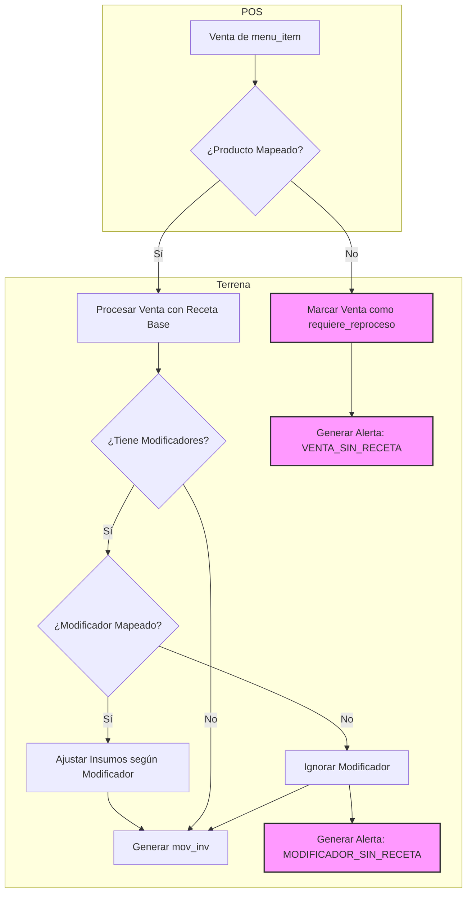

# Flujo de Mapeo POS ↔ Recetas ↔ Modificadores

*Versión 1.0 — Octubre 2025*

Este documento detalla el proceso para vincular productos de punto de venta (POS) con sus recetas correspondientes, asegurando que cada venta descuente correctamente el inventario y se costee de manera precisa.

---

## 1.0 Proceso Operativo de Mapeo

El mapeo es el proceso de conectar tres entidades clave:
1.  **`menu_items` (POS):** El producto que el cliente ve y compra.
2.  **`recipes` (Inventario):** La fórmula que define los insumos y cantidades.
3.  **`modificadores_pos` (Opcional):** Opciones que alteran la receta base (ej. "sin cebolla", "doble queso").

El objetivo es que cada `ticket_item` (venta individual) tenga una `recipe_version_id` asociada para que el sistema pueda generar los `mov_inv` (movimientos de inventario) correspondientes.

### 1.1 Flujo de Alta de un Nuevo Producto

1.  **Creación en POS:** El producto se crea primero en el sistema POS (Floreant), generando un `menu_item`.
2.  **Creación de Receta:** El equipo de Costos crea la receta en Terrena, definiendo insumos, cantidades y sub-recetas.
3.  **Mapeo en `pos_map`:** Se crea una entrada en la tabla `selemti.pos_map` que vincula el `menu_item.id` del POS con la `recipe_versions.id` de Terrena.
    -   `pos_map.menu_item_id` → ID del producto en POS.
    -   `pos_map.recipe_version_id` → ID de la versión de receta en Terrena.
    -   `pos_map.is_active` → `true` para habilitar el descuento de inventario.

### 1.2 Mapeo de Modificadores

Los modificadores permiten flexibilidad en las recetas sin necesidad de crear decenas de variaciones.

1.  **Identificación de Modificadores:** Se identifican los modificadores en el POS que tienen un impacto en el inventario (ej. "agregar tocino", "quitar aguacate").
2.  **Creación de Recetas de Modificadores:** Se crean "mini-recetas" que solo contienen el insumo a agregar o quitar.
    -   **Receta de Adición:** Contiene el insumo y cantidad a añadir (ej. Receta "Agregar Tocino" con 15g de tocino).
    -   **Receta de Sustracción:** Contiene el insumo a omitir, marcado con una cantidad negativa o una bandera especial.
3.  **Mapeo en `modificadores_pos`:** Se vincula el modificador del POS con su receta de ajuste.
    -   `modificadores_pos.modificador_id` → ID del modificador en POS.
    -   `modificadores_pos.recipe_version_id` → ID de la receta de ajuste.
    -   `modificadores_pos.tipo_ajuste` → `SUMA` o `RESTA`.

---

## 2.0 Proceso de Validación y Alertas

Para mantener la integridad del sistema, se ejecutan validaciones automáticas y se generan alertas.

### 2.1 Dashboard de Mapeo (`STATUS_RECETAS_1.2.md`)

El sistema cuenta con un dashboard que muestra el estado del mapeo y resalta las inconsistencias:

-   **Productos No Mapeados:** `menu_items` sin una entrada activa en `pos_map`. Estos productos se venden pero no descuentan inventario.
-   **Recetas No Vinculadas:** `recipes` que no están asociadas a ningún `menu_item`. Pueden ser sub-recetas o recetas inactivas.
-   **Modificadores sin Impacto:** Modificadores populares en el POS que no tienen una receta de ajuste vinculada.

### 2.2 Alertas (`alert_events`)

El sistema genera eventos de alerta para notificar al equipo de Costos sobre problemas críticos:

-   **`TIPO_ALERTA: VENTA_SIN_RECETA`**
    -   **Disparador:** Se registra un `ticket_item` de un `menu_item` no mapeado.
    -   **Acción:** La venta se marca con `requiere_reproceso = true` y se genera una alerta para que el equipo de Costos realice el mapeo.
    -   **Solución:** Una vez mapeado, el sistema puede reprocesar la venta para ajustar el inventario retroactivamente (ver [POS_REPROCESSING.md](POS_REPROCESSING.md)).

-   **`TIPO_ALERTA: MODIFICADOR_SIN_RECETA`**
    -   **Disparador:** Una venta incluye un modificador que no está mapeado en `modificadores_pos`.
    -   **Acción:** La venta base se procesa, pero el impacto del modificador se ignora. Se genera una alerta para revisión.

---

## 3.0 Diagrama del Flujo

---

**Nota:** En la fase actual solo se manejan modificadores que SUMAN ingredientes o seleccionan una subreceta (salsa, proteína, empaque para llevar). La lógica de RESTA (“sin ingrediente”) se implementará en fases posteriores.

*Versión 2.1 — Octubre 2025*