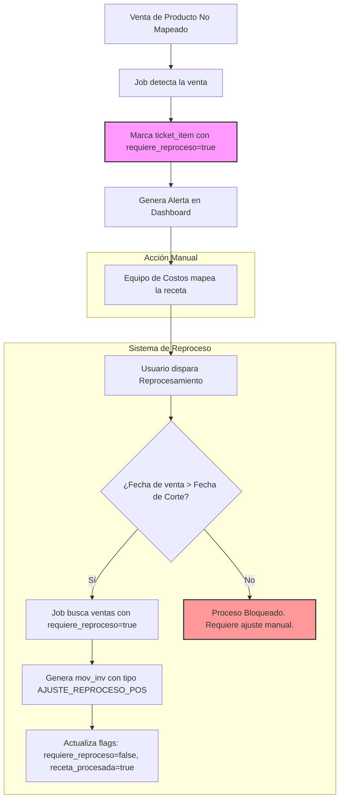

# Reprocesamiento Retroactivo de Ventas POS

*Versión 1.0 — Octubre 2025*

Este documento describe el sistema de reprocesamiento retroactivo, diseñado para corregir el inventario y los costos de ventas que ocurrieron antes de que un producto del POS fuera mapeado a su receta correspondiente.

---

## 1.0 Concepto y Justificación

En un entorno de restaurante dinámico, es común que nuevos productos se vendan en el POS antes de que su receta esté formalmente cargada y mapeada en el sistema de inventarios. El reprocesamiento permite "viajar en el tiempo" para aplicar los descuentos de inventario a esas ventas pasadas, asegurando que los costos y existencias sean precisos.

El sistema se basa en dos banderas en la tabla `ticket_items`:
-   `receta_procesada` (boolean): Indica si la venta ya generó un movimiento de inventario.
-   `requiere_reproceso` (boolean): Marcada como `true` por el sistema cuando detecta una venta de un producto no mapeado.

## 2.0 Flujo del Reprocesamiento

1.  **Detección:** Durante el cierre del día, un job automatizado (`CheckUnmappedSalesJob`) escanea los `ticket_items` del día. Si encuentra una venta de un `menu_item` sin mapeo activo en `pos_map`, marca esa venta con `requiere_reproceso = true` y `receta_procesada = false`.
2.  **Notificación:** Se genera una alerta (`TIPO_ALERTA: VENTA_SIN_RECETA`) visible en el dashboard de control para el equipo de Costos.
3.  **Acción del Usuario (Mapeo):** El equipo de Costos recibe la alerta, crea la receta si no existe, y la mapea al `menu_item` correspondiente en `pos_map` (ver [POS_MAPPING.md](POS_MAPPING.md)).
4.  **Ejecución del Reproceso:** Una vez que el producto está mapeado, el usuario puede disparar el reprocesamiento desde el dashboard. El sistema (`ReprocessSalesJob`) busca todas las ventas marcadas con `requiere_reproceso = true` para ese `menu_item`.
5.  **Generación de Movimientos:** Para cada venta reprocesada, el sistema:
    -   Genera los `mov_inv` correspondientes utilizando la nueva receta.
    -   Actualiza la bandera `requiere_reproceso` a `false`.
    -   Actualiza la bandera `receta_procesada` a `true`.
    -   Utiliza la fecha original de la venta (`ticket.fecha_venta`) como la fecha del movimiento de inventario.

---

## 3.0 Nuevos Tipos de Movimiento de Inventario (`tipo_mov_inv`)

Para dar claridad y trazabilidad a las correcciones, se introducen nuevos tipos de movimiento:

### `AJUSTE_REPROCESO_POS`
-   **Descripción:** Movimiento de salida generado por el job de reprocesamiento. Representa el consumo de insumos de una venta que no se registró en su momento.
-   **Impacto:** Reduce el stock del inventario.
-   **Trazabilidad:** El movimiento queda ligado al `ticket_item.id` original.

### `AJUSTE_REVERSO`
-   **Descripción:** Movimiento de entrada que anula un movimiento previo. Se utiliza en casos donde un reproceso fue incorrecto o se necesita revertir una transacción manual.
-   **Impacto:** Aumenta el stock del inventario.
-   **Trazabilidad:** Debe estar ligado al `mov_inv.id` que está revirtiendo.

### `APERTURA_INVENTARIO`
-   **Descripción:** Movimiento inicial para establecer el stock de un nuevo item o al inicio de un periodo de conteo. No está directamente ligado al reproceso, pero es fundamental para el saneamiento de inventarios.
-   **Impacto:** Establece el punto de partida del stock.

---

## 4.0 Fecha de Corte y Consideraciones

Para evitar inconsistencias contables y operativas, el sistema utiliza una **fecha de corte**.

-   **Definición:** La fecha de corte es el último día del periodo contable cerrado (ej. fin de mes).
-   **Regla:** El sistema **no permite** reprocesar ventas con fecha anterior a la fecha de corte.
-   **Justificación:** Reprocesar ventas de un periodo ya cerrado alteraría los costos y balances de ese periodo, causando problemas de auditoría.
-   **Alternativa:** Si se detecta una venta muy antigua que requiere ajuste, se debe realizar un ajuste manual de inventario (`AJUSTE_MANUAL`) en el periodo actual, con una nota explicando la razón.

> Durante la fase piloto se permite reprocesar todas las ventas desde la fecha de arranque operativo. En ambiente de producción, esta ventana se limitará al periodo contable abierto.

## 5.0 Diagrama del Flujo

---

### Manejo de stock negativo en reproceso
> Si durante el reproceso una venta causa que el inventario quede negativo, el sistema no descargará automáticamente los insumos.  
> En su lugar marcará la alerta `STOCK_NEGATIVO_ERROR` y detendrá el ticket hasta que el analista realice el ajuste correspondiente (compra retroactiva, corrección manual o movimiento `APERTURA_INVENTARIO`).

*Versión 2.1 — Octubre 2025*
