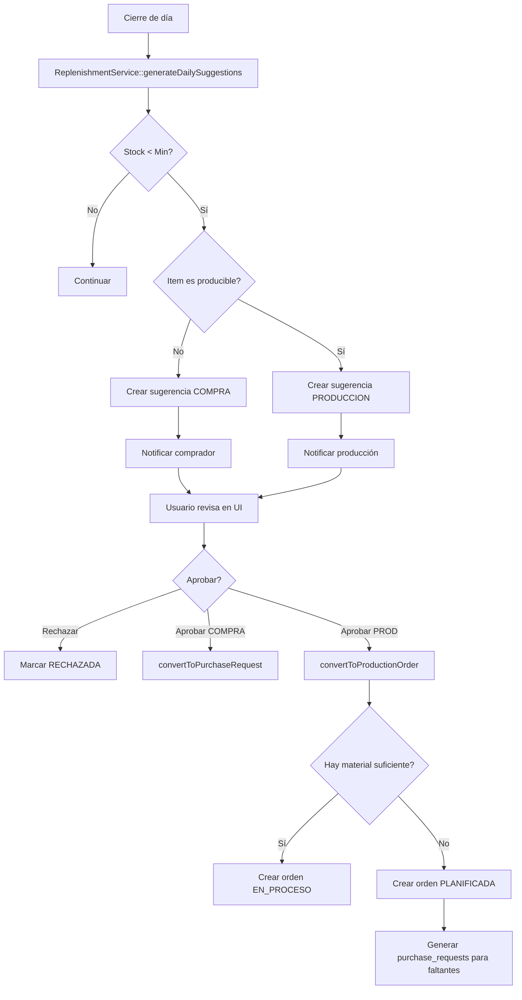

# ANÁLISIS: Sistema de Reposición Automática y Planificación de Producción

**Fecha:** 2025-10-24
**Módulos:** Replenishment (Auto-Reorder), Production Planning, Partial Receptions
**Objetivo:** Automatizar reposición de inventario basado en políticas de stock y consumo

---

## 📋 ESTADO ACTUAL

### ✅ Backend Existente (Codex)

**ProductionService** (`app/Services/Inventory/ProductionService.php`):
- ✅ `createOrder()` - Crea órdenes de producción completas
- ✅ Maneja inputs (materia prima), outputs (productos terminados), wastes (mermas)
- ✅ Registra movimientos kardex: `PROD_OUT`, `PROD_IN`, `MERMA`
- ✅ Estados: `BORRADOR`, `EN_PROCESO`, `COMPLETADO`
- ⚠️ **Ejecuta inmediatamente** - No valida disponibilidad de materia prima

**PurchasingService** (`app/Services/Purchasing/PurchasingService.php`):
- ✅ `createRequest()` - Crea solicitudes de compra
- ✅ `addQuote()` - Agrega cotizaciones
- ✅ `createOrderFromQuote()` - Genera órdenes desde cotizaciones
- ✅ Estados de request: `BORRADOR`, `COTIZADA`, `APROBADA`, `ORDENADA`
- ✅ Estados de order: `BORRADOR`, `APROBADA`, `ENVIADA`, `RECIBIDA`, `CERRADA`

**Tablas Existentes**:
```sql
-- Producción
selemti.production_orders          (qty_programada, qty_producida, qty_merma)
selemti.production_order_inputs    (materia prima consumida)
selemti.production_order_outputs   (productos terminados)
selemti.inventory_wastes           (mermas/desperdicios)

-- Compras
selemti.purchase_requests
selemti.purchase_request_lines
selemti.purchase_orders
selemti.purchase_order_lines

-- Inventario
selemti.stock_policy               (min_qty, max_qty, reorder_lote por item/sucursal)
selemti.mov_inv                    (kardex)
selemti.inventory_batch            (lotes/batches)
selemti.items                      (productos/insumos)
```

**Vistas Existentes**:
- `vw_stock_actual` - Stock actual por item/almacén
- `vw_stock_brechas` - Comparación stock actual vs políticas

---

## 🎯 REQUERIMIENTOS NUEVOS

### Caso de Uso 1: Reposición de Productos Comprados (Electrolic)

**Escenario:**
```
Sucursal NB - Electrolic Fresa
- Stock inicial: 10 unidades
- Ventas del día: 5 unidades
- Stock final: 5 unidades
- Política: min=10, max=20, reorder_lote=10
- Acción: Generar pedido sugerido de 10 unidades (compra)
```

**Flujo:**
1. Al cerrar el día, sistema detecta stock < min_qty
2. Calcula cantidad a pedir: `max_qty - stock_actual` = 10
3. Genera **Purchase Request** automático en estado `SUGERIDO`
4. Usuario revisa, ajusta y aprueba
5. Se convierte en orden de compra normal

### Caso de Uso 2: Reposición de Productos de Producción (Tortas)

**Escenario:**
```
Sucursal NB - Tortas
- Stock inicial: 20 tortas
- Ventas del día: 18 tortas
- Devoluciones: 2 tortas (no vendidas)
- Necesidad para mañana: 20 tortas

Subproceso:
1. Sistema genera orden de producción sugerida: 20 tortas
2. Verifica receta: requiere 2kg harina, 1L leche, etc.
3. Stock disponible en cocina: suficiente para 15 tortas
4. Acción A: Genera orden de producción por 15 tortas (inmediata)
5. Acción B: Genera purchase request por materia prima faltante (5 tortas)
6. Al llegar materia prima: genera segunda orden de producción por 5 tortas
```

**Complejidad:**
- ✅ Detectar que item es "producible" (tiene receta)
- ✅ Calcular materia prima necesaria basado en receta
- ✅ Comparar con stock disponible
- ✅ Dividir producción en múltiples órdenes si hay material parcial
- ✅ Generar compras automáticas para faltantes
- ⚠️ **Decisión sobre productos no vendidos**: ¿Merma? ¿Devolución? ¿Resurtir?

### Caso de Uso 3: Recepciones Parciales

**Escenario:**
```
Orden de Compra #OC-123: 100kg harina
- Recepción 1 (Día 1): 60kg
- Recepción 2 (Día 3): 40kg
- Estado: PARCIALMENTE RECIBIDA → COMPLETA
```

**Requisitos:**
- Permitir múltiples recepciones contra una misma orden
- Tracking de qty pendiente vs recibida
- Estados: `PENDIENTE`, `PARCIAL`, `COMPLETA`
- Generar batch separado por cada recepción

---

## 🏗️ DISEÑO PROPUESTO

### 1. Nueva Tabla: `replenishment_suggestions`

Almacena pedidos/producciones sugeridos por el sistema:

```sql
CREATE TABLE selemti.replenishment_suggestions (
    id BIGSERIAL PRIMARY KEY,
    tipo VARCHAR(20) NOT NULL,              -- 'COMPRA' o 'PRODUCCION'
    item_id BIGINT NOT NULL,
    sucursal_id VARCHAR(36),
    almacen_id VARCHAR(36),

    -- Cantidades
    stock_actual NUMERIC(18,6) NOT NULL,
    stock_min NUMERIC(18,6) NOT NULL,
    stock_max NUMERIC(18,6) NOT NULL,
    qty_sugerida NUMERIC(18,6) NOT NULL,
    uom VARCHAR(20),

    -- Estados
    estado VARCHAR(24) NOT NULL DEFAULT 'PENDIENTE',
    -- PENDIENTE, REVISADA, APROBADA, RECHAZADA, CONVERTIDA

    -- Trazabilidad
    purchase_request_id BIGINT NULL,        -- Si se convirtió en compra
    production_order_id BIGINT NULL,        -- Si se convirtió en producción

    -- Fechas
    sugerido_en TIMESTAMPTZ NOT NULL DEFAULT NOW(),
    revisado_en TIMESTAMPTZ,
    revisado_por BIGINT,

    -- Contexto
    motivo TEXT,                            -- "Stock bajo detectado", "Consumo diario promedio", etc.
    meta JSONB,
    notas TEXT,

    created_at TIMESTAMPTZ DEFAULT NOW(),
    updated_at TIMESTAMPTZ DEFAULT NOW(),

    INDEX idx_rep_sug_estado (estado),
    INDEX idx_rep_sug_tipo (tipo),
    INDEX idx_rep_sug_item_suc (item_id, sucursal_id),
    INDEX idx_rep_sug_fecha (sugerido_en)
);
```

### 2. Modificaciones a `purchase_order_lines`

Agregar tracking de recepciones:

```sql
ALTER TABLE selemti.purchase_order_lines
ADD COLUMN qty_recibida NUMERIC(18,6) NOT NULL DEFAULT 0;

-- Vista para ver pendientes:
CREATE VIEW selemti.vw_po_lines_pending AS
SELECT
    pol.*,
    po.folio,
    po.estado as po_estado,
    (pol.qty - pol.qty_recibida) as qty_pendiente,
    CASE
        WHEN pol.qty_recibida = 0 THEN 'PENDIENTE'
        WHEN pol.qty_recibida < pol.qty THEN 'PARCIAL'
        WHEN pol.qty_recibida >= pol.qty THEN 'COMPLETA'
    END as estado_recepcion
FROM selemti.purchase_order_lines pol
INNER JOIN selemti.purchase_orders po ON po.id = pol.order_id
WHERE po.estado IN ('APROBADA', 'ENVIADA', 'RECIBIDA');
```

### 3. Modificaciones a `production_orders`

Agregar estado `PLANIFICADA` (orden creada pero no ejecutada):

```sql
-- Estados actuales: BORRADOR, EN_PROCESO, COMPLETADO
-- Agregar: PLANIFICADA, PAUSADA, CANCELADA

ALTER TABLE selemti.production_orders
ADD COLUMN material_verificado BOOLEAN DEFAULT FALSE;

-- Para tracking de compras necesarias:
CREATE TABLE selemti.production_order_requirements (
    id BIGSERIAL PRIMARY KEY,
    production_order_id BIGINT NOT NULL,
    item_id BIGINT NOT NULL,              -- Materia prima
    qty_requerida NUMERIC(18,6) NOT NULL,
    qty_disponible NUMERIC(18,6) NOT NULL,
    qty_faltante NUMERIC(18,6) NOT NULL,
    uom VARCHAR(20),
    purchase_request_id BIGINT NULL,      -- Si se generó compra
    estado VARCHAR(24) DEFAULT 'FALTANTE',
    created_at TIMESTAMPTZ DEFAULT NOW(),

    INDEX idx_por_po (production_order_id),
    INDEX idx_por_item (item_id)
);
```

### 4. Nuevo Servicio: `ReplenishmentService`

```php
<?php

namespace App\Services\Inventory;

class ReplenishmentService
{
    /**
     * Analiza todas las sucursales y genera sugerencias
     * basadas en stock_policy
     */
    public function generateDailySuggestions(array $options = []): array
    {
        // Lógica:
        // 1. Obtener todos los items con stock_policy activa
        // 2. Para cada item/sucursal:
        //    - Consultar stock actual
        //    - Comparar vs min_qty
        //    - Si stock < min: generar sugerencia
        // 3. Determinar si es COMPRA o PRODUCCION (según item.es_producible)
        // 4. Insertar en replenishment_suggestions
        // 5. Retornar resumen
    }

    /**
     * Convierte una sugerencia en Purchase Request
     */
    public function convertToP urchaseRequest(int $suggestionId, array $overrides = []): int
    {
        // Usa PurchasingService::createRequest()
    }

    /**
     * Convierte una sugerencia en Production Order
     * Verifica disponibilidad de materia prima
     */
    public function convertToProductionOrder(int $suggestionId, array $overrides = []): int
    {
        // 1. Obtener receta del item
        // 2. Calcular materia prima necesaria
        // 3. Verificar disponibilidad en stock
        // 4. Si falta material:
        //    a) Generar production_order_requirements
        //    b) Generar purchase_requests para faltantes
        //    c) Marcar orden como PLANIFICADA
        // 5. Si hay material completo:
        //    a) Crear orden normal (usa ProductionService)
    }
}
```

### 5. Modificación: `ReceptionService`

Permitir recepciones parciales:

```php
/**
 * Recibe materiales contra una orden de compra
 * Ahora soporta recepciones parciales
 */
public function receiveAgainstPurchaseOrder(
    int $purchaseOrderId,
    array $lines,  // ['line_id' => qty_recibida, ...]
    array $header
): int {
    // 1. Validar que la orden existe y está en estado correcto
    // 2. Para cada line:
    //    - Validar qty_recibida <= (qty - qty_recibida_anterior)
    //    - Crear batch
    //    - Registrar mov_inv (RECEPCION)
    //    - Actualizar qty_recibida en purchase_order_lines
    // 3. Si todas las líneas están completas:
    //    - Actualizar estado orden a COMPLETA
    // 4. Si alguna línea está parcial:
    //    - Mantener estado RECIBIDA o crear PARCIALMENTE_RECIBIDA
}
```

---

## 🔄 FLUJOS COMPLETOS

### Flujo 1: Reposición Diaria Automática



### Flujo 2: Producción con Materia Prima Faltante

```
1. Usuario aprueba sugerencia de producir 20 tortas

2. ReplenishmentService::convertToProductionOrder()
   - Consulta receta de "Torta"
   - Calcula: 2kg harina, 1L leche, etc. (para 20 unidades)
   - Verifica stock actual:
     * Harina: 3kg disponible (suficiente)
     * Leche: 0.75L disponible (falta 0.25L)

3. Sistema decide:
   Opción A: Dividir producción
   - Orden 1 (PLANIFICADA): 15 tortas (con material actual)
   - Orden 2 (PLANIFICADA): 5 tortas (cuando llegue leche)
   - Purchase Request: 0.25L leche

   Opción B: Todo o nada
   - Orden 1 (PLANIFICADA): 20 tortas
   - Purchase Request: 0.25L leche
   - Esperar a que llegue material

4. Cuando llega la leche:
   - Recepción registrada
   - Sistema notifica: "Orden PLAN-xxx lista para producir"
   - Usuario ejecuta la orden → cambia a EN_PROCESO
```

### Flujo 3: Recepción Parcial

```
Orden de Compra #OC-20251024-001
Línea 1: 100kg Harina (proveedor X)

DÍA 1:
- Llega camión con 60kg
- Usuario va a "Recepciones" → "Recibir contra OC"
- Selecciona OC-20251024-001
- Captura: Línea 1 → 60kg
- Sistema:
  * Crea batch (lote proveedor, caducidad, etc.)
  * Registra mov_inv: +60kg RECEPCION
  * Actualiza purchase_order_lines.qty_recibida = 60
  * Estado línea: PARCIAL
  * Estado orden: PARCIALMENTE_RECIBIDA

DÍA 3:
- Llega segundo envío con 40kg
- Usuario repite proceso
- Captura: Línea 1 → 40kg
- Sistema:
  * Crea segundo batch
  * Registra mov_inv: +40kg RECEPCION
  * Actualiza purchase_order_lines.qty_recibida = 100
  * Estado línea: COMPLETA
  * Estado orden: COMPLETA (todas las líneas completas)
```

---

## 📊 COMPONENTES UI NECESARIOS

### 1. Replenishment Dashboard
**Ruta:** `/replenishment`
**Componente:** `app/Livewire/Replenishment/Dashboard.php`

**Features:**
- Tarjetas con estadísticas: Total sugerencias, Por compra, Por producción, Aprobadas hoy
- Tabla de sugerencias pendientes
- Filtros: Tipo, Sucursal, Estado, Fecha
- Acciones: Aprobar, Rechazar, Ver detalle
- Botón: "Generar sugerencias ahora" (fuerza cálculo)

### 2. Replenishment Detail
**Ruta:** `/replenishment/{id}`
**Componente:** `app/Livewire/Replenishment/Detail.php`

**Features:**
- Información completa de la sugerencia
- Gráfica de stock histórico (últimos 7 días)
- Consumo promedio diario
- Campos editables: qty_sugerida, notas
- Acciones:
  * Convertir a Purchase Request
  * Convertir a Production Order
  * Rechazar con motivo

### 3. Production Planning
**Ruta:** `/production/planning`
**Componente:** `app/Livewire/Production/Planning.php`

**Features:**
- Lista de órdenes PLANIFICADAS
- Estado de materia prima (semáforo: Verde=OK, Amarillo=Parcial, Rojo=Falta)
- Botón "Verificar material" (recalcula disponibilidad)
- Acción "Ejecutar orden" (si hay material completo)
- Link a purchase requests generadas

### 4. Partial Receptions
**Modificar existente:** `app/Livewire/Inventory/ReceptionsCreate.php`

**Cambios:**
- Agregar modo "Recibir contra OC"
- Mostrar qty ordenada vs qty recibida acumulada
- Permitir qty_parcial < qty_pendiente
- Alertas: "Esta es una recepción parcial, quedan X pendientes"

---

## 📅 PLAN DE IMPLEMENTACIÓN

### Fase 1: Pedidos Sugeridos (2-3 días)
1. ✅ Análisis completado
2. [ ] Crear migración: `replenishment_suggestions`
3. [ ] Crear modelo: `ReplenishmentSuggestion`
4. [ ] Crear servicio: `ReplenishmentService`
5. [ ] Crear comando Artisan: `php artisan replenishment:generate`
6. [ ] UI: Dashboard + Detail components
7. [ ] Testing básico

### Fase 2: Integración Producción → Compras (2-3 días)
1. [ ] Crear migración: `production_order_requirements`
2. [ ] Modificar `ProductionService` para modo PLANIFICADA
3. [ ] Extender `ReplenishmentService::convertToProductionOrder()`
4. [ ] UI: Production Planning component
5. [ ] Testing integración

### Fase 3: Recepciones Parciales (1-2 días)
1. [ ] Migración: ALTER purchase_order_lines ADD qty_recibida
2. [ ] Crear vista: `vw_po_lines_pending`
3. [ ] Modificar `ReceptionService::receiveAgainstPurchaseOrder()`
4. [ ] UI: Modificar ReceptionsCreate para modo "contra OC"
5. [ ] Testing recepciones múltiples

### Fase 4: Decisión Mermas/Devoluciones (1 día)
1. [ ] Analizar proceso de cierre de día
2. [ ] UI para registrar productos no vendidos
3. [ ] Flujo: Merma vs Devolución vs Descuento día siguiente
4. [ ] Integración con `inventory_wastes`

---

## 🔧 COMANDOS ÚTILES

```bash
# Generar sugerencias diarias (ejecutar en cron)
php artisan replenishment:generate --auto-approve=false

# Forzar recálculo para una sucursal
php artisan replenishment:generate --branch=NB --verbose

# Ver sugerencias pendientes
php artisan replenishment:pending --format=table

# Simular sin guardar (dry-run)
php artisan replenishment:generate --dry-run
```

---

## 📝 NOTAS IMPORTANTES

1. **Políticas de Stock**:
   - Deben estar configuradas por item/sucursal/almacén
   - Si no existe política, NO generar sugerencia

2. **Items Producibles**:
   - Necesitan flag `es_producible` o campo `recipe_id NOT NULL`
   - Items sin receta → siempre COMPRA

3. **Consumo Promedio**:
   - Opcionalmente calcular desde `mov_inv` tipo 'VENTA'
   - Usar ventana de 7 o 30 días
   - Ajustar qty_sugerida basado en tendencia

4. **Notificaciones**:
   - Email/SMS cuando hay sugerencias nuevas
   - Alertas en dashboard para gerentes
   - Push notifications para app móvil (futuro)

5. **Permisos**:
   - Ver sugerencias: `replenishment.view`
   - Aprobar compras: `replenishment.approve.purchase`
   - Aprobar producción: `replenishment.approve.production`
   - Rechazar: `replenishment.reject`

---

**Próximos Pasos:**
1. Revisar y aprobar este análisis
2. Decidir orden de implementación de fases
3. Crear migraciones y modelos
4. Implementar servicios y testing
5. Crear UI components

