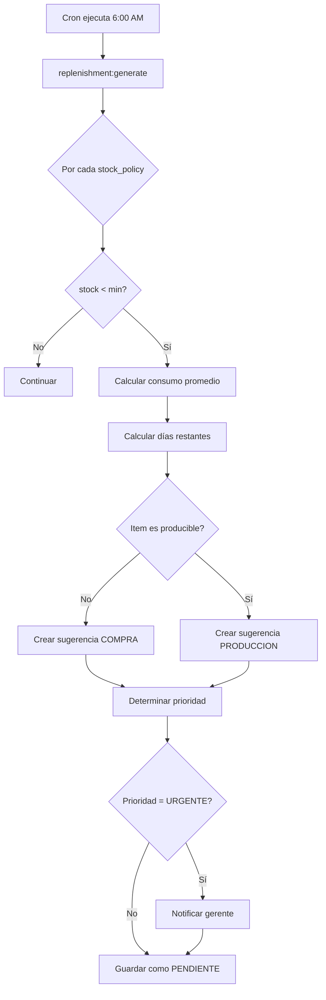
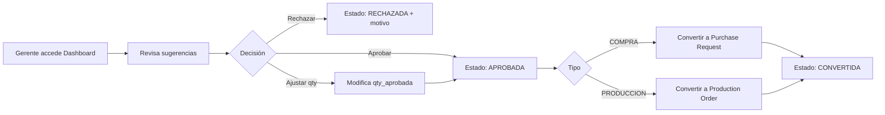
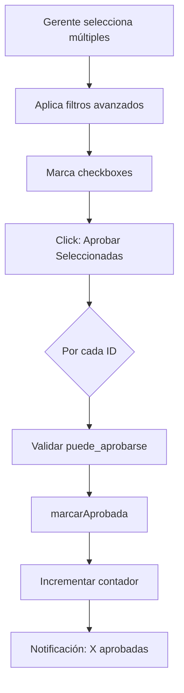

# MÓDULO DE REPOSICIÓN AUTOMÁTICA (REPLENISHMENT)

**Versión:** 1.0 - Fase 1
**Fecha:** 2025-10-24
**Estado:** Backend Completo, UI en progreso

---

## 📋 ÍNDICE

1. [Resumen Ejecutivo](#resumen-ejecutivo)
2. [Arquitectura](#arquitectura)
3. [Base de Datos](#base-de-datos)
4. [Modelos Eloquent](#modelos-eloquent)
5. [Servicios](#servicios)
6. [Comando Artisan](#comando-artisan)
7. [Componentes Livewire](#componentes-livewire)
8. [Flujos de Trabajo](#flujos-de-trabajo)
9. [Configuración](#configuración)
10. [Testing](#testing)
11. [Roadmap](#roadmap)

---

## RESUMEN EJECUTIVO

### ¿Qué es?

El **Módulo de Reposición Automática** es un sistema inteligente que analiza el inventario diariamente y genera **sugerencias automáticas** de reposición basadas en:

- 📊 **Políticas de stock** (mínimos y máximos por item/sucursal)
- 📈 **Consumo histórico** (promedio diario de los últimos 7-30 días)
- ⏱️ **Días de inventario restante** (cuándo se agotará el stock)
- 🎯 **Prioridad automática** (URGENTE, ALTA, NORMAL, BAJA)

### ¿Para quién?

**Gerente de Operaciones / Comprador:**
- Revisa sugerencias diarias en un dashboard
- Aprueba/rechaza con un clic
- Convierte sugerencias en compras o producciones
- Bulk actions para múltiples items
- Filtros avanzados y estadísticas

**Sistema Automático:**
- Ejecuta diariamente vía cron
- Detecta items bajo mínimo
- Calcula cantidades óptimas
- Notifica urgencias críticas

### Casos de Uso

#### 1️⃣ Reposición de Productos Comprados
```
📦 Electrolic Fresa
Stock actual: 5 unidades
Política: min=10, max=20
Consumo: 2.5 unidades/día
→ Sugerencia: COMPRAR 15 unidades (llevar a máximo)
→ Prioridad: ALTA (2 días de inventario)
```

#### 2️⃣ Reposición de Productos Producidos
```
🥖 Tortas
Stock actual: 2 unidades
Política: min=20, max=20
Consumo: 18 unidades/día
→ Sugerencia: PRODUCIR 20 unidades
→ Prioridad: URGENTE (<1 día de inventario)
→ Si falta materia prima: genera compra automática
```

---

## ARQUITECTURA

### Stack Tecnológico

```
┌─────────────────────────────────────┐
│         UI Layer (Pendiente)        │
│   Livewire Dashboard Component      │
└─────────────────────────────────────┘
              ↓
┌─────────────────────────────────────┐
│       Service Layer (✅ Listo)      │
│    ReplenishmentService             │
│  - generateDailySuggestions()       │
│  - convertToPurchaseRequest()       │
│  - convertToProductionOrder()       │
└─────────────────────────────────────┘
              ↓
┌─────────────────────────────────────┐
│      Model Layer (✅ Listo)         │
│  ReplenishmentSuggestion            │
│  StockPolicy, Item, Sucursal        │
└─────────────────────────────────────┘
              ↓
┌─────────────────────────────────────┐
│    Database Layer (✅ Listo)        │
│  replenishment_suggestions          │
│  vw_replenishment_dashboard         │
└─────────────────────────────────────┘
```

### Integración con Módulos Existentes

```
ReplenishmentService
    ├── PurchasingService (Codex)
    │   └── createRequest() → Purchase Request
    │
    ├── ProductionService (Codex)
    │   └── createOrder() → Production Order
    │
    └── mov_inv (Kardex)
        └── Consulta consumo histórico
```

---

## BASE DE DATOS

### Tabla: `replenishment_suggestions`

Almacena todas las sugerencias generadas automática o manualmente.

```sql
CREATE TABLE selemti.replenishment_suggestions (
    id BIGSERIAL PRIMARY KEY,
    folio VARCHAR(40) UNIQUE,                -- RSC-20251024-0001 o RSP-20251024-0001

    -- Clasificación
    tipo VARCHAR(20),                        -- COMPRA | PRODUCCION
    prioridad VARCHAR(20) DEFAULT 'NORMAL', -- URGENTE | ALTA | NORMAL | BAJA
    origen VARCHAR(40) DEFAULT 'AUTO',      -- AUTO | MANUAL | EVENTO_ESPECIAL

    -- Item y ubicación
    item_id VARCHAR(20),
    sucursal_id BIGINT,
    almacen_id BIGINT,

    -- Análisis de stock
    stock_actual NUMERIC(18,6),
    stock_min NUMERIC(18,6),
    stock_max NUMERIC(18,6),
    qty_sugerida NUMERIC(18,6),
    qty_aprobada NUMERIC(18,6),
    uom VARCHAR(20),

    -- Análisis de consumo
    consumo_promedio_diario NUMERIC(18,6),
    dias_stock_restante INT,
    fecha_agotamiento_estimada DATE,

    -- Estados
    estado VARCHAR(24) DEFAULT 'PENDIENTE',
    -- PENDIENTE → REVISADA → APROBADA → CONVERTIDA
    -- PENDIENTE → REVISADA → RECHAZADA
    -- PENDIENTE → CADUCADA (si no se revisa a tiempo)

    -- Trazabilidad
    purchase_request_id BIGINT NULL,
    production_order_id BIGINT NULL,

    -- Auditoría
    sugerido_en TIMESTAMPTZ DEFAULT NOW(),
    revisado_en TIMESTAMPTZ,
    revisado_por BIGINT,
    convertido_en TIMESTAMPTZ,
    caduca_en TIMESTAMPTZ,

    -- Contexto
    motivo TEXT,
    motivo_rechazo TEXT,
    notas TEXT,
    meta JSONB,

    created_at TIMESTAMPTZ DEFAULT NOW(),
    updated_at TIMESTAMPTZ DEFAULT NOW()
);
```

**Índices optimizados:**
- `idx_tipo`, `idx_prioridad`, `idx_estado`
- `idx_item_sucursal (item_id, sucursal_id)`
- `idx_fecha_agotamiento`
- `idx_revisado_por`

### Vista: `vw_replenishment_dashboard`

Vista optimizada para el dashboard del gerente.

```sql
CREATE VIEW selemti.vw_replenishment_dashboard AS
SELECT
    rs.*,
    i.item_code as item_codigo,
    i.nombre as item_nombre,
    s.nombre as sucursal_nombre,
    CASE
        WHEN rs.fecha_agotamiento_estimada <= CURRENT_DATE THEN 'CRITICO'
        WHEN rs.fecha_agotamiento_estimada <= CURRENT_DATE + 3 THEN 'URGENTE'
        WHEN rs.fecha_agotamiento_estimada <= CURRENT_DATE + 7 THEN 'PROXIMO'
        ELSE 'NORMAL'
    END as nivel_urgencia,
    CASE
        WHEN rs.stock_actual <= 0 THEN 'SIN_STOCK'
        WHEN rs.stock_actual < rs.stock_min THEN 'BAJO_MINIMO'
        ELSE 'OK'
    END as estado_stock
FROM selemti.replenishment_suggestions rs
LEFT JOIN selemti.items i ON i.id = rs.item_id
LEFT JOIN selemti.cat_sucursales s ON s.id = rs.sucursal_id;
```

---

## MODELOS ELOQUENT

### 1. ReplenishmentSuggestion

**Archivo:** `app/Models/ReplenishmentSuggestion.php`
**Líneas:** 376

#### Constantes

```php
// Estados
const ESTADO_PENDIENTE = 'PENDIENTE';
const ESTADO_REVISADA = 'REVISADA';
const ESTADO_APROBADA = 'APROBADA';
const ESTADO_RECHAZADA = 'RECHAZADA';
const ESTADO_CONVERTIDA = 'CONVERTIDA';
const ESTADO_CADUCADA = 'CADUCADA';

// Tipos
const TIPO_COMPRA = 'COMPRA';
const TIPO_PRODUCCION = 'PRODUCCION';

// Prioridades
const PRIORIDAD_URGENTE = 'URGENTE';
const PRIORIDAD_ALTA = 'ALTA';
const PRIORIDAD_NORMAL = 'NORMAL';
const PRIORIDAD_BAJA = 'BAJA';
```

#### Relaciones

```php
item()              → BelongsTo Item
sucursal()          → BelongsTo Sucursal
almacen()           → BelongsTo Almacen
purchaseRequest()   → BelongsTo PurchaseRequest
productionOrder()   → BelongsTo ProductionOrder
revisadoPor()       → BelongsTo User
```

#### Accessors (18 total)

```php
$suggestion->estado_badge          // HTML badge del estado
$suggestion->tipo_badge            // HTML badge del tipo
$suggestion->prioridad_badge       // HTML badge de prioridad
$suggestion->nivel_urgencia        // CRITICO|URGENTE|PROXIMO|NORMAL
$suggestion->urgencia_icono        // Icono FontAwesome
$suggestion->porcentaje_stock      // % actual vs mínimo
$suggestion->es_caducada           // bool
$suggestion->puede_aprobarse       // bool
$suggestion->fue_procesada         // bool
```

#### Scopes (13 total)

```php
pendiente()         → WHERE estado = PENDIENTE
revisada()          → WHERE estado = REVISADA
aprobada()          → WHERE estado = APROBADA
convertida()        → WHERE estado = CONVERTIDA
rechazada()         → WHERE estado = RECHAZADA
compra()            → WHERE tipo = COMPRA
produccion()        → WHERE tipo = PRODUCCION
urgentes()          → WHERE prioridad = URGENTE OR dias <= 3
porSucursal($id)    → WHERE sucursal_id = $id
automaticas()       → WHERE origen = AUTO
manuales()          → WHERE origen = MANUAL
requierenAtencion() → Combinación de filtros críticos
```

#### Métodos Auxiliares

```php
marcarRevisada($userId)
marcarAprobada($userId, $qtyAjustada = null)
marcarRechazada($userId, $motivo)
marcarConvertida($purchaseRequestId = null, $productionOrderId = null)
```

### 2. Modelos Auxiliares

#### StockPolicy
- Políticas de stock por item/sucursal/almacén
- Campos: `min_qty`, `max_qty`, `reorder_lote`

#### Item
- Productos/Insumos del catálogo
- Relación con `stockPolicies()`, `replenishmentSuggestions()`

#### Sucursal, Almacen
- Catálogos de ubicaciones
- Relaciones con sugerencias

#### ProductionOrder
- Órdenes de producción
- Estados: BORRADOR, PLANIFICADA, EN_PROCESO, COMPLETADO

---

## SERVICIOS

### ReplenishmentService

**Archivo:** `app/Services/Replenishment/ReplenishmentService.php`
**Líneas:** 420

#### 1. `generateDailySuggestions(array $options): array`

Genera sugerencias automáticas diarias.

**Parámetros:**
```php
[
    'sucursal_id' => int|null,      // Filtrar por sucursal
    'almacen_id' => int|null,       // Filtrar por almacén
    'dias_analisis' => int,         // Días para consumo promedio (default: 7)
    'auto_aprobar' => bool,         // Auto-aprobar urgentes (default: false)
    'dry_run' => bool,              // Simular sin guardar (default: false)
]
```

**Retorna:**
```php
[
    'total' => 45,
    'compras' => 30,
    'producciones' => 15,
    'urgentes' => 8,
    'normales' => 37,
    'errors' => [],
    'sugerencias' => Collection|array
]
```

**Algoritmo:**

1. Consulta todas las `stock_policy` activas (filtradas por parámetros)
2. Para cada política:
   - Consulta stock actual desde `vw_stock_actual`
   - Si `stock_actual < min_qty`:
     - Calcula consumo promedio de últimos N días
     - Calcula días de inventario restante
     - Determina tipo (COMPRA vs PRODUCCION)
     - Calcula cantidad sugerida
     - Determina prioridad automática
     - Genera folio único
     - Crea registro en BD (o retorna si dry_run)

**Lógica de Prioridad:**

```php
if (stock_actual <= 0 || dias_restantes <= 1)     → URGENTE
elseif (dias_restantes <= 3)                       → ALTA
elseif (dias_restantes <= 7)                       → NORMAL
else                                               → BAJA
```

**Lógica de Tipo:**

```php
if (item.recipe_id !== null || item.tipo === 'PRODUCCION') → PRODUCCION
else                                                        → COMPRA
```

#### 2. `convertToPurchaseRequest(int $suggestionId, array $overrides): int`

Convierte una sugerencia en solicitud de compra.

**Flujo:**
1. Valida que la sugerencia sea de tipo COMPRA
2. Valida que esté en estado aprobable
3. Obtiene qty (aprobada o sugerida)
4. Llama a `PurchasingService::createRequest()`
5. Marca sugerencia como CONVERTIDA
6. Retorna ID de la solicitud creada

**Ejemplo:**
```php
$service = new ReplenishmentService();
$requestId = $service->convertToPurchaseRequest(123);
// → Crea Purchase Request con línea para el item
// → Marca sugerencia como CONVERTIDA
```

#### 3. `convertToProductionOrder(int $suggestionId, array $overrides): array`

Convierte una sugerencia en orden de producción.

**Flujo:**
1. Valida que la sugerencia sea de tipo PRODUCCION
2. Valida que el item tenga receta
3. Obtiene qty y parámetros
4. Llama a `ProductionService::createOrder()`
5. Marca sugerencia como CONVERTIDA
6. Retorna resultado

**Futuro (Fase 2):**
- Validará disponibilidad de materia prima
- Generará purchase_requests para faltantes
- Dividirá en órdenes parciales si es necesario

#### 4. `createManualSuggestion(array $data): ReplenishmentSuggestion`

Crea una sugerencia manual (fuera del proceso automático).

**Uso:**
```php
$service->createManualSuggestion([
    'item_id' => 'ITEM123',
    'sucursal_id' => 1,
    'qty_sugerida' => 50,
    'uom' => 'KG',
    'prioridad' => 'ALTA',
    'motivo' => 'Evento especial Black Friday',
]);
```

---

## COMANDO ARTISAN

### `php artisan replenishment:generate`

**Archivo:** `app/Console/Commands/ReplenishmentGenerateCommand.php`
**Líneas:** 134

#### Opciones

```bash
php artisan replenishment:generate [opciones]

--sucursal=ID          Filtrar por sucursal específica
--almacen=ID           Filtrar por almacén específico
--dias=7               Días de análisis para consumo promedio
--auto-approve         Auto-aprobar sugerencias urgentes
--dry-run              Simular sin guardar en BD
```

#### Ejemplos de Uso

**1. Generación diaria automática (producción):**
```bash
php artisan replenishment:generate
```

**2. Simular sin guardar (testing):**
```bash
php artisan replenishment:generate --dry-run
```

**3. Solo sucursal específica con auto-aprobación:**
```bash
php artisan replenishment:generate --sucursal=1 --auto-approve
```

**4. Análisis de 30 días:**
```bash
php artisan replenishment:generate --dias=30
```

#### Output del Comando

```
🔄 Generando sugerencias de reposición...

✅ Proceso completado en 3 segundos

┌─────────────────┬──────────┐
│ Métrica         │ Cantidad │
├─────────────────┼──────────┤
│ Total sugerencias │ 45      │
│ Compras         │ 30      │
│ Producciones    │ 15      │
│ Urgentes        │ 8       │
│ Normales        │ 37      │
│ Errores         │ 0       │
└─────────────────┴──────────┘

⚠️  Sugerencias URGENTES generadas:

┌──────────────────┬───────────┬─────────┬──────────────┬────────────┐
│ Folio            │ Tipo      │ Item    │ Stock Actual │ Días Rest. │
├──────────────────┼───────────┼─────────┼──────────────┼────────────┤
│ RSC-20251024-001 │ COMPRA    │ ITEM001 │ 2.00         │ 1          │
│ RSP-20251024-005 │ PRODUCCION│ ITEM055 │ 0.00         │ 0          │
└──────────────────┴───────────┴─────────┴──────────────┴────────────┘
```

#### Configuración en Cron (Producción)

```cron
# Ejecutar diariamente a las 6:00 AM
0 6 * * * cd /path/to/project && php artisan replenishment:generate >> /var/log/replenishment.log 2>&1

# Con auto-aprobación de urgentes
0 6 * * * cd /path/to/project && php artisan replenishment:generate --auto-approve
```

---

## COMPONENTES LIVEWIRE

### Dashboard Component

**Archivo:** `app/Livewire/Replenishment/Dashboard.php`
**Líneas:** 344
**Estado:** ✅ Completo (Vista pendiente)

#### Propiedades Públicas

```php
// Filtros
$tipoFilter = 'all'              // all | COMPRA | PRODUCCION
$prioridadFilter = 'all'         // all | URGENTE | ALTA | NORMAL | BAJA
$estadoFilter = 'PENDIENTE'      // all | PENDIENTE | REVISADA | etc.
$sucursalFilter = 'all'          // all | ID de sucursal
$search = ''                     // Búsqueda por folio/item
$urgenciasOnly = false           // Mostrar solo urgentes

// Selección múltiple
$selectedIds = []                // IDs seleccionados
$selectAll = false               // Seleccionar todos

// Estados
$generando = false               // Proceso de generación activo
```

#### Métodos Principales

**1. Generación Manual:**
```php
generarSugerencias()
// Llama al servicio para generar nuevas sugerencias
// Muestra notificación con resultado
```

**2. Acciones Individuales:**
```php
aprobar($id)
rechazar($id, $motivo)
convertirACompra($id)
convertirAProduccion($id)
```

**3. Acciones Múltiples (Bulk):**
```php
aprobarSeleccionadas()
convertirSeleccionadasACompra()
// Procesa todos los IDs en $selectedIds
```

**4. Filtros:**
```php
limpiarFiltros()
// Resetea todos los filtros a valores por defecto
```

#### Estadísticas Calculadas

```php
$stats = [
    'total' => 150,                  // Total de sugerencias
    'pendientes' => 45,              // En estado PENDIENTE
    'urgentes' => 8,                 // Prioridad URGENTE
    'compras' => 30,                 // Tipo COMPRA pendientes
    'producciones' => 15,            // Tipo PRODUCCION pendientes
    'convertidas_hoy' => 12,         // Convertidas hoy
];
```

#### Query Optimization

- Eager loading: `with(['item', 'sucursal'])`
- Order by prioridad (CASE statement)
- Order by fecha_agotamiento_estimada
- Paginación: 20 registros por página

---

## FLUJOS DE TRABAJO

### Flujo 1: Generación Automática Diaria



### Flujo 2: Revisión por Gerente



### Flujo 3: Bulk Actions



---

## CONFIGURACIÓN

### Variables de Entorno

No requiere configuración adicional en `.env`. Usa la conexión PostgreSQL existente.

### Políticas de Stock

**Pre-requisito:** Deben existir políticas en `selemti.stock_policy`

```sql
INSERT INTO selemti.stock_policy (item_id, sucursal_id, almacen_id, min_qty, max_qty, reorder_lote, activo)
VALUES
('ITEM001', 1, NULL, 10, 50, 20, true),
('ITEM002', 1, NULL, 5, 20, 10, true);
```

### Items Producibles

Para que un item genere sugerencias de PRODUCCION:

```sql
UPDATE selemti.items
SET recipe_id = 123  -- O marcar tipo como 'PRODUCCION'
WHERE id = 'ITEM_TORTAS';
```

### Permisos (Futuro)

```php
// Sugeridos para implementar:
'replenishment.view'
'replenishment.approve.purchase'
'replenishment.approve.production'
'replenishment.reject'
'replenishment.generate'
```

---

## TESTING

### Testing Manual

#### 1. Generar Sugerencias (Dry Run)

```bash
php artisan replenishment:generate --dry-run
```

**Verificar:**
- ✅ Se calculan correctamente los días restantes
- ✅ La prioridad se asigna correctamente
- ✅ El tipo (COMPRA/PRODUCCION) es correcto
- ✅ No se guarda nada en BD

#### 2. Generar Sugerencias Reales

```bash
php artisan replenishment:generate --sucursal=1
```

**Verificar en BD:**
```sql
SELECT folio, tipo, prioridad, estado, dias_stock_restante
FROM selemti.replenishment_suggestions
WHERE created_at::date = CURRENT_DATE
ORDER BY prioridad;
```

#### 3. Aprobar Sugerencia

```php
use App\Models\ReplenishmentSuggestion;

$sug = ReplenishmentSuggestion::first();
$sug->marcarAprobada(1); // user_id = 1

// Verificar estado cambió a APROBADA
```

#### 4. Convertir a Compra

```php
use App\Services\Replenishment\ReplenishmentService;

$service = new ReplenishmentService();
$requestId = $service->convertToPurchaseRequest($sug->id);

// Verificar Purchase Request creado
```

### Unit Tests (Futuro)

**Archivo:** `tests/Unit/ReplenishmentServiceTest.php`

```php
test('calcula_consumo_promedio_correctamente')
test('determina_prioridad_urgente_cuando_stock_cero')
test('genera_folio_unico')
test('convierte_a_purchase_request')
test('rechaza_conversion_si_tipo_incorrecto')
```

### Feature Tests (Futuro)

**Archivo:** `tests/Feature/ReplenishmentTest.php`

```php
test('comando_genera_sugerencias')
test('dashboard_muestra_estadisticas')
test('gerente_puede_aprobar_sugerencia')
test('bulk_approve_funciona')
```

---

## ROADMAP

### ✅ FASE 1: Sistema Base (COMPLETADO)

- [x] Migración y tabla base
- [x] Vista vw_replenishment_dashboard
- [x] Modelo ReplenishmentSuggestion (18 accessors, 13 scopes)
- [x] Modelos auxiliares (7 total)
- [x] ReplenishmentService (4 métodos principales)
- [x] Comando Artisan completo
- [x] Componente Livewire Dashboard
- [ ] **Vistas Blade (Pendiente)**
- [ ] **Rutas y menú (Pendiente)**
- [ ] **Testing básico (Pendiente)**

### 🔄 FASE 2: Integración Producción → Compras (Próximo)

- [ ] Tabla `production_order_requirements`
- [ ] Validación de materia prima disponible
- [ ] Generación automática de compras para faltantes
- [ ] División de órdenes parciales
- [ ] Estado `PLANIFICADA` en production_orders
- [ ] UI: Production Planning component
- [ ] Notificaciones cuando material está listo

### 🔄 FASE 3: Recepciones Parciales

- [ ] Campo `qty_recibida` en purchase_order_lines
- [ ] Vista `vw_po_lines_pending`
- [ ] Modificar ReceptionService
- [ ] UI: Modo "Recibir contra OC"
- [ ] Estados: PENDIENTE → PARCIAL → COMPLETA
- [ ] Testing de múltiples recepciones

### 🔄 FASE 4: Mermas y Devoluciones

- [ ] UI para productos no vendidos
- [ ] Flujo: Merma vs Devolución
- [ ] Integración con inventory_wastes
- [ ] Decisión automática tras X días

### 🚀 FUTURO (Nice to Have)

- [ ] Machine Learning para predicción de consumo
- [ ] Integración con proveedores (API)
- [ ] Notificaciones push/email
- [ ] Dashboard mobile responsive
- [ ] Exportar reportes (PDF/Excel)
- [ ] Análisis de tendencias
- [ ] Comparación proveedores
- [ ] Sugerencias por evento (Black Friday, etc.)

---

## MÉTRICAS DE ÉXITO

### KPIs a Monitorear

1. **Tiempo de revisión promedio:** < 5 minutos por sugerencia
2. **Tasa de aprobación:** > 80%
3. **Stockouts evitados:** Medir items que hubieran llegado a cero
4. **Tiempo de reposición:** Días desde sugerencia hasta recepción
5. **Precisión de consumo:** Comparar estimado vs real

### Query de Métricas

```sql
-- Sugerencias por estado (últimos 30 días)
SELECT estado, COUNT(*) as total
FROM selemti.replenishment_suggestions
WHERE created_at >= CURRENT_DATE - INTERVAL '30 days'
GROUP BY estado;

-- Tiempo promedio de revisión
SELECT AVG(EXTRACT(EPOCH FROM (revisado_en - sugerido_en))/3600) as horas_promedio
FROM selemti.replenishment_suggestions
WHERE revisado_en IS NOT NULL;

-- Tasa de aprobación
SELECT
    COUNT(*) FILTER (WHERE estado = 'APROBADA') * 100.0 / COUNT(*) as tasa_aprobacion
FROM selemti.replenishment_suggestions
WHERE estado IN ('APROBADA', 'RECHAZADA');
```

---

## SOPORTE Y CONTACTO

**Documentación:** `docs/Replenishment/`
**Análisis Técnico:** `docs/Replenishment/ANALYSIS.md`
**Issue Tracker:** GitHub Issues

**Comandos Útiles:**

```bash
# Ver sugerencias pendientes
php artisan replenishment:generate --dry-run

# Logs del sistema
tail -f storage/logs/laravel.log | grep Replenishment

# Consulta rápida BD
psql -h localhost -p 5433 -U postgres -d pos -c "
    SELECT COUNT(*), estado
    FROM selemti.replenishment_suggestions
    GROUP BY estado;
"
```

---

**Última actualización:** 2025-10-24
**Versión:** 1.0 (Fase 1 - Backend Completo)
**Próximo hito:** Completar UI (vistas Blade + rutas)

