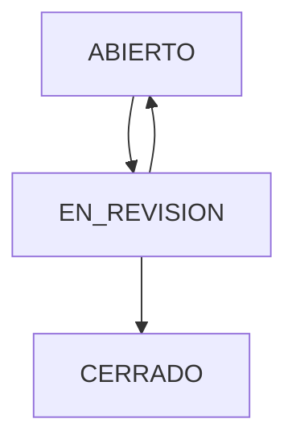

# Definición del Módulo: Caja Chica

## Descripción General
El módulo de Caja Chica gestiona los fondos diarios asignados para gastos menudos y pagos a proveedores en sucursales de restaurantes. Este sistema es independiente del efectivo de ventas (cortes de caja POS) y proporciona un control exhaustivo sobre la apertura de fondos, registro de egresos y reintegros, gestión de comprobantes digitales, arqueo (conciliación) al cierre del día, sistema de aprobaciones y auditoría completa de cambios.

## Componentes del Módulo

### 1. Gestión de Fondos
**Descripción:** Funcionalidad para la apertura y administración de fondos diarios.

**Características actuales:**
- Apertura de fondo con monto inicial
- Asignación de responsable
- Descripción opcional para identificación
- Control por sucursal y fecha

**Requerimientos de UI/UX:**
- Formulario de apertura con validación de datos
- Asignación de responsable con autocompletado
- Vista de listado con filtros por estado/fecha/sucursal
- Detalle de fondo con información completa
- Sistema de estados: ABIERTO → EN_REVISION → CERRADO

### 2. Registro de Movimientos
**Descripción:** Funcionalidad para registrar egresos, reintegros y depósitos.

**Características actuales:**
- Egresos, Reintegros y Depósitos
- Métodos de pago: Efectivo y Transferencia
- Adjuntar comprobantes (PDF, imágenes)
- Información de proveedor
- Edición y eliminación con auditoría

**Requerimientos de UI/UX:**
- Formulario intuitivo para registro de movimientos
- Drag & drop para adjuntar comprobantes
- Validación de montos y tipos
- Vista de listado con resumen financiero
- Filtros avanzados por tipo/fecha/proveedor
- Sistema de búsqueda y ordenamiento

### 3. Sistema de Auditoría
**Descripción:** Registro automático de todos los cambios en los movimientos.

**Características actuales:**
- Registro automático de todos los cambios
- Historial detallado por movimiento
- Trazabilidad completa (quién, cuándo, qué cambió)
- Valores anteriores y nuevos

**Requerimientos de UI/UX:**
- Timeline de eventos por movimiento
- Vista detallada de cambios
- Comparación visual de valores antes/después
- Exportación de auditoría a PDF/Excel

### 4. Arqueo y Conciliación
**Descripción:** Funcionalidad para el conteo físico de efectivo y conciliación con sistema.

**Características actuales:**
- Conteo de efectivo físico
- Comparación automática con saldo teórico
- Detección de diferencias (faltantes/sobrantes)
- Observaciones y justificaciones

**Requerimientos de UI/UX:**
- Wizard de arqueo intuitivo
- Vista de denominaciones con cálculo automático
- Comparación visual teórico vs físico
- Registro de diferencias con justificación
- Vista previa antes de cerrar

### 5. Sistema de Aprobaciones
**Descripción:** Flujo de trabajo para revisión y aprobación de fondos.

**Características actuales:**
- Estado EN_REVISION después del arqueo
- Revisión por usuarios autorizados
- Aprobación con validaciones
- Posibilidad de rechazar y reabrir
- Cierre definitivo (estado CERRADO)

**Requerimientos de UI/UX:**
- Panel de aprobaciones pendientes
- Vista detallada para revisión
- Botones de acción contextual
- Registro de comentarios y motivos
- Notificaciones de aprobaciones/rechazos

### 6. Vista de Detalle Completa
**Descripción:** Interfaz completa para visualizar toda la información de un fondo.

**Características actuales:**
- Información general del fondo
- Resumen financiero
- Tabla de movimientos
- Resultado del arqueo
- Timeline de eventos
- Formato de impresión profesional

**Requerimientos de UI/UX:**
- Diseño limpio y organizado
- Secciones claramente delimitadas
- Información resaltada según importancia
- Accesos rápidos a acciones frecuentes
- Responsive para diferentes dispositivos

### 7. Impresión Profesional
**Descripción:** Formato profesional para impresión de estados de cuenta.

**Características actuales:**
- Formato tipo estado de cuenta bancario
- Header con logo y datos del fondo
- Tabla optimizada para papel
- Resumen financiero destacado
- Footer con fecha de generación

**Requerimientos de UI/UX:**
- Diseño optimizado para impresión
- Uso eficiente del espacio en papel
- Información clara y legible
- Marcadores visuales para secciones
- Compatible con papel tamaño letter

## Estados del Fondo

### Descripción de Estados:
- **ABIERTO**: Fondo activo, permite registrar movimientos
- **EN_REVISION**: Fondo arqueado, pendiente de aprobación
- **CERRADO**: Fondo aprobado y cerrado, solo lectura

## Requerimientos Técnicos
- Modelo: CashFund con relaciones a movimientos, arqueos y auditoría
- Componentes Livewire: Index, Open, Movements, Arqueo, Approvals, Detail
- Vistas Blade: livewire/cash-fund/*.blade.php
- Rutas: /cashfund/*
- Permisos: cashfund.view, cashfund.manage, approve-cash-funds, close-cash-funds
- Sistema de archivos: storage/app/public/cash_fund_attachments/
- Auditoría: cash_fund_movement_audit_log
- Integración con: Sucursales, Almacenes, Usuarios, Proveedores

## Integración con Otros Módulos
- **Sucursales**: Asignación de fondos por ubicación
- **Usuarios**: Asignación de responsables y permisos
- **Proveedores**: Relación con movimientos de egreso
- **Reportes**: KPIs de caja chica y movimientos
- **Auditoría**: Registro de todas las acciones
- **Almacenes**: Posible integración con control de inventario

## KPIs Asociados
- Diferencia entre teórico y físico
- Número de excepciones por cierre
- Movimientos sin comprobante
- Total de ingresos/egresos por periodo
- Desviación de fondos iniciales
- Tiempo promedio de cierre de caja
- % egresos sin comprobante y tiempos de aprobación
- Diferencias de arqueo por día/usuario
- Tasa de comprobación de movimientos

## Flujos de Trabajo

### Flujo de Apertura
1. **Usuario** accede a /cashfund/open
2. **Ingresa** monto inicial, sucursal, responsable
3. **Sistema** crea fondo con estado ABIERTO
4. **Redirige** a vista de movimientos

### Flujo de Registro de Movimientos
1. **Usuario** accede a fondo existente
2. **Selecciona** tipo de movimiento (egreso/reintegro/depósito)
3. **Ingresa** datos y adjunta comprobante
4. **Sistema** valida y registra movimiento
5. **Actualiza** saldo disponible en tiempo real

### Flujo de Arqueo
1. **Usuario** accede a función de arqueo
2. **Ingresa** conteo físico por denominaciones
3. **Sistema** calcula diferencias
4. **Cambia** estado a EN_REVISION
5. **Notifica** a usuarios con permiso de aprobación

### Flujo de Aprobación
1. **Usuario autorizado** accede a panel de aprobaciones
2. **Revisa** fondo en estado EN_REVISION
3. **Aprueba** o rechaza con comentarios
4. **Si aprueba**: estado cambia a CERRADO
5. **Si rechaza**: estado vuelve a ABIERTO

## Permisos y Roles

### Permisos Disponibles
- `cashfund.view`: Ver fondos de caja
- `cashfund.manage`: Gestionar fondos (crear, editar movimientos)
- `approve-cash-funds`: Aprobar fondos arqueados
- `close-cash-funds`: Cerrar fondos aprobados

### Roles Sugeridos
- **Cajero**: cashfund.view, cashfund.manage
- **Supervisor**: cashfund.view, cashfund.manage, approve-cash-funds
- **Gerente**: cashfund.view, cashfund.manage, approve-cash-funds, close-cash-funds
- **Auditor**: cashfund.view (solo lectura)

## Consideraciones de Seguridad
- Todos los endpoints requieren usuario autenticado
- Permisos granulares con Spatie Permission
- Validación exhaustiva en todos los formularios
- Registro completo de acciones en audit_log
- Transacciones de BD para operaciones críticas
- Manejo de archivos adjuntos con validación de tipos