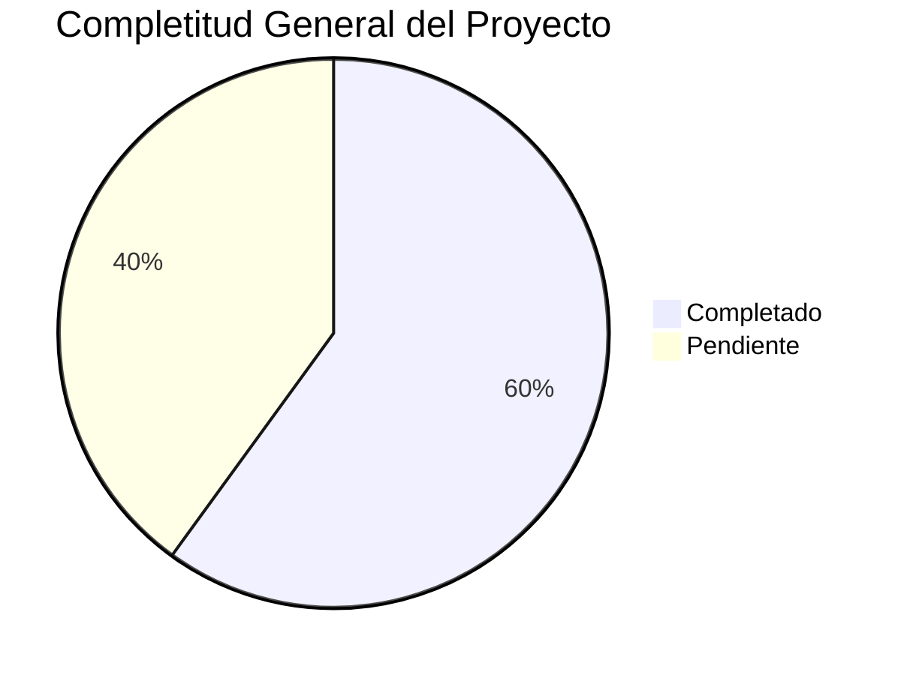

# 🎯 PLAN MAESTRO DE IMPLEMENTACIÓN - TERRENA LARAVEL ERP

**Fecha**: 31 de octubre de 2025
**Versión**: 1.0
**Analista**: Qwen AI

---

## 📋 TABLA DE CONTENIDOS

1. [Resumen Ejecutivo](#resumen-ejecutivo)
2. [Estado Actual del Proyecto](#estado-actual-del-proyecto)
3. [Arquitectura del Sistema](#arquitectura-del-sistema)
4. [Módulos por Prioridad](#módulos-por-prioridad)
5. [Roadmap de Implementación](#roadmap-de-implementación)
6. [Plan de Trabajo por Fases](#plan-de-trabajo-por-fases)
7. [Recursos Necesarios](#recursos-necesarios)
8. [KPIs de Seguimiento](#kpis-de-seguimiento)
9. [Riesgos y Mitigaciones](#riesgos-y-mitigaciones)
10. [Próximos Pasos](#próximos-pasos)

---

## 🎯 RESUMEN EJECUTIVO

### Objetivo del Proyecto
Transformar TerrenaLaravel de un sistema funcional pero fragmentado a un **ERP de restaurantes de clase enterprise** con:

- ✅ Integridad referencial completa
- ✅ Auditoría universal
- ✅ Performance optimizado
- ✅ Escalabilidad multi-tenant
- ✅ Zero downtime deployments

### Estado General del Proyecto
**Overall Progress**: 🟡 **60% Completitud**



### Módulos Críticos
1. **Inventario** - 70% completado
2. **Compras** - 60% completado
3. **Recetas** - 50% completado
4. **Producción** - 30% completado
5. **Transferencias** - 20% completado (CRÍTICO - Falta implementar)

---

## 📊 ESTADO ACTUAL DEL PROYECTO

### Completitud por Módulo
| Módulo | Backend | Frontend | API | Documentación | Estado |
|--------|---------|----------|-----|---------------|--------|
| **Inventario** | 70% | 60% | 75% | 85% | ⚠️ Bueno |
| **Compras** | 60% | 50% | 65% | 80% | ⚠️ Regular |
| **Recetas** | 50% | 40% | 55% | 75% | ⚠️ Regular |
| **Producción** | 30% | 20% | 35% | 70% | 🔴 Bajo |
| **Caja Chica** | 80% | 75% | 85% | 90% | ✅ Muy Bueno |
| **Reportes** | 40% | 30% | 45% | 65% | 🔴 Bajo |
| **Catálogos** | 80% | 70% | 85% | 85% | ✅ Muy Bueno |
| **Permisos** | 80% | 75% | 85% | 90% | ✅ Muy Bueno |
| **POS** | 65% | 55% | 70% | 80% | ⚠️ Bueno |
| **Transferencias** | 20% | 15% | 25% | 60% | 🔴 Crítico |

### Infraestructura
- ✅ **Base de Datos**: PostgreSQL 9.5 (141 tablas, 127 FKs, 415 índices)
- ✅ **Backend**: Laravel 12 + PHP 8.2
- ✅ **Frontend**: Livewire 3.7 + Alpine.js + Bootstrap 5
- ⚠️ **API REST**: 75% completada
- 🔴 **Testing**: 20% de cobertura
- ✅ **Documentación**: 75% completada

---

## 🏗️ ARQUITECTURA DEL SISTEMA

### Stack Tecnológico
```
Backend:
├── Laravel 12 (PHP 8.2+)
├── PostgreSQL 9.5
├── Spatie Permissions
└── Sanctum API Tokens

Frontend:
├── Livewire 3.7 (SPA híbrido)
├── Alpine.js (interactividad ligera)
├── Bootstrap 5 + Tailwind CSS
└── Vite (build system)

Infraestructura:
├── XAMPP (desarrollo)
├── Docker (futuro)
├── Redis (queues)
└── Apache/Nginx
```

### Patrones de Diseño
1. **Service Layer Pattern** - Lógica de negocio en servicios separados
2. **Repository Pattern** - Acceso a datos desacoplado
3. **MVC** - Separación clara de responsabilidades
4. **Event-Driven** - Sistema de eventos para auditoría
5. **Queue-Based** - Procesamiento asíncrono para operaciones pesadas

### Estructura de Directorios
```
app/
├── Http/
│   ├── Controllers/
│   │   ├── Api/
│   │   │   ├── Inventory/
│   │   │   ├── Purchasing/
│   │   │   ├── Production/
│   │   │   └── ...
│   │   ├── Inventory/
│   │   ├── Purchasing/
│   │   └── Production/
│   └── Requests/
│       ├── Api/
│       │   ├── Inventory/
│       │   ├── Purchasing/
│       │   ├── Production/
│       │   └── ...
│       └── ...
├── Models/
│   ├── Inventory/
│   ├── Purchasing/
│   ├── Production/
│   └── ...
├── Services/
│   ├── Inventory/
│   ├── Purchasing/
│   ├── Production/
│   └── ...
├── Jobs/
│   ├── Inventory/
│   ├── Purchasing/
│   ├── Production/
│   └── ...
└── Console/
    ├── Commands/
    │   ├── Inventory/
    │   ├── Purchasing/
    │   ├── Production/
    │   └── ...
    └── Kernel.php

resources/
├── views/
│   ├── livewire/
│   │   ├── inventory/
│   │   ├── purchasing/
│   │   ├── production/
│   │   └── ...
│   └── layouts/
└── js/

routes/
├── web.php
├── api.php
└── channels.php

database/
├── migrations/
├── seeders/
└── factories/

docs/
└── UI-UX/
    └── definición/
        ├── CajaChica.md
        ├── Catálogos.md
        ├── Compras.md
        ├── Inventario.md
        ├── Permisos.md
        ├── POS.md
        ├── Producción.md
        ├── Recetas.md
        ├── Reportes.md
        └── Transferencias.md
```

---

## 🔥 MÓDULOS POR PRIORIDAD

### 🔴 PRIORIDAD CRÍTICA
1. **Transferencias** (20% → 95%)
   - Impacto: MUY ALTO - Bloquea movimientos internos entre almacenes
   - Esfuerzo: MEDIO - 2-3 semanas
   - Riesgo: MEDIO - Requiere integración con mov_inv

2. **Producción** (30% → 90%)
   - Impacto: ALTO - Core del negocio de restaurantes
   - Esfuerzo: ALTO - 3-4 semanas
   - Riesgo: MEDIO - Requiere integración con recetas e inventario

### 🟡 PRIORIDAD ALTA
3. **Recetas** (50% → 95%)
   - Impacto: ALTO - Control de costos y rentabilidad
   - Esfuerzo: MEDIO - 2-3 semanas
   - Riesgo: BAJO - Funcionalidad parcial implementada

4. **Reportes** (40% → 90%)
   - Impacto: MEDIO - Toma de decisiones
   - Esfuerzo: MEDIO - 2-3 semanas
   - Riesgo: BAJO - UI pendiente

### 🟢 PRIORIDAD MEDIA
5. **Compras** (60% → 95%)
   - Impacto: MEDIO - Control de proveedores
   - Esfuerzo: MEDIO - 2 semanas
   - Riesgo: BAJO - Motor parcialmente implementado

### ⚪ PRIORIDAD BAJA
6. **Inventario** (70% → 95%)
   - Impacto: MEDIO - Refinamiento de UI/UX
   - Esfuerzo: BAJO - 1-2 semanas
   - Riesgo: BAJO - Funcionalidad básica completa

---

## 🗓️ ROADMAP DE IMPLEMENTACIÓN

### Fase 1: Críticos (Semanas 1-4)
**Objetivo**: Completar módulos críticos que bloquean funcionalidades

**Timeline**:
```
Semana 1 (1-7 nov): Transferencias (Backend + API)
Semana 2 (8-14 nov): Transferencias (Frontend + UI)
Semana 3 (15-21 nov): Recetas (UI + Versionado)
Semana 4 (22-28 nov): Producción (Backend + API)
```

### Fase 2: Altos (Semanas 5-8)
**Objetivo**: Completar módulos de alto impacto

**Timeline**:
```
Semana 5 (29 nov - 5 dic): Producción (Frontend + UI)
Semana 6 (6-12 dic): Reportes (Dashboard + Exportaciones)
Semana 7 (13-19 dic): Compras (UI refinada + Dashboard)
Semana 8 (20-26 dic): Inventario (UI refinada + Wizard)
```

### Fase 3: Medios (Semanas 9-12)
**Objetivo**: Refinamiento de módulos y testing

**Timeline**:
```
Semana 9 (27 dic - 2 ene): Testing automatizado
Semana 10 (3-9 ene): Refinamiento de UI/UX
Semana 11 (10-16 ene): Optimización de performance
Semana 12 (17-23 ene): Documentación final + Capacitación
```

---

## 📋 PLAN DE TRABAJO POR FASES

### Fase 1: Módulos Críticos (4 semanas)

#### Semana 1: Transferencias - Backend + API
**Objetivo**: Implementar backend y API de transferencias

**Tareas**:
1. ✅ **Modelos**:
   - Crear modelos TransferHeader, TransferDetail
   - Implementar relaciones (hasOne, hasMany, belongsTo)
   - Agregar scopes y accessors

2. ✅ **Servicio**:
   - Completar TransferService con métodos reales
   - Implementar lógica de negocio (createTransfer, approveTransfer, markInTransit, receiveTransfer, postTransferToInventory)
   - Agregar validaciones y manejo de errores

3. ✅ **Controlador**:
   - Completar TransferController con endpoints REST
   - Agregar middleware de autenticación y permisos
   - Implementar validación de datos

4. ✅ **Migraciones**:
   - Crear tablas transfer_header, transfer_detail, transfer_log
   - Agregar índices y constraints
   - Crear triggers para auditoría

**Entregables**:
- [ ] Modelos TransferHeader y TransferDetail implementados
- [ ] TransferService con lógica completa
- [ ] TransferController con endpoints REST
- [ ] Migraciones de base de datos
- [ ] Tests unitarios y de integración

#### Semana 2: Transferencias - Frontend + UI
**Objetivo**: Implementar interfaz de usuario para transferencias

**Tareas**:
1. ✅ **Componentes Livewire**:
   - Crear Transfers\Index (listado)
   - Crear Transfers\Create (creación)
   - Crear Transfers\Detail (detalle)
   - Crear Transfers\Receive (recepción)

2. ✅ **Vistas Blade**:
   - Implementar vistas para cada componente
   - Agregar estilos con Bootstrap/Tailwind
   - Implementar formularios responsivos

3. ✅ **Rutas**:
   - Registrar rutas web para transferencias
   - Agregar middleware de permisos
   - Implementar navegación en sidebar

**Entregables**:
- [ ] Componentes Livewire completos
- [ ] Vistas Blade implementadas
- [ ] Rutas web registradas
- [ ] Integración con sidebar
- [ ] UI funcional y responsiva

#### Semana 3: Recetas - UI + Versionado
**Objetivo**: Completar interfaz de usuario para recetas y versionado

**Tareas**:
1. ✅ **Editor Avanzado**:
   - Mejorar UI de RecipeEditor
   - Agregar wizard de edición
   - Implementar validación inline

2. ✅ **Versionado**:
   - Implementar versionado automático de recetas
   - Crear modelo RecipeVersion
   - Agregar funcionalidad de historial

3. ✅ **Snapshots**:
   - Completar RecipeCostSnapshot
   - Implementar generación automática
   - Agregar UI para visualizar historial

**Entregables**:
- [ ] Editor avanzado de recetas
- [ ] Sistema de versionado implementado
- [ ] Snapshots de costos funcionando
- [ ] UI de historial de versiones
- [ ] Tests de versionado y snapshots

#### Semana 4: Producción - Backend + API
**Objetivo**: Implementar backend y API de producción

**Tareas**:
1. ✅ **Modelos**:
   - Completar modelos de producción
   - Agregar relaciones con recetas e inventario
   - Implementar scopes y accessors

2. ✅ **Servicio**:
   - Completar ProductionService con métodos reales
   - Implementar lógica de planificación (planBatch)
   - Agregar consumo de ingredientes (consumeIngredients)
   - Completar cierre de batches (completeBatch, postBatchToInventory)

3. ✅ **Controlador**:
   - Completar ProductionController con endpoints REST
   - Agregar middleware de autenticación y permisos
   - Implementar validación de datos

4. ✅ **Migraciones**:
   - Crear tablas faltantes de producción
   - Agregar índices y constraints
   - Crear triggers para auditoría

**Entregables**:
- [ ] Modelos de producción completos
- [ ] ProductionService con lógica completa
- [ ] ProductionController con endpoints REST
- [ ] Migraciones de base de datos
- [ ] Tests unitarios y de integración

### Fase 2: Módulos de Alto Impacto (4 semanas)

#### Semana 5: Producción - Frontend + UI
**Objetivo**: Implementar interfaz de usuario para producción

**Tareas**:
1. ✅ **Componentes Livewire**:
   - Crear Production\Index (listado de órdenes)
   - Crear Production\Create (creación de órdenes)
   - Crear Production\Execute (ejecución de órdenes)
   - Crear Production\Detail (detalle de órdenes)

2. ✅ **Vistas Blade**:
   - Implementar vistas para cada componente
   - Agregar estilos con Bootstrap/Tailwind
   - Implementar formularios responsivos

3. ✅ **Rutas**:
   - Registrar rutas web para producción
   - Agregar middleware de permisos
   - Implementar navegación en sidebar

**Entregables**:
- [ ] Componentes Livewire completos
- [ ] Vistas Blade implementadas
- [ ] Rutas web registradas
- [ ] Integración con sidebar
- [ ] UI funcional y responsiva

#### Semana 6: Reportes - Dashboard + Exportaciones
**Objetivo**: Implementar dashboard y exportaciones de reportes

**Tareas**:
1. ✅ **Dashboard Principal**:
   - Crear componente Reports\Dashboard
   - Implementar KPIs principales
   - Agregar gráficas interactivas

2. ✅ **Exportaciones**:
   - Implementar exportación CSV/PDF
   - Agregar programación de reportes
   - Crear sistema de favoritos

3. ✅ **Drill-down**:
   - Implementar navegación jerárquica
   - Agregar filtros contextuales
   - Crear vistas detalladas

**Entregables**:
- [ ] Dashboard de reportes funcional
- [ ] Exportaciones CSV/PDF implementadas
- [ ] Sistema de programación de reportes
- [ ] Drill-down jerárquico
- [ ] UI responsiva

#### Semana 7: Compras - UI Refinada + Dashboard
**Objetivo**: Refinar interfaz de usuario para compras y completar dashboard

**Tareas**:
1. ✅ **Dashboard de Sugerencias**:
   - Completar UI de Replenishment\Dashboard
   - Agregar filtros avanzados
   - Implementar vista de razones del cálculo

2. ✅ **Wizard de Creación**:
   - Implementar wizard de creación de órdenes
   - Agregar validación inline
   - Crear sistema de plantillas

3. ✅ **UI de Proveedores**:
   - Completar CRUD de proveedores
   - Agregar historial de precios
   - Implementar sistema de calificación

**Entregables**:
- [ ] Dashboard de sugerencias completo
- [ ] Wizard de creación de órdenes
- [ ] UI de proveedores refinada
- [ ] Sistema de plantillas
- [ ] Tests de UI

#### Semana 8: Inventario - UI Refinada + Wizard
**Objetivo**: Refinar interfaz de usuario para inventario y completar wizard

**Tareas**:
1. ✅ **Wizard de Alta**:
   - Completar wizard de alta de ítems en 2 pasos
   - Agregar validación inline
   - Implementar preview de código

2. ✅ **UI de Recepciones**:
   - Refinar UI de recepciones
   - Agregar snapshot de costo
   - Implementar adjuntos múltiples

3. ✅ **UI de Conteos**:
   - Refinar UI de conteos físicos
   - Agregar mobile-first
   - Implementar acciones masivas

**Entregables**:
- [ ] Wizard de alta de ítems completo
- [ ] UI de recepciones refinada
- [ ] UI de conteos física mejorada
- [ ] Sistema de adjuntos múltiples
- [ ] Tests de UI

### Fase 3: Refinamiento y Testing (4 semanas)

#### Semana 9: Testing Automatizado
**Objetivo**: Implementar testing automatizado para todos los módulos

**Tareas**:
1. ✅ **Tests Unitarios**:
   - Implementar tests para servicios
   - Agregar tests para modelos
   - Crear tests para validaciones

2. ✅ **Tests de Integración**:
   - Implementar tests para controladores
   - Agregar tests para APIs
   - Crear tests para flujos completos

3. ✅ **Tests E2E**:
   - Implementar tests con Laravel Dusk
   - Agregar tests para flujos críticos
   - Crear tests para permisos

**Entregables**:
- [ ] Tests unitarios para servicios y modelos
- [ ] Tests de integración para controladores y APIs
- [ ] Tests E2E para flujos críticos
- [ ] Cobertura de testing >70%
- [ ] Reporte de cobertura

#### Semana 10: Refinamiento de UI/UX
**Objetivo**: Refinar la experiencia de usuario y corregir issues

**Tareas**:
1. ✅ **Design System**:
   - Crear componentes reutilizables
   - Implementar sistema de validación inline
   - Agregar sistema de notificaciones

2. ✅ **Responsive Design**:
   - Refinar diseño para móviles
   - Agregar optimización para tablets
   - Implementar breakpoints consistentes

3. ✅ **Accesibilidad**:
   - Agregar soporte para lectores de pantalla
   - Implementar contraste de colores
   - Agregar teclas de acceso rápido

**Entregables**:
- [ ] Design system completo
- [ ] UI/UX responsive y accesible
- [ ] Sistema de validación inline
- [ ] Sistema de notificaciones
- [ ] Pruebas de usabilidad

#### Semana 11: Optimización de Performance
**Objetivo**: Optimizar el rendimiento del sistema

**Tareas**:
1. ✅ **Optimización de Consultas**:
   - Identificar y corregir N+1 queries
   - Agregar índices faltantes
   - Implementar caching estratégico

2. ✅ **Optimización de Assets**:
   - Minificar CSS/JS
   - Implementar lazy loading
   - Agregar preloading de recursos críticos

3. ✅ **Monitoreo**:
   - Implementar sistema de métricas
   - Agregar profiling de consultas
   - Crear dashboard de performance

**Entregables**:
- [ ] Consultas optimizadas (<100ms)
- [ ] Assets optimizados
- [ ] Sistema de monitoreo implementado
- [ ] Dashboard de performance
- [ ] Reporte de optimización

#### Semana 12: Documentación Final + Capacitación
**Objetivo**: Completar documentación y preparar capacitación

**Tareas**:
1. ✅ **Documentación Final**:
   - Completar documentación de módulos
   - Agregar guías de usuario
   - Crear documentación de APIs

2. ✅ **Capacitación**:
   - Crear materiales de capacitación
   - Preparar videos tutoriales
   - Organizar sesiones de entrenamiento

3. ✅ **Go-Live**:
   - Preparar ambiente de producción
   - Realizar pruebas finales
   - Desplegar sistema en producción

**Entregables**:
- [ ] Documentación completa actualizada
- [ ] Materiales de capacitación
- [ ] Videos tutoriales
- [ ] Sistema desplegado en producción
- [ ] Plan de mantenimiento

---

## 👥 RECURSOS NECESARIOS

### Equipo Técnico
| Rol | Horas/semana | Duración | Total Horas |
|-----|--------------|----------|-------------|
| **Backend Lead** | 40h | 12 semanas | 480h |
| **Frontend Developer** | 30h | 12 semanas | 360h |
| **DBA PostgreSQL** | 20h | 12 semanas | 240h |
| **QA Engineer** | 20h | 12 semanas | 240h |
| **UI/UX Designer** | 15h | 12 semanas | 180h |
| **DevOps** | 10h | 12 semanas | 120h |
| **Project Manager** | 10h | 12 semanas | 120h |
| **Total** | **155h/semana** | **12 semanas** | **1,860h** |

### Infraestructura
| Recurso | Costo Mensual |
|---------|---------------|
| Hosting Staging | $200 |
| Herramientas (monitoring, backup) | $150 |
| Licencias (software, servicios) | $100 |
| **Total** | **$450/mes** |

---

## 📈 KPIs DE SEGUIMIENTO

### KPIs de Progreso
| KPI | Meta | Frecuencia de Medición |
|-----|------|------------------------|
| **Completitud del Proyecto** | 95% | Semanal |
| **Cobertura de Testing** | 80% | Semanal |
| **Performance API** | 95% <100ms | Semanal |
| **Zero Downtime Deployments** | 100% | Con cada deploy |
| **Documentación Actualizada** | 100% | Semanal |

### KPIs de Negocio
| KPI | Meta | Frecuencia de Medición |
|-----|------|------------------------|
| **Reducción de Mermas** | -15% | Mensual |
| **Precisión de Inventario** | 98% | Semanal |
| **Tiempo de Cierre Diario** | <30 min | Diario |
| **Stockouts Evitados** | 100% | Diario |
| **Margen Bruto** | +5% | Mensual |

### KPIs Técnicos
| KPI | Meta | Frecuencia de Medición |
|-----|------|------------------------|
| **Consultas Optimizadas** | 95% <100ms | Semanal |
| **Caching Hit Ratio** | >80% | Semanal |
| **Uptime** | 99.5% | Diario |
| **Memory Usage** | <100MB/request | Semanal |
| **Response Time** | <2s | Semanal |

---

## ⚠️ RIESGOS Y MITIGACIONES

### Riesgos Críticos
| Riesgo | Impacto | Probabilidad | Mitigación |
|--------|---------|--------------|------------|
| **Fallo en implementación de Transferencias** | ALTO | MEDIO | Plan B: Implementación paralela + backup |
| **Problemas de integración con mov_inv** | ALTO | MEDIO | Validación exhaustiva + rollback plan |
| **Retraso en Fase 1** | ALTO | ALTO | Recursos adicionales + ajuste de timeline |

### Riesgos Altos
| Riesgo | Impacto | Probabilidad | Mitigación |
|--------|---------|--------------|------------|
| **Performance insuficiente** | MEDIO | ALTO | Optimización continua + profiling |
| **Fallo en testing automatizado** | MEDIO | MEDIO | Plan de contingencia manual |
| **Conflictos de permisos** | MEDIO | ALTO | Validación granular + pruebas |

### Riesgos Medios
| Riesgo | Impacto | Probabilidad | Mitigación |
|--------|---------|--------------|------------|
| **Cambios en requerimientos** | MEDIO | BAJO | Proceso de cambio formal |
| **Fallo en documentación** | BAJO | MEDIO | Revisión periódica + checklist |
| **Problemas de capacitación** | BAJO | BAJO | Materiales de respaldo + sesiones repetidas |

---

## ✅ PRÓXIMOS PASOS

### Inmediatos (Esta Semana)
1. ✅ **Iniciar Fase 1: Transferencias - Backend + API**
   - Crear modelos TransferHeader y TransferDetail
   - Completar TransferService con lógica real
   - Implementar TransferController con endpoints REST
   - Crear migraciones de base de datos

2. ✅ **Actualizar documentación de módulos**
   - Completar definiciones en docs/UI-UX/definición/
   - Actualizar matrices de permisos
   - Documentar nuevos endpoints

### Corto Plazo (Próximas 2 Semanas)
1. ⏳ **Completar Fase 1: Transferencias - Frontend + UI**
   - Implementar componentes Livewire
   - Crear vistas Blade
   - Registrar rutas web

2. ⏳ **Iniciar Fase 1: Recetas - UI + Versionado**
   - Mejorar editor avanzado
   - Implementar versionado automático
   - Completar snapshots de costos

### Mediano Plazo (Próximo Mes)
1. ⏳ **Completar Fase 1: Producción - Backend + API**
   - Completar modelos de producción
   - Implementar ProductionService completo
   - Crear ProductionController con endpoints REST

2. 🔴 **Iniciar Fase 2: Producción - Frontend + UI**
   - Crear componentes Livewire
   - Implementar vistas Blade
   - Registrar rutas web

---

## 📞 CONTACTO Y SOPORTE

**Project Manager**: [Nombre del PM]
**Tech Lead**: [Nombre del Tech Lead]
**Equipo de Desarrollo**: Equipo TerrenaLaravel
**Fecha de Última Revisión**: 31 de octubre de 2025
**Próxima Revisión**: 7 de noviembre de 2025

---

**🎉 ¡Plan maestro creado con éxito!**

Este plan proporciona una hoja de ruta clara para completar la implementación del ERP TerrenaLaravel. Siguiendo este roadmap, el sistema estará completamente funcional en aproximadamente 12 semanas.