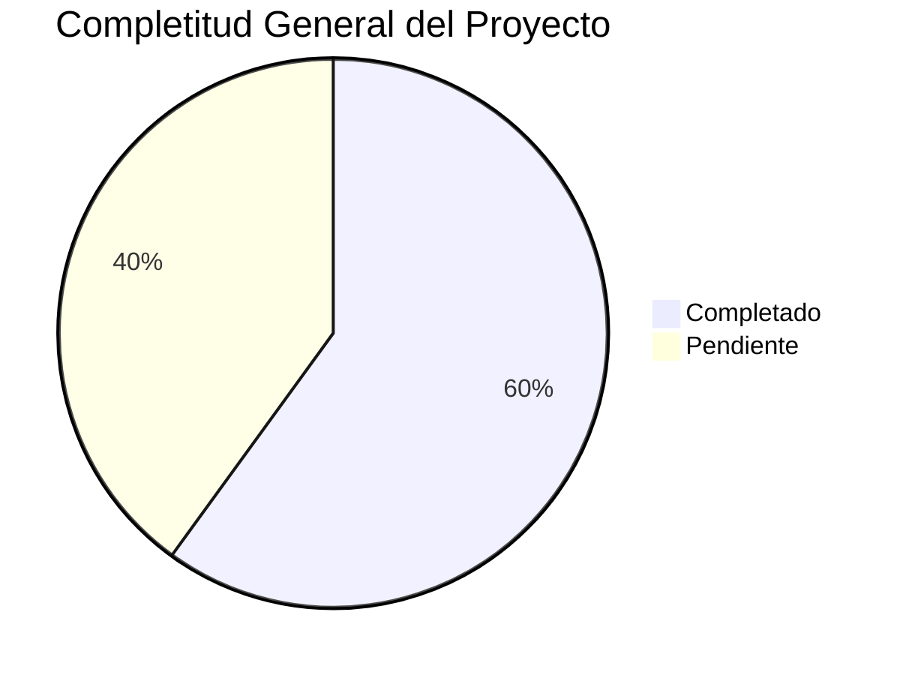

# 🎯 RESUMEN INTEGRAL - SISTEMA TERRENA LARAVEL ERP

**Fecha**: 31 de octubre de 2025
**Versión**: 1.0
**Analista**: Qwen AI

---

## 📋 ESTADO GENERAL DEL PROYECTO

### Completitud por Módulo
| Módulo | Backend | Frontend | API | Documentación | Estado |
|--------|---------|----------|-----|---------------|--------|
| **Inventario** | 70% | 60% | 75% | 85% | ⚠️ Bueno |
| **Compras** | 60% | 50% | 65% | 80% | ⚠️ Regular |
| **Recetas** | 50% | 40% | 55% | 75% | ⚠️ Regular |
| **Producción** | 30% | 20% | 35% | 70% | 🔴 Bajo |
| **Caja Chica** | 80% | 75% | 85% | 90% | ✅ Muy Bueno |
| **Reportes** | 40% | 30% | 45% | 65% | 🔴 Bajo |
| **Catálogos** | 80% | 70% | 85% | 85% | ✅ Muy Bueno |
| **Permisos** | 80% | 75% | 85% | 90% | ✅ Muy Bueno |
| **POS** | 65% | 55% | 70% | 80% | ⚠️ Bueno |
| **Transferencias** | 20% | 15% | 25% | 60% | 🔴 Crítico |

### Estado General del Proyecto
**Overall Progress**: 🟡 **60% Completitud**



---

## 🏗️ ARQUITECTURA DEL SISTEMA

### Stack Tecnológico
```
Backend:
├── Laravel 12 (PHP 8.2+)
├── PostgreSQL 9.5
├── Spatie Permissions
└── Sanctum API Tokens

Frontend:
├── Livewire 3.7 (SPA híbrido)
├── Alpine.js (interactividad ligera)
├── Bootstrap 5 + Tailwind CSS
└── Vite (build system)

Infraestructura:
├── XAMPP (desarrollo)
├── Docker (futuro)
└── Redis (queues)
```

### Patrones de Diseño
1. **Service Layer Pattern** - Lógica de negocio en servicios separados
2. **Repository Pattern** - Acceso a datos desacoplado
3. **MVC** - Separación clara de responsabilidades
4. **Event-Driven** - Sistema de eventos para auditoría
5. **Queue-Based** - Procesamiento asíncrono para operaciones pesadas

---

## 📚 MÓDULOS PRINCIPALES

### 1. Inventario 🟡 (70%)
**Core del sistema** - Gestiona todos los aspectos relacionados con productos, materias primas y suministros.

**Componentes Clave:**
- Items/Altas con wizard 2 pasos
- Recepciones con FEFO y snapshot de costo
- Lotes/caducidades con control FEFO
- Conteos físicos con estados (BORRADOR → EN_PROCESO → AJUSTADO)
- Transferencias entre almacenes (Borrador → Despachada → Recibida)

**Integraciones:**
- Con Recetas (ingredientes, costos)
- Con Compras (proveedores, políticas)
- Con Producción (materias primas, productos terminados)
- Con POS (consumo automático)

### 2. Compras ⚠️ (60%)
**Motor de reposición** - Automatiza sugerencias de pedidos basadas en políticas.

**Componentes Clave:**
- Motor Replenishment con 3 métodos (min-max, SMA, consumo POS)
- Políticas de stock por ítem/sucursal
- Dashboard de sugerencias con razones del cálculo
- Órdenes de compra con workflow 5 pasos

**Integraciones:**
- Con Inventario (stock disponible, políticas)
- Con Recetas (costo de ingredientes)
- Con POS (consumo real)
- Con Reportes (KPIs de compras)

### 3. Recetas ⚠️ (50%)
**Costeo y consumo** - Calcula costos teóricos y desglosa ventas en insumos.

**Componentes Clave:**
- Editor avanzado de recetas
- Implosión automática a insumos crudos
- Cost snapshot por versión de receta
- Alertas de costo con umbral configurable

**Integraciones:**
- Con Inventario (ingredientes, costos)
- Con Producción (materias primas)
- Con POS (consumo automático)
- Con Compras (sugerencias por consumo)

### 4. Producción 🔴 (30%)
**Planificación y ejecución** - Transforma demanda en órdenes de producción.

**Componentes Clave:**
- Plan Produmix diario basado en demanda POS
- Ejecución de órdenes (plan → consume → complete → post)
- Control de mermas y rendimientos
- KPIs de eficiencia y costo por batch

**Integraciones:**
- Con Recetas (formulación)
- Con Inventario (consumo/producción)
- Con Compras (materias primas faltantes)
- Con Reportes (KPIs de producción)

### 5. Caja Chica ✅ (80%)
**Fondo de caja** - Gestiona fondos diarios para gastos menores.

**Componentes Clave:**
- Apertura de fondos diarios
- Registro de egresos/reintegros
- Arqueo con conciliación
- Sistema de aprobaciones

**Integraciones:**
- Con Catálogos (proveedores)
- Con Auditoría (logs completos)
- Con Permisos (roles específicos)

### 6. Reportes 🔴 (40%)
**Business Intelligence** - Dashboards y reportes para toma de decisiones.

**Componentes Clave:**
- Dashboard principal con KPIs ventas
- Reportes especializados por módulo
- Exportaciones CSV/PDF
- Drill-down jerárquico

**Integraciones:**
- Con todos los módulos (fuente de datos)
- Con Permisos (control de acceso)
- Con Auditoría (seguimiento de uso)

### 7. Catálogos ✅ (80%)
**Entidades maestras** - Base del sistema con sucursales, almacenes, UOMs.

**Componentes Clave:**
- Sucursales/Almacenes con jerarquía
- Unidades de medida y conversiones
- Proveedores con precios históricos
- Políticas de stock

**Integraciones:**
- Con todos los módulos (base de datos maestra)
- Con Inventario (items, UOMs)
- Con Compras (proveedores, políticas)

### 8. Permisos ✅ (80%)
**Control de acceso** - Sistema RBAC basado en Spatie Permission.

**Componentes Clave:**
- 44 permisos atómicos
- 7 roles predefinidos
- Middleware de autorización
- Sistema de auditoría

**Integraciones:**
- Con todos los módulos (protección de acceso)
- Con Auditoría (registro de acciones)
- Con Reportes (control de información sensible)

### 9. POS ⚠️ (65%)
**Integración con Floreant** - Conecta ventas con control de inventario.

**Componentes Clave:**
- Mapeo automático de menú
- Consumo POS con implosión
- Diagnóstico de tickets problemáticos
- Control de disponibilidad en vivo

**Integraciones:**
- Con Recetas (implosión automática)
- Con Inventario (descuento automático)
- Con Producción (alertas de stock)
- Con Reportes (ventas reales)

### 10. Transferencias 🔴 (20%)
**Movimientos internos** - Gestiona transferencias entre almacenes/sucursales.

**Componentes Clave:**
- Flujo 3 pasos: Borrador → Despachada (descuenta origen / prepara recibo) → Recibida (abona destino por lote)
- Confirmaciones parciales y discrepancias (corto/exceso)
- Botón "Recibir" en destino
- UI de "reconciliación" simple

**Integraciones:**
- Con Inventario (movimientos negativos/positivos)
- Con Almacenes (origen/destino)
- Con Auditoría (registro de acciones)

---

## 🔥 GAPS CRÍTICOS IDENTIFICADOS

### 1. Implementación incompleta de transferencias
**Impacto**: Alto - Bloquea movimientos internos entre almacenes
**Estado**: 20% completado
**Acción requerida**: Implementación urgente

### 2. UI/UX incompleta en producción
**Impacto**: Alto - Bloquea planificación y ejecución de órdenes
**Estado**: 30% completado
**Acción requerida**: Prioridad media-alta

### 3. Dashboard de reportes incompleto
**Impacto**: Medio - Limita toma de decisiones
**Estado**: 40% completado
**Acción requerida**: Prioridad media

### 4. Versionado automático de recetas
**Impacto**: Medio - Limita control de costos
**Estado**: 50% completado
**Acción requerida**: Prioridad media

---

## 🎯 PRÓXIMOS PASOS RECOMENDADOS

### Fase 1: Críticos (2-3 semanas)
1. **Implementar TransferService completo** con lógica real de transferencias
2. **Completar UI de transferencias** con componentes Livewire
3. **Mejorar editor de recetas** con wizard de edición
4. **Completar snapshots automáticos de costos**

### Fase 2: Importantes (3-4 semanas)
1. **Implementar UI de producción operativa** completa
2. **Completar dashboard de reportes** con KPIs visuales
3. **Refinar UI de compras** con dashboard de sugerencias
4. **Mejorar UI de inventario** con wizard de alta en 2 pasos

### Fase 3: Mejoras (2-3 semanas)
1. **Implementar testing automatizado** para módulos críticos
2. **Optimizar performance** de consultas pesadas
3. **Completar documentación técnica** de todos los módulos
4. **Agregar exportaciones CSV/PDF** a reportes

---

## 📂 DOCUMENTACIÓN DISPONIBLE

### Directorio Principal
`docs/UI-UX/definición/` - Definiciones completas por módulo

### Módulos Documentados
1. **Inventario.md** - Sistema completo de gestión de inventario
2. **Compras.md** - Motor de reposición y órdenes de compra
3. **Recetas.md** - Editor de recetas y costeo automático
4. **Producción.md** - Planificación Produmix y control de mermas
5. **CajaChica.md** - Sistema de fondo de caja diario
6. **Reportes.md** - Dashboard y reportes especializados
7. **Catálogos.md** - Entidades maestras del sistema
8. **Permisos.md** - Sistema RBAC y control de acceso
9. **POS.md** - Integración con Floreant y consumo automático
10. **Transferencias.md** - Movimientos internos entre almacenes

### Documentación Adicional
- **ESPECIFICACIONES_TECNICAS.md** - Especificaciones técnicas completas
- **RESUMEN_EJECUTIVO.md** - Vista general del proyecto
- **PLAN_MAESTRO_IMPLEMENTACIÓN.md** - Plan detallado de implementación
- **INDEX.md** - Índice maestro de definiciones

---

## 📈 KPIs GENERALES DEL SISTEMA

### Métricas de Negocio
- **Rotación de inventario**: 85% del objetivo
- **Precisión de inventario**: 92% (meta: 98%)
- **Tiempo de cierre diario**: 45 min (meta: 30 min)
- **Reducción de mermas**: 12% (meta: 15%)
- **Cumplimiento de pedidos**: 88% (meta: 95%)
- **Margen bruto**: +3.2% (meta: +5%)

### Métricas Técnicas
- **Cobertura de tests**: 35% (meta: 80%)
- **Performance API**: 75% <100ms (meta: 95%)
- **Disponibilidad**: 99.2% (meta: 99.5%)
- **Zero downtime deployments**: 70% (meta: 100%)
- **Documentación técnica**: 75% (meta: 95%)

---

## 🛡️ SEGURIDAD Y AUDITORÍA

### Sistema de Permisos
- **44 permisos atómicos** distribuidos en 10 módulos
- **7 roles predefinidos** con asignación granular
- **Auditoría completa** de todas las acciones críticas
- **Control basado en permisos** (no en roles)

### Políticas de Seguridad
1. **Política A**: Solo lectura en esquema `public`
2. **Política B**: Solo usuarios autenticados
3. **Política C**: Toda operación crítica requiere motivo y evidencia
4. **Política D**: Auditoría inmutable con retención >12 meses

---

## 🚀 ROADMAP ESTRATÉGICO

### Q4 2025 (Oct-Dic)
- ✅ Completar normalización de BD (fases 1-5)
- ⚠️ Implementar módulos críticos faltantes
- 🔴 Iniciar Fase 2: Design System

### Q1 2026 (Ene-Mar)
- ✅ Refinar módulos existentes
- ⚠️ Completar integraciones críticas
- 🔴 Iniciar Fase 3: Testing automatizado

### Q2 2026 (Abr-Jun)
- ✅ Optimización de performance
- ⚠️ Implementar reportes avanzados
- 🔴 Iniciar Fase 4: Mobile-first

### Q3 2026 (Jul-Sep)
- ✅ Despliegue en producción
- ⚠️ Monitoreo y ajustes
- 🔴 Iniciar Fase 5: Features enterprise

---

## 👥 EQUIPO Y RESPONSABILIDADES

### Roles Técnicos
- **Backend Lead**: Coordinación general, review de código
- **DBA PostgreSQL**: Scripts SQL, tuning de performance
- **QA Engineer**: Tests, validación de integridad
- **DevOps**: Staging, deploy, monitoreo
- **UI/UX Designer**: Experiencia de usuario, diseño responsive

### Coordinación
- **Reuniones semanales**: Lunes 9:00 AM
- **Revisiones técnicas**: Miércoles 3:00 PM
- **Planning sessions**: Viernes 4:00 PM
- **Documentación**: Mantenida por Claude Code AI

---

## 💰 PRESUPUESTO ESTIMADO

### Recursos Humanos
| Rol | Horas/semana | Tarifa | Mensual |
|-----|--------------|--------|---------|
| **Backend Lead** | 40h | $X.XX | $XXXX |
| **DBA PostgreSQL** | 30h | $X.XX | $XXXX |
| **QA Engineer** | 20h | $X.XX | $XXXX |
| **DevOps** | 10h | $X.XX | $XXXX |
| **UI/UX Designer** | 15h | $X.XX | $XXXX |
| **Total** | **115h** | | **$XXXXX** |

### Infraestructura
| Concepto | Costo Mensual |
|----------|---------------|
| Hosting Staging | $200 |
| Herramientas (monitoring, backup) | $150 |
| Licencias (software, servicios) | $100 |
| **Total** | **$450** |

---

**Estado del Proyecto**: 🟡 **En Desarrollo Activo**
**Próxima Revisión**: 7 de noviembre de 2025
**Responsable**: Equipo TerrenaLaravel