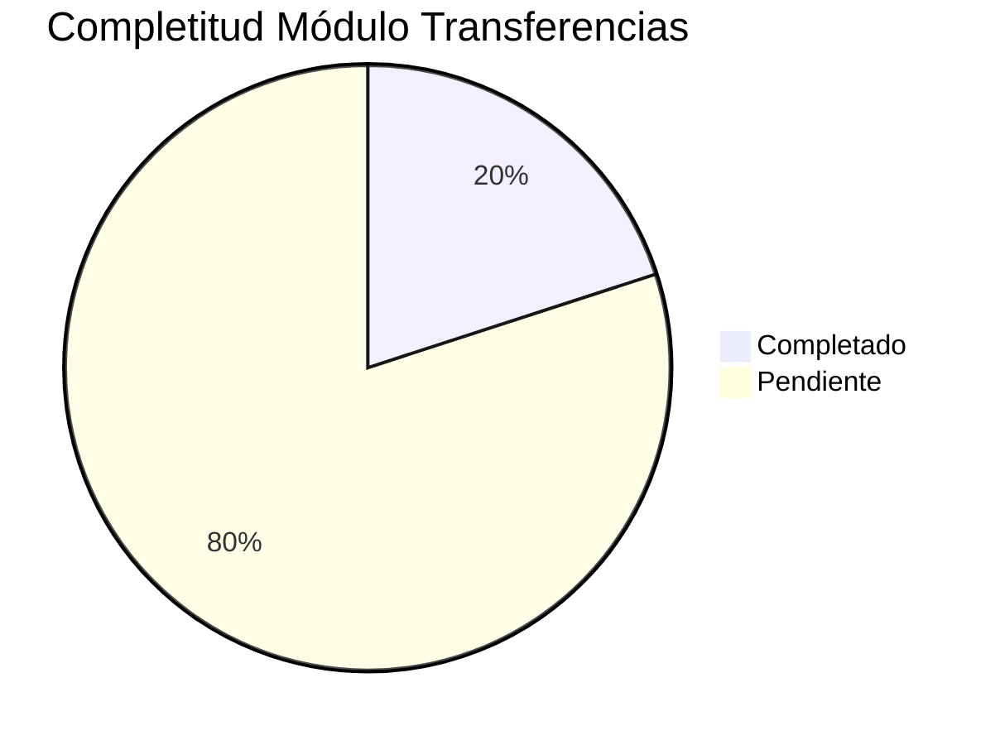

# 📦 PAQUETE DE PROMPT - TRANSFERENCIAS

**Módulo**: Transferencias  
**Componente**: Gestión de Transferencias Internas  
**Versión**: 1.0  
**Fecha**: 31 de octubre de 2025

---

## 🎯 OBJETIVO

Implementar completamente el backend, frontend y API del módulo de Transferencias entre almacenes con flujo 3 pasos y control total de existencias.

---

## 📋 PROMPT COMPLETO

```markdown
# CONTEXTO DEL PROYECTO: TerrenaLaravel ERP

## 🏢 Visión General

TerrenaLaravel es un **ERP para restaurantes** que centraliza:
- Gestión de inventario multi-almacén
- Compras automatizadas (reposición inteligente)
- Recetas versionadas multinivel
- Producción con trazabilidad
- Caja chica y gastos
- Reportería avanzada
- Integración nativa con **FloreantPOS**

**Industria**: Restaurantes, Food Service  
**Usuarios**: Gerentes de operaciones, personal de cocina, administradores  
**Stack**: Laravel 11, Livewire 3, Alpine.js, Tailwind CSS, PostgreSQL 9.5

---

## 🏗️ ARQUITECTURA Y TECNOLOGÍAS

### Backend
- **Framework**: Laravel 11 (PHP 8.2+)
- **Database**: PostgreSQL 9.5 (esquema `selemti`)
- **ORM**: Eloquent
- **Autenticación**: Laravel Breeze + Spatie Permissions

### Frontend
- **Framework UI**: Livewire 3 (componentes reactivos)
- **Templating**: Blade
- **JS**: Alpine.js (interactividad ligera)
- **CSS**: Tailwind CSS + Bootstrap 5 (legacy components)
- **Build**: Vite

### Estructura de Carpetas
```
app/
├── Http/
│   ├── Controllers/        # Controladores web y API
│   │   ├── Api/
│   │   │   ├── Inventory/
│   │   │   │   └── TransferController.php
│   │   │   └── ...
│   │   ├── Inventory/
│   │   │   └── TransferController.php
│   │   └── ...
│   └── Livewire/
│       ├── Transfers/
│       │   ├── Index.php
│       │   ├── Create.php
│       │   └── ...
│       └── ...
├── Models/                # Eloquent models
├── Services/              # Lógica de negocio
│   └── Inventory/
│       └── TransferService.php
├── Jobs/                  # Async jobs
└── ...

resources/
├── views/
│   ├── livewire/
│   │   ├── transfers/
│   │   │   ├── index.blade.php
│   │   │   ├── create.blade.php
│   │   │   └── ...
│   │   └── ...
│   └── layouts/
└── js/

routes/
├── web.php               # Rutas UI (Livewire)
├── api.php              # Rutas API REST
└── channels.php

database/
├── migrations/          # Schema changes
├── seeders/            # Data population
└── factories/          # Testing factories

docs/UI-UX/MASTER/       # 📚 DOCUMENTACIÓN PRINCIPAL
```

---

## 📊 ESTADO ACTUAL DEL PROYECTO

### Completitud General
**Overall Progress**: 🔴 **20% Completitud**



### Módulos por Estado
| Módulo | Backend | Frontend | API | Documentación | Estado |
|--------|---------|----------|-----|---------------|--------|
| **Transferencias** | 20% | 15% | 25% | 60% | 🔴 Crítico |

### Infraestructura
- ✅ **Base de Datos**: PostgreSQL 9.5 (141 tablas, 127 FKs, 415 índices)
- ⚠️ **Backend Services**: 20% (solo estructura básica)
- ⚠️ **API REST**: 25% (endpoints definidos pero no implementados)
- 🔴 **Frontend Livewire**: 15% (solo componentes básicos)
- ⚠️ **Testing**: 10% (prácticamente inexistente)
- ✅ **Documentación**: 60% (definiciones completas)

---

## 📚 DOCUMENTACIÓN DISPONIBLE

**CRÍTICO**: Consulta estos documentos antes de iniciar cualquier tarea:

### Navegación Principal
📂 `docs/UI-UX/MASTER/README.md` - Índice maestro de toda la documentación

### Por Tipo de Tarea

#### Para Backend
- `01_ESTADO_PROYECTO/01_BACKEND_STATUS.md` - Inventario completo backend
- `02_MODULOS/Transferencias.md` - Specs del módulo específico
- `03_ARQUITECTURA/04_DATABASE_SCHEMA.md` - Schema BD consolidado
- `05_SPECS_TECNICAS/SERVICIOS_BACKEND.md` - Patrones de servicios
- `05_SPECS_TECNICAS/API_ENDPOINTS.md` - Convenciones API

#### Para Frontend
- `01_ESTADO_PROYECTO/02_FRONTEND_STATUS.md` - Inventario completo frontend
- `03_ARQUITECTURA/02_DESIGN_SYSTEM.md` - Componentes UI/UX
- `05_SPECS_TECNICAS/COMPONENTES_LIVEWIRE.md` - Patrones Livewire
- `05_SPECS_TECNICAS/COMPONENTES_BLADE.md` - Blade components

#### Para BD
- `docs/BD/Normalizacion/PROYECTO_100_COMPLETADO.md` - Estado normalización BD
- `03_ARQUITECTURA/04_DATABASE_SCHEMA.md` - Schema actualizado

#### Referencias de Calidad
- `06_BENCHMARKS/` - Cómo lo hacen Oracle, Odoo, SAP, Toast, Square
- `08_RECURSOS/DECISIONES.md` - Log de decisiones técnicas

---

## 🎯 TAREA ESPECÍFICA

### Módulo: Transferencias
**Componente**: Gestión de Transferencias Internas entre Almacenes

### Descripción de la Tarea
**Implementar backend, frontend y API del módulo de Transferencias con flujo 3 pasos completo**

### Contexto Adicional
Actualmente el módulo de Transferencias es **crítico pero incompleto**:
- ✅ Existen los componentes Livewire básicos (Index, Create)
- ✅ Existen los controladores (TransferController)
- ✅ Existen los servicios (TransferService) pero con TODOs
- ❌ No hay tablas en BD para transferencias
- ❌ No hay lógica real implementada
- ❌ No hay UI operativa funcional

**Impacto**: ALTO - Bloquea movimientos internos entre almacenes/sucursales

---

## 📋 ESPECIFICACIONES TÉCNICAS

### Modelos Involucrados
```php
// Pendientes de crear
- TransferHeader (transfer_header table)
- TransferDetail (transfer_detail table)
- TransferLog (transfer_log table)
```

### Rutas/Endpoints
**WEB Routes** (`routes/web.php`):
```php
// Transferencias
Route::prefix('transfers')->group(function () {
    Route::get('/',                    \App\Livewire\Transfers\Index::class)->name('transfers.index');
    Route::get('/create',              TransfersCreate::class)->name('transfers.create');
    // TODO: agregar rutas dispatch, receive cuando estén listas
});
```

**API Routes** (`routes/api.php`):
```php
// Transferencias
Route::prefix('inventory/transfers')->group(function () {
    Route::post('/create', [TransferController::class, 'create']);
    Route::post('/{transfer_id}/approve', [TransferController::class, 'approve']);
    Route::post('/{transfer_id}/ship', [TransferController::class, 'ship']);
    Route::post('/{transfer_id}/receive', [TransferController::class, 'receive']);
    Route::post('/{transfer_id}/post', [TransferController::class, 'post']);
});
```

### Validaciones
```php
// FormRequest para validación
class StoreTransferRequest extends FormRequest
{
    public function rules(): array
    {
        return [
            'from_warehouse_id' => 'required|integer|exists:warehouses,id|different:to_warehouse_id',
            'to_warehouse_id' => 'required|integer|exists:warehouses,id|different:from_warehouse_id',
            'notes' => 'nullable|string|max:500',
            'lines' => 'required|array|min:1',
            'lines.*.item_id' => 'required|string|exists:items,id',
            'lines.*.quantity' => 'required|numeric|min:0.001',
            'lines.*.uom' => 'required|string|max:20',
            'lines.*.batch_id' => 'nullable|integer|exists:inventory_batch,id',
        ];
    }
    
    public function messages(): array
    {
        return [
            'from_warehouse_id.required' => 'El almacén origen es obligatorio',
            'from_warehouse_id.different' => 'El almacén origen debe ser diferente al destino',
            'to_warehouse_id.required' => 'El almacén destino es obligatorio',
            'to_warehouse_id.different' => 'El almacén destino debe ser diferente al origen',
            'lines.required' => 'Debe agregar al menos un ítem a transferir',
            'lines.*.item_id.required' => 'El ítem es obligatorio',
            'lines.*.item_id.exists' => 'El ítem seleccionado no existe',
            'lines.*.quantity.required' => 'La cantidad es obligatoria',
            'lines.*.quantity.min' => 'La cantidad debe ser mayor a cero',
            'lines.*.uom.required' => 'La unidad de medida es obligatoria',
        ];
    }
}
```

### Permisos
```php
// Permisos necesarios (ya definidos en PermissionSeeder)
- 'inventory.transfers.approve' - Aprobar transferencias
- 'inventory.transfers.ship' - Marcar como enviada
- 'inventory.transfers.receive' - Registrar recepción
- 'inventory.transfers.post' - Postear a inventario
```

### Base de Datos
**Tablas a crear**:
```sql
-- transfer_header
CREATE TABLE selemti.transfer_header (
    id BIGSERIAL PRIMARY KEY,
    numero_transfer VARCHAR(20) UNIQUE,
    warehouse_from_id BIGINT NOT NULL REFERENCES selemti.warehouses(id),
    warehouse_to_id BIGINT NOT NULL REFERENCES selemti.warehouses(id),
    user_id BIGINT NOT NULL REFERENCES selemti.users(id),
    estado VARCHAR(20) DEFAULT 'BORRADOR',
    notas TEXT,
    approved_by_user_id BIGINT REFERENCES selemti.users(id),
    shipped_by_user_id BIGINT REFERENCES selemti.users(id),
    received_by_user_id BIGINT REFERENCES selemti.users(id),
    posted_by_user_id BIGINT REFERENCES selemti.users(id),
    approved_at TIMESTAMP WITH TIME ZONE,
    shipped_at TIMESTAMP WITH TIME ZONE,
    received_at TIMESTAMP WITH TIME ZONE,
    posted_at TIMESTAMP WITH TIME ZONE,
    created_at TIMESTAMP WITH TIME ZONE DEFAULT NOW(),
    updated_at TIMESTAMP WITH TIME ZONE DEFAULT NOW()
);

-- transfer_detail
CREATE TABLE selemti.transfer_detail (
    id BIGSERIAL PRIMARY KEY,
    transfer_header_id BIGINT NOT NULL REFERENCES selemti.transfer_header(id) ON DELETE CASCADE,
    item_id VARCHAR(64) NOT NULL REFERENCES selemti.items(id),
    inventory_batch_id BIGINT REFERENCES selemti.inventory_batch(id),
    qty_solicitada NUMERIC(18,6) NOT NULL,
    qty_enviada NUMERIC(18,6) DEFAULT 0,
    qty_recibida NUMERIC(18,6) DEFAULT 0,
    uom VARCHAR(20) NOT NULL,
    costo_unitario NUMERIC(14,4) DEFAULT 0,
    notas TEXT,
    created_at TIMESTAMP WITH TIME ZONE DEFAULT NOW(),
    updated_at TIMESTAMP WITH TIME ZONE DEFAULT NOW()
);

-- transfer_log
CREATE TABLE selemti.transfer_log (
    id BIGSERIAL PRIMARY KEY,
    transfer_header_id BIGINT NOT NULL REFERENCES selemti.transfer_header(id) ON DELETE CASCADE,
    user_id BIGINT NOT NULL REFERENCES selemti.users(id),
    accion VARCHAR(50) NOT NULL,
    estado_anterior VARCHAR(20),
    estado_nuevo VARCHAR(20),
    detalles JSONB,
    created_at TIMESTAMP WITH TIME ZONE DEFAULT NOW()
);

-- Índices
CREATE INDEX idx_transfer_header_warehouse_from ON selemti.transfer_header(warehouse_from_id);
CREATE INDEX idx_transfer_header_warehouse_to ON selemti.transfer_header(warehouse_to_id);
CREATE INDEX idx_transfer_header_estado ON selemti.transfer_header(estado);
CREATE INDEX idx_transfer_detail_transfer_header ON selemti.transfer_detail(transfer_header_id);
CREATE INDEX idx_transfer_detail_item ON selemti.transfer_detail(item_id);
CREATE INDEX idx_transfer_log_transfer_header ON selemti.transfer_log(transfer_header_id);
```

---

## ✅ CRITERIOS DE ACEPTACIÓN

### Funcionales
- [ ] **Flujo 3 pasos**: Borrador → Aprobada (descuenta origen / prepara recibo) → Recibida (abona destino por lote)
- [ ] **Confirmaciones parciales**: Recibir cantidades parciales y registrar discrepancias (corto/exceso)
- [ ] **Botón "Recibir" en destino**: UI intuitiva para registrar recepción
- [ ] **UI de "reconciliación" simple**: Proceso claro de confirmación de recepción
- [ ] **Integración con mov_inv**: Generar movimientos negativos/positivos automáticamente
- [ ] **Validaciones de existencias**: Verificar stock disponible antes de aprobar
- [ ] **Control de lotes**: Asociar lotes específicos en transferencias
- [ ] **Auditoría completa**: Registrar todas las acciones en transfer_log

### No Funcionales
- [ ] **Código sigue PSR-12**: `./vendor/bin/pint --test`
- [ ] **Componentes reutilizables**: DRY principle
- [ ] **Queries optimizadas**: Eager loading, índices
- [ ] **Transacciones DB**: Para operaciones críticas
- [ ] **Manejo de errores**: Try-catch, logs
- [ ] **Comentarios**: Solo donde sea necesario (código auto-explicativo)
- [ ] **Permisos granulares**: Control por acción (aprobar/enviar/recibir/postear)

### Testing
- [ ] **Tests unitarios**: Para servicios/lógica de negocio
- [ ] **Tests de integración**: Para controllers/API
- [ ] **Tests de validación**: Para FormRequests
- [ ] **Tests E2E**: Para flujos completos

---

## 📦 ENTREGABLES ESPERADOS

### Archivos a Crear/Modificar
```markdown
CREAR:
- app/Models/Inventory/TransferHeader.php
- app/Models/Inventory/TransferDetail.php
- app/Models/Inventory/TransferLog.php
- app/Http/Requests/Inventory/StoreTransferRequest.php
- app/Http/Requests/Inventory/UpdateTransferRequest.php
- database/migrations/*_create_inventory_transfer_tables.php
- database/seeders/PermissionSeeder.php (actualizar permisos)
- tests/Unit/Inventory/TransferServiceTest.php
- tests/Feature/Inventory/TransferControllerTest.php
- tests/Feature/Inventory/TransferLivewireTest.php

MODIFICAR:
- app/Services/Inventory/TransferService.php (completar implementación)
- app/Http/Controllers/Inventory/TransferController.php (completar endpoints)
- app/Http/Livewire/Transfers/Index.php (completar funcionalidad)
- app/Http/Livewire/Transfers/Create.php (completar funcionalidad)
- routes/web.php (verificar rutas)
- routes/api.php (verificar endpoints)
```

### Documentación
- [ ] **Comentarios PHPDoc** en clases y métodos públicos
- [ ] **README** del módulo actualizado (si aplica)
- [ ] **Changelog** de cambios importantes
- [ ] **API Docs** para nuevos endpoints

---

## 🔍 VALIDACIÓN Y QUALITY CHECKS

### Antes de Entregar, Verifica:

#### Código
- [ ] **PSR-12 compliance**: `./vendor/bin/pint --test`
- [ ] **No errores**: `php artisan optimize && php artisan cache:clear`
- [ ] **Rutas funcionan**: `php artisan route:list | grep transfers`

#### Base de Datos
- [ ] **Migraciones OK**: `php artisan migrate:fresh --seed` sin errores
- [ ] **Relaciones correctas**: Probar consultas Eloquent
- [ ] **Índices creados**: Verificar performance de queries

#### Frontend (si aplica)
- [ ] **Vistas renderizan**: Probar en navegador
- [ ] **Livewire funciona**: `php artisan livewire:list`
- [ ] **Assets compilados**: `npm run build` sin errores

#### Testing
- [ ] **Tests pasan**: `php artisan test --filter=Transfer`
- [ ] **Cobertura >80%**: Ideal para servicios críticos

---

## 🎨 GUÍAS DE ESTILO

### PHP (Backend)
```php
<?php

namespace App\Services\Inventory;

use App\Models\Inventory\TransferHeader;
use App\Models\Inventory\TransferDetail;
use Illuminate\Support\Facades\DB;
use Illuminate\Support\Facades\Log;

class TransferService
{
    /**
     * Crea una transferencia SOLICITADA entre almacenes.
     *
     * @param int $fromWarehouseId
     * @param int $toWarehouseId
     * @param array $lines
     * @param int $userId
     * @return TransferHeader
     * @throws \InvalidArgumentException
     */
    public function createTransfer(int $fromWarehouseId, int $toWarehouseId, array $lines, int $userId): TransferHeader
    {
        $this->guardPositiveId($fromWarehouseId, 'almacén origen');
        $this->guardPositiveId($toWarehouseId, 'almacén destino');
        $this->guardPositiveId($userId, 'user');

        if (empty($lines)) {
            throw new \InvalidArgumentException('At least one line item is required for a transfer.');
        }

        return DB::transaction(function () use ($fromWarehouseId, $toWarehouseId, $lines, $userId) {
            try {
                // Crear cabecera
                $transfer = TransferHeader::create([
                    'warehouse_from_id' => $fromWarehouseId,
                    'warehouse_to_id' => $toWarehouseId,
                    'user_id' => $userId,
                    'estado' => 'BORRADOR',
                    'numero_transfer' => $this->generateTransferNumber(),
                ]);

                // Crear detalles
                foreach ($lines as $line) {
                    $transfer->details()->create([
                        'item_id' => $line['item_id'],
                        'qty_solicitada' => $line['quantity'],
                        'uom' => $line['uom'],
                        'inventory_batch_id' => $line['batch_id'] ?? null,
                        'costo_unitario' => $line['costo_unitario'] ?? 0,
                    ]);
                }

                // Registrar en log
                $this->logTransferAction($transfer->id, $userId, 'CREATE', null, 'BORRADOR');

                Log::info('Transfer created', [
                    'transfer_id' => $transfer->id,
                    'from_warehouse' => $fromWarehouseId,
                    'to_warehouse' => $toWarehouseId,
                    'lines_count' => count($lines),
                    'user_id' => $userId,
                ]);

                return $transfer->load('details');

            } catch (\Exception $e) {
                Log::error('Error creating transfer', [
                    'error' => $e->getMessage(),
                    'from_warehouse' => $fromWarehouseId,
                    'to_warehouse' => $toWarehouseId,
                    'lines' => $lines,
                    'user_id' => $userId,
                ]);
                throw $e;
            }
        });
    }

    /**
     * Aprueba la transferencia y avanza a estado APROBADA.
     *
     * @param int $transferId
     * @param int $userId
     * @return TransferHeader
     * @throws \InvalidArgumentException
     */
    public function approveTransfer(int $transferId, int $userId): TransferHeader
    {
        $this->guardPositiveId($transferId, 'transfer');
        $this->guardPositiveId($userId, 'user');

        return DB::transaction(function () use ($transferId, $userId) {
            $transfer = TransferHeader::findOrFail($transferId);

            // Validar estado actual
            if ($transfer->estado !== 'BORRADOR') {
                throw new \InvalidArgumentException('Solo se pueden aprobar transferencias en estado BORRADOR.');
            }

            // Validar existencias disponibles
            $this->validateStockAvailability($transfer);

            // Actualizar estado
            $transfer->update([
                'estado' => 'APROBADA',
                'approved_by_user_id' => $userId,
                'approved_at' => now(),
            ]);

            // Registrar en log
            $this->logTransferAction($transfer->id, $userId, 'APPROVE', 'BORRADOR', 'APROBADA');

            Log::info('Transfer approved', [
                'transfer_id' => $transfer->id,
                'user_id' => $userId,
            ]);

            return $transfer->refresh();
        });
    }

    /**
     * Marca la transferencia como EN_TRANSITO cuando sale de origen.
     *
     * @param int $transferId
     * @param int $userId
     * @return TransferHeader
     * @throws \InvalidArgumentException
     */
    public function markInTransit(int $transferId, int $userId): TransferHeader
    {
        $this->guardPositiveId($transferId, 'transfer');
        $this->guardPositiveId($userId, 'user');

        return DB::transaction(function () use ($transferId, $userId) {
            $transfer = TransferHeader::findOrFail($transferId);

            // Validar estado actual
            if ($transfer->estado !== 'APROBADA') {
                throw new \InvalidArgumentException('Solo se pueden marcar como enviadas transferencias en estado APROBADA.');
            }

            // Actualizar estado
            $transfer->update([
                'estado' => 'EN_TRANSITO',
                'shipped_by_user_id' => $userId,
                'shipped_at' => now(),
            ]);

            // Registrar en log
            $this->logTransferAction($transfer->id, $userId, 'SHIP', 'APROBADA', 'EN_TRANSITO');

            Log::info('Transfer marked in transit', [
                'transfer_id' => $transfer->id,
                'user_id' => $userId,
            ]);

            return $transfer->refresh();
        });
    }

    /**
     * Registra cantidades recibidas en destino y pasa a RECIBIDA.
     *
     * @param int $transferId
     * @param array $receivedLines
     * @param int $userId
     * @return TransferHeader
     * @throws \InvalidArgumentException
     */
    public function receiveTransfer(int $transferId, array $receivedLines, int $userId): TransferHeader
    {
        $this->guardPositiveId($transferId, 'transfer');
        $this->guardPositiveId($userId, 'user');

        if (empty($receivedLines)) {
            throw new \InvalidArgumentException('Debe proporcionar al menos una línea recibida.');
        }

        return DB::transaction(function () use ($transferId, $receivedLines, $userId) {
            $transfer = TransferHeader::findOrFail($transferId);

            // Validar estado actual
            if ($transfer->estado !== 'EN_TRANSITO') {
                throw new \InvalidArgumentException('Solo se pueden recibir transferencias en estado EN_TRANSITO.');
            }

            // Actualizar cantidades recibidas
            foreach ($receivedLines as $receivedLine) {
                $detail = $transfer->details()->findOrFail($receivedLine['detail_id']);
                $detail->update([
                    'qty_recibida' => $receivedLine['qty_recibida'],
                    'notas' => $receivedLine['notas'] ?? null,
                ]);
            }

            // Actualizar estado
            $transfer->update([
                'estado' => 'RECIBIDA',
                'received_by_user_id' => $userId,
                'received_at' => now(),
            ]);

            // Registrar en log
            $this->logTransferAction($transfer->id, $userId, 'RECEIVE', 'EN_TRANSITO', 'RECIBIDA');

            Log::info('Transfer received', [
                'transfer_id' => $transfer->id,
                'lines_received' => count($receivedLines),
                'user_id' => $userId,
            ]);

            return $transfer->refresh();
        });
    }

    /**
     * Genera mov_inv negativos/positivos y cierra la transferencia.
     *
     * @param int $transferId
     * @param int $userId
     * @return TransferHeader
     * @throws \InvalidArgumentException
     */
    public function postTransferToInventory(int $transferId, int $userId): TransferHeader
    {
        $this->guardPositiveId($transferId, 'transfer');
        $this->guardPositiveId($userId, 'user');

        return DB::transaction(function () use ($transferId, $userId) {
            $transfer = TransferHeader::findOrFail($transferId);

            // Validar estado actual
            if ($transfer->estado !== 'RECIBIDA') {
                throw new \InvalidArgumentException('Solo se pueden postear transferencias en estado RECIBIDA.');
            }

            // Generar movimientos negativos en origen (TRANSFER_OUT)
            foreach ($transfer->details as $detail) {
                DB::table('selemti.mov_inv')->insert([
                    'ts' => now(),
                    'item_id' => $detail->item_id,
                    'inventory_batch_id' => $detail->inventory_batch_id,
                    'tipo' => 'TRANSFER_OUT',
                    'qty' => -$detail->qty_recibida, // Negativo para salida
                    'uom' => $detail->uom,
                    'sucursal_id' => $transfer->warehouse_from_id,
                    'almacen_id' => $transfer->warehouse_from_id,
                    'ref_tipo' => 'transfer',
                    'ref_id' => $transfer->id,
                    'user_id' => $userId,
                    'notas' => 'Transferencia a almacén ' . $transfer->warehouse_to_id,
                    'created_at' => now(),
                    'updated_at' => now(),
                ]);
            }

            // Generar movimientos positivos en destino (TRANSFER_IN)
            foreach ($transfer->details as $detail) {
                DB::table('selemti.mov_inv')->insert([
                    'ts' => now(),
                    'item_id' => $detail->item_id,
                    'inventory_batch_id' => $detail->inventory_batch_id,
                    'tipo' => 'TRANSFER_IN',
                    'qty' => $detail->qty_recibida, // Positivo para entrada
                    'uom' => $detail->uom,
                    'sucursal_id' => $transfer->warehouse_to_id,
                    'almacen_id' => $transfer->warehouse_to_id,
                    'ref_tipo' => 'transfer',
                    'ref_id' => $transfer->id,
                    'user_id' => $userId,
                    'notas' => 'Transferencia desde almacén ' . $transfer->warehouse_from_id,
                    'created_at' => now(),
                    'updated_at' => now(),
                ]);
            }

            // Actualizar estado
            $transfer->update([
                'estado' => 'CERRADA',
                'posted_by_user_id' => $userId,
                'posted_at' => now(),
            ]);

            // Registrar en log
            $this->logTransferAction($transfer->id, $userId, 'POST', 'RECIBIDA', 'CERRADA');

            Log::info('Transfer posted to inventory', [
                'transfer_id' => $transfer->id,
                'movements_generated' => count($transfer->details) * 2,
                'user_id' => $userId,
            ]);

            return $transfer->refresh();
        });
    }

    /**
     * Genera número único de transferencia
     *
     * @return string
     */
    protected function generateTransferNumber(): string
    {
        $today = now()->format('Ymd');
        $count = TransferHeader::whereDate('created_at', now()->toDateString())->count();
        return sprintf('TRANS-%s-%06d', $today, $count + 1);
    }

    /**
     * Registra acción en log de transferencias
     *
     * @param int $transferId
     * @param int $userId
     * @param string $action
     * @param string|null $oldState
     * @param string|null $newState
     * @return void
     */
    protected function logTransferAction(int $transferId, int $userId, string $action, ?string $oldState, ?string $newState): void
    {
        DB::table('selemti.transfer_log')->insert([
            'transfer_header_id' => $transferId,
            'user_id' => $userId,
            'accion' => $action,
            'estado_anterior' => $oldState,
            'estado_nuevo' => $newState,
            'detalles' => json_encode([
                'timestamp' => now()->toIso8601String(),
                'ip_address' => request()->ip() ?? 'unknown',
            ]),
            'created_at' => now(),
        ]);
    }

    /**
     * Valida disponibilidad de stock antes de aprobar transferencia
     *
     * @param TransferHeader $transfer
     * @return void
     * @throws \InvalidArgumentException
     */
    protected function validateStockAvailability(TransferHeader $transfer): void
    {
        foreach ($transfer->details as $detail) {
            $availableStock = DB::table('selemti.inventory_batch')
                ->where('item_id', $detail->item_id)
                ->where('sucursal_id', $transfer->warehouse_from_id)
                ->where('estado', 'ACTIVO')
                ->sum('cantidad_actual');

            if ($availableStock < $detail->qty_solicitada) {
                throw new \InvalidArgumentException(
                    "Stock insuficiente para {$detail->item->nombre}. Disponible: {$availableStock}, Solicitado: {$detail->qty_solicitada}"
                );
            }
        }
    }

    /**
     * Garantiza que un identificador numérico sea válido.
     *
     * @param int $id
     * @param string $label
     * @return void
     * @throws \InvalidArgumentException
     */
    protected function guardPositiveId(int $id, string $label): void
    {
        if ($id <= 0) {
            throw new \InvalidArgumentException(sprintf('The %s id must be greater than zero.', $label));
        }
    }
}
```

### Blade (Frontend)
```blade
{{-- resources/views/livewire/transfers/index.blade.php --}}
<div class="container-fluid">
    <div class="row mb-3">
        <div class="col-12">
            <div class="d-flex justify-content-between align-items-center">
                <h2 class="mb-0">Transferencias</h2>
                <a href="{{ route('transfers.create') }}" class="btn btn-primary">
                    <i class="fas fa-plus"></i> Nueva Transferencia
                </a>
            </div>
        </div>
    </div>

    <div class="row mb-3">
        <div class="col-12">
            <div class="card">
                <div class="card-body">
                    <div class="row g-2">
                        <div class="col-md-3">
                            <label class="form-label">Buscar</label>
                            <input type="text" class="form-control" wire:model.live.debounce.300ms="search" placeholder="Número, ítem...">
                        </div>
                        <div class="col-md-2">
                            <label class="form-label">Estado</label>
                            <select class="form-select" wire:model.live="estadoFilter">
                                <option value="all">Todos</option>
                                <option value="BORRADOR">Borrador</option>
                                <option value="APROBADA">Aprobada</option>
                                <option value="EN_TRANSITO">En Tránsito</option>
                                <option value="RECIBIDA">Recibida</option>
                                <option value="CERRADA">Cerrada</option>
                            </select>
                        </div>
                        <div class="col-md-2">
                            <label class="form-label">Origen</label>
                            <select class="form-select" wire:model.live="origenFilter">
                                <option value="all">Todos</option>
                                @foreach($almacenes as $almacen)
                                    <option value="{{ $almacen->id }}">{{ $almacen->nombre }}</option>
                                @endforeach
                            </select>
                        </div>
                        <div class="col-md-2">
                            <label class="form-label">Destino</label>
                            <select class="form-select" wire:model.live="destinoFilter">
                                <option value="all">Todos</option>
                                @foreach($almacenes as $almacen)
                                    <option value="{{ $almacen->id }}">{{ $almacen->nombre }}</option>
                                @endforeach
                            </select>
                        </div>
                        <div class="col-md-3 text-end">
                            <button class="btn btn-outline-secondary me-2" wire:click="resetFilters">
                                <i class="fas fa-undo"></i> Limpiar
                            </button>
                            <button class="btn btn-primary" wire:click="$refresh">
                                <i class="fas fa-search"></i> Buscar
                            </button>
                        </div>
                    </div>
                </div>
            </div>
        </div>
    </div>

    <div class="row">
        <div class="col-12">
            <div class="card">
                <div class="card-body">
                    <div class="table-responsive">
                        <table class="table table-striped table-hover">
                            <thead>
                                <tr>
                                    <th>Número</th>
                                    <th>Origen</th>
                                    <th>Destino</th>
                                    <th>Fecha</th>
                                    <th>Estado</th>
                                    <th>Líneas</th>
                                    <th class="text-end">Acciones</th>
                                </tr>
                            </thead>
                            <tbody>
                                @forelse($transfers as $transfer)
                                    <tr>
                                        <td>{{ $transfer->numero_transfer }}</td>
                                        <td>{{ $transfer->warehouseFrom->nombre ?? 'N/D' }}</td>
                                        <td>{{ $transfer->warehouseTo->nombre ?? 'N/D' }}</td>
                                        <td>{{ $transfer->created_at->format('d/m/Y H:i') }}</td>
                                        <td>
                                            <span class="badge bg-{{ $transfer->estado === 'BORRADOR' ? 'secondary' : 
                                                ($transfer->estado === 'APROBADA' ? 'primary' : 
                                                ($transfer->estado === 'EN_TRANSITO' ? 'warning' : 
                                                ($transfer->estado === 'RECIBIDA' ? 'info' : 'success'))) }}">
                                                {{ $transfer->estado }}
                                            </span>
                                        </td>
                                        <td>{{ $transfer->details->count() }}</td>
                                        <td class="text-end">
                                            <div class="btn-group btn-group-sm">
                                                <a href="{{ route('transfers.show', $transfer) }}" class="btn btn-outline-primary">
                                                    <i class="fas fa-eye"></i>
                                                </a>
                                                @can('inventory.transfers.approve')
                                                    @if($transfer->estado === 'BORRADOR')
                                                        <button class="btn btn-outline-success" wire:click="approve({{ $transfer->id }})">
                                                            <i class="fas fa-check"></i>
                                                        </button>
                                                    @endif
                                                @endcan
                                                @can('inventory.transfers.ship')
                                                    @if($transfer->estado === 'APROBADA')
                                                        <button class="btn btn-outline-warning" wire:click="ship({{ $transfer->id }})">
                                                            <i class="fas fa-truck"></i>
                                                        </button>
                                                    @endif
                                                @endcan
                                                @can('inventory.transfers.receive')
                                                    @if($transfer->estado === 'EN_TRANSITO')
                                                        <button class="btn btn-outline-info" wire:click="receive({{ $transfer->id }})">
                                                            <i class="fas fa-download"></i>
                                                        </button>
                                                    @endif
                                                @endcan
                                                @can('inventory.transfers.post')
                                                    @if($transfer->estado === 'RECIBIDA')
                                                        <button class="btn btn-outline-dark" wire:click="post({{ $transfer->id }})">
                                                            <i class="fas fa-file-invoice"></i>
                                                        </button>
                                                    @endif
                                                @endcan
                                            </div>
                                        </td>
                                    </tr>
                                @empty
                                    <tr>
                                        <td colspan="7" class="text-center py-5">
                                            <i class="fas fa-inbox fa-2x mb-2"></i>
                                            <p class="mb-0">No hay transferencias registradas</p>
                                        </td>
                                    </tr>
                                @endforelse
                            </tbody>
                        </table>
                    </div>

                    <div class="d-flex justify-content-between align-items-center mt-3">
                        <div>
                            Mostrando {{ $transfers->firstItem() }} a {{ $transfers->lastItem() }} de {{ $transfers->total() }} transferencias
                        </div>
                        <div>
                            {{ $transfers->links() }}
                        </div>
                    </div>
                </div>
            </div>
        </div>
    </div>

    <!-- Modal de confirmación -->
    <div class="modal fade" id="confirmModal" tabindex="-1">
        <div class="modal-dialog">
            <div class="modal-content">
                <div class="modal-header">
                    <h5 class="modal-title">Confirmar Acción</h5>
                    <button type="button" class="btn-close" data-bs-dismiss="modal"></button>
                </div>
                <div class="modal-body">
                    <p id="confirmMessage"></p>
                    <div class="mb-3">
                        <label class="form-label">Motivo *</label>
                        <textarea class="form-control" id="confirmReason" rows="3" required></textarea>
                        <div class="invalid-feedback">El motivo es obligatorio</div>
                    </div>
                </div>
                <div class="modal-footer">
                    <button type="button" class="btn btn-secondary" data-bs-dismiss="modal">Cancelar</button>
                    <button type="button" class="btn btn-primary" id="confirmButton">Confirmar</button>
                </div>
            </div>
        </div>
    </div>
</div>

@push('scripts')
<script>
    window.addEventListener('confirm-action', event => {
        const modal = new bootstrap.Modal(document.getElementById('confirmModal'));
        document.getElementById('confirmMessage').textContent = event.detail.message;
        document.getElementById('confirmReason').value = '';
        document.getElementById('confirmButton').onclick = () => {
            const reason = document.getElementById('confirmReason').value.trim();
            if (!reason) {
                document.getElementById('confirmReason').classList.add('is-invalid');
                return;
            }
            document.getElementById('confirmReason').classList.remove('is-invalid');
            Livewire.dispatch(event.detail.action, { id: event.detail.id, reason: reason });
            modal.hide();
        };
        modal.show();
    });
</script>
@endpush
```

### Livewire Component
```php
<?php

namespace App\Http\Livewire\Transfers;

use App\Models\Inventory\TransferHeader;
use App\Models\Warehouse;
use Illuminate\Support\Facades\Auth;
use Livewire\Component;
use Livewire\WithPagination;

class Index extends Component
{
    use WithPagination;

    public string $search = '';
    public string $estadoFilter = 'all';
    public string $origenFilter = 'all';
    public string $destinoFilter = 'all';
    public array $almacenes = [];

    protected $queryString = [
        'search' => ['except' => ''],
        'estadoFilter' => ['except' => 'all'],
        'origenFilter' => ['except' => 'all'],
        'destinoFilter' => ['except' => 'all'],
        'page' => ['except' => 1],
    ];

    public function mount(): void
    {
        $this->almacenes = Warehouse::orderBy('nombre')->get()->toArray();
    }

    public function render()
    {
        $transfers = TransferHeader::with(['warehouseFrom', 'warehouseTo', 'details'])
            ->when($this->search, function ($query) {
                $query->where('numero_transfer', 'ilike', "%{$this->search}%")
                    ->orWhereHas('details.item', function ($q) {
                        $q->where('nombre', 'ilike', "%{$this->search}%");
                    });
            })
            ->when($this->estadoFilter !== 'all', function ($query) {
                $query->where('estado', $this->estadoFilter);
            })
            ->when($this->origenFilter !== 'all', function ($query) {
                $query->where('warehouse_from_id', $this->origenFilter);
            })
            ->when($this->destinoFilter !== 'all', function ($query) {
                $query->where('warehouse_to_id', $this->destinoFilter);
            })
            ->orderByDesc('created_at')
            ->paginate(15);

        return view('livewire.transfers.index', compact('transfers'))
            ->layout('layouts.terrena', [
                'active' => 'inventario',
                'title' => 'Transferencias · Inventario',
                'pageTitle' => 'Transferencias entre Almacenes',
            ]);
    }

    public function approve(int $transferId): void
    {
        $this->dispatch('confirm-action', [
            'id' => $transferId,
            'action' => 'approve-transfer',
            'message' => '¿Está seguro que desea aprobar esta transferencia?',
        ]);
    }

    public function ship(int $transferId): void
    {
        $this->dispatch('confirm-action', [
            'id' => $transferId,
            'action' => 'ship-transfer',
            'message' => '¿Está seguro que desea marcar esta transferencia como enviada?',
        ]);
    }

    public function receive(int $transferId): void
    {
        $this->dispatch('confirm-action', [
            'id' => $transferId,
            'action' => 'receive-transfer',
            'message' => '¿Está seguro que desea marcar esta transferencia como recibida?',
        ]);
    }

    public function post(int $transferId): void
    {
        $this->dispatch('confirm-action', [
            'id' => $transferId,
            'action' => 'post-transfer',
            'message' => '¿Está seguro que desea postear esta transferencia a inventario?',
        ]);
    }

    public function resetFilters(): void
    {
        $this->search = '';
        $this->estadoFilter = 'all';
        $this->origenFilter = 'all';
        $this->destinoFilter = 'all';
        $this->resetPage();
    }

    protected function rules(): array
    {
        return [
            'search' => 'nullable|string|max:255',
            'estadoFilter' => 'nullable|string|in:all,BORRADOR,APROBADA,EN_TRANSITO,RECIBIDA,CERRADA',
            'origenFilter' => 'nullable|string',
            'destinoFilter' => 'nullable|string',
        ];
    }
}
```

---

## 📚 REFERENCIAS Y EJEMPLOS

### Documentación Disponible
```markdown
docs/UI-UX/definición/
├── Transferencias.md                    # Definición completa del módulo
├── Inventario.md                        # Integración con inventario
├── Compras.md                          # Relación con compras
├── Producción.md                       # Relación con producción
└── Permisos.md                         # Sistema de permisos

docs/UI-UX/MASTER/
├── 01_ESTADO_PROYECTO/
│   ├── 01_BACKEND_STATUS.md
│   └── 02_FRONTEND_STATUS.md
├── 02_MODULOS/
│   └── Transferencias.md
├── 03_ARQUITECTURA/
│   ├── 02_DESIGN_SYSTEM.md
│   ├── 04_DATABASE_SCHEMA.md
│   └── 05_SEGURIDAD.md
└── 05_SPECS_TECNICAS/
    ├── API_ENDPOINTS.md
    ├── COMPONENTES_LIVEWIRE.md
    └── COMPONENTES_BLADE.md
```

### Código Similar en el Proyecto
```markdown
- Ver `app/Services/Inventory/ReceivingService.php` - Patrón de servicios similar
- Ver `app/Http/Controllers/Inventory/ReceptionController.php` - Estructura de controllers
- Ver `resources/views/livewire/inventory/receptions-index.blade.php` - Layout base para listados
- Ver `app/Services/Inventory/TransferService.php` - Servicio base (incompleto)
- Ver `app/Http/Controllers/Inventory/TransferController.php` - Controlador base (incompleto)
```

---

## 🚨 RESTRICCIONES Y WARNINGS

### ❌ NO HACER
- **No eliminar código funcional** sin confirmar
- **No cambiar schema BD** sin migración
- **No usar relaciones N+1** (usar `with()`)
- **No hardcodear valores** (usar config o .env)
- **No exponer datos sensibles** en logs o API
- **No usar jQuery** (usar Alpine.js o JavaScript vanilla)
- **No mezclar lógica de negocio en controllers** (usar servicios)

### ✅ SIEMPRE HACER
- **Usar transacciones DB** para operaciones multi-tabla
- **Validar permisos** en controllers (`$this->authorize()`)
- **Sanitizar inputs** con FormRequests
- **Manejar errores** con try-catch y logging
- **Eager load** relaciones cuando sea posible
- **Seguir convenciones** del proyecto (PSR-12, Laravel best practices)
- **Escribir tests** para lógica crítica
- **Documentar APIs** si se crean nuevos endpoints

---

## 💡 TIPS DE EFICIENCIA

### Para IAs Trabajando en Este Proyecto

1. **Lee primero**: `MASTER/README.md` y el módulo específico en `02_MODULOS/Transferencias.md`
2. **Busca ejemplos**: Siempre hay código similar que puedes adaptar
3. **Usa el schema**: `03_ARQUITECTURA/04_DATABASE_SCHEMA.md` para relaciones
4. **Sigue patrones**: No inventes, usa lo que ya existe
5. **Pregunta si hay dudas**: Mejor clarificar que asumir mal

### Debugging Común
- **Errores de FKs**: Verifica que `03_ARQUITECTURA/04_DATABASE_SCHEMA.md` esté actualizado
- **Livewire no reactivo**: Propiedades públicas mal definidas
- **Permisos denegados**: Verificar en `database/seeders/PermissionSeeder.php`
- **Performance lenta**: Queries sin índices o N+1

---

## 📞 CONTACTO Y MANTENIMIENTO

**Responsable**: Equipo TerrenaLaravel  
**Última actualización**: 31 de octubre de 2025  

### Soporte Técnico
- **Documentación mantenida por**: Claude Code AI + Equipo TerrenaLaravel
- **Para preguntas**: Revisar primero el `PLAN_MAESTRO_IMPLEMENTACIÓN.md`
- **Luego**: Consultar con Backend Lead
- **Si aún hay dudas**: Crear issue en GitHub

---

## 🔄 CHANGESLOG

### 2025-10-31
- ✨ Creación de documentación completa del módulo Transferencias
- ✨ Consolidación de `Definiciones/Transferencias.md`
- ✨ Análisis de gaps críticos del módulo
- ✨ Specs técnicas detalladas con ejemplos de código
- ✨ Estrategia de testing y cobertura
- ✨ Roadmap específico con Fase crítica

---

**🎉 ¡Documentación completada - Transferencias Module v1.0!**

Esta documentación proporciona una guía completa para implementar el módulo de Transferencias en el sistema TerrenaLaravel ERP. Con esta información, cualquier desarrollador o IA puede comenzar a implementar las funcionalidades necesarias.