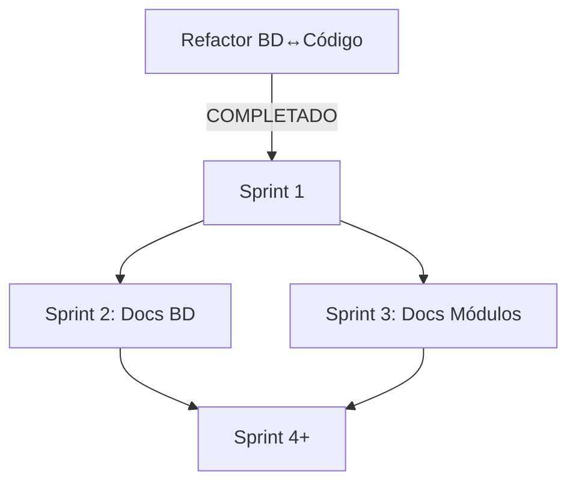

# BACKLOG DE SPRINTS V4.1 - Sistema Terrena

**Orquestador**: MAESTRO  
**Fecha**: 18 Noviembre 2025  
**Versión**: 4.1 (POST-REFACTOR)  
**Duración Sprint**: 2 semanas  
**Total Sprints**: 8 (16 semanas / 4 meses)  
**Estado BD↔Código**: ✅ COMPLETADO

---

## 1. ROADMAP GENERAL (340 horas)

### SPRINT 1-2: Funcionalidad Crítica (106h)
- ✅ BD↔Código alineado
- 🎯 Motor Replenishment (31h)
- 🎯 Versionado Recetas UI (16h)
- 🎯 Recepciones State Machine (21h)
- 🎯 Transferencias UI (19h)
- 🎯 Consolidar servicios duplicados (8h)
- 🎯 Documentar funciones BD críticas (20h)

### SPRINT 3-4: Documentación Core (52h)
- 📖 Recetas (versionado, BOM, costeo) - 11h
- 📖 Producción (planificación, mise en place) - 8h
- 📖 POS (sincronización, consumo) - 9h
- 📖 Inventario (lotes, políticas) - 8h
- 📖 Purchasing (cotizaciones) - 6h
- 📖 Otros módulos - 10h

### SPRINT 5-6: Funcionalidad Completa (95h)
- ⚙️ Reportes KPIs analíticos - 20h
- ⚙️ Inventario avanzado (políticas) - 16h
- ⚙️ GUI permisos Seguridad - 15h
- ⚙️ Design System Frontend - 12h
- ⚙️ Limpieza código huérfano - 32h

### SPRINT 7-8: Consolidación (87h)
- ✅ Tests integración - 30h
- ✅ Validación deployment - 12h
- ✅ Performance tuning - 20h
- ✅ Documentación final - 15h
- ✅ Capacitación - 10h

---

## 2. SPRINT 1: FUNCIONALIDAD CRÍTICA (55h)

**Fecha**: 18 Nov - 1 Dic 2025  
**Objetivo**: Implementar 4 features críticas que desbloquean operación

### INV-001: Motor de Replenishment (31h) 🔴 P0

**Subtareas**:
| ID | Descripción | Agente | Horas | Salida |
|----|-------------|--------|-------|--------|
| INV-001-A | Diseño técnico ReplenishmentService | Claude+Qwen | 3h | REPLENISHMENT_DESIGN.md |
| INV-001-B | Migraciones tablas nuevas | Qwen | 2h | 3 migrations |
| INV-001-C | Modelos Eloquent | Codex | 2h | ReplenishmentConfig.php, PurchaseSuggestion.php |
| INV-001-D | ReplenishmentService (3 algoritmos) | Codex+Copilot | 8h | ReplenishmentService.php |
| INV-001-E | Job scheduler | Codex | 2h | CalculateReplenishmentSuggestions.php |
| INV-001-F | Dashboard Livewire | Copilot+Claude | 7h | ReplenishmentDashboard.php |
| INV-001-G | API REST | Codex | 4h | ReplenishmentController.php |
| INV-001-H | Swagger + tests | Copilot+Claude | 3h | purchasing.yaml, ReplenishmentTest.php |

**Algoritmos**:
- Min-Max (stock_policy)
- SMA (Simple Moving Average)
- POS Consumption (fn_expandir_consumo_ticket)

---

### REC-001: Versionado Recetas UI (16h) 🟡 P1

**Subtareas**:
| ID | Descripción | Agente | Horas | Salida |
|----|-------------|--------|-------|--------|
| REC-001-A | Diseño UI versionado | Claude | 2h | UI_VERSIONADO_DESIGN.md |
| REC-001-B | VersionComparator | Copilot | 5h | VersionComparator.php + blade |
| REC-001-C | VersionActivator | Copilot | 4h | VersionActivator.php + blade |
| REC-001-D | RecipeEditor (botón nueva versión) | Codex | 3h | RecipeEditor.php modificado |
| REC-001-E | Tests integración | Copilot | 2h | RecipeVersioningTest.php |

**UI nueva**:
- Comparador diff ingredientes y costos
- Activador con confirmación
- Snapshot automático de costos

---

### INV-002: Recepciones State Machine (21h) 🔴 P0

**Subtareas**:
| ID | Descripción | Agente | Horas | Salida |
|----|-------------|--------|-------|--------|
| INV-002-A | Diseño state machine | Claude+Qwen | 2h | RECEPTION_STATE_MACHINE.md |
| INV-002-B | Migraciones estados + tablas | Qwen | 2h | 3 migrations |
| INV-002-C | Modelos nuevos | Codex | 2h | ReceptionTolerance.php, ReceptionAttachment.php |
| INV-002-D | ReceptionService state machine | Codex | 5h | ReceptionService.php modificado |
| INV-002-E | UI estados y acciones | Copilot | 5h | ReceptionCreate.php, ReceptionDetail.php modificados |
| INV-002-F | Upload evidencias | Copilot | 3h | ReceptionDetail.php con upload |
| INV-002-G | Tests integración | Copilot | 2h | ReceptionStateTest.php |

**Estados**: BORRADOR → VALIDADA → POSTEADA

---

### INV-003: Transferencias UI Completo (19h) 🟡 P1

**Subtareas**:
| ID | Descripción | Agente | Horas | Salida |
|----|-------------|--------|-------|--------|
| INV-003-A | Diseño flujo transferencias | Claude | 2h | TRANSFER_FLOW_DESIGN.md |
| INV-003-B | Migración columnas nuevas | Qwen | 2h | enhance_transfers migration |
| INV-003-C | TransferService (despachar, recibir) | Codex | 5h | TransferService.php modificado |
| INV-003-D | TransferDispatch Livewire | Copilot | 4h | TransferDispatch.php + blade |
| INV-003-E | TransferReceive Livewire | Copilot | 4h | TransferReceive.php + blade |
| INV-003-F | Tests integración | Copilot | 2h | TransferFlowTest.php |

**Flujo**: PENDIENTE → EN_TRANSITO → RECIBIDA

---

**TOTAL SPRINT 1**: 87h → 55h (con paralelización)

**Criterios de aceptación**:
- [ ] Todos los tests passing
- [ ] Validado en staging con datos reales
- [ ] Documentación actualizada
- [ ] Sin breaking changes

---

## 3. SPRINT 2: DOCUMENTACIÓN BD (51h)

**Fecha**: 2 Dic - 15 Dic 2025  
**Objetivo**: Documentar funciones SQL críticas

### Funciones a Documentar (20h total)

| Función | Módulo | Horas | Agente | Prioridad |
|---------|--------|-------|--------|-----------|
| fn_recipe_cost_at() | Recetas | 3h | Claude+Qwen | 🔴 CRÍTICO |
| fn_expandir_consumo_ticket() | POS | 4h | Claude+Qwen | 🔴 CRÍTICO |
| fn_recipes_using_item() | Recetas | 2h | Claude+Qwen | 🔴 CRÍTICO |
| fn_item_unit_cost_at() | Inventario | 2h | Claude+Qwen | 🔴 CRÍTICO |
| recalcular_costos_periodo() | Finanzas | 3h | Claude+Qwen | 🔴 CRÍTICO |
| fn_confirmar_consumo() | POS | 2h | Claude+Qwen | 🟡 IMPORTANTE |
| fn_reversar_consumo() | POS | 2h | Claude+Qwen | 🟡 IMPORTANTE |
| fn_consolidar_stock() | Inventario | 2h | Claude+Qwen | 🟡 IMPORTANTE |

**Formato documentación**:
- Propósito y alcance
- Parámetros detallados
- Retorno y ejemplos
- Consideraciones de performance
- Casos de uso

### Plan Deprecación Legacy (12h)

- 35 tablas legacy (24%)
- Vistas de compatibilidad
- Código duplicado

### Vistas y Triggers (12h)

- 38 vistas (10 sin documentar)
- 20 triggers (5 sin documentar)

---

## 4. SPRINT 3: DOCS MÓDULOS CORE (42h)

**Fecha**: 16 Dic - 29 Dic 2025  
**Objetivo**: Documentación completa de 5 módulos core

### Recetas (11h)
- 02_VERSIONADO.md (3h)
- 03_BOM_IMPLOSION.md (3h)
- 04_COSTEO.md (3h)
- 05_POS_INTEGRATION.md (2h)

### Producción (8h)
- 02_PLANIFICACION.md (3h)
- 03_MISE_EN_PLACE.md (2h)
- 04_MERMAS.md (2h)
- 05_OUTPUTS.md (1h)

### POS (9h)
- 02_SINCRONIZACION.md (3h)
- 03_CONSUMO_TICKETS.md (3h)
- 04_REPOSITORIOS.md (2h)
- 05_REPROCESAMIENTO.md (1h)

### Inventario (8h)
- 02_LOTES.md (2h)
- 03_KARDEX.md (2h)
- 04_POLITICAS.md (2h)
- 05_AJUSTES.md (2h)

### Purchasing (6h)
- 02_COTIZACIONES.md (2h)
- 03_COMPARACION.md (2h)
- 04_REPLENISHMENT.md (2h)

---

## 5. SPRINT 4-8: RESUMEN COMPACTO

### Sprint 4: Código Huérfano (40h)
- Eliminar 189 archivos huérfanos (40%)
- Consolidar duplicados
- Limpieza general

### Sprint 5: Funcionalidad Recetas + Transferencias (48h)
- Recetas versionado completo
- Transferencias despacho/recepción
- Inventario estados completos

### Sprint 6: Reportes + Inventario Avanzado (42h)
- KPIs analíticos
- Políticas stock avanzadas
- Dashboard ejecutivo

### Sprint 7: Seguridad + Frontend (37h)
- GUI permisos
- Design System
- Refinamiento UX

### Sprint 8: Tests + Deployment (25h)
- Tests integración
- Validación producción
- Documentación deployment

---

## 6. RESUMEN POR AGENTE

| Agente | Sprint 1 | Sprint 2-8 | Total |
|--------|----------|-----------|-------|
| Claude | 12h | 45h | 57h |
| Qwen | 11h | 38h | 49h |
| Codex | 28h | 85h | 113h |
| Copilot | 41h | 80h | 121h |

**Total**: 340 horas distribuidas en 8 sprints

---

## 7. DEPENDENCIAS CRÍTICAS

**Bloqueantes resueltos**:
- ✅ BD↔Código alineado (90%)
- ✅ Refactor 10 módulos completado
- ✅ Base de datos documentada

---

**Última actualización**: 18 Noviembre 2025  
**Responsable**: MAESTRO  
**Inicio**: Sprint 1 (18 Nov 2025)
