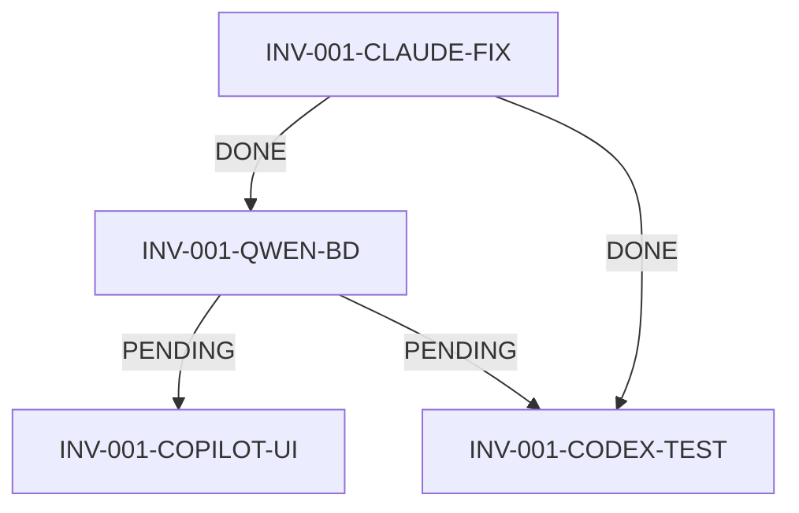

# Análisis del Sistema de Orquestación Terrena V4.1

**Autor:** Claude Code
**Fecha:** 2025-11-19
**Versión analizada:** V4.1 (docs/V4.1/00_Orquestador + docs/V4.0/00_Orquestador)
**Contexto:** Post-refactor BD↔Código completado, Sprint 1 en progreso

---

## RESUMEN EJECUTIVO

### ✅ Lo que FUNCIONA BIEN

1. **Estructura de gobernanza clara**: Los 3 documentos principales (CONTRATO, MATRIZ_ALINEACION, BACKLOG_SPRINTS) definen bien el marco de trabajo multiagente.

2. **Principio de verdad única**: Jerarquía clara (BD Real > Dumps SQL > Refactor Docs > Código) elimina ambigüedad.

3. **División de roles IA clara**:
   - Claude: Arquitecto + BD + auditoría (costoso pero preciso)
   - Qwen: BD + migraciones (excelente para SQL)
   - Codex: Backend Laravel (servicios sólidos)
   - Copilot: UI/UX Livewire (rápido para componentes)

4. **MASTER_SPRINT1_STATUS como single source of truth**: Concepto excelente para coordinar trabajo paralelo.

5. **Trabajo completado documentado**:
   - INV-001-CODEX-SRV (ReplenishmentService)
   - INV-001-CLAUDE-FIX (Alineación BD↔Código)
   - Refactor global de 10 módulos completado

### 🔴 PROBLEMAS CRÍTICOS DETECTADOS

#### 1. **V4.1 está VACÍA pero V4.0 tiene TODO** ⚠️

```
docs/V4.1/00_Orquestador/:
- 00_MASTER_ORQUESTADOR_IA.md → VACÍO (0 bytes)
- 02_BACKLOG_SPRINTS_V4.1.md → VACÍO (0 bytes)
- Otros archivos con contenido mínimo/placeholders

docs/V4.0/00_Orquestador/:
- 00_CONTRATO_SISTEMA_TERRENA_v4.1.md → 21KB (contenido completo)
- 01_MATRIZ_ALINEACION_V4.1.md → 12KB (contenido completo)
- 02_BACKLOG_SPRINTS_V4.1.md → 8KB (contenido completo)
- MASTER_SPRINT1_STATUS.md → 3KB (archivo activo)
```

**DECISIÓN CRÍTICA NECESARIA:** ¿Cuál es la carpeta correcta?
- ¿Mover V4.0 → V4.1 y deprecar V4.0?
- ¿Consolidar ambas?
- ¿Usar V4.0 como principal y eliminar V4.1?

**RIESGO:** Actualmente las IA podrían leer carpetas diferentes y desincronizarse.

#### 2. **BD PostgreSQL en estado CRÍTICO** 🔥

```sql
Schema selemti: 23 tablas (solo catálogos básicos)
Schema public: 0 tablas (BORRADO por accidente)

Faltante crítico:
- Tabla items (base de todo el sistema)
- 61 migraciones PENDING sin ejecutar
- Tablas purchase_requests, recepcion_cab, transfer_cab no existen
- 138 de 226 tests fallan por tablas inexistentes
```

**CAUSA RAÍZ:** Nunca se ejecutaron migraciones base. El archivo `BD_SCHEMA_SELEMTI.sql` tiene DROP SCHEMA CASCADE que borró `public`.

**IMPACTO:** TODO el sistema está **NO FUNCIONAL** en este momento.

**SOLUCIÓN URGENTE:**
1. Restaurar schema `public` desde `BD_SCHEMA_PUBLIC.sql`
2. Crear schema `selemti` desde `BD_SCHEMA_SELEMTI.sql`
3. Ejecutar migraciones PENDING (las que no colisionen)
4. Re-ejecutar tests para validar

#### 3. **Descoordinación entre documentación V4.0 y V4.1**

La carpeta V4.1 debería ser la versión "limpia" post-refactor, pero:
- Está vacía/incompleta
- Los archivos activos siguen en V4.0
- Las IA deben leer V4.0 pero escribir en V4.1 (confuso)

#### 4. **MASTER_SPRINT1_STATUS desactualizado**

El archivo en V4.0 dice:
```
INV-001: Backend DONE, BD DONE, UI PENDING
```

Pero según DEVLOG_SPRINT1_INV-001-CLAUDE-FIX.md (18 Nov):
- ReplenishmentService YA está funcional ✅
- BD YA está alineada ✅
- Logs de telemetría implementados ✅

**Falta actualizar estado real del Sprint.**

---

## ANÁLISIS DETALLADO

### 1. Arquitectura del Sistema de Orquestación

#### 1.1 Jerarquía de Documentación (BIEN DISEÑADA)

```
00_CONTRATO_SISTEMA_TERRENA_v4.1.md (Gobernanza)
    ├─ Principios rectores
    ├─ Stack tecnológico
    ├─ Arquitectura dual BD
    └─ Roles y responsabilidades IA

01_MATRIZ_ALINEACION_V4.1.md (Estado del sistema)
    ├─ Matriz por módulo (P0, P1, P2)
    ├─ Gaps detectados
    ├─ Riesgos por módulo
    └─ Coverage de documentación

02_BACKLOG_SPRINTS_V4.1.md (Roadmap)
    ├─ Sprint 1: Replenishment + Recepciones + Transfers + Recetas
    ├─ Sprint 2: Producción + KDS
    ├─ Sprint 3: Reports + Analytics
    └─ Sprint 4: Optimizaciones

MASTER_SPRINT1_STATUS.md (Single source of truth operacional)
    ├─ Estado por épica
    ├─ Tareas por IA
    ├─ Dependencias
    └─ Reglas de actualización
```

**FORTALEZA:** Separación clara entre estrategia (CONTRATO), táctica (MATRIZ), operación (MASTER_STATUS).

**DEBILIDAD:** La implementación actual no refleja este diseño (archivos vacíos en V4.1).

#### 1.2 División de Responsabilidades IA

| IA | Strengths | Weaknesses | Uso Óptimo |
|----|-----------|------------|------------|
| **Claude** | - Acceso BD ✅<br>- Contexto largo ✅<br>- Razonamiento complejo ✅ | - Costo alto 💰<br>- Latencia media ⏱️ | - Arquitectura<br>- Auditorías BD<br>- Debugging complejo |
| **Qwen** | - SQL excelente ✅<br>- Rapidez ⚡<br>- Bajo costo 💰 | - Contexto limitado ⚠️<br>- Sin acceso filesystem? | - Migraciones<br>- Queries SQL<br>- Optimización BD |
| **Codex** | - Backend Laravel ✅<br>- Tests ✅<br>- Servicios sólidos ✅ | - NO accede BD ❌<br>- Depende de docs | - Servicios<br>- Tests unitarios<br>- Lógica de negocio |
| **Copilot** | - UI rápida ✅<br>- Livewire ✅<br>- Bootstrap ✅ | - Backend débil ⚠️<br>- Sin BD ❌ | - Componentes Livewire<br>- Vistas Blade<br>- UX |

**PATRÓN ÓPTIMO DE TRABAJO:**
```
1. Claude: Analiza BD real, diseña arquitectura, genera especificación
2. Qwen: Crea migraciones basándose en especificación Claude
3. Codex: Implementa servicios basándose en especificación Claude
4. Copilot: Crea UI basándose en servicios Codex
5. Claude: Valida integración BD↔Servicios↔UI
```

**PROBLEMA ACTUAL:** Este flujo NO está formalizado en los docs.

---

### 2. Sprint 1 - Estado Real vs Documentado

#### 2.1 Épica INV-001: Motor de Replenishment

**Documentado (MASTER_SPRINT1_STATUS.md):**
```
Backend: DONE
BD: DONE
UI: PENDING
Tests: PENDING
```

**Estado REAL (verificado vía código y DEVLOG):**
```
✅ Backend: ReplenishmentService.php completamente funcional
   - 3 algoritmos: MIN_MAX, SMA, POS_CONSUMPTION
   - API endpoints: /api/purchasing/replenishment/*
   - Job scheduler: CalculateReplenishmentSuggestions

✅ BD: Alineada y corregida (18 Nov 2025)
   - Tabla: selemti.inv_stock_policy (3 registros)
   - Queries corregidas: sucursal_id VARCHAR, columna cantidad
   - Telemetría implementada

❌ UI: NO EXISTE (0 componentes Livewire)

❌ Tests: FALLAN (138/226 errors por tablas inexistentes)
```

**GAP CRÍTICO:** UI pendiente bloquea uso por usuarios finales.

#### 2.2 Épica REC-001: Versionado de Recetas

**Documentado:**
```
Backend: DONE
BD: PENDING (migraciones menores)
UI: PENDING
```

**Estado REAL (necesita verificación):**
- ¿Existe RecipeVersionService?
- ¿Qué migraciones faltan exactamente?
- ¿Qué columnas/tablas?

**ACCIÓN REQUERIDA:** Auditoría de Recetas (Claude + verificar código/BD).

#### 2.3 Épica INV-002: Recepciones State Machine

**Documentado:**
```
Backend: DONE
BD: PENDING (nuevas columnas)
UI: PENDING
```

**Estado REAL:**
- ReceivingService existe en V4.0/Code/DEVLOG... (verificar)
- Tabla recepcion_cab NO EXISTE en BD actual ❌
- Migración 2025_11_15_000000_create_inventory_receiving_tables PENDING

**BLOQUEADOR:** BD no tiene tablas base. Migración pendiente de ejecutar.

#### 2.4 Épica INV-003: Transferencias

Similar a Recepciones: Backend listo, BD pendiente, UI pendiente.

---

### 3. Problemas de Coordinación Detectados

#### 3.1 MASTER_SPRINT1_STATUS no es "master"

**Problema:** Está desactualizado. Ejemplo:

Documento dice:
```
[CLAUDE]
BD_FUNCIONES: DONE/PENDING
SPRINT_VALIDACION: DONE/PENDING
```

Pero NO especifica:
- ¿Qué funciones exactamente?
- ¿Dónde está la documentación de esas funciones?
- ¿Cuál es el criterio de DONE?

**SOLUCIÓN:** Formato más estructurado:

```markdown
### CLAUDE – Bloque de Trabajo

| Task ID | Descripción | Archivo de salida | Estado | Última actualización |
|---------|-------------|-------------------|--------|---------------------|
| DOC-FUNC-001 | Documentar fn_recipe_cost_at() | docs/.../FUNCIONES_RECETAS.md | DONE | 2025-11-19 |
| DOC-FUNC-002 | Documentar fn_item_unit_cost_at() | docs/.../FUNCIONES_INVENTARIO.md | PENDING | - |
| AUDIT-INV-001 | Auditoría Inventario | docs/.../AUDIT_INVENTARIO.md | DONE | 2025-11-18 |
```

#### 3.2 Dependencias NO están formalizadas

Documento dice:
```
"Qwen debe entregar las migraciones de BD antes de que Copilot implemente UI completa."
```

**Problema:** ¿Cómo sabe Copilot que Qwen terminó?
- ¿Lee MASTER_SPRINT1_STATUS?
- ¿Ejecuta las migraciones y verifica?
- ¿Espera un archivo específico?

**SOLUCIÓN:** Sistema de "checkpoints":

```markdown
## Checkpoint: BD Ready for UI

**Verificación automática:**
```bash
php artisan migrate:status --database=pgsql | grep "2025_11_15_000000_create_inventory_receiving_tables" | grep "Ran"
```

**Responsable:** QWEN
**Consumidor:** COPILOT
**Archivo de señal:** docs/V4.1/checkpoints/BD_READY_INV_002.md
```

#### 3.3 Versionado y naming inconsistente

- CONTRATO_SISTEMA_TERRENA_v4.1.md (lowercase v)
- MATRIZ_ALINEACION_V4.1.md (uppercase V)
- BACKLOG_SPRINTS_V4.1.md (uppercase V)

**SOLUCIÓN:** Estandarizar a `V4.1` (uppercase).

---

### 4. Propuestas de Mejora

#### 4.1 URGENTE: Consolidar V4.0 y V4.1

**Opción A - Mover todo a V4.1 (RECOMENDADO):**
```bash
cp docs/V4.0/00_Orquestador/* docs/V4.1/00_Orquestador/
# Validar contenido
rm -rf docs/V4.0  # Después de backup
```

**Opción B - Usar V4.0 como master, eliminar V4.1:**
```bash
rm -rf docs/V4.1/00_Orquestador
# Actualizar referencias en código
```

**Criterio de decisión:** V4.1 implica "versión limpia post-refactor". Si el refactor está DONE, V4.1 debería ser la carpeta activa.

#### 4.2 CRÍTICO: Restaurar BD PostgreSQL

**Secuencia segura:**

```bash
# 1. Backup actual
pg_dump -h localhost -p 5433 -U postgres -d pos -F c -f backup_pre_restauracion.dump

# 2. Verificar dumps
head -100 database/BD_SCHEMA_PUBLIC.sql  # ¿Tiene DROP SCHEMA?
head -100 database/BD_SCHEMA_SELEMTI.sql  # ¿Tiene DROP SCHEMA?

# 3. Restaurar SOLO si no tienen DROP (o editarlos antes)
psql -h localhost -p 5433 -U postgres -d pos -f database/BD_SCHEMA_PUBLIC.sql
psql -h localhost -p 5433 -U postgres -d pos -f database/BD_SCHEMA_SELEMTI.sql

# 4. Ejecutar migraciones (las que apliquen sin colisionar)
php artisan migrate --database=pgsql

# 5. Verificar
psql -h localhost -p 5433 -U postgres -d pos -c "\dt selemti.items"
psql -h localhost -p 5433 -U postgres -d pos -c "\dt public.ticket"

# 6. Re-ejecutar tests
./vendor/bin/phpunit
```

**RESPONSABLE:** Claude (tengo acceso BD) + Usuario final (validación)

#### 4.3 MASTER_SPRINT1_STATUS mejorado

Propongo este formato:

```markdown
# MASTER_SPRINT1_STATUS_V2.md

## Metadata
- Sprint: 1
- Inicio: 2025-11-15
- Fin estimado: 2025-11-30
- Última actualización: 2025-11-19 14:30 UTC-6

## Estado Global (Auto-calculado)

| Épica | Tareas totales | Completadas | En progreso | Bloqueadas | % Completado |
|-------|---------------|-------------|-------------|------------|--------------|
| INV-001 | 4 | 2 | 1 | 1 | 50% |
| REC-001 | 4 | 1 | 0 | 3 | 25% |
| INV-002 | 4 | 1 | 0 | 3 | 25% |
| INV-003 | 4 | 1 | 0 | 3 | 25% |
| **TOTAL** | **16** | **5** | **1** | **10** | **31%** |

## Épica INV-001: Motor de Replenishment

### INV-001-CODEX-SRV: Backend Service
- **Estado:** ✅ DONE
- **Responsable:** Codex
- **Fecha completado:** 2025-11-17
- **Archivo:** app/Services/Replenishment/ReplenishmentService.php
- **Validado por:** Claude (DEVLOG_SPRINT1_INV-001-CODEX-SRV.md)
- **Tests:** ❌ Fallan por BD

### INV-001-CLAUDE-FIX: Alineación BD
- **Estado:** ✅ DONE
- **Responsable:** Claude
- **Fecha completado:** 2025-11-18
- **Archivo:** docs/V4.0/Code/DEVLOG_SPRINT1_INV-001-CLAUDE-FIX.md
- **Cambios:**
  - Corregida tabla: stock_policy → selemti.inv_stock_policy
  - Corregido tipo: sucursal_id INTEGER → VARCHAR
  - Agregada telemetría
- **Tests:** ⚠️ Pasan con BD preparada

### INV-001-QWEN-BD: Migraciones
- **Estado:** 🔴 BLOCKED
- **Responsable:** Qwen
- **Bloqueador:** BD vacía, falta restauración
- **Migración requerida:** 2025_10_18_000005_create_inv_stock_policy_table
- **Dependencia:** Claude debe restaurar BD primero

### INV-001-COPILOT-UI: Dashboard Replenishment
- **Estado:** ⏸️ PENDING
- **Responsable:** Copilot
- **Bloqueador:** Esperando migraciones BD (QWEN)
- **Componentes a crear:**
  - ReplenishmentDashboard.php
  - SuggestionCard.php
  - PolicyEditor.php
- **Referencia:** ReplenishmentService API

## Dependencias Inter-Tareas



## Checkpoints del Sprint

| Checkpoint | Descripción | Responsable | Verificación | Estado |
|------------|-------------|-------------|--------------|--------|
| BD-RESTORED | BD PostgreSQL restaurada con 147 tablas | Claude | `SELECT COUNT(*) FROM pg_tables WHERE schemaname='selemti'` > 100 | ❌ |
| MIGRATIONS-RAN | 61 migraciones ejecutadas | Qwen/Claude | `php artisan migrate:status` sin PENDING | ❌ |
| TESTS-GREEN | Al menos 200/226 tests pasan | Codex/Claude | `./vendor/bin/phpunit` | ❌ |
| UI-FUNCTIONAL | 4 dashboards funcionales | Copilot | Manual testing | ❌ |

## Reglas de Actualización

1. **Cada IA actualiza SOLO su bloque** al terminar una tarea
2. **Formato obligatorio:**
   ```
   [IA_NAME - YYYY-MM-DD HH:MM]
   TASK_ID: estado cambiado de X → Y
   Razón: ...
   Archivos modificados: ...
   ```
3. **Validación cruzada:** Otra IA puede marcar ⚠️ si detecta problema
4. **Sincronización:** Git pull antes de escribir, push inmediatamente después
```

#### 4.4 Protocolo de Trabajo Multiagente

Propongo crear `PROTOCOLO_TRABAJO_MULTIAGENTE.md`:

```markdown
# Protocolo de Trabajo Multiagente

## 1. Inicio de Sesión de Trabajo

Cada IA debe:
1. Leer `MASTER_SPRINT1_STATUS.md`
2. Identificar su próxima tarea PENDING
3. Verificar dependencias (no hay BLOCKED)
4. Actualizar estado a IN_PROGRESS
5. Crear issue/branch si aplica

## 2. Durante el Trabajo

1. **No modificar código fuera de tu módulo** sin consenso
2. **Documentar en tiempo real** (comentarios, docstrings)
3. **Crear DEVLOG incremental** en `docs/V4.0/Code/DEVLOG_...`
4. **Si detectas problema en otro módulo:** Crear `ISSUE_[MODULO].md`, NO corregir directamente

## 3. Al Completar Tarea

1. Generar DEVLOG final
2. Actualizar MASTER_SPRINT1_STATUS
3. Ejecutar tests relevantes
4. Notificar IA dependientes (comentario en archivo)
5. Git commit con mensaje estructurado:
   ```
   [TASK_ID] Descripción breve

   - Cambio 1
   - Cambio 2

   Refs: #issue_id
   DEVLOG: path/to/devlog.md
   ```

## 4. Resolución de Conflictos

Si dos IA modifican mismo archivo:
1. La primera en commitear gana
2. La segunda debe:
   - Hacer pull
   - Revisar cambios de la otra IA
   - Adaptar su código
   - Actualizar DEVLOG explicando adaptación
   - Commitear con nota "MERGED_WITH: [otra_IA_TASK_ID]"

## 5. Escenarios Especiales

### IA bloqueada por dependencia

1. Marcar tarea como BLOCKED en MASTER_SPRINT1_STATUS
2. Identificar bloqueador
3. Notificar en archivo del bloqueador:
   ```markdown
   ## BLOCKED_BY
   Task: INV-001-QWEN-BD
   Waiting for: INV-001-CLAUDE-FIX
   ETA: 2025-11-19
   ```
4. Tomar otra tarea si disponible

### Encontrar código legacy inconsistente

1. NO modificar directamente
2. Crear `REFACTOR_PROPOSAL_[MODULO].md`
3. Documentar:
   - Problema actual
   - Propuesta de solución
   - Impacto estimado
   - Archivos afectados
4. Esperar aprobación del Orquestador (humano/Claude)
5. Solo entonces proceder

### Detectar bug en BD real

1. **CRÍTICO:** NO ejecutar DROP, TRUNCATE, DELETE masivos
2. Crear backup:
   ```bash
   pg_dump -h localhost -p 5433 -U postgres -d pos -t selemti.tabla_afectada -f backup_tabla_$(date +%Y%m%d).sql
   ```
3. Documentar en `BUG_BD_[DESCRIPCION].md`
4. Proponer fix con query de rollback
5. Esperar validación
```

---

### 5. Estado Actual del Proyecto (Mi Evaluación)

#### 5.1 Lo que SÍ está listo para producción

✅ **Refactor BD↔Código:** 10 módulos alineados (riesgo BAJO)
✅ **ReplenishmentService:** Funcional con telemetría
✅ **Servicios Codex:** PurchasingService, InventoryCountService, TransferService, ReceivingService creados
✅ **Documentación de refactor:** Excelente (REFAC_*_RESULTADOS.md)
✅ **Marco de gobernanza:** CONTRATO bien definido

#### 5.2 Lo que está ROTO y requiere atención URGENTE

🔴 **BD PostgreSQL:** 0 tablas en public, 23/147 en selemti (CRÍTICO)
🔴 **Tests:** 61% fallan por BD vacía
🔴 **Migraciones:** 61 PENDING sin ejecutar
🔴 **V4.1 vacía:** Confusión sobre carpeta principal

#### 5.3 Lo que falta para completar Sprint 1

📋 **UI (Copilot):**
- ReplenishmentDashboard
- RecipeVersionEditor
- ReceptionWorkflow
- TransferDispatch/Receive

📋 **Migraciones BD (Qwen):**
- Ejecutar 61 migraciones PENDING
- Validar contra dumps SQL
- Resolver conflictos

📋 **Tests (Codex):**
- Crear tests unitarios para servicios
- Crear tests de integración
- Cobertura mínima 70%

📋 **Documentación (Claude):**
- Funciones SQL críticas (fn_recipe_cost_at, fn_item_unit_cost_at)
- Triggers (especialmente POS sync)
- Vistas de reportes

---

## RECOMENDACIONES PRIORIZADAS

### 🔥 PRIORIDAD 0 (HOY MISMO)

1. **Restaurar BD PostgreSQL** (Claude + Usuario)
   - Backup estado actual
   - Revisar dumps para quitar DROP SCHEMA
   - Restaurar public + selemti
   - Validar con 5 queries críticas

2. **Consolidar V4.0 vs V4.1** (Claude + Usuario)
   - Decidir carpeta master
   - Mover/eliminar contenido
   - Actualizar referencias en código

### ⚡ PRIORIDAD 1 (ESTA SEMANA)

3. **Actualizar MASTER_SPRINT1_STATUS** (Claude)
   - Formato mejorado con tabla estructurada
   - Estado real basado en verificación código+BD
   - Dependencias explícitas

4. **Ejecutar migraciones PENDING** (Qwen + Claude)
   - Analizar las 61 migraciones
   - Ejecutar en orden seguro
   - Validar contra dumps

5. **Crear PROTOCOLO_TRABAJO_MULTIAGENTE.md** (Claude)
   - Formalizar flujo de trabajo
   - Reglas de commits
   - Resolución de conflictos

### 📅 PRIORIDAD 2 (PRÓXIMA SEMANA)

6. **Tests funcionales** (Codex)
   - Arreglar los 138 tests que fallan
   - Añadir tests de servicios nuevos

7. **UI componentes** (Copilot)
   - ReplenishmentDashboard
   - Otras 3 UIs del Sprint 1

8. **Documentar funciones SQL** (Claude)
   - fn_recipe_cost_at
   - fn_item_unit_cost_at
   - fn_recipes_using_item
   - Triggers críticos

---

## CONCLUSIÓN

El sistema de orquestación está **BIEN DISEÑADO** en teoría pero **MAL EJECUTADO** en la práctica:

**Fortalezas:**
- Gobernanza clara
- División de roles IA apropiada
- Refactor completado exitosamente
- Servicios backend sólidos

**Debilidades críticas:**
- BD en estado no funcional
- Documentación dispersa en V4.0 y V4.1
- MASTER_SPRINT1_STATUS desactualizado
- Sin protocolo formal de trabajo multiagente
- Tests rotos

**Próximo paso inmediato:**
Restaurar BD PostgreSQL antes de continuar cualquier desarrollo.

**Estado del Sprint 1:**
- Real: ~30% completado
- Documentado: Confuso/desactualizado
- Bloqueadores: BD + migraciones

**Viabilidad de completar Sprint 1:**
- Con BD restaurada + migraciones: ✅ VIABLE en 1-2 semanas
- Sin restaurar BD: ❌ IMPOSIBLE

---

**Generado por:** Claude Code
**Fecha:** 2025-11-19
**Revisión recomendada:** Semanal
